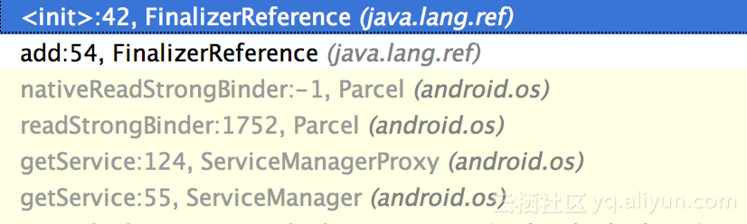

# 再谈 Finalizer 对象 -- 大型 App 中内存与性能的隐性杀手

> 本文由 [简悦 SimpRead](http://ksria.com/simpread/) 转码， 原文地址 [developer.aliyun.com](https://developer.aliyun.com/article/225755)

在上一篇《提升 Android 下内存的使用意识和排查能力》的文章中，多次提到了 Finalizer 对象。也可以看到该对象的清理至少是需要两次 GC 才能完成，而在 Android5.0，尤其是 6.0 以后的系统中，对于该对象的回收变得更加的慢。我们在开发的时候往往关注内存的分配、泄漏，却容易忽视 Finalizer 对象，其实在大型 App 中，该对象是引起内存和性能问题的一个不可忽视的元凶。在类似于双十一会场的界面中，在使用一段时间后，设备会变得越来越慢，内存使用量也不断攀升，甚至容易引发 OOM，这个有一个重要原因就和 Finalizer 对象的过度使用有关。为什么过度的使用 Finalizer 对象会对性能和内存都造成危害呢？我们不妨来看下 Finalizer 对象的原理。

一、Finalizer 对象创建过程带来的开销
-------------------------------------------------------------------

Finalizer 对象是指 Java 类中重写了 `finalize` 方法，且该方法不为空的对象。当运行时环境遇到创建 Finalizer 对象的时候，既**创建对象实例的时候，会先判断该对象是否是 Finalizer 对象，如果是，那么在构造函数过程中会把生成的对象再封装成 Finalizer 对象并添加到 Finalizer 链表中**。在运行时环境中，也会有一个专门的 `FinalizerReference` 来处理和 Finalizer 对象的关联。我们可以看一下 Android 7.0 上的 `FinalizerReference` 的代码：

```java
public final class FinalizerReference<T> extends Reference<T> {
    // This queue contains those objects eligible for finalization.
    public static final ReferenceQueue<Object> queue = new ReferenceQueue<Object>();

    // Guards the list (not the queue).
    private static final Object LIST_LOCK = new Object();

    // This list contains a FinalizerReference for every finalizable object in the heap.
    // Objects in this list may or may not be eligible for finalization yet.
    private static FinalizerReference<?> head = null;

    // The links used to construct the list.
    private FinalizerReference<?> prev;
    private FinalizerReference<?> next;

    // When the GC wants something finalized, it moves it from the 'referent' field to
    // the 'zombie' field instead.
    private T zombie;

    public FinalizerReference(T r, ReferenceQueue<? super T> q) {
        super(r, q);
    }

    @Override public T get() {
        return zombie;
    }

   @Override public void clear() {
        zombie = null;
    }

    public static void add(Object referent) {
        FinalizerReference<?> reference = new FinalizerReference<Object>(referent, queue);
        synchronized (LIST_LOCK) {
            reference.prev = null;
            reference.next = head;
            if (head != null) {
                head.prev = reference;
            }
            head = reference;
        }
    }

    public static void remove(FinalizerReference<?> reference) {
        synchronized (LIST_LOCK) {
            FinalizerReference<?> next = reference.next;
            FinalizerReference<?> prev = reference.prev;
            reference.next = null;
            reference.prev = null;
            if (prev != null) {
                prev.next = next;
            } else {
                head = next;
            }
            if (next != null) {
                next.prev = prev;
            }
        }
    }
}
```

通过断点，我们也可以还原对象的创建过程，例如：  




通过断点，我们也可以清晰的看到，在上面两个对象的创建过程中，都进入了 `FinalizerReference` 的 add 函数。在该函数中，又**会增加一个包装的对象 `FinalizerReference`，这本身就是对内存的一个开销**。另外，从上面的代码，我们很容易看到一个问题，在 add 和 remove 的时候，都会遇到 synchronized (LIST_LOCK) 的同步锁问题。当大量的这种类型的对象需要同时创建或者回收的时候，就会遇到线程间的锁开销问题。在一个大型 app 中，这是不得不考虑的因素。而在 Android4.2 之前，同步对象用的是 class 本身，也就是锁的粒度会更大，当系统中有不止一个 FinalizerReference 对象的时候性能开销会更大。另外，在添加对象的时候，在队列中也会遇到另外一个锁，下面代码中会分析到。

二、Finalizer 对象回收过程带来的开销和问题
----------------------------------------------------------------------

在 Android 系统中，会有一个专门的线程来实现该对象的回收。我们在查看线程的时候就可以看到有这样一个 FinalizerDaemon 线程。

### 1、额外增加的多个同步锁开销

首先先看下该线程的代码：

```
public final class Daemons {
    public static void start() {
        ReferenceQueueDaemon.INSTANCE.start();
        FinalizerDaemon.INSTANCE.start();
        FinalizerWatchdogDaemon.INSTANCE.start();
        HeapTaskDaemon.INSTANCE.start();
    }

    public static void stop() {
        HeapTaskDaemon.INSTANCE.stop();
        ReferenceQueueDaemon.INSTANCE.stop();
        FinalizerDaemon.INSTANCE.stop();
        FinalizerWatchdogDaemon.INSTANCE.stop();
    }
......
}

 private static class FinalizerDaemon extends Daemon {
        private static final FinalizerDaemon INSTANCE = new FinalizerDaemon();
        private final ReferenceQueue<Object> queue = FinalizerReference.queue;
        private final AtomicInteger progressCounter = new AtomicInteger(0);
        // Object (not reference!) being finalized. Accesses may race!
        private Object finalizingObject = null;

        FinalizerDaemon() {
            super("FinalizerDaemon");
        }

        @Override public void run() {


            while (isRunning()) {
                try {
                    // Use non-blocking poll to avoid FinalizerWatchdogDaemon communication
                    // when busy.
                    FinalizerReference<?> finalizingReference = (FinalizerReference<?>)queue.poll();
                    if (finalizingReference != null) {
                        finalizingObject = finalizingReference.get();
                        progressCounter.lazySet(++localProgressCounter);
                    } else {
                        finalizingObject = null;
                        progressCounter.lazySet(++localProgressCounter);
                        // Slow path; block.
                        FinalizerWatchdogDaemon.INSTANCE.goToSleep();
                        finalizingReference = (FinalizerReference<?>)queue.remove();
                        finalizingObject = finalizingReference.get();
                        progressCounter.set(++localProgressCounter);
                        FinalizerWatchdogDaemon.INSTANCE.wakeUp();
                    }
                    doFinalize(finalizingReference);
                } catch (InterruptedException ignored) {
                } catch (OutOfMemoryError ignored) {
                }
            }
        }

        @FindBugsSuppressWarnings("FI_EXPLICIT_INVOCATION")
        private void doFinalize(FinalizerReference<?> reference) {
            FinalizerReference.remove(reference);
            Object object = reference.get();
            reference.clear();
            try {
                object.finalize();
            } catch (Throwable ex) {
                // The RI silently swallows these, but Android has always logged.
                System.logE("Uncaught exception thrown by finalizer", ex);
            } finally {
                // Done finalizing, stop holding the object as live.
                finalizingObject = null;
            }
        }
    }
```

    通过代码，我们可以看到，在进程起来后，会启动一个 FinalizerDaemon 线程和该线程的守护线程。在前面的代码中我们可以看到，在 Finalizer 对象 add 的时候，会关联到一个 ReferenceQueue 的 queue 中。在该线程进行处理这些对象的时候，首先会从 ReferenceQueue 的队列中获取链表的头结点。我看可以看下 poll 方法的代码：

```
public Reference<? extends T> poll() {
        synchronized (lock) {
            if (head == null)
                return null;

            return reallyPollLocked();
        }
    }
```

    从这里我们可以看到，这里会遇到另外一个锁 lock， 该锁和 FinalizerReference 代码中的锁是独立的。我们可以看到，在 doFinalize 函数中，会首先调用 FinalizerReference 对象的 remove 方法，该方法前面已经可以看到存在在同步锁。也就是在加入和删除 Finalizer 对象的时候会同时遇到这两个锁开销。

### [](https://www.atatech.org/articles/70632#3)2、难以预知的 finalize 方法调用开销

    在 doFinalize 函数中，我们可以看到，对该对象的 finalize 方法的调用。这里看似没有问题，但是一旦该对象的 finalize 写法有问题：耗时、进入其他资源、不断抛出异常等待等等就会遇到问题。这些都会引起本身该代码的性能问题，更进一步会影响到整个 App 中的 Finalizer 对象的内存回收，一旦内存回收不过来，系统就会引发崩溃。  
    在系统中还有一个 FinalizerWatchdogDaemon 的守护进程，该进程会监控 FinalizerDaemon 线程的运行，一旦 FinalizerDaemon 在处理一个对象的时候超过 10s 中，那么就会结束进程，导致崩溃。我们可以查看 FinalizerWatchdogDaemon 的主要代码：

```
private static class FinalizerWatchdogDaemon extends Daemon {
        private static final FinalizerWatchdogDaemon INSTANCE = new FinalizerWatchdogDaemon();

        private boolean needToWork = true;  // Only accessed in synchronized methods.

       FinalizerWatchdogDaemon() {
            super("FinalizerWatchdogDaemon");
        }

        @Override public void run() {
            while (isRunning()) {
                if (!sleepUntilNeeded()) {
                    // We have been interrupted, need to see if this daemon has been stopped.
                    continue;
                }
                final Object finalizing = waitForFinalization();
                if (finalizing != null && !VMRuntime.getRuntime().isDebuggerActive()) {
                    finalizerTimedOut(finalizing);
                    break;
                }
            }
        }

        private static void finalizerTimedOut(Object object) {
......
            Thread.UncaughtExceptionHandler h = Thread.getDefaultUncaughtExceptionHandler();
            // Send SIGQUIT to get native stack traces.
            try {
                Os.kill(Os.getpid(), OsConstants.SIGQUIT);
                // Sleep a few seconds to let the stack traces print.
                Thread.sleep(5000);
            } catch (Exception e) {
                System.logE("failed to send SIGQUIT", e);
            } catch (OutOfMemoryError ignored) {
                // May occur while trying to allocate the exception.
            }
            if (h == null) {
                // If we have no handler, log and exit.
                System.logE(message, syntheticException);
                System.exit(2);
            }

            h.uncaughtException(Thread.currentThread(), syntheticException);
        }
    }
}
```

     因为 finalize 方法调用的不确定性，所以不仅仅会导致性能问题，还会引起内存问题和稳定性问题。

### [](https://www.atatech.org/articles/70632#4)3、finalize 带来的内存和稳定性问题


     我们通过代码来模拟一下写法不准确带来的危害。

```
class MyView extends  View{
        public MyView(Context context) {
            super(context);
        }

        @Override
        protected void finalize() throws Throwable {
            try {
                Thread.sleep(1000);
            } finally {
                super.finalize();
            }
        }

    }

    void onButtonClick(){
        for (int i = 0; i < 1000; i++) {
            View view = new MyView(this);
        }
    }
```

     在点击按钮的时候会创建 1000 个 View，而每个 view 在回收的时候都需要等待 1s 的时间。当连续点击按钮的时候，我们可以看到内存会不断的往上增加，而基本不会减少。


    通过线程的堆栈信息，我们也可以观察者两个线程正在做的事情：  


     在这种情况下，线程都还在干活，没有到达崩溃的程度。但是内存的回收已经变得极其缓慢，及时手动触发 GC，也无济于事，对象已经非常的多：


    如果这个时候再继续点击按钮，一旦内存回收遇到问题，就会引发崩溃，如下所示，引发了 JNI ERROR (app bug): weak global reference table overflow (max=51200) 的崩溃，因为 weak reference 对象太多，已经超过极限：


   我们再来模拟另外一种情况，finalize 函数长时间无法返回的情况。代码如下：

```
class MyView extends  View{
        int mIndex = 0;
        public MyView(Context context, int index) {
            super(context);
            mIndex = index;
        }

        @Override
        protected void finalize() throws Throwable {
            try {
                if(mIndex == 10000) {
                    Thread.sleep(20000);
                }
            } finally {
                super.finalize();
            }
        }

    }

    void onButtonClick(){
        for (int i = 0; i < 1000; i++) {
            View view = new MyView(this,count);
            count++;
        }
    }
```

     在 index 值为 10000 的时候，finalize 函数需要 20s 的执行时间，那么内存和最后的稳定性情况会怎么样呢？


    内存会和我们预期的一致，在前面几次点击的时候，由于 finalize 函数执行顺利，我们可以看到 GC 过程，内存没有快速上升。但是到了 10 次以后，内存就开始不断攀升。这个时候，我们让 App 静默等待，结果 10s 多后，就发生了超时崩溃，如下所示：


  

### [](https://www.atatech.org/articles/70632#5)4、线程优先级引入的内存和性能问题

    由于在一些设备上 UI 和 Render 线程的 Nice 优先级值都是负数，而该线程的 Nice 值一般情况下是 0，也就是默认值。在 UI 等其他线程都繁忙的时候，finalize 的回收并不会很快，这样就会导致内存回收变慢，进一步影响到整体的性能。特别是很多低性能的设备，更加容易暴露这方面的问题。

### [](https://www.atatech.org/articles/70632#6)5、Android 不同版本带来的问题

    之前的文件已经介绍过，从 Android 5.0 开始，每个 View 都包含了一个或者多个的 Finalizer 对象，RenderNode 对象的增加会导致一定的内存和性能问题，尤其是当一个界面需要创建大量的控件的时候，该问题就会特别明显，例如在手淘中的某些 Weex 页面，由于渲染界面的样式是过前端控制的，没有分页的概念，这样一次性创建非常多的控件，并且很多控件都额外使用了其他 Finalizer 对象，这样就会导致这种情况下，内存会正常很快，在低端设备上，有可能就会来不及回收而引起性能和稳定性问题。我们可以看下 View 和 RenderNode 的代码：

```
public class RenderNode {
......
    @Override
    protected void finalize() throws Throwable {
        try {
            nDestroyRenderNode(mNativeRenderNode);
        } finally {
            super.finalize();
        }
   }
}

//---------------------

@UiThread
public class View implements Drawable.Callback, KeyEvent.Callback,
        AccessibilityEventSource {

    /**
     * RenderNode used for backgrounds.
     * <p>
     * When non-null and valid, this is expected to contain an up-to-date copy
     * of the background drawable. It is cleared on temporary detach, and reset
     * on cleanup.
     */
    private RenderNode mBackgroundRenderNode;
    /**
     * RenderNode holding View properties, potentially holding a DisplayList of View content.
     * <p>
     * When non-null and valid, this is expected to contain an up-to-date copy
     * of the View content. Its DisplayList content is cleared on temporary detach and reset on
     * cleanup.
     */
    final RenderNode mRenderNode;
}
```

     当然，除了 View 以外，Path，NinePatch，Matrix，文件操作的类，正则表达式等等都会创建 Finalizer 对象，在大型 App 中过多的使用这些操作对内存和性能和稳定性都会带来比较大的影响。

### [](https://www.atatech.org/articles/70632#7)6、对象累积带来的问题

    如果大量的 Finalizer 对象累积无法及时回收，那么我们可以预见到，FinalizerDaemon 线程就会增加越来越重的负担，在 GC 过程中，需要检测的对象越来越多，所占用的 CPU 资源也必然增加。整体 CPU 占用过多，肯定也会对 UI 线程和业务线程产生干扰，对性能产生影响，而且由于其占用的内存无法及时释放，那么整个内存的利用率和分配过程也会对性能造成影响。另外考虑到同步锁的影响，在线程越多的情况下，在创建 Finalizer 对象的过程中，也会影响到使用方的线程的性能。

[](https://www.atatech.org/articles/70632#8)三、Finalizer 对象的监管
-------------------------------------------------------------

    在手淘的性能体系中，有专门对 Finalizer 对象做了监控。在接入 OnLineMonitor 较新版本的 App 中都可以监控到 Finalizer 的数量和分布（统计分布的功能需要额外开启）。例如，我们启动手淘，点击微淘，问大家，天猫，天猫国际这几个界面，在最后的报告中，我们就可以看到这些界面的 Finalizer 变化，如下图所示（Nexus 6p 设备上）：  
  
    我们可以看到，从首页开始，Finalizer 对象一直在增加，因为这几个界面都没有销毁。而到了【天猫】界面，增加的很快。我们再来看下这些界面的主要 Finalizer 对象分布：  


    上图我们可以看到 Finalizer 对象分布情况，在回到首页然后进入天猫之后，RenderNode 和 Matrix 对象有了明显的上升。这与控件增加较多以及很多控件的图片使用了图片效果有关。上面的检测是在 Nexus 6p 设备上，在该设备上 Finalize 线程的回收还算比较及时。一旦包含大量的 Finalizer 对象的界面很多，在性能较差的设备上就会导致 Finalizer 对象的累积，影响到内存和性能，在部分极端的设备上还会引发崩溃的问题。  
    除了本地报表有监控外，在后台我们也进行了整体的 Finalizer 对象的跟踪，能够跟踪各个界面的 Finalizer 对象数量，后续可以对 Finalizer 过高的界面进行有针对性的优化，以加快内存的回收，提升整体的性能。
    
    在内存的使用上，除了前面提到的熟悉内存工具和提高意识外。在我们写代码的时候，也要加强 Finalizer 对象的理解和警觉，了解哪些系统类是有 Finalizer 对象，并了解 Finalizer 对内存，性能和稳定性所带来的影响。特别是我们自己写类的时候，要尽量避免重写 finalize 方法，即使重写了也要注意该方法的实现，不要有耗时操作，也尽量不要抛出异常等。只有这样才能写出更加优秀的代码，才能在手淘这种超级 App 中运行的更加流畅和稳定。

**版权声明：**本文内容由阿里云实名注册用户自发贡献，版权归原作者所有，阿里云开发者社区不拥有其著作权，亦不承担相应法律责任。具体规则请查看《[阿里云开发者社区用户服务协议](https://developer.aliyun.com/article/768092)》和《[阿里云开发者社区知识产权保护指引](https://developer.aliyun.com/article/768093)》。如果您发现本社区中有涉嫌抄袭的内容，填写[侵权投诉表单](https://yida.alibaba-inc.com/o/right)进行举报，一经查实，本社区将立刻删除涉嫌侵权内容。