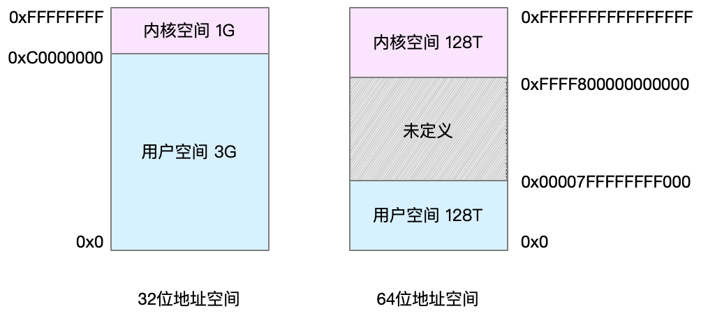

我们通常说的内存（例如你的笔记本是 8G 内存）都是指物理内存，也称作主存，大多数计算机使用的内存都是动态随机访问内存（DRAM）。只有内核才能直接访问物理内存，也就是说进程是无法直接访问物理内存的，为此 Linux 内核为每个进程都提供了一个独立的虚拟地址空间，并且这个地址空间是连续的，这样，进程就可以很方便的访问虚拟内存了。

虚拟地址空间分为两部分：内核空间和用户空间，不同位数的 CPU，地址空间的范围不同。比如最常见的 32 位和 64 位系统。

> 通过这里可以看出，32 位系统的内核空间占用 1G，位于最高处，剩下的 3G 是用户空间。而 64 位系统的内核空间和用户空间都是 128T，分别占据整个内存空间的最高和最低处，剩下的中间部分是未定义的。

## top 命令关于内存数据列的含义：

>VIRT 是进程虚拟内存的大小，只要是进程申请过的内存，即便还没有真正分配物理内存，也会计算在内。
>
>RES 是常驻内存的大小，也就是进程实际使用的物理内存大小，但不包括 Swap 和共享内存。
>
>SHR 是共享内存的大小，比如与其他进程共同使用的共享内存、加载的动态链接库以及程序的代码段等。
>
>%MEM 是进程使用物理内存占系统总内存的百分比。

