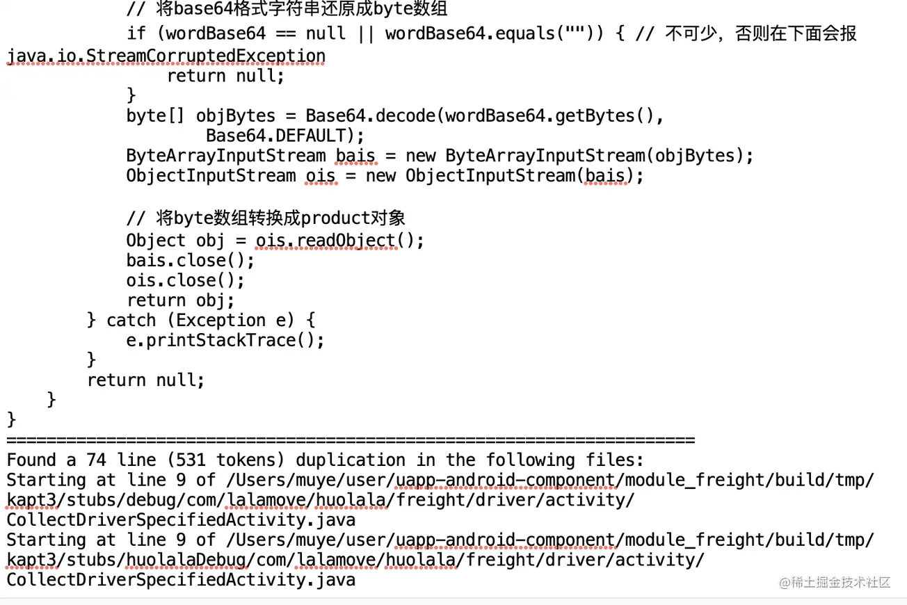
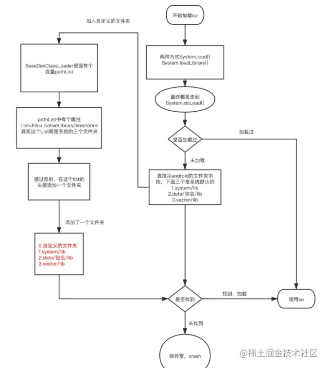

> 本文由 [简悦 SimpRead](http://ksria.com/simpread/) 转码， 原文地址 [juejin.cn](https://juejin.cn/post/7095565884122464292)

背景介绍
----

为什么要做包体积优化？主要出于以下几方面的考虑

1.  下载转化率

(1) 很多应用市场流量保护限制是 40M  
(2) 很多大型 App 一般都会有一个 Lite 版本的 App，也是出于下载转化率方面的考虑

2.  对 app 性能的影响

(1) 安装时间：比如 文件拷贝、Library 解压，并且，在编译 ODEX 的时候，特别是对于 Android 5.0 和 6.0 系统来说，耗费的时间比较久，而 Android 7.0 之后有了 混合编译，所以还可以接受。最后，App 变大后，其 签名校验 的时间也会变长。  
(2) 运行时内存：Resource 资源、Library 以及 Dex 类加载都会占用应用的一部分内存。  
(3)ROM 空间：如果应用的安装包大小为 50MB，那么启动解压之后很可能就已经超过 100MB 了

3.  CDN 流量费用增加

安装包体积越大，单个 apk 下载流量越大

优化思路分析
------

apk 主要由以下 4 个部分构成  
(1) 代码相关的 dex 文件  
(2) 资源相关的 resources.arsc 和清单文件等  
(3)so 相关的 lib 目录下的文件  
(4) 系统签名文件

所以我们的优化思路如下：

1.  从 apk 整体优化

(1) 插件化  
动态加载安装包中的部分代码、资源、so  
(2) 动态资源加载  
动态加载安装包中的资源、so

2.  代码相关的 dex 文件优化

(1) 代码混淆  
使用更短的混淆字段来混淆原始的类名、方法名、变量名  
(2) 删除未使用的代码  
完全没使用的代码、只使用了一小部分却引入了整体功能的代码  
(3) 删除重复的代码  
完全重复的代码、部分方法重复的代码  
(4)sdk 优化  
重复功能的 sdk(比如图片加载库)、只使用了部分功能却引入了完整的 sdk  
(5)dex 压缩  
使用更高压缩率的算法、可以替换成常量的字节码  
(6) 多 dex 关联优化  
减少跨 Dex 调用的冗余信息  
(7) 字节码优化  
方法内联、常量内联、优化多余赋值指令、getter 和 setter 方法内联、删除日志等

3.  资源相关的文件优化

(1)shrinkResources  
将项目中没有使用的图片、xml 资源文件使用系统自带的资源替换  
(2) 删除未使用的资源  
(3) 删除重复资源  
(4)AndResGuard - 资源混淆  
使用更短的混淆名来混淆原始的资源名  
(5) 属性代码替换 shape xml 文件  
(6) 语言资源优化  
去掉多余的国际语言资源  
(7) 图片资源优化  
图片格式优化、图片压缩、图片分辨率优化  
(8) 本地图片转网图  
编译时将本地的图片从 apk 中删除，改成网络动态加载的方式

4.  so 相关的文件优化

移除多余的 so 架构、移除调试符号

工欲善其事必先利其器，为了实现我们的优化效果，我们引入和开发部分工具、插件来帮助我们做 apk、代码、资源的相关分析

货拉拉 Android 包体积优化思维导图
---------------------


APK 构成
------

1.  APK 构成


apk 各个部分的详细信息：


2.  dex 简介

Dex 是 Android 系统的可执行文件，包含 应用程序的全部操作指令以及运行时数据。因为 Dalvik 是一种针对嵌入式设备而特殊设计的 Java 虚拟机，所以 Dex 文件与标准的 Class 文件在结构设计上有着本质的区别。当 Java 程序被编译成 class 文件之后，还需要使用 dx 工具将所有的 class 文件整合到一个 dex 文件中，这样 dex 文件就将原来每个 class 文件中都有的共有信息合成了一体，这样做的目的是 保证其中的每个类都能够共享数据，这在一定程度上 降低了信息冗余，同时也使得 文件结构更加紧凑。与传统 jar 文件相比，Dex 文件的大小能够缩减 50% 左右


3.  apk 打包过程

(1) 简化版


(2) 详细版


Apk 分析工具
--------

1.  zip 解压

直接把 apk 后缀改成 zip，然后解压缩  
解压之后可以看到 apk 的各个组成部分


2.  Android Studio 自带的 Analyze APK

直接在 Android Studio 中点击打开 apk 文件即可，打开之后可以看到各个部分的大小


还可以做 apk 的对比分析，可以看到新旧版本的体积对比，更直接客观的看出新版本哪部分体积增加了及哪部分体积减少了


另外，还可以点开每个 dex 文件，查看里面的具体类信息


3.  反编译工具 APKTool

APKTool 主要包含三个部分：apktool、dex2jar、jd-gui，作用分别如下：

*   apktool  
    作用：资源文件获取，可以提取出图片文件和布局文件进行使用查看
    
*   dex2jar 作用：将 apk 反编译成 java 源码（classes.dex 转化成 jar 文件）
  
*   jd-gui 作用：查看 APK 中 classes.dex 转化成出的 jar 文件，即源码文件
  

反编译命令如下：

```
java -jar apktool_2.3.4.jar apktool d app-release.apk
复制代码
```


反编译后可以得到 smali 码，通过 jd-gui 可以打开如下：


4.  class-shark

(1)android-classshark 是一个 面向 Android 开发人员的独立二进制检查工具，它可以 浏览任何的 Android 可执行文件，并且检查出信息，比如类的接口、成员变量等等，此外，它还可以支持多种格式，比如说 APK、Jar、Class、So 以及所有的 Android 二进制文件如清单文件等等

(2) 传送门

[github.com/google/andr…](https://link.juejin.cn/?target=https%3A%2F%2Fgithub.com%2Fgoogle%2Fandroid-classyshark "https://github.com/google/android-classyshark")

(3) 使用方式

双击打开 ClassShark.jar，拖动我们的 APK 到它的工作空间即可。接下来，我们就可以看到 Apk 的分析界面了，这里我们点击 classes 下的 classes.dex，在分析界面 左边 可以看到该 dex 的方法数和文件大小，并且，最下面还显示出了该 dex 中包含有 Native Call 的类


(4) 点击左上角的 Methods count 还可以切换到 方法数环形图标统计界面，我们不仅可以 直观地看到各个包下的方法数和相对大小，还可以看到各个子包下的方法数和相对大小


5.  nimbledroid

(1)nibledroid 是美国哥伦比亚大学的博士创业团队研发出来的分析 Android App 性能指标的系统，分析的方式有静态和动态两种方式

(2) 传送门

[nimbledroid.com/](https://link.juejin.cn/?target=https%3A%2F%2Fnimbledroid.com%2F "https://nimbledroid.com/")

(3) 静态分析：可以分析出 APK 安装包中大文件排行榜，Dex 方法数和知名第三方 SDK 的方法数及占代码整体的比例

(4) 动态分析：可以给出 冷启动时间, 列出 Block UI 的具体方法, 内存占用, 以及 Hot Methods, 从这些分析报告中, 可以 定位出具体的优化点

6.  ApkChecker

(1) 简介

ApkChecker 是微信 APM 系统 Matrix 中的一个针对 android 安装包的分析检测工具

针对 android 安装包的分析检测工具，根据一系列设定好的规则检测 apk 是否存在特定的问题，并输出较为详细的检测结果报告，用于分析排查问题以及版本追踪。

(2) 传送门

[github.com/Tencent/mat…](https://link.juejin.cn/?target=https%3A%2F%2Fgithub.com%2FTencent%2Fmatrix%2Fwiki%2FMatrix-Android-ApkChecker "https://github.com/Tencent/matrix/wiki/Matrix-Android-ApkChecker")

(3) 怎么使用

Matrix-ApkChecker 以一个 jar 包的形式提供使用，通过命令行执行 java -jar ApkChecker.jar 即可运行

(4) 能统计啥

fileSize 列出超过一定大小的文件，可按文件后缀过滤，并且按文件大小排序

--min 文件大小最小阈值，单位是 KB

--order 按照文件大小升序（asc）或者降序（desc）排列

--suffix 按照文件后缀过滤，使用 "," 作为多个文件后缀的分隔符

countMethod 统计方法数

group 输出结果按照类名 (class) 或者包名 (package) 来分组

checkResProguard 检查是否经过了资源混淆 (AndResGuard)

findNonAlphaPng 发现不含 alpha 通道的 png 文件

min png 文件大小最小阈值，单位是 KB

checkMultiLibrary 检查是否包含多个 ABI 版本的动态库

uncompressedFile 发现未经压缩的文件类型（即该类型的所有文件都未经压缩）

suffix 按照文件后缀过滤，使用 "," 作为多个文件后缀的分隔符

countR 统计 apk 中包含的 R 类以及 R 类中的 field count

duplicatedFile 发现冗余的文件，按照文件大小降序排序

checkMultiSTL 检查是否有多个动态库静态链接了 STL

toolnm nm 工具的路径

unusedResources 发现 apk 中包含的无用资源

rTxt R.txt 文件的路径（如果在全局参数中给定了 --input，则可以省略）

ignoreResources 需要忽略的资源，使用 "," 作为多个资源名称的分隔符

unusedAssets 发现 apk 中包含的无用 assets 文件

ignoreAssets 需要忽略的 assets 文件，使用 "," 作为多个文件的分隔符

unstrippedSo 发现 apk 中未经裁剪的动态库文件

(5) 检测结果示例


代码分析工具
------

1、Proguard

proguard 代码混淆时会生成 dump、mapping、seeds、usage4 个文件，如下：


以 seeds.txt 为例，会列出当前混淆规则下没有被混淆的类和成员，为后续进一步混淆优化提供指导


2、lint 分析插件

Android Studio 自带 lint 分析插件，以分析未使用声明为例

Analyze -> Run Inspection by Name -> unused declaration


此外还可以分析项目中未使用的 class 和 resources 资源等

3、自定义 lint 分析插件

除了 AS 自带的 lint 插件，还可以自定义 lint 插件，自定义 lint 插件可以扫描以下几类文件

(1)JavaScanner / JavaPsiScanner / UastScanner：扫描 Java 源文件

(2)XmlScanner：扫描 XML 文件

(3)ClassScanner：扫描 class 文件

(4)BinaryResourceScanner：扫描二进制资源文件

(5)ResourceFolderScanner：扫描资源文件夹

(6)GradleScanner：扫描 Gradle 脚本

(7)OtherFileScanner：扫描其他类型文件

以扫描 java 源文件为例，以下扫描项目中所有的 Log 日志代码：


4、自定义 gradle 插件

(1) 自定义 gradle 插件的三种方式

Build script：在`build.gradle`构建脚本中直接使用，只能在本文件内使用；

buildSrc project：新建一个名为`buildSrc`的 Module 使用，只能在本项目中使用；

Standalone project：在独立的 Module 中使用，可以发布到本地或者远程仓库供其他项目使用。

(2) 支持的语言

可以使用多种语言来实现 Gradle 插件，其实只要最终被编译为 JVM 字节码的都可以，常用的有`Groovy`、`Java`、`Kotlin`

(3)Build script 示例


(4)buildSrc project 和 Standalone project 使用

本质上实现方式一样

首先自定义插件类 implements Plugin，

实现 **void** apply(Project project) 方法注册自定义的 Transform 类；

然后自定义类 extends Transform，在 transform() 方法中实现自定义逻辑，例如可以自定义

ClassVisitor 类访问和修改类的相关属性，自定义 MethodVisitor 类访问和修改方法的相关属性

5、coverage 插件

(1) 简介

coverage 插件是由字节跳动开源的线上无用代码分析工具

(2) 原理

由于代码设计不合理以及 keep 规则限制等原因，静态代码检查无法找出所有的无用代码。

我们可以从用户的角度去分析，对每个类插桩，执行时将信息上报到服务器。基于大量用户上报，用户没有用到的类可以被定义为无用类。

在抖音项目中，我们发现了 1/6 的无用类，不包含其引用的资源，共计 3M（dex 大小 20M），如果能全部删除，将减少 5% 包大小

(3) 传送门

[github.com/bytedance/B…](https://link.juejin.cn/?target=https%3A%2F%2Fgithub.com%2Fbytedance%2FByteX%2Fblob%2Fmaster%2Fcoverage%2FREADME-zh.md "https://github.com/bytedance/ByteX/blob/master/coverage/README-zh.md")

6、pmd 检测重复代码

(1) 简介

PMD 是一个静态源代码分析器。它找到常见的编程缺陷，如未使用的变量，空的 catch 块，不必要的对象创建等等。它主要关注 Java 和 Apex，但支持其他六种语言。

PMD 具有许多内置检查（在 PMD 术语，规则中），这些检查在规则参考中针对每种语言进行了记录。我们还支持广泛的 API 来编写您自己的规则，您可以使用 Java 或作为自包含的 XPath 查询来执行。

在集成到构建过程中时，PMD 最有用。

(2) 支持的 4 种运行方式

作为 Maven 的目标

作为 Ant 任务

作为 Gradle 任务

从命令行

(3) 传送门

[pmd.sourceforge.io/pmd-5.4.1/u…](https://link.juejin.cn/?target=https%3A%2F%2Fpmd.sourceforge.io%2Fpmd-5.4.1%2Fusage%2Fcpd-usage.html "https://pmd.sourceforge.io/pmd-5.4.1/usage/cpd-usage.html")

(4) 检测结果示例

使用命令行方式：

```
./run.sh cpd --language java --minimum-tokens 100 --files /Users/xxxx/Work/code/DeliciousFood/Classes > ~/Desktop/codeCheck.txt
复制代码
```



7、Simian 检测重复代码

(1)Simian 是一个可跨平台使用的重复代码检测工具，能够检测代码片段中除了空格、注释及换行外的内容是否完全一致，且支持的语言包括：

*   Java
*   C#
*   C++
*   C
*   Objective-C
*   JavaScript (ECMAScript)
*   COBOL, ABAP
*   Ruby
*   Lisp
*   SQL
*   Visual Basic
*   Groovy
*   Swift

(2) 传送门

[www.harukizaemon.com/simian/get_…](https://link.juejin.cn/?target=http%3A%2F%2Fwww.harukizaemon.com%2Fsimian%2Fget_it_now.html "http://www.harukizaemon.com/simian/get_it_now.html")

(3)simian 检测结果示例


### 代码体积优化

1、代码优化小建议

(1) 时刻保持良好的编程习惯，去除重复或者不用的代码，慎用第三方库，选用体积小的第三方 SDK

(2) 尽量不要使用自动生成的代码的 sdk 比如 butterknife 和 viewbinding、databinding

(3) 减少 ENUM 的使用, 避免使用枚举 单个枚举会使应用的 classes.dex 文件增加大约 1.0 到 1.4KB 的大小 请考虑使用 @IntDef 注释

2、代码混淆 Proguard

(1) 作用

混淆器的 作用 不仅仅是 保护代码，它也有 精简编译后程序大小 的作用，其 通过缩短变量和函数名以及丢失部分无用信息等方式，能使得应用包体积减小。

i 瘦身：它可以检测并移除未使用到的类、方法、字段以及指令、冗余代码，并能够对字节码进行深度优化。最后，它还会将类中的字段、方法、类的名称改成简短无意义的名字。

ii 安全：增加代码被反编译的难度，一定程度上保证代码的安全。

(2) 代码混淆形式

代码混淆的形式主要有 三种，如下所示：

i：将代码中的各个元素，比如类、函数、变量的名字改变成无意义的名字。例如将 hasValue 转换成单个的字母 a。这样，反编译阅读的人就无法通过名字来猜测用途。

ii：重写 代码中的 部分逻辑，将它变成 功能上等价，但是又 难以理解 的形式。比如它会 改变循环的指令、结构体。

iii：打乱代码的格式，比如多加一些空格或删除空格，或者将一行代码写成多行，将多行代码改成一行。

(3)Proguard 踩坑经验

i：如果项目首次混淆，可能需要全局扫描所有的类和包名，可以先全量 keep，然后再逐包放开混淆

ii：EventBus 的 java、kotlin 的 onEvent 的坑

iii：没有序列化的内部属性类也需要 keep

3、sdk 优化

(1)sdk 接入标准

i：不要为了某个小功能就随意引入 sdk，可以考虑源码接入

ii：邮件通知审核 sdk 是否接入

(2) 选择第三方 SDK 的时候，我们可以将包大小作为选择的指标之一，我们应该 尽可能地选择那些比较小的库来实现相同的功能

(3) 不要选择重复功能的 sdk，如果有，可以考虑去掉其他的 Picasso、Glide、Fresco

(4) 某些库支持部分功能分离，不需要引入整个包 比如 Fresco，它将图片加载的各个功能，如 webp、gif 功能进行了剥离，它们都处于单个的库当中

4、删除重复的代码

可以使用上面的 pmd 和 simian 工具扫描出重复的代码

5、删除未使用的代码

可以使用上面的 coverage 插件来辅助统计出未使用的代码

6、dex 压缩

(1) 内联 R Field

通过内联 R Field 来进一步对代码进行瘦身，此外，它也解决了 R Field 过多导致 MultiDex 65536 的问题。要想实现内联 R Field，我们需要 通过 Javassist 或者 ASM 字节码工具在构建流程中内联 R Field

实现原理：

android 中的 R 文件，除了 styleable 类型外，所有字段都是 int 型变量 / 常量，且在运行期间都不会改变。所以可以在编译时，记录 R 中所有字段名称及对应值，然后利用 ASM 工具遍历所有 Class，将除 R$styleable.class 以外的所有 R.class 删除掉，并且在引用的地方替换成对应的常量

使用工具：ThinRPlugin(美丽说团队开源)

插件部分实现：

 (2)dex 压缩 --XZ Utils

i：XZ Utils 是具有高压缩率的免费通用数据压缩软件，它同 7-Zip 一样，都是 LZMA Utils 的后继产品，内部使用了 LZMA/LZMA2 算法。LZMA 提供了高压缩比和快速解压缩，因此非常适合嵌入式应用

ii：缺点 压缩 Dex 的方式，那么首次生成 ODEX 的时间可能就会超过 1 分钟

iii：传送门

[tukaani.org/xz/](https://link.juejin.cn/?target=https%3A%2F%2Ftukaani.org%2Fxz%2F "https://tukaani.org/xz/")

7、多 dex 关联优化 - ReDex

(1) 背景

Dex 的方法数就会超过 65536 个，因此，必须采用 mutildex 进行分包，但是此时每一个 Dex 可能会调用到其它 Dex 中的方法，这种 跨 Dex 调用的方式会造成许多冗余信息 (1) 多余的 method id：跨 Dex 调用会导致当前 dex 保留被调用 dex 中的方法 id，这种冗余会导致每一个 dex 中可以存放的 class 变少，最终又会导致编译出来的 dex 数量增多，而 dex 数据的增加又会进一步加重这个问题。 (2) 其它跨 dex 调用造成的信息冗余：除了需要多记录被调用的 method id 之外，还需多记录其所属类和当前方法的定义信息，这会造成 string_ids、type_ids、proto_ids 这几部分信息的冗余。

(2) ReDex 方案

为了减少跨 Dex 调用的情况，我们必须 尽量将有调用关系的类和方法分配到同一个 Dex 中。但是各个类相互之间的调用关系是非常复杂的，所以很难做到最优的情况。所幸的是，ReDex 的 CrossDexDefMinimizer 类分析了类之间的调用关系，并 使用了贪心算法去计算局部的最优解（编译效果和 dex 优化效果之间的某一个平衡点）。使用 "InterDexPass" 配置项可以把互相引用的类尽量放在同个 Dex，增加类的 pre-verify，以此提升应用的冷启动速度

(3)ReDex 的 5 个功能

Interdex：类重排和文件重排、Dex 分包优化。其中对于类重排和文件重排，Google 在 Android 8.0 的时候引入了 Dexlayout，它是一个用于分析 dex 文件，并根据配置文件对其进行重新排序的库。与 ReDex 类似，Dexlayout 通过将经常一起访问的部分 dex 文件集中在一起，程序可以因改进文件位置从而拥有更好的内存访问模式，以节省 RAM 并缩短启动时间。不同于 ReDex 的是它使用了运行时配置信息对 Dex 文件的各个部分进行重新排序。因此，只有在应用运行之后，并在系统空闲维护的时候才会将 dexlayout 集成到 dex2oat 的设备进行编译

Oatmeal：直接生成 Odex 文件

StripDebugInfo：去除 Dex 中的 Debug 信息

源码中 access-marking 模块：删除 Java access 方法

源码中 type-erasure 模块：类型擦除。

(4) 传送门

[fbredex.com/docs/instal…](https://link.juejin.cn/?target=https%3A%2F%2Ffbredex.com%2Fdocs%2Finstallation "https://fbredex.com/docs/installation")

资源体积优化
------

1、图片格式优化

(1) 如果能用`VectorDrawable`来表示的话优先使用 VectorDrawable，如果支持`WebP`则优先用 WebP，而`PNG`主要用在展示透明或者简单的图片，而其它场景可以使用`JPG`格式。针对每种图片格式也有各类的优化手段和优化工具。

(2) 使用矢量图片

可以使用[矢量图形](https://link.juejin.cn/?target=https%3A%2F%2Fdeveloper.android.com%2Fguide%2Ftopics%2Fgraphics%2Fvector-drawable-resources.html "https://developer.android.com/guide/topics/graphics/vector-drawable-resources.html")来创建独立于分辨率的图标和其他可伸缩图片。使用矢量图片能够有效的减少 App 中图片所占用的大小，矢量图形在 Android 中表示为 [VectorDrawable](https://link.juejin.cn/?target=https%3A%2F%2Fdeveloper.android.com%2Fguide%2Ftopics%2Fgraphics%2Fvector-drawable-resources.html "https://developer.android.com/guide/topics/graphics/vector-drawable-resources.html") 对象。 使用 [VectorDrawable](https://link.juejin.cn/?target=https%3A%2F%2Fdeveloper.android.com%2Fguide%2Ftopics%2Fgraphics%2Fvector-drawable-resources.html "https://developer.android.com/guide/topics/graphics/vector-drawable-resources.html") 对象，100 字节的文件可以生成屏幕大小的清晰图像，但系统渲染每个 VectorDrawable 对象需要大量的时间，较大的图像需要更长的时间才能出现在屏幕上。 因此只有在显示小图像时才考虑使用矢量图形。有关使用 [VectorDrawable](https://link.juejin.cn/?target=https%3A%2F%2Fdeveloper.android.com%2Freference%2Fandroid%2Fgraphics%2Fdrawable%2FVectorDrawable.html "https://developer.android.com/reference/android/graphics/drawable/VectorDrawable.html") 的更多信息，请参阅 [Working with Drawables](https://link.juejin.cn/?target=https%3A%2F%2Fdeveloper.android.com%2Ftraining%2Fmaterial%2Fdrawables.html "https://developer.android.com/training/material/drawables.html")。

(3) 使用 WebP

如果 App 的`minSdkVersion`高于 14（`Android 4.0+`）的话，可以选用 WebP 格式，因为 WebP 在同画质下体积更小（WebP 支持透明度，压缩比比 JPEG 更高但显示效果却不输于 JPEG，官方评测 quality 参数等于 75 均衡最佳）， 可以通过 [PNG 到 WebP 转换工具](https://link.juejin.cn/?target=https%3A%2F%2Fdevelopers.google.com%2Fspeed%2Fwebp%2Fdocs%2Fprecompiled "https://developers.google.com/speed/webp/docs/precompiled")来进行转换。


2、图片压缩

(1)png 格式图片可以在 tinyPng 网站上压缩，或者使用 [pngcrush](https://link.juejin.cn/?target=http%3A%2F%2Fpmt.sourceforge.net%2Fpngcrush%2F "http://pmt.sourceforge.net/pngcrush/")、[pngquant](https://link.juejin.cn/?target=https%3A%2F%2Fpngquant.org%2F "https://pngquant.org/") 或 [zopflipng](https://link.juejin.cn/?target=https%3A%2F%2Fgithub.com%2Fgoogle%2Fzopfli "https://github.com/google/zopfli") 等工具压缩

而不会丢失图像质量。所有这些工具都可以减少 PNG 文件大小，同时保持图像质量。

[pngcrush](https://link.juejin.cn/?target=http%3A%2F%2Fpmt.sourceforge.net%2Fpngcrush%2F "http://pmt.sourceforge.net/pngcrush/") 工具特别有效：此工具在 PNG 过滤器和 zlib（Deflate）参数上迭代，使用过滤器和参数的每个组合来压缩图像。然后选择产生最小压缩输出的配置

(2)JPEG 文件，可以使用 [packJPG](https://link.juejin.cn/?target=http%3A%2F%2Fwww.elektronik.htw-aalen.de%2Fpackjpg%2F "http://www.elektronik.htw-aalen.de/packjpg/") 或 [guetzli](https://link.juejin.cn/?target=https%3A%2F%2Fgithub.com%2Fgoogle%2Fguetzli%2F "https://github.com/google/guetzli/") 等工具将 JPEG 文件压缩的更小，这些工具能够在保持图片质量不变的情况下，把图片文件压缩的更小。[guetzli](https://link.juejin.cn/?target=https%3A%2F%2Fgithub.com%2Fgoogle%2Fguetzli%2F "https://github.com/google/guetzli/") 工具更是能够在图片质量不变的情况下，将文件大小降低 35%

3、开启资源压缩`shrinkResources`

(1)Android 的编译工具链中提供了一款资源压缩的工具，可以通过该工具来压缩资源，如果要启用资源压缩，可以在 build.gradle 文件中将`shrinkResources true`

(2) 需要注意的是，Android 构建工具是通过 [ResourceUsageAnalyzer](https://link.juejin.cn/?target=https%3A%2F%2Fandroid.googlesource.com%2Fplatform%2Ftools%2Fbase%2F%2B%2Fgradle_2.0.0%2Fbuild-system%2Fgradle-core%2Fsrc%2Fmain%2Fgroovy%2Fcom%2Fandroid%2Fbuild%2Fgradle%2Ftasks%2FResourceUsageAnalyzer.java "https://android.googlesource.com/platform/tools/base/+/gradle_2.0.0/build-system/gradle-core/src/main/groovy/com/android/build/gradle/tasks/ResourceUsageAnalyzer.java") 来检查哪些资源是无用的，

当检查到无用的资源时会把该资源替换成预定义的版本。主要是针对 .png、.9.png、.xml 提供了 TINY_PNG、TINY_9PNG、TINY_XML 这 3 个 byte 数组的预定义版本。资源压缩工具默认是采用 安全压缩模式 来运行，可以通过开启 严格压缩模式 来达到 更好的瘦身效果


4、语言资源优化

语言资源优化 让构建工具移除指定语言之外的所有资源 (可以删除 sdk 里面的语言资源) resConfigs "zh", "zh-rCN"

5、图片分辨率优化

根据项目实际需要，大部分图片可以只保留一套 xxhdpi 图片

6、属性代码替代 shape xml

(1) 背景

项目中为了满足 ui 需求，使用了大量 android shape 来生成各式各样的背景。这些背景大多数只有圆角，描边，填充色等信息不一样，但是种类繁多，无法兼容，需要我们使用大量的 xml 文件来生产多种多样的背景，目前项目中多达数百个

(2) 解决思路

i：自定义 HllRoundBackground 类来构建一个 android 原生 GradientDrawable 来表示背景 shape

ii：自定义属性来表示常用的 android shape 属性，包含圆角，填充色，描边，根据状态改变填充颜色，描边颜色，字体颜色，以及渐变色属性

iii：继承 android 原生 LayoutInflater.Factory2 类，用它来生成 View，并检查该 View 上是否有自定义属性，如果有尝试生成背景，并设置到该 View 上。把该 Factory 注入到系统中，必要的时候，由我们代替系统的 LayoutInflater 创建 View

(3) 代码设计方案


(4) 使用示例

```
<TextView
    android:layout_width="match_parent"
    android:layout_height="wrap_content"
    android:text="20元"
    app:hll_corners_radius = "6dp"
    app:hll_stroke_width = "1dp"
    app:hll_solid_normal_color = "@color/white"
    app:hll_solid_selected_color = "@color/color_0dff6600"
    app:hll_stroke_normal_color = "@color/gray_15_percent"
    app:hll_stroke_selected_color = "@color/color_ff6600"/>
复制代码
```

7、资源混淆 - AndResGuard

(1) AndResGuard 方案

直接处理 apk. 不依赖源码，不依赖编译过程，仅仅输入一个安装包，得到一个混淆包


(2)AndResGuard 处理流程

i：resources.arsc：它记录了资源文件的名称与路径，使用混淆后的短路径 res/s/a，可以减少文件的大小。

ii：metadata 签名文件：签名文件 MANIFEST.MF 与 CERT.SF 需要记录所有文件的路径以及它们的哈希值，使用短路径可以减少这两个文件的大小。

iii：ZIP 文件：ZIP 文件格式里面通过其索引记录了每个文件 Entry 的路径、压缩算法、CRC、文件大小等等信息。短路径的优化减少了记录文件路径的字符串大小

AndResGuard 工作流程图


(3) 传送门

[github.com/shwenzhang/…](https://link.juejin.cn/?target=https%3A%2F%2Fgithub.com%2Fshwenzhang%2FAndResGuard "https://github.com/shwenzhang/AndResGuard")

(4) 与 7z 极限压缩


(5)AndResGuard 混淆后的资源名


(6)AndResGuard 踩坑经验

i：资源混淆之白名单

代码扫描调用 getIdentifier() 方法的地方

ii：开启 7zip 压缩之后会影响图片加载速度，会对 app 启动速度有点影响

8、删除重复资源

可以使用上面的 ApkChecker 工具扫描出 apk 中重复的资源

9、删除未使用资源

(1) 可以使用上面的 ApkChecker 工具扫描出 apk 中没有使用的资源

(2) 也可以使用 Android Studio 自带的 lint 插件扫描项目中没有使用的资源

Analyze -> Run Inspection by Name -> unused Resources

其他包体积优化方案
---------

1、资源动态加载方案

(1) 原理

把一些使用频率相对低一些的资源不打包进 apk，需要的时候在下载到本地进行使用（这些资源可能包括动画文件、字体文件、so 库、zip 压缩包等）

(2) 资源动态加载架构图


(3) 部分类 UML 设计


(4) 资源动态配置示例


(5) 动态 so 加载

i：正常 so 加载流程

安装 app 的时候，PMS 会把指定架构的 so 库，拷贝到 data/data/[包名]/lib 下面

启动 app 的时候，会把系统的 so 文件夹，以及 安装包的 so 文件夹位置 给 BaseDexClassLoader 中的属性 DexPathList 下面属性的 nativeLibraryDirectories 和 systemNativeLibraryDirectories 两个 File 集合

调用及使用 调用：System.loadLibrary("xxx")

ii：动态加载 so 方案

System.loadLibrary() 和 System.load() 最后都会调用 DexPathList 的 findLibrary(), 通过 DexPathList 中的 nativeLibraryDirectories 和 systemNativeLibraryDirectories 两个文件夹集合，生成一个 NativeLibraryElement[], 然后从这里面找对应的 so，返回全路径

hook 了 DexPathList 中的 nativeLibraryDirectories，在这个文件夹集合中又添加一个自定义的文件夹

流程图如下：



2、字节码优化 Bytex

(1)Bytex 简介

ByteX 字节跳动团队开发的一个基于 gradle transform api 和 ASM 的字节码插件平台（或许，你可以把它当成一个有无限个插头的插座？）

目前集成了若干个字节码插件，每个插件完全独立，既可以脱离 ByteX 这个宿主而独立存在，又可以自动集成到宿主和其它插件一起整合为一个单独的 Transform。插件和插件之间，宿主和插件之间的代码是完全解耦的（有点像组件化），这使得 ByteX 在代码上拥有很好的可拓展性，新插件的开发将会变得更加简单高效


(2) 传送门

[ByteX/README_zh.md at master · bytedance/ByteX](https://link.juejin.cn/?target=https%3A%2F%2Fgithub.com%2Fbytedance%2FByteX%2Fblob%2Fmaster%2FREADME_zh.md "https://github.com/bytedance/ByteX/blob/master/README_zh.md")

(3) 字节码优化功能

i：优化多余赋值指令 (field-assign-opt-plugin)

编译期间去除代码中不必要或者重复的赋值 (默认值) 代码，在虚拟机实例化时分配的内存中默认会给予默认值，所以代码中的默认值是多余的，如下：

```
private boolean aBoolean = false;
private byte aByte = 0;
private short aShort = 0;
private char aChar = '\u0000';
private int anInt = 0;
private float aFloat = 0f;
private double aDouble = 0d;
private long aLong = 0l;
复制代码
```

ii：删除某些方法调用 (method-call-opt-plugin)

比如我们的调试日志 Log.d() 只是在开发调试阶段使用，发布包完全不需要此类代码

iii：常量内联（const-inline-plugin）

编译期间内联并优化掉项目中的编译期间常量字段，插件将对编译期常量的运算 (对应 GETFIELD 指令) 进行内联操作(对应 LDC 指令)，然后将对应的字段进行删除优化。插件会对可能的反射的代码进行分析，对于直接使用反射方式获取运行时常量字段进行忽略优化处理。

3、so 包瘦身

(1) 移除多余的 so 架构

```
defaultConfig {     
     ndk {         
        abiFilters "armeabi"    
     } 
} 
复制代码
```

i：一般应用都不需要用到 neon 指令集，我们只需留下 armeabi 目录就可以了。因为 armeabi 目录下的 So 可以兼容别的平台上的 So

ii：缺点：别的平台使用时性能上就会有所损耗，失去了对特定平台的优化

(2) 移除调试符号

使用 Android NDK 中提供的 arm-eabi-strip 工具从原生库中移除不必要的调试符号

4、Buck - 删除 Native Library 中无用的导出 symbol

(1)Buck 作用

分析代码中的 JNI 方法以及不同 Library 库的方法调用，然后找出无用的 symbol 并删除，这样 Linker 在编译的时候也会把 symbol 对应的无用代码给删除。在 Buck 有 NativeRelinker 这个类，它就实现了这个功能，其 类似于 Native Library 的 ProGuard Shrinking 功能

(2) 使用

删除 Native Library 中无用的导出 symbol 使用 facebook 的 Buck 库, Buck 有 NativeRelinker 这个类，可以删除 Native Library 中无用的导出 symbol，其 类似于 Native Library 的 ProGuard Shrinking 功能。

(3) 传送门

[github.com/facebook/bu…](https://link.juejin.cn/?target=https%3A%2F%2Fgithub.com%2Ffacebook%2Fbuck "https://github.com/facebook/buck")

插件化
---

1、DL 动态加载框架 (2014 年底)

基于代理的方式实现插件框架，当启动插件组件时，首先启动一个代理组件，然后通过这个代理组件来构建，启动插件组件

支持的功能

(1)plugin 无需安装即可由宿主调起。

(2) 支持用 R 访问 plugin 资源

(3)plugin 支持 Activity 和 FragmentActivity（未来还将支持其他组件）

(4) 基本无反射调用

(5) 插件安装后仍可独立运行从而便于调试

(6) 支持 3 种 plugin 对 host 的调用模式：

无调用（但仍然可以用反射调用）。

部分调用，host 可公开部分接口供 plugin 调用。 这前两种模式适用于 plugin 开发者无法获得 host 代码的情况。

完全调用，plugin 可以完全调用 host 内容。这种模式适用于 plugin 开发者能获得 host 代码的情况。

(7) 只需引入 DL 的一个 jar 包即可高效开发插件，DL 的工作过程对开发者完全透明

传送门：

[github.com/singwhatiwa…](https://link.juejin.cn/?target=https%3A%2F%2Fgithub.com%2Fsingwhatiwanna%2Fdynamic-load-apk "https://github.com/singwhatiwanna/dynamic-load-apk")

2、DroidPlugin (2015 年 8 月)

360 手机助手实现的一种插件化框架，它可以直接运行第三方的独立 APK 文件，完全不需要对 APK 进行修改或安装。一种新的插件机制，一种免安装的运行机制，是一个沙箱

功能：

(1) 插件 APK 完全不需做任何修改，可以独立安装运行、也可以做插件运行。要以插件模式运行某个 APK，你**无需**重新编译、无需知道其源码。

(2) 插件的四大组件完全不需要在 Host 程序中注册，支持 Service、Activity、BroadcastReceiver、ContentProvider 四大组件

(3) 插件之间、Host 程序与插件之间会互相认为对方已经 "安装" 在系统上了。

(4)API 低侵入性：极少的 API。HOST 程序只是需要一行代码即可集成 Droid Plugin

(5) 超强隔离：插件之间、插件与 Host 之间完全的代码级别的隔离：不能互相调用对方的代码。通讯只能使用 Android 系统级别的通讯方法。

(6) 支持所有系统 API

(7) 资源完全隔离：插件之间、与 Host 之间实现了资源完全隔离，不会出现资源窜用的情况。

(8) 实现了进程管理，插件的空进程会被及时回收，占用内存低。

(9) 插件的静态广播会被当作动态处理，如果插件没有运行（即没有插件进程运行），其静态广播也永远不会被触发

缺点：

(1) 无法在插件中发送具有自定义资源的`Notification`，例如： a. 带自定义 RemoteLayout 的 Notification b. 图标通过 R.drawable.XXX 指定的通知（插件系统会自动将其转化为 Bitmap）

(2) 无法在插件中注册一些具有特殊 Intent Filter 的`Service`、`Activity`、`BroadcastReceiver`、`ContentProvider`等组件以供 Android 系统、已经安装的其他 APP 调用。

(3) 缺乏对 Native 层的 Hook，对某些带 native 代码的 apk 支持不好，可能无法运行。比如一部分游戏无法当作插件运行。

传送门：

[github.com/DroidPlugin…](https://link.juejin.cn/?target=https%3A%2F%2Fgithub.com%2FDroidPluginTeam%2FDroidPlugin "https://github.com/DroidPluginTeam/DroidPlugin")

3、Small (2015 年底)

实现原理：(1)动态加载类 (2) 资源分段 (3) 动态代理注册

传送门：

[github.com/wequick/Sma…](https://link.juejin.cn/?target=https%3A%2F%2Fgithub.com%2Fwequick%2FSmall%2Fwiki%2FAndroid "https://github.com/wequick/Small/wiki/Android")

4、VirtualAPK (2017 年 6 月)

VirtualAPK 是滴滴开源的一套插件化框架，支持几乎所有的 Android 特性，四大组件方面

VirtualAPK 架构图


传送门：

[github.com/didi/Virtua…](https://link.juejin.cn/?target=https%3A%2F%2Fgithub.com%2Fdidi%2FVirtualAPK%2Fblob%2Fmaster%2FREADME.md "https://github.com/didi/VirtualAPK/blob/master/README.md")

5、RePlugin (2017 年 7 月) RePlugin 是一套完整的、稳定的、适合全面使用的，占坑类插件化方案，由 360 手机卫士的 RePlugin Team 研发，也是业内首个提出” 全面插件化 “（全面特性、全面兼容、全面使用）的方案

RePlugin 架构图


优点：

*   **极其灵活**：主程序无需升级（无需在 Manifest 中预埋组件），即可支持新增的四大组件，甚至全新的插件

*   **非常稳定**：Hook 点**仅有一处（ClassLoader），无任何 Binder Hook**！如此可做到其**崩溃率仅为 “万分之一”，并完美兼容市面上近乎所有的 Android ROM**

*   **特性丰富**：支持近乎所有在 “单品” 开发时的特性。**包括静态 Receiver、Task-Affinity 坑位、自定义 Theme、进程坑位、AppCompat、DataBinding 等**

*   **易于集成**：无论插件还是主程序，**只需 “数行” 就能完成接入**

*   **管理成熟**：拥有成熟稳定的 “插件管理方案”，支持插件安装、升级、卸载、版本管理，甚至包括进程通讯、协议版本、安全校验等

*   **数亿支撑**：有 360 手机卫士庞大的**数亿**用户做支撑，**三年多的残酷验证**，确保 App 用到的方案是最稳定、最适合使用的

传送门：

[github.com/Qihoo360/Re…](https://link.juejin.cn/?target=https%3A%2F%2Fgithub.com%2FQihoo360%2FRePlugin%2Fblob%2Fdev%2FREADME_CN.md "https://github.com/Qihoo360/RePlugin/blob/dev/README_CN.md")

6、Shadow

腾讯自主研发的 Android 插件框架，经过线上亿级用户量检验，号称 “零 hook”

Shadow 主要具有以下特点：

(1) 复用独立安装 App 的源码：插件 App 的源码原本就是可以正常安装运行的。

(2) 零反射无 Hack 实现插件技术：从理论上就已经确定无需对任何系统做兼容开发，更无任何隐藏 API 调用和 Google 限制非公开 SDK 接口访问的策略完全不冲突。

(3) 全动态插件框架：一次性实现完美的插件框架很难，但 Shadow 将这些实现全部动态化起来，使插件框架的代码成为了插件的一部分。插件的迭代不再受宿主打包了旧版本插件框架所限制。

(4) 宿主增量极小：得益于全动态实现，真正合入宿主程序的代码量极小（15KB，160 方法数左右）。 (5)Kotlin 实现：core.loader，core.transform 核心代码完全用 Kotlin 实现，代码简洁易维护

传送门

[github.com/Tencent/Sha…](https://link.juejin.cn/?target=https%3A%2F%2Fgithub.com%2FTencent%2FShadow "https://github.com/Tencent/Shadow")

总结
--

以上是我们目前在 Apk 包体积优化方面做的一些尝试和积累，可以根据自身情况取舍使用

通过上述优化措施，货拉拉 32 位包体积从 82.69M 减少到了 33.86M，减少了 60%

 

由于自身业务特点，我们暂时没有使用插件化框架；

最后，保持好的开发习惯，砍掉不必要的功能才是保证包体积持续优化的超级大招