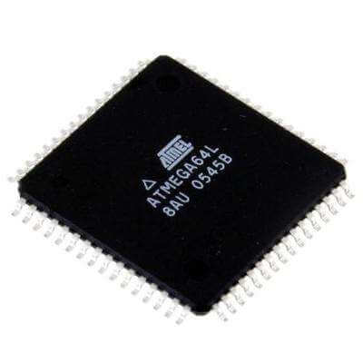
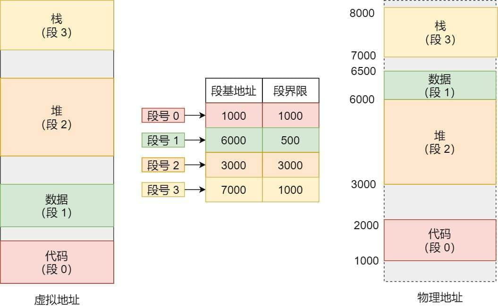
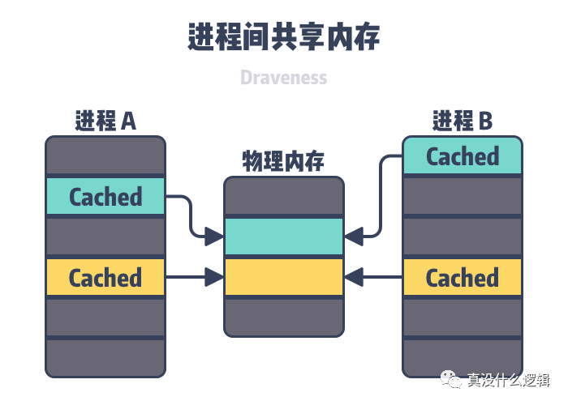

# 内存管理 —— 虚拟内存

## CPU 指令对内存的要求

对于 CPU 执行指令来说有三种重要的寄存器：

* PC 寄存器（Program Counter Register：程序计数器），我们也称作指令地址寄存器（Instruction Address Register）。顾名思义，他就是用来存储下一条指令的地址的。
* 指令寄存器（Instruction Register）
* 条件寄存器（Status Register），用里面的一个一个标记位（Flag），存放 CPU 进行算术或者逻辑计算的结果。

当程序执行的的时候，CPU 会根据 PC 寄存器里面的地址读取内存中的指令到指令寄存器执行，然后 PC 寄存器根据指令的长度自增，指向下一条指令的地址。从这里可以看到：程序中的一条条指令是连续存储在内存中的，这就说明**我们需要一个连续的内存空间存储指令**。

## 早期计算机的缩影：单片机

单片机相当于一个微型的计算机，和计算机相比，单片机只缺少了I/O设备。和早期的计算机一样：单片机是没有操作系统的。

这样来看呢，单片机其实就是一块电路板，执行的程序才是老大，**执行在单片机上所有程序都会直接操作物理内存**。在这种情况下就算排除 CPU 的限制，从内存的角度来讲要想在同时运行两个程序已经是不可能的了。例如：如果第一个程序在 2000 的位置写入一个新的值，将会擦掉第二个程序存放在相同位置上的所有内容，所以同时运行两个程序是根本行不通的，这两个程序会立刻崩溃。

## 内存对操作系统的挑战

当有了操作系统之后，就算是单核 CPU 的计算机，操作系统也可以通过分时的方式统计运行多个程序。那么操作系统是如何面对内存的挑战的呢？

 以 C 语言编写的程序为例，程序的执行过程主要分以下两个步骤：

1. 编译、汇编、链接三个过程最终生成一个可执行文件保存到磁盘上。
2. 从磁盘中加载可执文件中的数据和指令到内存，等待执行。

在 Linux 系统下使用的是一种名叫 ELF（Execuatable and Linkable File Format） 的文件格式，他的中文名叫做可执行和执行文件格式。

ELF 被加载到内存的过程主要面临两个挑战：

第一、**加载 ELF 的内存必须是连续的**。这个原因主要是源于 CPU 指令对内存的要求。

第二、**物理内存的分配问题**。我们需要同时加载多个程序，但要保证不同程序之间内存是隔离的，不会使用相同的内存空间造成撞车。

为了应对这两个要求，前人提出了一个解决方案：在磁盘上开辟一个连续的空间模拟内存，将可执行文件全部加载到这个空间中，“欺骗”程序获得了一块连续的物理内存空间，然后把这段连续的磁盘空间地址，和物理内存地址做一个映射。 至此虚拟内存诞生了。

这里就引出了两种地址的概念：

- 应用程序所使用的内存地址叫做**虚拟内存地址**（*Virtual Memory Address*），实际上是一块连续的磁盘空间。
- 实际存在硬件内存里面的空间地址叫**物理内存地址**（*Physical Memory Address*）。

**虚拟内存是操作系统物理内存和进程之间的中间层**，它为程序屏蔽了零碎、多变、共享的物理内存，提供了完整连续、稳定、独立的虚拟内存。

操作系统引入了虚拟内存，进程持有的虚拟地址会通过 CPU 芯片中的内存管理单元（MMU）的映射关系，来转换变成物理地址，然后再通过物理地址访问内存，如下图所示：

操作系统是如何管理虚拟地址与物理地址之间的关系？

主要有两种方式，分别是**内存分段和内存分页**，分段是比较早提出的，我们先来看看内存分段。

## 内存分段

程序使用的内存，会根据属性划分成不同的逻辑锻，例如：栈、堆、数据段、代码段等。单分段过后会存在三个不足：

1. **内存碎片**
2. **内存浪费**
3. **内存交换的效率低**

我们先来看看，分段为什么会产生内存碎片的问题？

我们来看看这样一个例子。假设有 1G 的物理内存，用户执行了多个程序，其中：

- 游戏占用了 512MB 内存
- 浏览器占用了 128MB 内存
- 音乐占用了 256 MB 内存。

这个时候，如果我们关闭了浏览器，则空闲内存还有 1024 - 512 - 256 = 256MB。

如果这个 256MB 不是连续的，被分成了两段 128 MB 内存，这就会导致没有空间再打开一个 200MB 的程序。

此时就表现出了前两个问题：

1. 内存碎片化。产生了不连续的多个小物理内存，导致新程序无法被加载。
2. 内存的浪费，不管程序是否真的使用到全部内存，在运行初期就把所有的内容都加载进了内存，导致了内存的浪费。

首先来看问题 1 的解决方案： 内存交换（Memory Swapping）

简单说就是将零散的程序内存区域先读到磁盘中，这块磁盘区域就是 Swap 。然后紧贴连续内存消耗区域再读出来。例如上图的例子：将音乐所占用 256M 内存区域读取到 Swap 中，然后紧贴游戏占用的 512M 再读到内存中。这样以来就有了两个连续的 128M 的内存空间了。

但是磁盘的读写速度相比内存还是慢了很多很多，在做较大内存交换的时候肯定会带来机器的卡顿。

所以为了解决内存浪费和交换效率低的问题，引入了新的概念：内存分页。

## 内存分页

内存分段虽然能够开辟连续的内存空间，但是因此造成的内存浪费、内存交换效率低的问题也很明显。既然内存划分的太大有问题，那么就把内存划分的更细一些：例如 Linux 就根据经验值将内存划分为 4K 大小的块，这个内存块有固定的名字叫做：内存页。

而当进程访问的虚拟地址在页表中查不到时，系统会产生一个**缺页异常**，进入系统内核空间分配物理内存、更新进程页表，最后再返回用户空间，恢复进程的运行。

由于内存空间都是预先划分好的，也就不会像分段会产生间隙非常小的内存，这正是分段会产生内存碎片的原因。而**采用了分页，那么释放的内存都是以页为单位释放的，也就不会产生无法给进程使用的小内存。**

如果内存空间不够，操作系统会把其他正在运行的进程中的「最近没被使用」的内存页面给释放掉，也就是暂时写在硬盘上，称为**换出**（*Swap Out*）。一旦需要的时候，再加载进来，称为**换入**（*Swap In*）。所以，一次性写入磁盘的也只有少数的一个页或者几个页，不会花太多时间，**内存交换的效率就相对比较高。**

更进一步地，分页的方式使得我们在加载程序的时候，不再需要一次性都把程序加载到物理内存中。我们完全可以在进行虚拟内存和物理内存的页之间的映射之后，并不真的把页加载到物理内存里，而是**只有在程序运行中，需要用到对应虚拟内存页里面的指令和数据时，再加载到物理内存里面去。**

## 缓存

虚拟内存中的虚拟页（Virtual Page，PP）可能处于以下的三种状态 — 未分配（Unallocated）、未缓存（Uncached）和已缓存（Cached），其中未分配的内存页是没有被进程申请使用的，也就是空闲的虚拟内存，不占用虚拟内存磁盘的任何空间，未缓存和已缓存的内存页分别表示已经加载到主存中的内存页和仅加载到磁盘中的内存页。如上图所示，图中绿色的虚拟内存页由主存中的物理内存页（Physical Page，PP）支撑，所以它是已经缓存过的，而黄色的虚拟内存页仅在磁盘中，所以没有被物理内存缓存。

当用户程序访问未被缓存的虚拟页时，硬件就会触发缺页中断（Page Fault，PF），在部分情况下，被访问的页面已经加载到了物理内存中，但是用户程序的页表（Page Table）并不存在该对应关系，这时我们只需要在页表中建立虚拟内存到物理内存的关系；在其他情况下，操作系统需要将磁盘上未被缓存的虚拟页加载到物理内存中

因为主内存的空间是有限的，当主内存中不包含可以使用的空间时，操作系统会从选择合适的物理内存页驱逐回磁盘，为新的内存页让出位置，选择待驱逐页的过程在操作系统中叫做页面替换（Page Replacement）。缺页中断和页面替换技术都是操作系统调页算法（Paging）的一部分，该算法的目的就是充分利用内存资源作为磁盘的缓存以提高程序的运行效率。

## 页表

在分页机制下，虚拟地址分为两部分，**页号**和**页内偏移**。页号作为页表的索引，**页表**包含物理页每页所在**物理内存的基地址**，这个基地址与页内偏移的组合就形成了物理内存地址，见下图。（在 Linux 中页表存储于内核中）

总结一下，对于一个内存地址转换，其实就是这样三个步骤：

- 把虚拟内存地址，切分成页号和偏移量；
- 根据页号，从页表里面，查询对应的物理页号；
- 直接拿物理页号，加上前面的偏移量，就得到了物理内存地址。

下面举个例子，虚拟内存中的页通过页表映射为了物理内存中的页，如下图：

这看起来似乎没什么毛病，但是放到实际中操作系统，这种简单的分页是肯定是会有问题的。

### 简单的分页有什么缺陷吗？

有空间上的缺陷。

因为操作系统是可以同时运行非常多的进程的，那这不就意味着页表会非常的庞大。

在 32 位的环境下，虚拟地址空间共有 4GB，假设一个页的大小是 4KB（2^12），那么就需要大约 100 万 （2^20） 个页，每个「页表项」需要 4 个字节大小来存储，那么整个 4GB 空间的映射就需要有 `4MB` 的内存来存储页表。

这 4MB 大小的页表，看起来也不是很大。但是要知道每个进程都是有自己的虚拟地址空间的，也就说都有自己的页表。

那么，`100` 个进程的话，就需要 `400MB` 的内存来存储页表，这是非常大的内存了，更别说 64 位的环境了。

## 多级页表

虚拟内存可以为正在运行的进程提供独立的内存空间，制造一种每个进程的内存都是独立的假象，在 64 位的操作系统上，每个进程都会拥有 256 TiB 的内存空间，内核空间和用户空间分别占 128 TiB[^5]，部分操作系统使用 57 位虚拟地址以提供 128 PiB 的寻址空间[^6]。因为每个进程的虚拟内存空间是完全独立的，所以它们都可以完整的使用 0x0000000000000000 到 0x00007FFFFFFFFFFFF 的全部内存。

虚拟内存空间只是操作系统中的逻辑结构，就像我们上面说的，应用程序最终还是需要访问物理内存或者磁盘上的内容。因为操作系统加了一个虚拟内存的中间层，所以我们也需要为进程实现地址翻译器，实现从虚拟地址到物理地址的转换，页表是虚拟内存系统中的重要数据结构，每一个进程的页表中都存储了从虚拟内存到物理内存页的映射关系，为了存储 64 位操作系统中 128 TiB 虚拟内存的映射数据，Linux 在 2.6.10 中引入了四层的页表辅助虚拟地址的转换[^7]，在 4.11 中引入了五层的页表结构[^8]，在未来还可能会引入更多层的页表结构以支持 64 位的虚拟地址。

在如上图所示的四层页表结构中，操作系统会使用最低的 12 位作为页面的偏移量，剩下的 32 位会分四组分别表示当前层级在上一层中的索引，所有的虚拟地址都可以用上述的多层页表查找到对应的物理地址。

## MMU &  TLB

页表实际上存储在 CPU 的**内存管理单元** （*MMU*） 中，于是 CPU 就可以直接通过 MMU，找出要实际要访问的物理内存地址。

多级页表虽然解决了空间上的问题，但是虚拟地址到物理地址的转换就多了几道转换的工序，这显然就降低了这俩地址转换的速度，也就是带来了时间上的开销。

程序是有局部性的，即在一段时间内，整个程序的执行仅限于程序中的某一部分。相应地，执行所访问的存储空间也局限于某个内存区域。

我们就可以利用这一特性，把最常访问的几个页表项存储到访问速度更快的硬件，于是计算机科学家们，就在 CPU 芯片中，加入了一个专门存放程序最常访问的页表项的 Cache，这个 Cache 就是 TLB（*Translation Lookaside Buffer*） ，通常称为页表缓存、转址旁路缓存、快表等。

在 CPU 芯片里面，封装了内存管理单元（*Memory Management Unit*）芯片，它用来完成地址转换和 TLB 的访问与交互。

有了 TLB 后，那么 CPU 在寻址时，会先查 TLB，如果没找到，才会继续查常规的页表。

TLB 的命中率其实是很高的，因为程序最常访问的页就那么几个。

## 共享内存

因为有多层的页表结构可以用来转换虚拟地址，所以多个进程可以通过虚拟内存共享物理内存。我们在 为什么 Redis 快照使用子进程 一文中介绍的写时复制就利用了虚拟内存的这个特性，当我们在 Linux 中调用 `fork` 创建子进程时，实际上**只复制了父进程的页表**。如下图所示，父子进程会通过不同的页表指向相同的物理内存：

**虚拟内存不仅可以在 `fork` 时用于共享进程的物理内存，提供写时复制的机制，还能共享一些常见的动态库减少物理内存的占用，所有的进程都可能调用相同的操作系统内核代码，而 C 语言程序也会调用相同的标准库。**

除了能够共享内存之外，独立的虚拟内存空间也会简化内存的分配过程，当用户程序向操作系统申请堆内存时，操作系统可以分配几个连续的虚拟页，但是这些虚拟页可以对应到物理内存中不连续的页中。

## 段页式内存管理

内存分段和内存分页并不是对立的，它们是可以组合起来在同一个系统中使用的，那么组合起来后，通常称为**段页式内存管理**。

段页式内存管理实现的方式：

- 先将程序划分为多个有逻辑意义的段，也就是前面提到的分段机制；
- 接着再把每个段划分为多个页，也就是对分段划分出来的连续空间，再划分固定大小的页；

这样，地址结构就由**段号、段内页号和页内位移**三部分组成。

用于段页式地址变换的数据结构是每一个程序一张段表，每个段又建立一张页表，段表中的地址是页表的起始地址，而页表中的地址则为某页的物理页号，如图所示：

段页式地址变换中要得到物理地址须经过三次内存访问：

- 第一次访问段表，得到页表起始地址；
- 第二次访问页表，得到物理页号；
- 第三次将物理页号与页内位移组合，得到物理地址。

可用软、硬件相结合的方法实现段页式地址变换，这样虽然增加了硬件成本和系统开销，但提高了内存的利用率。

## 内存保护机制

### 权限管理

操作系统中的用户程序不应该修改只读的代码段，也不应该读取或者修改内核中的代码和数据结构或者访问私有的以及其他的进程的内存，如果无法对用户进程的内存访问进行限制，攻击者就可以访问和修改其他进程的内存影响系统的安全。

如果每一个进程都持有独立的虚拟内存空间，那么虚拟内存中页表可以理解成进程和物理页的『连接表』，其中可以存储进程和物理页之间的访问关系，包括读权限、写权限和执行权限：

内存管理单元可以决定当前进程是否有权限访问目标的物理内存，这样我们就最终将权限管理的功能全部收敛到虚拟内存系统中，减少了可能出现风险的代码路径。

### 地址空间布局随机化

原先我们一个进程的内存布局空间是固定的，所以任何第三方很容易就能知道指令在哪里，程序栈在哪里，数据在哪里，堆又在哪里。这个其实为想要搞破坏的人创造了很大的便利。而地址空间布局随机化这个机制，就是让这些区域的位置不再固定，在内存空间随机去分配这些进程里不同部分所在的内存空间地址，让破坏者猜不出来。

## 参考

[为什么 Linux 需要虚拟内存](https://mp.weixin.qq.com/s?__biz=MzU5NTAzNjc3Mg==&mid=2247484282&idx=1&sn=62ddd2e10613c126fa602c845c4d833e&chksm=fe795c71c90ed56742bffa01e73fa1dc33c263bd215ecbadfbd6e8da2c16e8f225e18d995538&scene=21#wechat_redirect)

[20 张图揭开「内存管理」的迷雾，瞬间豁然开朗](https://zhuanlan.zhihu.com/p/152119007)

极客时间《深入浅出计算机组成原理》

极客时间《趣谈 Linux 操作系统》

极客时间《Linux 性能优化实战》

