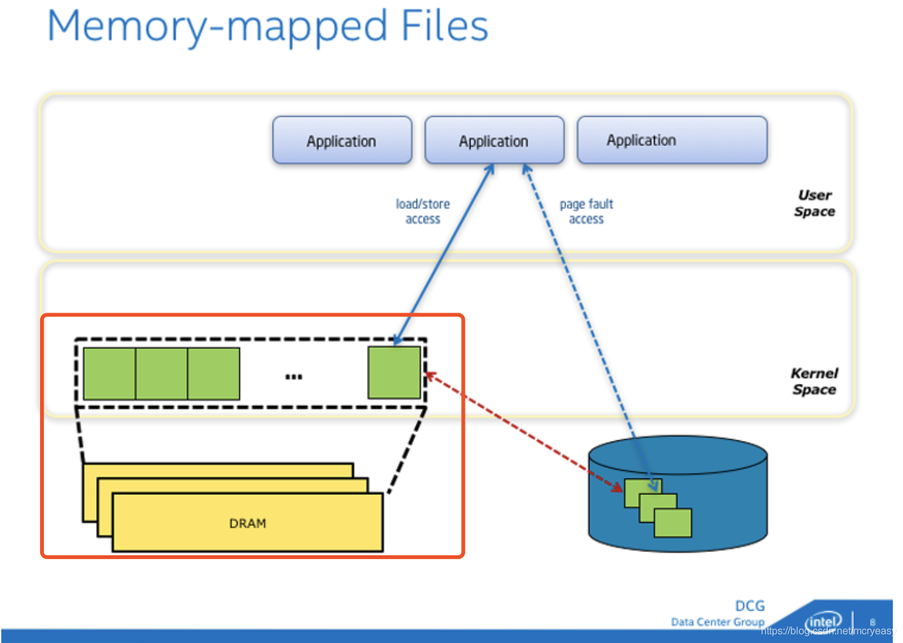

前面我们学习了分配虚拟内存的两种系统调用：brk 和 mmap 。blk 就很好理解了，直接移动指针即可。但是对 mmap 却还是云里雾里不是很理解。这里就单独学习一下 mmap 的基本原理以及在 Android 系统中的应用。

在 Android 中 mmap 应用于堆内存划分的同时也是 Binder 机制的基石，而腾讯的高性能 IO 库 [MMKV](https://github.com/tencent/mmkv)、美团的  [Logan](https://github.com/Meituan-Dianping/Logan) 都是基于 mmap  原理打造的。

# Linux 的文件系统

由于 Android 是基于 Linux 内核打造的，所以也符合 Linux 文件系统分层结构。和网络分层类似，一次文件读写请求内核所经历的层次模型大体如下：


- **虚拟文件系统层**：作用是屏蔽下层具体文件系统操作的差异，为上层的操作提供一个统一的接口。
- **文件系统层** ：具体的文件系统层，一个文件系统一般使用块设备上一个独立的逻辑分区。
- **Page Cache （层页高速缓存层）**：引入 Cache 层的目的是为了提高 Linux 操作系统对磁盘访问的性能。
- **通用块层**：作用是接收上层发出的磁盘请求，并最终发出 I/O 请求。
- **I/O 调度层**：作用是管理块设备的请求队列。
- **块设备驱动层** ：利用驱动程序，驱动具体的物理块设备。
- **物理块设备层**：具体的物理磁盘块。


可以看到 Linux 的文件系统分层是很复杂的，今天我们的重点是 Page Cache ，其他模块今天不讲。Page Cache 是为了加快文件的读取速度而引入的缓存。Page Cache（下面简称 Cache）是一块由内核管理的物理内存。简单来说读取磁盘很耗时的的一次事情，为此我们可以将一定数量的内容 cache ，如果读取操作命中缓存则直接返回结果避免了二次 IO 操作可以大大提升性能。


在 Linux 环境中我们可以使用

 ```shell
cat proc/meminfo
 ```

命令，可以看到 Cache 的情况


这里拓展一下 Buffer 和 Cache 的区别：

<font color = red >Buffer 是对磁盘数据的缓存,而 Cache 是对文件数据的缓存，他们即会用到读请求中也会用到写请求中。读写普通文件的时候， I/O 需要先和文件系统交互，然后文件系统负责和磁盘交互进行读写操作；读写磁盘实际操作的是一个块设备，如果跳过文件系统直接操作硬盘，这也就是所谓的“裸 I/O”，比如一些 VM虚拟机，则会越过File System，只接操作 Disk, 常说的 Direct IO.</font>

在早期的 Linux 内核中文件读写需要经过 Cache 和 Buffer 两个缓存，这样虽然简单但是明显浪费了内存，在后面的内核中 Linux 将二者融合了，使用的都是同一个内存空间，这样可以更充分的利用内存。

|               老版本 Linux 内核下二者是分开的                |                   目前的内核已经将二者融合                   |
| :----------------------------------------------------------: | :----------------------------------------------------------: |
|  |  |

Cache 是可以被回收的，当系统内存不足的时候 Cache 中的数据会被写入磁盘，释放内存以备使用。所以 Linux 可用内存是 MemFree + MemCached 的总和

Android 系统中通过 ActivityManager#getMemoryInfo#avalimem 中查看内用内存大小也是这样计算的：

其最终实现位于 [frameworks/base/core/jni/android_util_Process.cpp](https://cs.android.com/android/platform/superproject/+/master:frameworks/base/core/jni/android_util_Process.cpp;l=617?q=android_util_Process.cpp)


下图为源码顺藤摸瓜的路径（从左到右依次）：==可以看到最终的计算方式是读取 prof/meminfo 文件将 MemFree 和 Cached 两个值相加==

|              ActivityManager#getMemoryInfo 方法              | 通过 Binder 获取 getMemoryInfo 在 ActivityMangerService 的实现 |
| :----------------------------------------------------------: | :----------------------------------------------------------: |
|  |  |
|                    **mProcess 的实现类**                     |            **发现 getFreeMemory 为 native 方法**             |
|  |  |
|                       **最终计算方法**                       |                      **获取数据的方式**                      |
|  |  |


# Cache 与 Read/Write 操作

以读取文件为例，大体流程如下：

1. 进程使用系统调用向内核发起文件读取请求，此时会有用户态转为内核态的过程。
2. 内核访问文件系统读取
3. 如果有 cache 直接返回数据，没有开始读取磁盘
4. 读取成功将 page1 读取到 cache 中完成第一次 copy
5. 通知内核读取完毕（不同IO模型实现不同）
6. 将数据从 cache 拷贝到进程空间完成第二次拷贝


这里简单说一下为啥要拷贝到进程中：进程之间是相互隔离的，而且进程无法访问内核数据，所以得将 cache 拷贝的进程当中，给进程使用。


可见正常的文件读取都要进行两次内存拷贝，而我们今天的主角 mmap 可以将拷贝降低到一次，大幅度提升读写性能。

# MMAP 内存映射原理

==mmap 是一种内存映射文件的手段 ，它可以将文件直接映射到进程的地址空间(虚拟内存)。实现了文件和虚拟内存地址一一映射的关系==。在完成映射后，进程就可以使用指针直接读写文件，而系统会自动回写被修改过得脏页到磁盘对应位置。mmap 在完成了 read、write 相同效果的同时不仅省去了内核到进程的内存拷贝过程，而且还可以实现数据的共享操作：如果这段被映射的文件被内核或其他进程修改，那么最终的结果也会反映到映射当中。


## mmap 映射过程

1. 当进程调用内存映射库 mmap 函数后，会在其虚拟内存中寻找或开辟一段连续的、满足映射要求的地址用于稍后的操作。
2. 当内核收到相关请求后会调用系统内核 mmap 函数（注意此函数不同于用户空间函数），内核 mmap 函数会通过文件系统获取到文件在磁盘中的物理地址，映射到进程为此开辟的虚拟内存中。此时仅使用了虚拟内存还没有分配任何的物理内存空间即没有进行文件拷贝进内存，真正的拷贝是在进程读取或者写入操作的时候。
3. 当进程想要读写数据时，会寻找虚拟地址映射的物理内存区域（映射工作由 CPU MMU 通过内部的多级页表完成）。如果是第一次操作则页表未与物理内存完成映射，则会触发缺页中断
4. 在发生缺页中断后，会首先按照地址和偏移量查询 page cache 是否有目标数据缓存，如果有则修改 MMU 多级映射表将虚拟内存地址和 page cache 物理内存地址建立映射关系。此时完成了虚拟内存从磁盘地址映射到 page cache 物理内存映射转关的关系
5. 如果没有命中缓存，则通过内核读取文件内容到 page cache 中并转换映射关系。
6. 之后进程就可以直接操作 page cache 而且指定 MAP_SHARED 标志后脏页可自动会写磁盘（MAP_PRIVATE 修改了内存，数据不会同步到磁盘）。


可以看到 mmap 可以使进程直接操作位于内核的 page cache，完成这项操作的原理就是修改 MMU 多级页表的映射关系，但是 mmap 操作也是绕不开内核，他需要在内核的帮助下完成虚拟地址到磁盘地址的映射、通过 page cache 缓存文件数据。如下图所示 mmap 与磁盘的映射是暂时的（蓝色虚线），如果发生操作最终的映射转变为与 page cache 的物理内存映射（蓝色实线）




## 内存映射库 mmap 函数预览

```c
void *mmap(
	void *addr,   //映射区首地址，传NULL
	size_t length, //映射区大小（一般指定为文件fd的大小）非0 实际大小是内存页面（一般是4K）的整数倍
	int prot,  //映射区权限 
		PORT_READ //----映射区必须有PORT_READ权限
		PORT_WRITE
		PORT_READ | PORT_WRITE
	int flags,  //标志位参数
		MAP_SHARED //修改了内存，数据会同步到磁盘
		MAP_PRIVATE //修改了内存，数据不会同步到磁盘
   int fd,  //文件描述符,	要映射的文件对应的fd
   int off_t offset  // 映射文件的偏移量（一般设为0,偏移量必须是内存页面（一般是4K）的整数倍）
    ); 
```


更多信息可以在 macOS 或者 Linux 下执行 `man mmap` 查看

**细节**：

1. **mmap映射区域大小和偏移量必须是内存页(page_size)的整倍数（在Linux中内存页通常是4k）**内存管理的最小单元为页，为了一一映射，所以必须是内存页面的整数倍。
2.  **mmap 映射的是磁盘，只要映射建立完毕关闭文件句柄也是没有任何影响的**

## 案例：映射文件内存并写入

首先创建一个 1k 的二进制文件 test.txt。

```sh
mkfile 1k test.txt
```


然后创建文件 mmapDemo.c 具体代码如下

```c
#include <sys/mman.h>
#include <stdio.h>
#include <fcntl.h> // for open file
#include <stdlib.h> // for close file
#include <sys/stat.h>

int main(int argc, char const *argv[])
{
    const char* file = "/Users/im_dsd/Desktop/test.txt";
    // 打开文件，获取 fd 句柄
    int fd = open(file, O_RDWR);
    if (fd < 0) {
        printf("open file failed %s\n", file);
        exit(-1);
    }

    // 获取文件信息（此处获取大小信息）
    struct stat sb;
    if((fstat(fd, &sb)) == -1){
        printf("Can't file status failed\n");
        exit(-1);
    }
    
    char* mapped = mmap(NULL, sb.st_size, PROT_READ | PROT_WRITE, MAP_SHARED, fd,0);
    if(mapped == MAP_FAILED){
        printf("File mmap failed\n");
        exit(-1);
    }
    // 完成映射逻辑，关闭文件。mmap 映射的是磁盘地址 fd 被关闭了也不影响结果
    close(fd);
    
    // 直接对映射的内存进行修改，在首地址写入 Hello World
    strcpy(mapped, "Hello World!");
    // 同步内存与文件
    // 只要映射还存在，就可以通过 msync 将映射空间和内容写入文件，实现空间和文件的同步，
    if(msync (mapped, sb.st_size, MS_SYNC)== MAP_FAILED){
        printf("msync failed \n");
        exit(-1);
    }

    if ((munmap (mapped, sb.st_size)) == MAP_FAILED) {
        printf("munmap failed \n");
        exit(-1);
    }

    printf("mmap success \n");   
    return 0;
}

```

在 macOS 下 执行 make 命令编译文件并执行

```shell
# 编译文件
make mmapDemo
# 执行
./mmapDemo
```

最终成功向文件写入内容


# mmap 的应用

1. 程序的运行

   Linux执行一个程序，这个程序在磁盘上，为了执行这个程序，需要把程序加载到内存中，这时也是采用的是mmap。你可以从/proc/pid/maps看到每个进程的mmap状态。

1. 内存分配

   Linux 进程分配堆内存时候，会使用两种系统调用：brk、mmap，brk 适用于分配小内存空间原理就是移动指针指向。分配大内存的时候会使用 mmap 。那么在内存分配的场景下如何使用 mmap 呢？

   通过 `man mmap` 可以看到 mmap 有两个直接分配内存的 flag：MAP_ANON & MAP_ANONYMOUS 他们的作用就是只分配内存（匿名内存），而不与任何特定文件关联。 

   


3. Andorid Binder 机制

   Binder 在内存管理方面使用了 mmap 的功能达到了文件只拷贝一次的特点：

   1. 在 Binder 初始化时就会在物理内存当中申请大小为一页的空间，然后分别映射到以 vm_struct 表示的内核空间、以 vm_are_struct 表示的用户空间
   2. 当 Client 通过 Binder 跨进程与 Server 进行交互的时候，会将 Client 携带的数据写入 vm_struct 内核空间，完成第一次拷贝。
   3. 因为 vm_strcut 映射的是物理内存 binder_map ，所以数据会落地于此。
   4. vm_are_struct 也建立同 binder_map 的映射关系，这样一来 Server 的用户空间在不拷贝的情况下也能获取到 Client 发过来的数据。

   

4. 高效 IO 库

   mmap最主要的功能就是提高了IO读写的效率，微信的[MMKV](https://github.com/tencent/mmkv) key-value组件、美团的 [Logan](https://github.com/Meituan-Dianping/Logan)的日志组件 都是基于mmap来实现的。在微信的 [MMKV/Android/MMKV/mmkv/src/main/cpp/MMKV.cpp](https://github.com/Tencent/MMKV/blob/d4914ce5d2bb3015ca9d5c459c9735dece872532/Android/MMKV/mmkv/src/main/cpp/MMKV.cpp) 和美团的 [Meituan-Dianping/Logan/blob/master/Logan/Clogan/mmap_util.c](https://github.com/Meituan-Dianping/Logan/tree/master/Logan/Clogan) 的这两个文件中你都可以看到对mmap函数的使用，有兴趣的小伙伴可以自行查阅。

# 参考

[Android-内存映射mmap](https://blog.csdn.net/mcryeasy/article/details/86741781)

[极客时间：Linux 性能优化实战](https://time.geekbang.org/column/article/74633)

[Linux MMAP & Ioremap introduction PPT](https://www.slideshare.net/gene7299/linux-mmap-ioremap-introduction)


