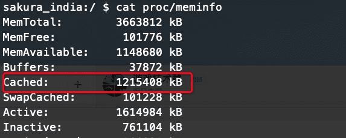
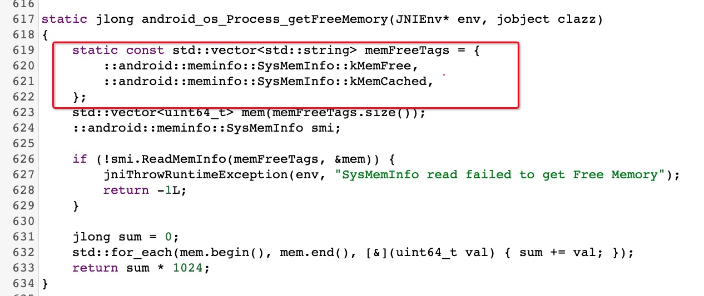
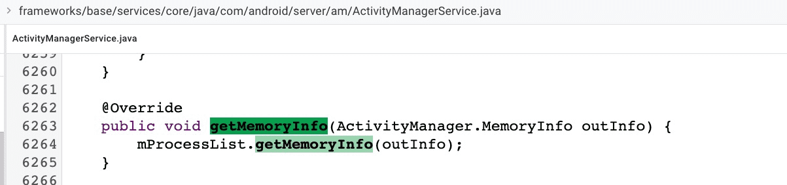
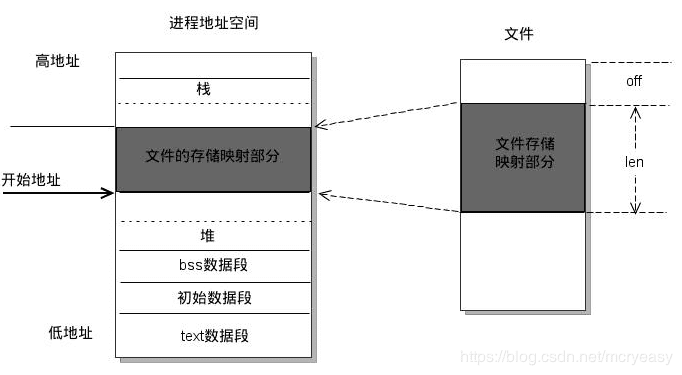

前面我们学习了分配虚拟内存的两种系统调用：brk 和 mmap 。blk 就很好理解了，直接移动指针即可。但是对 mmap 却还是云里雾里不是很理解。这里就单独学习一下 mmap 的基本原理以及在 Android 系统中的应用。

在 Android 中 mmap 应用于堆内存划分的同时也是 Binder 机制的基石，而腾讯的高性能 IO 库 [MMKV](https://github.com/tencent/mmkv)、美团的  [Logan](https://github.com/Meituan-Dianping/Logan) 都是基于 mmap  原理打造的。

# Linux 的文件系统

由于 Android 是基于 Linux 内核打造的，所以也符合 Linux 文件系统分层结构。和网络分层类似，一次文件读写请求内核所经历的层次模型大体如下：


- **虚拟文件系统层**：作用是屏蔽下层具体文件系统操作的差异，为上层的操作提供一个统一的接口。
- **文件系统层** ：具体的文件系统层，一个文件系统一般使用块设备上一个独立的逻辑分区。
- **Page Cache （层页高速缓存层）**：引入 Cache 层的目的是为了提高 Linux 操作系统对磁盘访问的性能。
- **通用块层**：作用是接收上层发出的磁盘请求，并最终发出 I/O 请求。
- **I/O 调度层**：作用是管理块设备的请求队列。
- **块设备驱动层** ：利用驱动程序，驱动具体的物理块设备。
- **物理块设备层**：具体的物理磁盘块。


可以看到 Linux 的文件系统分层是很复杂的，今天我们的重点是 Page Cache ，其他模块今天不讲。Page Cache 是为了加快文件的读取速度而引入的缓存。Page Cache（下面简称 Cache）是一块由内核管理的物理内存。简单来说读取磁盘很耗时的的一次事情，为此我们可以将一定数量的内容 cache ，如果读取操作命中缓存则直接返回结果避免了二次 IO 操作可以大大提升性能。


在 Linux 环境中我们可以使用

 ```shell
cat proc/meminfo
 ```

命令，可以看到 Cache 的情况



这里拓展一下 Buffer 和 Cache 的区别：

<font color = red >Buffer 是对磁盘数据的缓存,而 Cache 是对文件数据的缓存，他们即会用到读请求中也会用到写请求中。读写普通文件的时候， I/O 需要先和文件系统交互，然后文件系统负责和磁盘交互进行读写操作；读写磁盘实际操作的是一个块设备，如果跳过文件系统直接操作硬盘，这也就是所谓的“裸 I/O”，比如一些 VM虚拟机，则会越过File System，只接操作 Disk, 常说的 Direct IO.</font>

在早期的 Linux 内核中文件读写需要经过 Cache 和 Buffer 两个缓存，这样虽然简单但是明显浪费了内存，在后面的内核中 Linux 将二者融合了，使用的都是同一个内存空间，这样可以更充分的利用内存。

|               老版本 Linux 内核下二者是分开的                |                   目前的内核已经将二者融合                   |
| :----------------------------------------------------------: | :----------------------------------------------------------: |
|  |  |

Cache 是可以被回收的，当系统内存不足的时候 Cache 中的数据会被写入磁盘，释放内存以备使用。所以 Linux 可用内存是 MemFree + MemCached 的总和

Android 系统中通过 ActivityManager#getMemoryInfo#avalimem 中查看内用内存大小也是这样计算的：

其最终实现位于 [frameworks/base/core/jni/android_util_Process.cpp](https://cs.android.com/android/platform/superproject/+/master:frameworks/base/core/jni/android_util_Process.cpp;l=617?q=android_util_Process.cpp)



下图为源码顺藤摸瓜的路径（从左到右依次）：==可以看到最终的计算方式是读取 prof/meminfo 文件将 MemFree 和 Cached 两个值相加==

|              ActivityManager#getMemoryInfo 方法              | 通过 Binder 获取 getMemoryInfo 在 ActivityMangerService 的实现 |
| :----------------------------------------------------------: | :----------------------------------------------------------: |
|  |  |
|                    **mProcess 的实现类**                     |            **发现 getFreeMemory 为 native 方法**             |
|  |  |
|                       **最终计算方法**                       |                      **获取数据的方式**                      |
|  |  |


# Cache 与 Read/Write 操作

以读取文件为例，大体流程如下：

1. 进程使用系统调用向内核发起文件读取请求，此时会有用户态转为内核态的过程。
2. 内核访问文件系统读取
3. 如果有 cache 直接返回数据，没有开始读取磁盘
4. 读取成功将 page1 读取到 cache 中完成第一次 copy
5. 通知内核读取完毕（不同IO模型实现不同）
6. 将数据从 cache 拷贝到进程空间完成第二次拷贝


这里简单说一下为啥要拷贝到进程中：进程之间是相互隔离的，而且进程无法访问内核数据，所以得将 cache 拷贝的进程当中，给进程使用。


可见正常的文件读取都要进行两次内存拷贝，而我们今天的主角 mmap 可以将拷贝降低到一次，大幅度提升读写性能。

# MMAP 内存映射原理

==mmap 是一种内存映射文件的手段 ，它可以将文件直接映射到进程的地址空间(虚拟内存)。实现了文件和虚拟内存地址一一映射的关系==。在完成映射后，进程就可以使用指针直接读写文件，而系统会自动回写被修改过得脏页到磁盘对应位置。mmap 在完成了 read、write 相同效果的同时不仅省去了内核到进程的内存拷贝过程，而且还可以实现数据的共享操作：如果这段被映射的文件被内核或其他进程修改，那么最终的结果也会反映到映射当中。



## mmap 映射过程

1. 当进程调用 mmap 函数后，会在其虚拟内存中寻找或开辟一段连续的、满足映射要求的地址用于稍后的操作。
2. 当内核收到 mmap 请求后，会通过文件系统获取文件在磁盘中的地址，映射到请求进程开辟的虚拟内存当中

# 参考

[Android-内存映射mmap](https://blog.csdn.net/mcryeasy/article/details/86741781)

[极客时间：Linux 性能优化实战](https://time.geekbang.org/column/article/74633)


