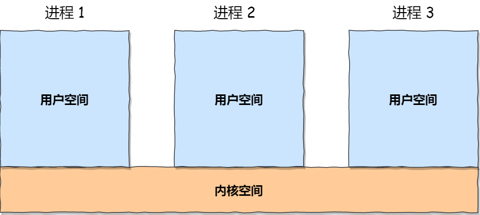
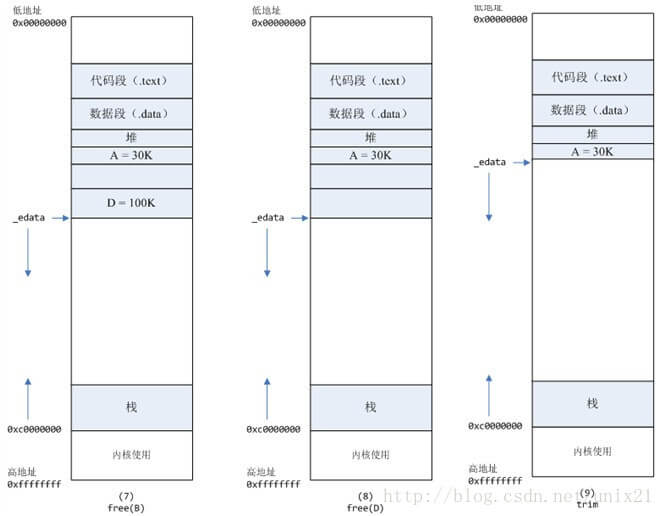

# 内存管理 —— Linux

## 硬件的影响：Intel 80386

早期 Intel 的处理器从 80286 开始使用的是段式内存管理。但是很快发现，光有段式内存管理而没有页式内存管理是不够的，这会使它的 X86 系列会失去市场的竞争力。因此，在不久以后的 80386 中就实现了对页式内存管理。也就是说，80386 除了完成并完善从 80286 开始的段式内存管理的同时还实现了页式内存管理。

但是这个 80386 的页式内存管理设计时，没有绕开段式内存管理，而是建立在段式内存管理的基础上，这就意味着，**页式内存管理的作用是在由段式内存管理所映射而成的地址上再加上一层地址映射。**

由于此时由段式内存管理映射而成的地址不再是“物理地址”了，Intel 就称之为“线性地址”（也称虚拟地址）。于是，段式内存管理先将逻辑地址映射成线性地址，然后再由页式内存管理将线性地址映射成物理地址。

这里说明下逻辑地址和线性地址：

- 程序所使用的地址，通常是没被段式内存管理映射的地址，称为逻辑地址；
- 通过段式内存管理映射的地址，称为线性地址，也叫虚拟地址；

逻辑地址是「段式内存管理」转换前的地址，线性地址则是「页式内存管理」转换前的地址。

##  Linux 内存管理方式

**Linux 内存主要采用的是页式内存管理，但同时也不可避免地涉及了段机制**。

这主要是上面 Intel 处理器发展历史导致的，因为 Intel X86 CPU 一律对程序中使用的地址先进行段式映射，然后才能进行页式映射。既然 CPU 的硬件结构是这样，Linux 内核也只好服从 Intel 的选择。

但是事实上，Linux 内核所采取的办法是使段式映射的过程实际上不起什么作用。也就是说，“上有政策，下有对策”，若惹不起就躲着走。

**Linux 系统中的每个段都是从 0 地址开始的整个 4GB 虚拟空间（32 位环境下），也就是所有的段的起始地址都是一样的。这意味着，Linux 系统中的代码，包括操作系统本身的代码和应用程序代码，所面对的地址空间都是线性地址空间（虚拟地址），这种做法相当于屏蔽了处理器中的逻辑地址概念，段只被用于访问控制和内存保护。**

## Linux 的用户空间、内核空间

从纵观的角度来看，在 Linux 操作系统中为了安全性在虚拟地址空间中划分出了**内核空间和用户空间**两部分，不同位数的系统，地址空间的范围也不同。比如最常见的 32 位和 64 位系统，如下所示：

通过这里可以看出：

- `32` 位系统的内核空间占用 `1G`，位于最高处，剩下的 `3G` 是用户空间；
- `64` 位系统的内核空间和用户空间都是 `128T`，分别占据整个内存空间的最高和最低处，剩下的中间部分是未定义的。

对于用户空间和内核空间来讲主要有以下区别：

- 用户空间是进程的私密空间，不用进程的内存空间都是相互隔离不可见的。进程在用户态时，只能访问用户空间内存；
- 内核空间系统的核心管理层，所有系统资源管理都是内核空间负责的，程序无法进入内核空间，只能通过系统调用来完成；

虽然每个进程都各自有独立的虚拟内存，但是**每个虚拟内存中的内核地址，其实关联的都是相同的物理内存**。这样，进程切换到内核态后，就可以很方便地访问内核空间内存。

下图给出了 Linux 下硬件、系统、进程三个层面的内存之间的概要关系。

## Linux 下虚拟内存的布局

### 用户空间

以 32 位系统为例，我画了一张图来表示用户空间的虚拟内存划分：

通过这张图你可以看到，用户空间内存，从**低到高**分别是 7 种不同的内存段：

- 程序文件段（只读段），包括二进制可执行代码；
- 已初始化数据段，包括静态常量； 
- 未初始化数据段，包括未初始化的静态变量；
- 堆段，包括动态分配的内存，从低地址开始向上增长；其中堆顶的位置可通过函数 `brk` 和 `sbrk` 进行动态调整。
- 文件映射段，包括动态库、共享内存等，从低地址开始向上增长（**[跟硬件和内核版本有关](https://link.zhihu.com/?target=http%3A//lishiwen4.github.io/linux/linux-process-memory-location)**）；一般是 `mmap` 函数所分配的虚拟地址空间。
- 栈段，包括局部变量和函数调用的上下文等。栈的大小是固定的，一般是 `8 MB`。当然系统也提供了参数，以便我们自定义大小；

在这 7 个内存段中，堆和文件映射段的内存是动态分配的。比如说，使用 C 标准库的 malloc() 或者 mmap() ，就可以分别在堆和文件映射段动态分配内存。

### 内核空间

内核空间看到的内存实质上也是虚拟内存。内核空间与具体的进程无关的，所有进程在通过系统调用进入内核态后看到的都是同样的内存空间。

直接映射区：就是这一块空间是连续的，和物理内存是非常简单的映射关系，其实就是虚拟内存地址减去 3G，就得到物理内存的位置。

## Linux 下虚拟内存的数据结构

Linux 为虚拟内存不同的段，提供了不同的数据结构来描述：

1. 在 Linux **内核**眼中所有的进程、线程都是 task 都适用 task_struck 描述。
2. task_struck 数据结构中的 mm 字段（mm_struct 类型）描述了进程或者线程用户态的内存信息；
3. mm_struct 中有映射页的统计信息(总页数, 锁定页数, 数据/代码/栈映射页数等)以及各区域地址
4. mm_struct 维护着 vm_area_struct 的链表，每个链表节点都描述了用户空间虚拟内存的布局划分：

那么，更重要的问题来了，内存究竟是怎么分配的呢？

## 用户空间的虚拟内存申请原理

### 发成缺页中断后，执行了那些操作？

当一个进程发生缺页中断的时候，进程会陷入内核态，执行以下操作：

- 检查要访问的虚拟地址是否合法
- 查找/分配一个物理页
- 填充物理页内容（读取磁盘，或者直接置0，或者啥也不干）
- 建立映射关系（虚拟地址到物理地址） 重新执行发生缺页中断的那条指令，如果第3步，需要读取磁盘，那么这次缺页中断就是majflt，否则就是minflt。

### 内存分配的原理

从操作系统角度来看，进程分配内存有两种方式，分别由两个系统调用完成：`brk`和`mmap`（不考虑共享内存）。

- brk是将数据段(.data)的最高地址指针_edata往高地址推；
- mmap是在进程的虚拟地址空间中（堆和栈中间，称为文件映射区域的地方）找一块空闲的虚拟内存。

> 这两种方式分配的都是虚拟内存，没有分配物理内存。在第一次访问已分配的虚拟地址空间的时候，发生缺页中断，操作系统负责分配物理内存，然后建立虚拟内存和物理内存之间的映射关系。

在标准C库中，提供了malloc/free函数分配释放内存，这两个函数底层是由brk，mmap，munmap这些系统调用实现的。

下面以一个例子来说明内存分配的原理：

**情况一、malloc小于128k的内存，**使用brk分配内存，将_edata往高地址推(只分配虚拟空间，不对应物理内存(因此没有初始化)，第一次读/写数据时，引起内核缺页中断，内核才分配对应的物理内存，然后虚拟地址空间建立映射关系)，如下图：

- 进程启动的时候，其（虚拟）内存空间的初始布局如图1所示。 其中，mmap内存映射文件是在堆和栈的中间（例如libc-2.2.93.so，其它数据文件等），为了简单起见，省略了内存映射文件。 _edata指针（glibc里面定义）指向数据段的最高地址。
- 进程调用A=malloc(30K)以后，内存空间如图2： malloc函数会调用brk系统调用，将_edata指针往高地址推30K，就完成虚拟内存分配。 你可能会问：只要把_edata+30K就完成内存分配了？ 事实是这样的，_edata+30K只是完成虚拟地址的分配，A这块内存现在还是没有物理页与之对应的，等到进程第一次读写A这块内存的时候，发生缺页中断，这个时候，内核才分配A这块内存对应的物理页。也就是说，如果用malloc分配了A这块内容，然后从来不访问它，那么，A对应的物理页是不会被分配的。
- 进程调用B=malloc(40K)以后，内存空间如图3。

**情况二、malloc大于128k的内存，**使用mmap分配内存，在堆和栈之间找一块空闲内存分配(对应独立内存，而且初始化为0)，如下图：

- 进程调用C=malloc(200K)以后，内存空间如图4： 默认情况下，malloc函数分配内存，如果请求内存大于128K（可由M_MMAP_THRESHOLD选项调节），那就不是去推_edata指针了，而是利用mmap系统调用，从堆和栈的中间分配一块虚拟内存。 这样子做主要是因为:: brk分配的内存需要等到高地址内存释放以后才能释放（例如，在B释放之前，A是不可能释放的，这就是内存碎片产生的原因，什么时候紧缩看下面），而mmap分配的内存可以单独释放。 当然，还有其它的好处，也有坏处，再具体下去，有兴趣的同学可以去看glibc里面malloc的代码了。
- 进程调用D=malloc(100K)以后，内存空间如图5；
- 进程调用free(C)以后，C对应的虚拟内存和物理内存一起释放。

- 进程调用free(B)以后，如图7所示： B对应的虚拟内存和物理内存都没有释放，因为只有一个_edata指针，如果往回推，那么D这块内存怎么办呢？ 当然，B这块内存，是可以重用的，如果这个时候再来一个40K的请求，那么malloc很可能就把B这块内存返回回去了。
- 进程调用free(D)以后，如图8所示： B和D连接起来，变成一块140K的空闲内存。
- 默认情况下： 当最高地址空间的空闲内存超过128K（可由M_TRIM_THRESHOLD选项调节）时，执行内存紧缩操作（trim）。在上一个步骤free的时候，发现最高地址空闲内存超过128K，于是内存紧缩，变成图9所示。

mmap 的系统调用过程图

### 既然堆内内存brk和sbrk不能直接释放，为什么不全部使用 mmap 来分配，munmap直接释放呢？

既然堆内碎片不能直接释放，导致疑似“内存泄露”问题，为什么 malloc 不全部使用 mmap 来实现呢(mmap分配的内存可以会通过 munmap 进行 free ，实现真正释放)？而是仅仅对于大于 128k 的大块内存才使用 mmap ？

其实，进程向 OS 申请和释放地址空间的接口 sbrk/mmap/munmap 都是系统调用，频繁调用系统调用都比较消耗系统资源的。并且， mmap 申请的内存被 munmap 后，重新申请会产生更多的缺页中断。例如使用 mmap 分配 1M 空间，第一次调用产生了大量缺页中断 (1M/4K 次 ) ，当munmap 后再次分配 1M 空间，会再次产生大量缺页中断。缺页中断是内核行为，会导致内核态CPU消耗较大。另外，如果使用 mmap 分配小内存，会导致地址空间的分片更多，内核的管理负担更大。

同时堆是一个连续空间，并且堆内碎片由于没有归还 OS ，如果可重用碎片，再次访问该内存很可能不需产生任何系统调用和缺页中断，这将大大降低 CPU 的消耗。 因此， glibc 的 malloc 实现中，充分考虑了 sbrk 和 mmap 行为上的差异及优缺点，默认分配大块内存 (128k) 才使用 mmap 获得地址空间，也可通过 mallopt(M_MMAP_THRESHOLD, ) 来修改这个临界值。

## 参考

[极客时间：Linux性能优化实战 - 15 | 基础篇：Linux内存是怎么工作的？ ](https://time.geekbang.org/column/article/74272)

[极客时间：趣谈 Linux 系统 - 第四部分：内存管理](https://time.geekbang.org/column/article/94926)

[Linux 内存分配原理](http://www.jishuchi.com/read/linux-interview/2830)

[OS / Linux / 进程的虚拟地址空间布局](https://blog.csdn.net/itworld123/article/details/104587838)

[malloc 两种实现方式：brk 和 mmap](https://blog.csdn.net/itworld123/article/details/104590807)

[认真分析mmap：是什么 为什么 怎么用](https://www.cnblogs.com/huxiao-tee/p/4660352.html)

[HotSpot VM的Native Memory Tracking](https://juejin.im/post/5c986e48f265da60cc02b83c)