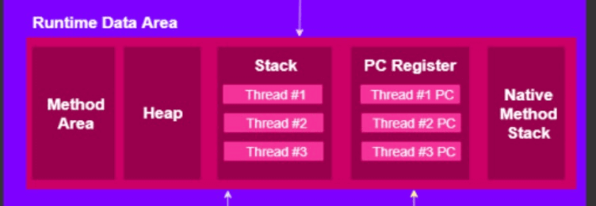
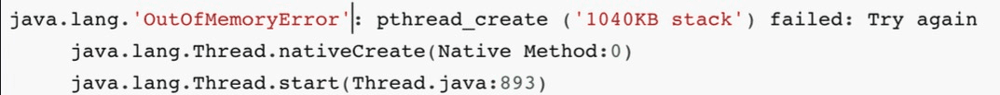
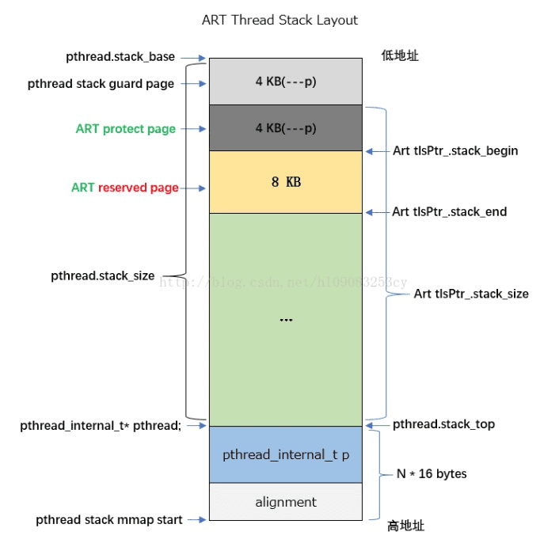
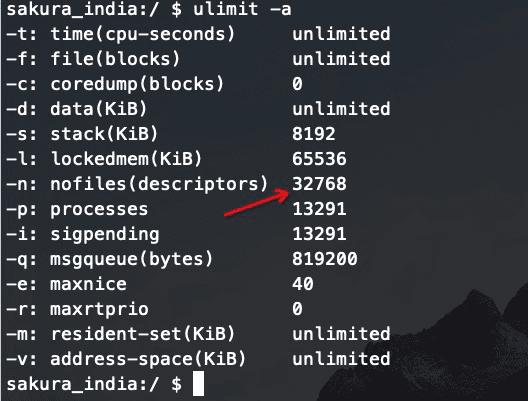
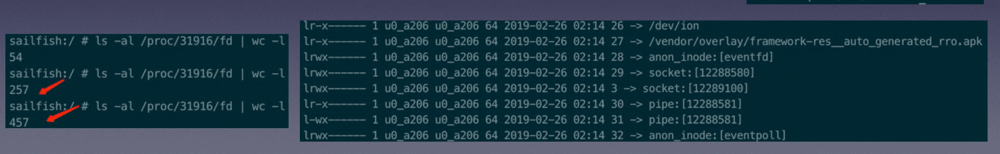
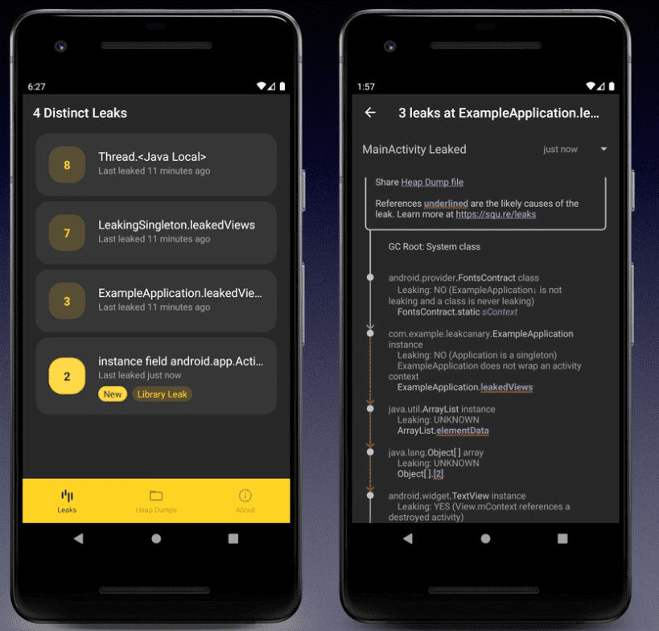
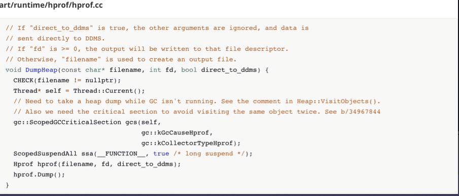
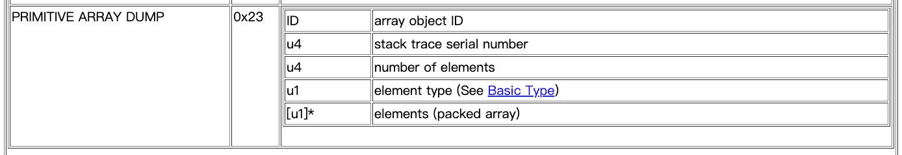
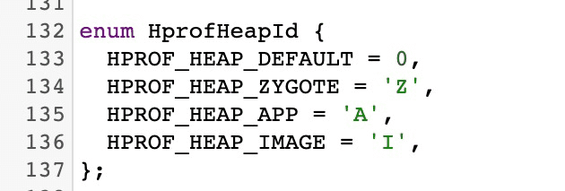
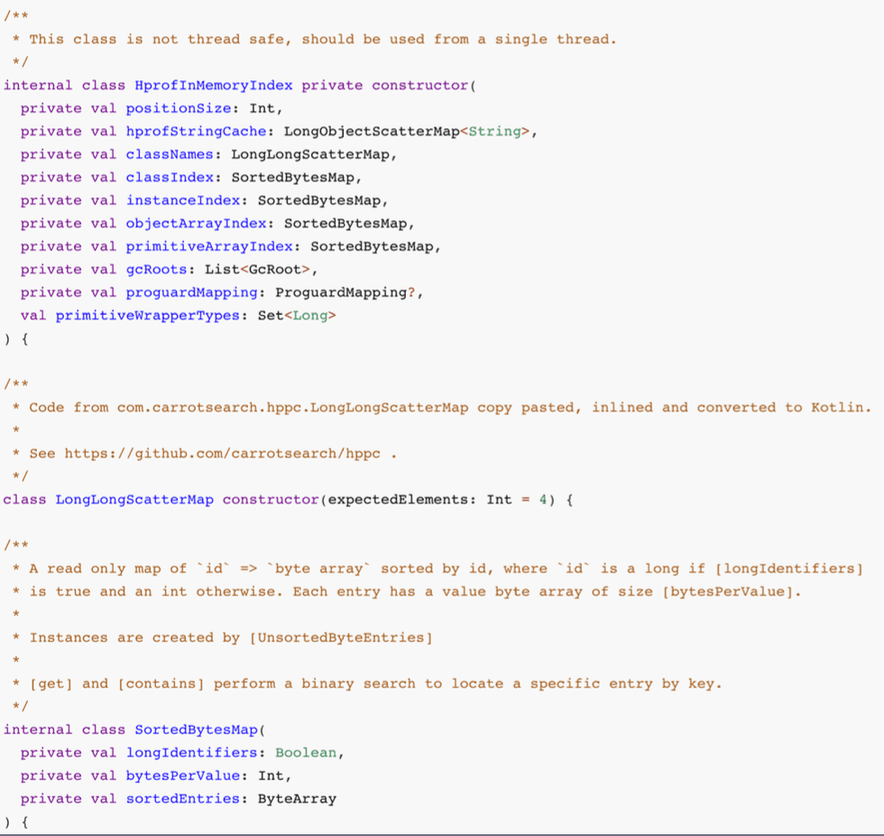

此文在 [快手Android OOM治理实践与思考](https://www.infoq.cn/video/EDV9u2HZlwmycLiFJm5s) 的基础上进行了自己的剖析和引导

# Android OOM 概览 

## OOM 分类

* Java 
* Native
* Thread
* File Descriptor
* JNI Reference

## Java Heap OOM

* 以 Bitmap 为例，创建 720P 的 Bitmap 需要 3M 内存，剩余 Java Heap 只有 1M，引发 OOM。在开启 largeHeap 的情况下，绝大多数设备的 Java Heap 上显示 512M（由dalvik.vm.heapsize 属性决定），64位设备还会更大一些，合理使用完全满足。
* Android 8.0 开始 Bitmap 分配在 Native Heap， OOM 率大幅度降低。  

## Java Stack OOM

* 虚拟机为 Java 线程分配的栈空间为 1040KB（1024 + 两个8kb的保护段），绝大多数的情况下都是浪费的
* 由于 Java 代码无法在 Stack 上分配对象，所以 Java的 Stack OOM 多数因为死循环递归调用引起的
* JNI 的情况复杂一些， C 代码可以在栈上分配大内存，即使内存使用得当也可能造成匪夷所思的栈溢出，比如误用了其他线程的 JVIEnv。

## Native VSS OOM（VSS:Virtual Set Size 虚拟内存）

VSS(包含共享库占用的内存) OOM 指的是虚拟内存 OOM，按理说虚拟地址是无限的，为啥会出现 OOM 呢？原因在于寻址空间:

* 64 位设备的 kernal 运行于 64位模式寻址空间我们可以认为是无限的，而32位 app 的寻址空间实际只有 4G

* 虚拟机会占用 1 ~ 2G 的 VSS 用于 GC 等操作，因此对于32位应用， Java Heap 越大，反而越容易触发 VSS OOM。这个错误容易出现在重度依赖 Native 的 app 上，变现为：越是高端机（分辨率高、Java Heap高）OOM 率越高的怪异现象。

这个错误在 Native 层会返回 12 或者 -12 错误码。

## Native PSS OOM (PSS:  Proportional Set Size 物理内存)

PSS(比例分配共享库占用的内存) 不像是 Java Heap 有单进程的上线，而是根据设备总体内存情况决定。  LowMemoryKiller 守护进程（LMKD）会每隔一段事件检查设备的内存使用情况，当内存不足的时候，会依据进程优先级从低到高依次杀进程释放内存，保证系统服务和前台应用有足够的内存。

比如我们在一个4G物理内存的手机上，使用 Native 分配 2G 内存，很大概率 App 会被 LMK 杀死，而且没有任何提示。

## Thread OOM

在 Java 调用 Thread#start 方法之后，Native层就会创建一个 Thread，创建 Thread 需要在 Java Stack 上分配一个`1040kb`的空间作为线程栈。

上图可以看到 Thread OOM 会提示 ptread_create 失败，Thread OOM 主要出现两种情况：

1. 文件描述符不够了
2. 虚拟内存的寻址空间不够了。

下图是 ART 虚拟机线程栈的内存布局图，其中绿色部分就是一个线程需要的 Stack 内存空间： 1024kb，再加上 ART 提供的内存保护：两个8KB，总共是1040KB

* 线程数的上线系统默认是 32768 部分华为设备的限制是500， 也是 VSS OOM的一种表现形式。通常1000(1000 * 1040k ≈ 1G)左右就会触发 VSS OOM。因此Thread OOM其实也是 VSS OOM的一种表现形式。

* 通过 hook libart.so 的 pthread_attr_setstacksize 外部调用， 可以减小创建线程时分配的内存比如 256KB, 根据快手技术专家的经验 256kb 已经足够用了，大幅减低Thread OOM率。

* 同理，反射减小sCursorWindowSize，可以大幅降低数据库访问时的OOM。

## File Descriptor OOM

* 在 Android 9 以前 FD 是宝贵的资源，系统默认设定一个进程最多分配 1024 个FD，可以通过 ulimit -a 查看。到了 Android 9 Google 工程师也意识到这个设定有点小了已经拓展到 32768 （3k个）

* | Anrdoid 9 以前                                               | Android 9                                                    |
  | ------------------------------------------------------------ | ------------------------------------------------------------ |
  |  |  |

* 我们很多应用场景都会默默的使用 FD 例如 Handler、stock 等比如创建一个 HandlerThread 在创建线程的同时还会创建两个 FD：mWeakEventFd和mEpollEvent（原因是 Handler 内使用了 epoll 机制来保障 Looper 的等待和唤醒，在 Android 5.0之前 Handler 的底层使用的是管道此时会使用三个 FD）。

* /proc/<pid>/fd 根据文件名聚类可以初步定位fd泄漏问题。（此操作需要 Root）

* 

## JNI Reference OOM

JNIT 的引用 OOM 可以在 logcat 中查看。在 Android 日常开发中很少会遇到 JNI Reference OOM 场景，除非你是 Native 的开发人员。

# LeakCanary

## 原理

* 解决内存问题最有效的办法就是通过内存镜像（Hprof文件）

* LeakCanary 的核心也是解决内存问题常见的三板斧：监控泄漏、采集镜像、分析镜像。

* 但是 LeakCanary 有致命的问题：无法线上部署。原因很简单在采集和分析内存镜像中会造成明显的卡顿。而且官方文档也明确建议不推荐在线上版本使用，如果集成到 release 包内会直接触发崩溃。

  > We **do not recommend** including LeakCanary in release builds, as it could negatively impact the experience of your customers.

## 缺陷

* 无法线上部署
  * 主动触发 GC 造成 App 卡顿
  * Dump 内存镜像时会造成 app 冻结（大约13s，期间不响应任何操作）
  * 分析内存镜像效率低
  * 不具备 service 处理能力（上传、检索、分析）
* 使用范围
  * 仅能检查 Activity&Fragment泄漏
  * 无法检测大对象分配、内心抖动等问题
* 自动化程度低
  * 无法对问题做聚类分发
  * 需要人工买点

# 采集监控性能优化

## 1. dump 优化

LeakCanary dump 操作使用了 Android Api `Debug.dumpHprofData(String fileName)`:

* 为什么  `Debug.dumpHprofData(String fileName)` 会冻结 App
* dump 的操作能不能异步完成？

### 冻结的原因

* dump 操作会通过 Native 层的 hprof.Dump() 将内存数据按照 Hprof 协议的格式按照二进制的形式保存到磁盘中

* ==为了保证 dump 过程中内存数据的不变性在执行 hprof.Dump() 之前会通过 ScopedSuspendAll （构造函数内调用了 SupendAll）暂停了所有 Java 线程，在 dump 结束后通过 ScopedSusendAll 析构函数中（通过 ResumeAll ）恢复线程==

### 异步 dump 

既然要冻结所有线程那么常规的子线程操作就没了任何意义。那么在子进程中处理可以吗？这里要设计一个知识点 ：进程的创建过程。

Android 是在 Linux 内核基础上构建的操作系统，所以 Android 创建进程的流程大体如下：

1. 子进程都由父进程 fork 而来（Android 为 App 创建进程时 fork 的是 zygote 进程），且符合 COW 流程（copy-on-write 写时复制）
2. COW指的子进程在创建时拷贝的是父进程的虚拟内存而不是物理内存。子进程拥有了父进程的虚拟内存就可以通过页表共享父进程的物理内存（这是关键）
3. 当子进程或者父进程对同享的物理内存修改时，内核会拦截此过程，将共享的内存以页为单位进行拷贝，父进程将保留原始物理空间，而子进程将会使用拷贝后的新物理内存。

这意味着我们可以在 dump 之前先 fork App 进程，这样子进程就获得了父进程所有的内存镜像。但还有一个棘手的问题需要解决。

### SuspendAll 处理

这个棘手的问题是：dump 前需要暂停所有线程（不仅仅是 Java 线程还有 Native 线程），而子进程只保留执行 fork 操作的进程，但主进程内所有的线程信息还是保留的，以至于虚拟机认为子进程中还是由很多线程的。所以在子进程中执行 SuspendAll 触发暂停是永远无法等到其他线程执行暂停后的返回结果的。

经过仔细分析 SuspendAll 过程，我们发现可以先在主进程中执行 SuspendAll 方法，使 ThreadList 中保存所有线程状态为 suspend，之后再fork，这样子进程共享父进程的 ThreadList 全局变量 _list，可以欺骗虚拟机，使其认为所有的线程完成了暂停操作，接下来就可以在子线程执行 hprof.dump 操作了。而主进程在 fork 之后调用 ResumAll 恢复运行。

|                     **fork dump**流程图                      |                 dump hprof blocking 时间对比                 |
| :----------------------------------------------------------: | :----------------------------------------------------------: |
|  |  |

## 2. hprof 体积优化

hprof 文件通常比较到，文件的体积和手机最大堆内存呈正相关。分析 OOM 时遇到 500M 以上的 hprof 文件也不稀奇。文件的大小和 dump 成功率、dump 性能、上传成功率均呈负相关。且大文件额外浪费用户的磁盘空间和上传到服务端的流量。因此需要对 hprof 文件进行裁剪，只保留分析 OOM 必须的数据，另外，裁剪还有对用户数据脱敏的好处，只上传内存中类域对象的组织结构，并不上传真是的业务数据(诸如字符串、byte 数组等含有具体数据的内容)，保护了用户的隐私。

1. Hprof 文件中的内容都是些什么？数据如何组织的？哪些可以裁剪？
2. 内存中的数据结构和 hprof 文件二进制协议的映射关系？
3. 如何裁剪

### hprof 的数据结构

查阅 openJDK 官方文档和 AOSP 源码可知(更多 Hprof 文件信息见 [HPROF Agent](http://hg.openjdk.java.net/jdk6/jdk6/jdk/raw-file/tip/src/share/demo/jvmti/hprof/manual.html))

1. Hprof 文件按 byte by byte 顺序存储，u1、u2、u4 分别代表 1byte 、2byte、4byte

2. Hprof 的核心数据结构物 Header 和 Recod，Header 记录元数据，Record 分很多条目，每一条有一个单独的 TAG 表示（下图来自 ART 源码）

   

我们主要关注 Record 中的 HEAP_DUMP 类型，其中分为五个子类，分别为 GC ROOT、CLASS DUMP、INSTANCE DUMP、OBJECT ARRAY DUMP 、PRIMITIVE ARRAY DUMP。

下图为 PRIMITIVE ARRAY DUMP（基本类型数组）的数据结构，内存中绝大部分数据是 PRIMITIVE ARRAY DUMP,通常占据 80% 以上，而我们 OOM 分析只关心对象的引用关系和对象大小，其他部分我们并不关心，因此这部分是我们裁剪 Hprof 的主要突破口。

### 实时裁剪

通过[ Art hprof.cc](https://cs.android.com/android/platform/superproject/+/master:art/runtime/hprof/hprof.cc;drc=master;bpv=1;bpt=1;l=163) 源码可以看到Android 对 TAG 类型做了拓展，增加了一些 GC ROOT 类型

Android 对 Java堆进行了更细致的划分(用 HEAP_DUMP_INFO 表示具体划分情况见下图)。我们只关心 HPROF_HEAP_APP 即可，其余的部分都可以裁剪掉，这是因为其他部位都是 Android 内存所有 App 共享的不参与 GC。这里可以参考 Android Studio 中 Memory Profile 的处理。

接下来讨论的是如何实现裁剪，裁剪的方案有两个：

1. 在 dump 完成后的 hprof 文件上做裁剪
2. 在 dump 过程中做实时裁剪

为了较少不必要的 IO 操作和资源消耗，快手选择了第二种。

## hook 点的选取

顺着 TAG 找到了 HEAP_DUMP 的写入点，PS ：下图可以清楚的看到 Recod的写入过程：

1. 使用 [StartNewRecord() ](https://cs.android.com/android/platform/superproject/+/master:art/runtime/hprof/hprof.cc;drc=master;l=163) 写入开始 TAG 和当前时间戳
2. 使用 StartNewRecord 写入结束 TAG 和事件戳
3. 调用 Enreccord() 收尾。

根据快手 Anroid 专家的意思写入的过程也是使用 AddU1/U4/U8 方法将数据写入 Buffer。但是笔者对 C/C++ 不了解，没看懂源码是如何将 hprof 文件到写入 buffer 中的，

在写入时先会执行 [StartNewRecord() ](https://cs.android.com/android/platform/superproject/+/master:art/runtime/hprof/hprof.cc;drc=master;l=163)方法,然后通过 AddU1/U4 写入 buffer ==此时可以发现 Record 数据的都是通过 AddU1/U4/U8 方法写入 Buffer 的==

我们在 EndRecord 中顺着 HandleEndRecord 的蔓摸到了==最终写入磁盘的方法：WriteFully==。

显而易见此时有两个点可提我们 hook：

1. AddUx 方法
2. WriteFully 方法

理论上讲 AddUx 方法性能最好，可以较少写入 buffer 时候的内存开销。但是 AddUx 的调用比较复杂，而且他是 ART 内部代码，很可能会被不同手机厂商修改出现兼容性的问题。而 write 是一个外部调用且只在 Record 写入文件的时候调用一次，从 hook 原理上来讲，hook 外部调用的 PLT/GOThook 也比 hook 内部调用的 inline hook 要稳定的多（PS:好吧，我对 hook 这块一无所知，一脸懵逼）。因此快手最终选择了方法二。

# 监控性能优化

## 阈值监控

为什么 LeakCanary 需要主动触发 GC 呢？LeakCanary 监控泄漏利用了弱引用的特征，为 Activity 对象创建弱引用，当 Activity 变为弱可达（没有强引用）的时候，弱引用将会加入弱引用队列中，但是 GC 的触发时机不可知，所以不能仅仅依靠弱引用队列是否不为空就确定存在内存泄漏。在通过主动 GC 的方式可以使垃圾回收器进行一次扫描标记从而确定是否存在内存泄漏（确认的方式还是看弱引用队列中是否存在此 Activity 的弱引用）。

但是 GC 是 Stop-The-World 的，频繁的 GC 会造成用户感知的明显卡顿。为了解决这一方案快手、美团都使用了阈值判定的方式设计了无性能损耗的内存监控策略。其中快手的策略大致如下：

1. Java 堆、线程数量、文件描述符数量突破阈值触发采集
2. Java 堆上涨速度突破阈值触发采集。
3. 发生 OOM 是如果策略 1、2 未命中触发采集。
4. 泄漏判定延到解析时。

改成阈值监控除了性能外，还有其他明显的好处 ：OOM 的来源一般有两种

1. 是内存的峰值过高。例如特大图片占用内存过大、不合理的 Bitmap 缓存池。
2. 持续的内存泄漏，内存水位线逐渐上涨。

LeakCanary 的弱引用策略仅能解决内存泄漏问题，而且需要手动埋点（PS:没试过，怎么埋点呢？）而通过阈值监控的方式可以同时解决内存泄漏和峰值的问题，也不需要手动埋点，甚至还能解决频繁对象的引发的内存抖动问题。

那么如何判定对象泄漏呢？以 Activity 为例，其实并不需要在运行时判定其是否内存泄漏，Activtu 内部有一个成员变量 mDestroyed，在 onDestroy 时会被置为 true，只要解析时发现 可达且 mDestroyed 为 true 的 Activity 即判定为泄漏。其他类型的对象可以以此类推，根据其特点设计。

# 解析性能优化

## 可达性分析

三板斧的最后一斧就是镜像分析了，其基本思路是模仿 GC 算法，对我们关注的对象（泄漏、大对象）进行科可达性分析，找出 GC Root 和引用链，再结合代码分析。

暴力解析引用关系树的 CPU 和内存消耗都是很高的，即使在独立进程解析，很容易触发 OOM 或者被系统强杀，成功率非常低。因此需要对解析算法进行优化。

## 关键对象的选取

对所有对象进行可达性分析性能开销是巨大的，且没有重点也不利于问题解决，回顾前文，如果我们只关注泄漏对象和不合理使用的大对象，那么第一步就可以对引用关系树尽可能的进行剪枝:

1. 泄漏对象最典型的 Activity 和 Fragment，有着明显的生命周期特征且持有大量资源，除此外我们还对自定义核心组件做了泄漏判定，比如 Presenter。
2. 常见的大对象有 Bitmap、Array、TextTure 等，Bitamp/TextTure 的数量、宽高，Array 长度等等可以结合业务数据比如屏幕大小、View Size 等进行判定。
3. 有些对象既是泄漏也是大对象，关键对象的选取策略需要各 App 结合实际情况来灵活定制。

## HAHA & Shark

LeakCanary 早起使用的解析引擎是 HAHA 。在 HAHA1 使用了 MAT 的分析组件到了 HAHA2 改为 Android Stuido Perlib 组件。但是这两个组件都是基于 PC 端设计的且表现优秀，但是在移植到资源受限的手机端后，性能就急剧下降，解析过程很容易出现第二次 OOM，且解析极慢，成功率低。

随着 LeakCanary 2.0 版本的发布，其研发团队退出了新一代 hporf 分析引擎 shark。其宣称 Shark 相比 HAHA 内存峰值降低10倍，解析速度提升 6倍。快手团队试验后发现在较小的 hprof 文件下 Shark 的表现和宣称的性能一致。但是在分析包含百万级对象的 hprof 是性能解决下降，分析耗时突破 10 分钟。

## HAHA 为啥慢

1. 没有懒加载， hprof 内容会全部 load 到内存中。
2. Domainitor tree 和 retained size 全量计算，而我们只关心关键对象
3. 频发触发 GC : 这是因为 Java 的集合类没有针对计算密集型任务做优化，含有大量用于的拆箱、装箱、扩容拷贝等操作，大量的对象创建频发的 GC ，GC 反过来进一步降低对象分配速度，陷入恶性循环。

## Shark 为啥快

Shark 的核心思想就是懒加载和数据结构优化：

1. 索引。Sark低内存开销的本质就是通过索引做到了懒加载，遍历 hprof 时存储对象在 hprof 中的文职，并建立做索引方便按需解析
2. 数据结构上做了深度优化，主要使用了更高效的 map，一是对于 key 和 value 都是基本类型的 hppc，二是对于 value 不是基本类型的，使用 SotredBytesMap 村粗内容。
3. Hppc 是 High Performance Primitive Collection 的缩写，Shark 使用了 Kotlin 将其进行了了重写，hppc 只支持基本类型，我们知道 kotlin 只有基本类型没有装箱类型，所以没有了拆箱和装箱的性能损耗，相关集合操作也做了大量优化。

## 索引

[Shark 索引源码地址](https://github.com/square/leakcanary/blob/5983eae9a1dbd96f0de5cd5e2601cd3c563f978f/shark-graph/src/main/java/shark/internal/HprofInMemoryIndex.kt)

* 索引对应前文提到的 hprof Record 中的 HEAP DUMP 类型。

* 包含实例索引，类索引，字符串索引，类名索引，数组索引。

  

## 需求分析

我们的目标是打造线上内存分析工具，所以和 LeakCanary 还是存在挺大差异的：

1. LeakCanary 中 Shark 只用于分析单一内存泄漏对象的引用链，而线上 OOM 分析工具要分析的是大量对象的引用链。
2. LeakCanary 对于结果的要求非常准确，而我们的是线上大数据分析，允许丢弃个别对象的引用链，牺牲一些覆盖率来大幅度提高稳定性。
3. LeakCanary 为了让分析日志更加详尽，对于镜像中的对象所有字段都会进行分析，而我们只关心引用链并不关心基础类型的值。所以此步骤可以省略。

## 最终优化策略

1. 对 GC Root 剪枝，可达性分析是从 GC Root 自顶向下 BFS，如 JavaFrame MonitorUsed 等 GC Root 都可以直接剪枝。

2. 基本类型和基本类型数组不搜索、不解析；同类对象超过阈值时不再搜索。

3. 增加预处理，缓存每个类递归调用的结果，减少重复计算。

4. 将 object ID 的 类型从 long 改为 int，Android 虚拟机的 object ID 大小只有 32 位，目前shark 里使用的都是 long 来存储的， OOM 时百万级对象的情况下，可以节省10M 内存。

   

   经过上面的优化、将解析时间在 Shark 的基础上优化了2倍以上，内存峰值控制在 100M 以内。

# 分发与跟进

此部分就没啥好说的了，就只能看看人家大厂是如何做的。

# 总结

1. 基础知识很重要
2. 源码阅读能力很重要
3. 遇见问题要抓住头部问题，例如如果用户入口页、长时间驻留页发生内存泄漏影响是最大的，一旦出现问题稳定性会大幅度降低。需要第一时间解决。
4. 大需求何如前一定要做对比灰度，OOM 问题很难定位到是哪个需求引入的，如果在需求何入前通过对比灰度数据，可以精准的预估出实际上线后对大盘的影响。
5. 推荐打包为 64 为的 App ，32位的地址空间仅有4G，内核固定使用1G，进程启动的时候就会划分出去 2 ~3 G的虚拟地址范围，很容易出现手机配置越高越容易出现 OOM 的现象。

# 参考

 [快手Android OOM治理实践与思考](https://www.infoq.cn/video/EDV9u2HZlwmycLiFJm5s) 

[为什么 Redis 快照使用子进程](https://draveness.me/whys-the-design-redis-bgsave-fork/)