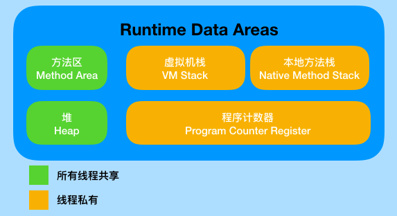
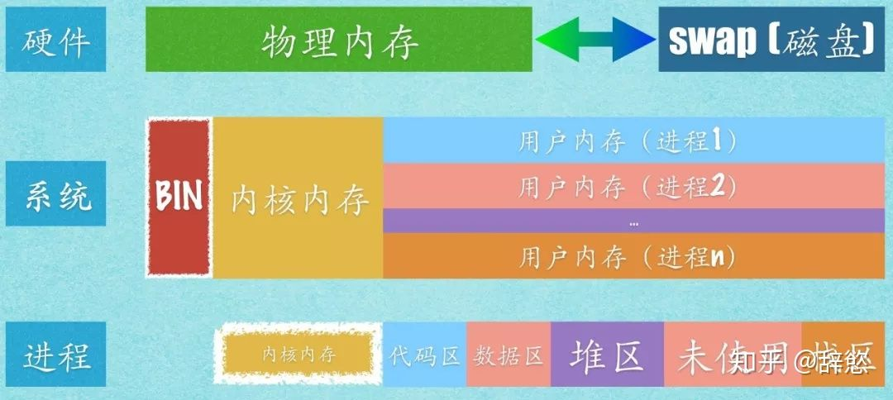
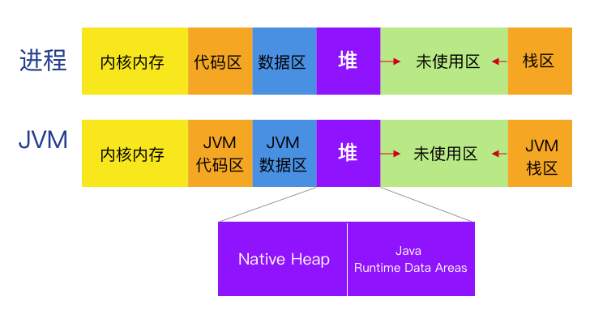
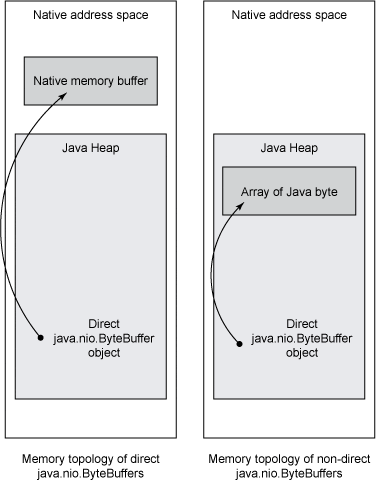
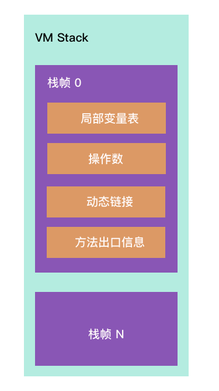
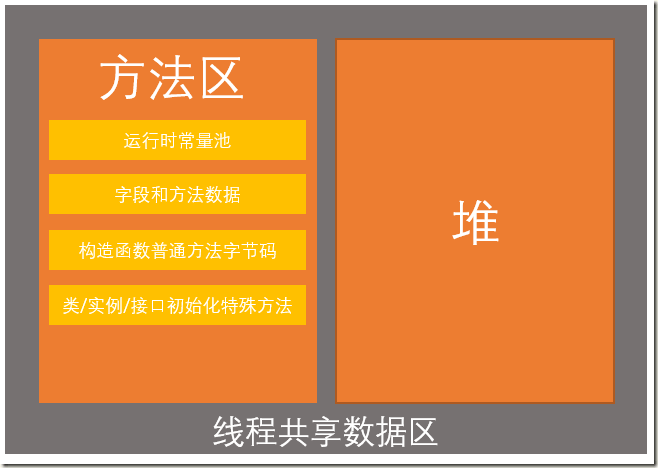

<font color = red>注意：</font>

1. <font color = red>如果不做特殊注明，本文提到的所有内存均指虚拟内存</font>
2. <font color = red>本文涉及的操作系统层面内容均指 Linux 操作系统</font>
3. <font color = red>本文的 JVM 特指 Hotspot 虚拟机</font>


# 从进程的角度看待 JVM

绝大部分的资料、数据描述的都是 java 运行时内存模型：




但每个 JVM 实例都做作为一个**进程**运行在操作系统当中，那么

1. JVM 的内存布局是怎样的
2. Java 程序是如何使用内存的
3. java 运行时内存分布与虚拟内存段的对应关系是什么？

带着这几个问题，进入接下来的分析。


## Linxu 操作系统的内存关系

JVM 以一个进程（Process）的身份运行在 Linux 系统上，了解 Linux 与进程的内存关系，是理解 JVM 与 Linux 内存的关系的基础。下图给出了硬件、系统、进程三个层面的内存之间的概要关系。




## JVM 进程内存布局

在阅读完 JVM 相关的著作之后，我得出了 JVM 进程与 Java 运行时内存关系图。



可以看到：

1. JVM 进程的内存布局还是和不同进程一样没有变化。
2. 我们所说的 Native 内存、或者直接内存指的其实就是 JVM 进程的堆，这块内存至少被 Class Loader、执行引擎使用着、垃圾回收器
3. Java 运行时数据区本质上属于 JVM 进程堆，Java 程序在使用的时候将其进行个更加细致的划分见下图红色区域。


为什么 JVM 要如此划分内存呢？我认为 JVM 在模拟操作系统。他为 Java 代码提供了一个运行的环境，然后将一部分 JVM堆内存按照不同区域再次划分成堆、栈结构，并接管了 Java 堆的内存回收工作。


而 JVM 本身也是程序，它运行在操作系统之上。经过上面这些图就可以回到开篇提出的问题中的两个。

1. JVM 的内存布局是怎样的。答：见本节第一张图
2. java 运行时内存分布与虚拟内存段的对应关系是什么？答：见本节第一张图

## Java 运行时是如何使用内存的

通过上一节第二张图，其实我们可以从中窥探一二了：

### Java Heap 与 垃圾回收器

Java堆是分配对象的内存区域，控制堆大小的方法是在 Java 命令行中使用 `-Xmx`和 `-Xms`选项（`mx`是堆的最大大小，`ms`是初始大小）。虽然 Java Heap 物理内存的大小会随着对象的数量、GC 所花费的时间的增大或者缩小，但所使用的 Native 内存量（也就是 JVM 堆内存）仍然保持不变（因为他们是虚拟内存），并且将由 `-Xmx`值（最大堆大小）决定。这是因为为了更好管理，Java 堆一般都是连续的内存空间（物理内存上不一定是连续的），如果是动态申请内存，一旦遇到内存碎片化堆的拓展就变得复杂了，所有 Java 堆大多数情况下都会按照 `-Xmx`值（最大堆大小）直接划分好（PS：反正都是虚拟内存不消耗物理内存）。

对于大多数垃圾回收期而言采用的都是标记-XXX算法（标记-清除、标记-复制、标记-整理）算法，为了记录标记的对象以及 GC 进度，需要使用数据结构进行报错。这些数据结构的确切大小和性质随实现的不同而变化，但是基本上与堆的大小成正比。


### 执行引擎

JVM 的程序的执行引起分为两种：解释器、编译器（JIT)。以 JIT 为例：JIT编译器在运行时将热点代码直接编译为机器码报错起来。这极大地提高了 Java 运行速度。

首先字节码肯定是要保存到内存中的，但这个区域在不同版本的虚拟机上不同，有的保存在 Java Heap 的永生代，有的保存在 Native 内存中。而且 JIT 的输出肯定肯定也会保存在 Native 中的（具体保存在什么地方还不知道）。可见程序在使用 JIT 编译器后会比单纯使用解释器内存消耗多一点。


### Class Loader

Java 程序的 class 文件都不能存在方法区中，而方法区的早起版本实现在 Java Heap 的永生代中，在 JDK 8 开始方法区全部移到了 Native 区（自 JDK 5 开始就逐步移动方法区的一些部分了）。所以如果程序中更多的类会消耗更多的内存。（方法区也有内存回收策略：在永生代时依靠 GC 算法，在 Native 区以来卸载功能）**反射是然在方法区生成 class 文件的，所以如果大量使用反射可能会有内存问题的风险**

在 calss 开始执行的时候就要通过 Class Loader 进行加载了。Java运行时可以卸载类以回收空间，但只能在严格的条件下进行。注意卸载的只能是类加载器，类是不能单独写在的，当类加载器卸载完毕后，一直对应的类也随之卸载。


### Thread

应用程序中的每个线程都需要内存来存储调用栈信息。反过来 Java 的每个线程都需要自己的调用栈内存，否者就不能运行。在 JVM 中有的 Thread Stack 可能保存在  Runtime Data Areas 的 Java Stack 中，也可能直接保存在 Native 中，不同版本的 JVM 实现不同。


Thread 在运行时肯定也会消耗一些 Java Heap 内存，也可能会消耗一些 Native 内存。

堆栈大小因Java实现和体系结构而异。一些实现允许您指定Java线程的堆栈大小。典型值为256KB至756KB。虽然这些空间看起来挺小的，但是如果线程数量很多，也是一笔不小的内存开销。


### JNI

直接使用 Native 程序编写 C/C++代码。Java运行时本身严重依赖JNI代码来实现类库功能，例如文件和网络I / O。

### NIO

Java NIO 指的是 New IO 并不是 No Blocking IO！！！！



NIO 中的 Bytebuffer 可以指定分配的内存在 Java Heap 中，还是在 Native (也称作 Direct Memory ：直接内存) 内存中。


# Java 运行时内存模型

Java 运行是内存模型的概念早就满天飞了，总结的最好的还是 《 深入理解Java虚拟机：JVM高级特性与最佳实践》第二章。在这节中我将尝试自己描述一下 Java 运行时内存模型，看看我自己能不能理清楚、讲明白。


## 程序计数器(Program Counter Register)

* 程序计数器是一块较小的内存空间。它用于保存当前正在解释执行的字节码地址。

* 为了保存多线程切换后当前正在执行的字节码信息。所以程序计数器必须是线程私有的。
* 而且它是 JVM 规范中唯一没有规定 OOM 异常情况的内存区域。


看到 Program Counter Register 这个名字之后，很容易让人联想到 CPU 的 PC 寄存器，但是二者还是有很明显的差异的：

1. 实现原理不同：CPU 的 PC 寄存器是物理单元位于 CPU 的内部；而 Java 运行时的程序计数器位于内存当中是逻辑单元。
2. 存储内容不同：CPU 的 PC 寄存器保存的是下一条将要执行地指令的内存地址；Java 运行时程序计数器保存的是这在解释执行的字节码地址（这个地址指向方法区）。
3. 服务对象不同：CPU 的 PC 寄存器视为 CPU 服务的；Java 运行时的程序计数器是为执行引擎服务的。


## 虚拟机栈（VM Stack）

在我们的印象中内存仿佛就分为堆内存和栈内存，这种划分模式继承自 C/C++ ，但是放到 Java 里就显得太粗糙了。这也表示了作为开发人员的我们最关心的区域是 “堆”和“栈”。在 Java 的划分模型里 “栈” 只代表了局部变量表。

在 Java 运行时，每一个线程都有独立的虚拟机栈，其内部的最小单位是栈帧。每当一个方法执行的时候，就会产生一个栈帧用于存储局部变量表、操作数、动态连接、方法出口，每一个方法并执行调用到完毕都伴随着栈帧入栈出栈的过程。



* 局部变量表：

  局部变量表存放了编译期可知的各种Java虚拟机基本数据类型（boolean、byte、char、short、int、float、long、double）、对象引用。

* 操作数：

* 动态链接

* 方法出口


在《Java虚拟机规范》中，对这个内存区域规定了两类异常状况：如果线程请求的栈深度大于虚拟机所允许的深度，将抛出StackOverflowError异常；如果Java虚拟机栈容量可以动态扩展[插图]，当栈扩展时无法申请到足够的内存会抛出OutOfMemoryError异常。


## 本地方法栈 (Native Stack)

本地方法栈（Native Method Stacks）与虚拟机栈所发挥的作用是非常相似的，其区别只是虚拟机栈为虚拟机执行Java方法（也就是字节码）服务，而本地方法栈则是为虚拟机使用到的本地（Native）方法服务。

* 线程私有的，原因和 VM Stack 一致
* 定义了 OOM 异常

## 堆（ Heap）

堆可以说是 Java 运行时最大的一块内存区域了，堆是线程共享的区域，在 JVM 启动的时候就已经按照 `-Xmx` 指定的大小创建好了。而且为了更好的管理 Java Heap 一般都是连续的内存空间。这里还是要说明一下，虽然在 JVM 启动的时候已经开辟出 `-Xmx` 大小的连续区域用于堆的创建，但这都是逻辑上的，也就是虚拟内存，并非物理内存。真实的物理内存可以是不连续的，而且只有在需要时才会开辟出来。随着对象的增加和 GC 的回收，物理内存是有增减变化的，但是堆的虚拟内存大小永远是`-Xmx` 指定的值。综上我们可以总结 Heap 的两个特点

1. 在 JVM 创建时，预先开辟好 `-Xmx`  大小的空间用作堆的存储空间，这样的好处就是防止内存碎片化导致动态扩展变的艰难。反正都是虚拟内存先申请了再说
2. 堆内存的大小永远是 `-Xmx` ，不会改变。大小会改变的只有物理内存。从这里我们可以窥探到这样的信息
   1.  理论上`-Xmx` 的大小可以超过物理内存。
   2. 当堆申请机物理内存时，没有足够的空间才会 OOM。


从内存回收的角度来看：

Java Heap 的回收依赖自动垃圾回收机制，也就是我们所说的 GC 机制。为了更好的 GC，机会所有的垃圾回收器都采用了分代算法来划分区域。那么重点来了：在 JVM 规范中，并没有对 Heap 内部进一步划分，我们常见的年轻代、老年代、永生代其实都是 GC 算法划分的。对于这块知识，将会在后面的 GC 一节详细描述。


从内存分配的角度来看，不同的线程共享堆内存，肯定会有资源抢占的问题，怎么解决呢：

1. java 虚拟机使用 CAS（原子性）指令 + 失败重试的机制划分区域。这样就可以抵御线程的资源抢占带来的问题。
2. 线程可以在堆中划分出自己私有的缓冲区（Thread LocalAllocation Buffer，TLAB）。线程先使用 TLAB 的空间等到使用完毕后才用同步机制在堆上开辟空间。


## 方法区（Method Area）

方法区同样是一个线程共享区域。当一个 .class 文件被 Class Loader 加载后 .class 文件的所有信息都会保存到方法区内，例如：类型信息、常量、静态变量、即时编译器编译后的代码缓存等数据。



以目前常见的 HotSpot 虚拟机为例，在 JDK 5 版本之前，方法区完全位于堆内。按照 GC 的分代算法他有个特殊的名字：永生代。这样使得HotSpot的垃圾收集器可以管理这部分内存，省去专门为方法区编写内存管理代码的工作。再此种方案下方法区的大小需要提前划分好（永久代有-XX：MaxPermSize的上限，即使不设置也有默认大小）。这样一来方法的大小就有了限制，更容易 OOM。

在 JDK6 开始 HotSpot 开始逐步转移方法区到 Native 内存中。到了 JDK 8 方法区已经完全被移动到了 Native 内存，这也就是为啥说 JDK 8 开始就没有用永生代了。对于存储方法区的这段内存我们称作：元数据区。


在 JVM 规范中对方法区也定义了 OOM 异常。在早期方法区放在堆内实现的时候，很容易模拟出 OOM。后面转移到 Native 内存问题就不容易出现了。


## 内存分区的关系

PS：这段描述的可能不准确，需要学习执行引擎之后再校验一下。

例如执行以下代码，这几个内存区域是如何相互配合的呢？

```java
new Object();
```

1. 首先执行 new 操作的时候 JVM 会查看方法区内有没有对应的类型信息，如果没有需要使用 Class Loader 从 .class 文件中加载字节码数据到方法区，此时类中的常量和静态方法也就一同被初始化好了。

2. 然后就开始在堆上分配内存，存储变量等数据。

对于方法的执行过程

```java
Object a = new Object();
a.hashCode();
```

1. 将 hashCode() 方法涉及的局部变量、操作数装在到栈帧后入栈。等待 CPU 执行
2. 以解释执行为例：执行引擎从程序计数器中获取需要执行的字节码，解释为机器码。
3. CPU 读取指令（程序指令 + 读取栈数据的指令）开始执行。


# 参考

[Java Garbage Collection Basics](https://www.oracle.com/webfolder/technetwork/tutorials/obe/java/gc01/index.html)

[getting started with the G1 garbage collector](http://yuweijun.github.io/blog/java/2017/09/21/getting-started-with-the-G1-garbage-collector.html)

[Understanding JVM Architecture](https://medium.com/platform-engineer/understanding-jvm-architecture-22c0ddf09722)

[Understanding Java Memory Model](https://medium.com/platform-engineer/understanding-java-memory-model-1d0863f6d973)

[Understanding Java Garbage Collection](https://medium.com/platform-engineer/understanding-java-garbage-collection-54fc9230659a)

[Java (JVM) Memory Model – Memory Management in Java](https://www.journaldev.com/2856/java-jvm-memory-model-memory-management-in-java)

[Java Memory Management for Java Virtual Machine (JVM)](https://betsol.com/java-memory-management-for-java-virtual-machine-jvm/)

[Java内存模型](http://ifeve.com/java-memory-model-6/)

[Java内存模型FAQ](http://ifeve.com/jmm-faq/)

[JVM第四篇 程序计数器(PC寄存器)](https://blog.csdn.net/niugang0920/article/details/104687699)

[内存详解](https://www.ibm.com/developerworks/cn/java/j-nativememory-aix/index.html)