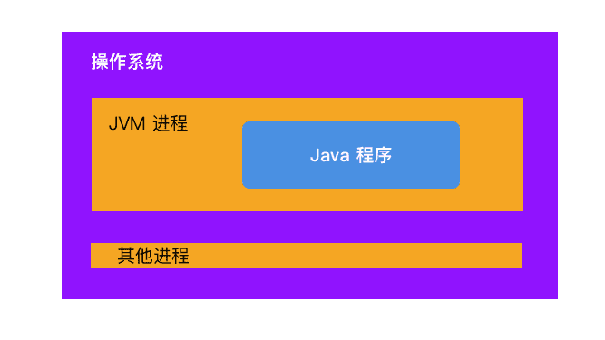

<font color = red>注意：</font>

1. <font color = red>如果不做特殊注明，本文提到的所有内存均指虚拟内存</font>
2. <font color = red>本文涉及的操作系统层面内容均指 Linux 操作系统</font>
3. <font color = red>本文的 JVM 特指 Hotspot 虚拟机</font>

如果您阅读到此文章，请您带着批判的眼光看待内容，如有错误或不严谨的地方请联系我，我将不尽感激：im_dsd@126.com，谢谢。


# 从进程的角度看待 JVM

绝大部分的资料、数据描述的都是 java 运行时内存模型：


但每个 JVM 实例都做作为一个**进程**运行在操作系统当中，那么

1. JVM 的内存布局是怎样的
2. Java 程序是如何使用内存的
3. java 运行时内存分布与虚拟内存段的对应关系是什么？

带着这几个问题，进入接下来的分析。


## Linxu 操作系统的内存关系

JVM 以一个进程（Process）的身份运行在 Linux 系统上，了解 Linux 与进程的内存关系，是理解 JVM 与 Linux 内存的关系的基础。下图给出了硬件、系统、进程三个层面的内存之间的概要关系。


## JVM 进程内存布局

在阅读完 JVM 相关的著作之后，我得出了 JVM 进程与 Java 运行时内存关系图。


可以看到：

1. JVM 进程的内存布局还是和不同进程一样没有变化。
2. 我们所说的 Native 内存、或者直接内存指的其实就是 JVM 进程的堆，这块内存至少被 Class Loader、执行引擎、垃圾回收器使用着
3. Java 运行时数据区本质上属于 JVM 进程堆，知识对其进行了更加细致的划分：见下图红色区域。


为什么 JVM 要如此划分内存呢？我认为 JVM 在模拟操作系统。他为 Java 代码提供了一个运行环境，然后将一部分 JVM 堆内存按照不同区域再次划分成 Java 堆、栈(Native 栈、VM栈)结构，并接管了 Java 堆、方法区的内存回收工作。



而 JVM 本身也是程序，它运行在操作系统之上。经过上面这些图就可以回答开篇提出的两个问题。

1. JVM 的内存布局是怎样的。答：见本节第一张图
2. Java 运行时内存分布与虚拟内存段的对应关系是什么？答：见本节第一张图

## Java 运行时是如何使用内存的

通过上一节第二张图我们可以从中窥探一二了：

### Java Heap 与 垃圾回收器

Java堆是分配对象的内存区域。堆内存的申请策略可以分为两种：全部申请型、动态拓展型。其中动态拓展型是主流方式，使用者可以通过控制命令行： `-Xmx`和 `-Xms`选项（`mx`是堆的最大大小，`ms`是初始大小）指定堆信息。JVM 一启动就会开辟 `-Xms `大小的内存，当内存不够用的时候才会继续拓展，如果需要的内存超过了 `-Xmx` 的指定值，就会 OOM。

堆在逻辑上讲也就是在虚拟内存上是连续的的空间，而在物理内存上就不一定了。

对于大多数垃圾回收器而言，采用的都是标记-XXX算法（标记-清除、标记-复制、标记-整理），为了记录标记的对象以及 GC 进度，需要使用数据结构进行保存。这些数据结构的确切大小和性质随实现的不同而变化，但是基本上与堆的大小成正比。


### 执行引擎

JVM 的程序的执行引起分为两种：解释器、编译器（JIT)。以 JIT 为例：JIT 在运行时将热点代码直接编译为机器码保存起来。这极大地提高了 Java 运行速度。

首先字节码肯定是要保存到内存中的，但这个区域在不同版本的虚拟机上不同，有的保存在 Java Heap 的永生代，有的保存在 Native 内存中。而且 JIT 的输出肯定也要保存在 Native中的（具体保存在什么地方还不知道）。可见程序在使用 JIT 编译器后会比单纯使用解释器内存消耗多一点。


### Class Loader

而方法区的早期版本实现在 Java Heap 的永生代中，在 JDK 8 开始方法区全部移到了 Native 区（自 JDK 5 开始就逐步移动方法区的一些部分了）。所以如果程序中有更多的类会消耗更多的内存。（方法区也有内存回收策略：在永生代时依靠 GC 算法，在 Native 区以卸载来实现）**反射是会方法区生成 class 文件的，所以如果大量使用反射可能会有内存问题的风险**

在 calss 开始执行的时候就要通过 Class Loader 进行加载了。Java运行时可以卸载类以回收空间，但只能在严格的条件下进行。注意卸载的只能是类加载器，类是不能单独卸载的，当类加载器卸载完毕后，与之对应的类也随之卸载。


### Thread

应用程序中的每个线程都需要内存来存储调用栈信息。反过来 Java 的每个线程都需要自己的调用栈内存，否者就不能运行。在 JVM 中有的 Thread Stack 可能保存在  Runtime Data Areas 的 Java Stack 中，也可能直接保存在 Native 中，不同版本的 JVM 实现不同。


Thread 在运行时肯定也会消耗一些 Java Heap 内存，也可能会消耗一些 Native 内存。

堆栈大小因 Java 的实现和体系结构而异。一些实现允许您指定Java线程的堆栈大小。典型值为256KB至756KB。虽然这些空间看起来挺小的，但是如果线程数量很多，也是一笔不小的内存开销。


### JNI

直接使用 Native 程序编写 C/C++代码。Java运行时本身严重依赖 JNI 代码来实现类库功能，例如文件和网络I / O。

### NIO

Java NIO 指的是 New IO 并不是 No Blocking IO！！！！


NIO 中的 Bytebuffer 可以指定分配的内存在 Java Heap 中，还是在 Native (也称作 Direct Memory ：直接内存) 内存中。


# Java 运行时内存模型

Java 运行时内存模型的概念早就满天飞了，总结的最好的还是 《 深入理解Java虚拟机：JVM高级特性与最佳实践》第二章。在这节中我将尝试自己描述一下 Java 运行时内存模型，看看我自己能不能理清楚、讲明白。


## 程序计数器(Program Counter Register)

* 程序计数器是一块较小的内存空间。它用于保存当前**正在解释执行的字节码地址**。

* 为了保存多线程切换后当前正在执行的字节码信息。所以程序计数器必须是线程私有的。
* 而且它是 JVM 规范中唯一没有规定 OOM 异常情况的内存区域。


看到 Program Counter Register 这个名字之后，很容易让人联想到 CPU 的 PC 寄存器，但是二者还是有很明显的差异的：

1. 实现原理不同：CPU 的 PC 寄存器是物理单元位于 CPU 的内部；而 Java 运行时的程序计数器位于内存是逻辑单元。
2. 存储内容不同：CPU 的 PC 寄存器保存的是下一条将要执行地指令的内存地址；Java 运行时程序计数器保存的是这在解释执行的字节码地址（这个地址指向方法区）。
3. 服务对象不同：CPU 的 PC 寄存器是为 CPU 服务的；Java 运行时的程序计数器是为执行引擎服务的。


## 虚拟机栈（VM Stack）

在我们的印象中内存仿佛就分为堆内存和栈内存，这种划分模式继承自 C/C++ ，但是放到 Java 里就显得太粗糙了。这也表示了作为开发人员的我们最关心的区域是 “堆”和“栈”。在 Java 的划分模型里 “栈” 只代表了局部变量表。

在 Java 运行时，每一个线程都有独立的虚拟机栈，其内部的最小单位是栈帧。每当一个方法执行的时候，就会产生一个栈帧用于存储局部变量表、操作数、动态连接、方法出口，每一个方法并执行调用到完毕都伴随着栈帧入栈出栈的过程。


* 局部变量表：

  局部变量表存放了编译期可知的各种 Java 虚拟机基本数据类型（boolean、byte、char、short、int、float、long、double）、对象引用。

* 操作数：

* 动态链接

* 方法出口


在《Java虚拟机规范》中，对这个内存区域规定了两类异常状况：如果线程请求的栈深度大于虚拟机所允许的深度，将抛出StackOverflowError异常；如果Java虚拟机栈容量可以动态扩展，当栈扩展时无法申请到足够的内存会抛出OutOfMemoryError异常。


## 本地方法栈 (Native Stack)

本地方法栈（Native Method Stacks）与虚拟机栈所发挥的作用是非常相似的，其区别只是虚拟机栈为虚拟机执行Java方法（也就是字节码）服务，而本地方法栈则是为虚拟机使用到的本地（Native）方法服务。

* 线程私有的，原因和 VM Stack 一致
* 定义了 OOM 异常

## 堆（ Heap）

堆可以说是 Java 运行时最大的一块内存区域了，堆是线程共享的区域，在 JVM 启动的时候就已经按照 `-Xms` 指定的大小创建好了。而且为了更好的管理 Java Heap 一般都是连续的内存空间。这里还是要说明一下，虽然在 JVM 启动的时候已经开辟出 `-Xms` 大小的连续区域用于堆的创建，但这都是逻辑上的，也就是虚拟内存，并非物理内存。真实的物理内存可以是不连续的，而且只有在需要时才会开辟出来。


从内存回收的角度来看：

Java Heap 的回收依赖自动垃圾回收机制，也就是我们所说的 GC 机制。为了更好的 GC，几乎所有的垃圾回收器都采用了分代算法来划分区域。那么重点来了：在 JVM 规范中，并没有对 Heap 内部进一步划分，我们常见的年轻代、老年代、永生代其实都是 GC 算法划分的。对于这块知识，将会在后面的 GC 一节详细描述。


从内存分配的角度来看，不同的线程共享堆内存，肯定会有资源抢占的问题，怎么解决呢：

1. java 虚拟机使用 CAS（原子性）指令 + 失败重试的机制划分区域。这样就可以抵御线程的资源抢占带来的问题。
2. 线程可以在堆中划分出自己私有的缓冲区（Thread LocalAllocation Buffer，TLAB）。线程先使用 TLAB 的空间等到使用完毕后才用同步机制在堆上开辟空间。

对于堆内存分配后面的文章还会介绍。


## 方法区（Method Area）

方法区同样是一个线程共享区域。当一个 .class 文件被 Class Loader 加载后 .class 文件的所有信息都会保存到方法区内，例如：类型信息、常量、静态变量、即时编译器编译后的代码缓存等数据。


以目前常见的 HotSpot 虚拟机为例，在 JDK 5 版本之前，方法区完全位于堆内。按照 GC 的分代算法他有个特殊的名字：永生代。这样使得 HotSpot 的垃圾收集器可以管理这部分内存，省去专门为方法区编写内存管理代码的工作。再此种方案下方法区的大小需要提前划分好（永久代有-XX：MaxPermSize的上限，即使不设置也有默认大小）。这样一来方法的大小就有了限制，更容易 OOM。

在 JDK6 开始 HotSpot 开始逐步转移方法区到 Native 内存中。到了 JDK 8 方法区已经完全被移动到了 Native 内存，这也就是为啥说 JDK 8 开始就没有用永生代了。对于存储方法区的这段内存我们称作：元数据区。

> 移除了永久代（PermGen），替换为元空间（Metaspace）；
>
> 永久代中的 class metadata 转移到了 native memory（本地内存，而不是虚拟机）；
>
> 永久代中的 interned Strings 和 class static variables 转移到了 Java heap；
>
> 永久代参数 （PermSize MaxPermSize） -> 元空间参数（MetaspaceSize MaxMetaspaceSize）
>
> 
>
> 作者：Mr Zeng
> 链接：https://www.zhihu.com/question/39990490/answer/369690291
> 来源：知乎
> 著作权归作者所有。商业转载请联系作者获得授权，非商业转载请注明出处。

在 JVM 规范中对方法区也定义了 OOM 异常。在早期方法区放在堆内实现的时候，很容易模拟出 OOM。后面转移到 Native 内存问题就不容易出现了。


## 分区关系的简单描述

PS：这段描述的可能不准确，需要学习执行引擎之后再校验一下。

例如执行以下伪代码，这几个内存区域是如何相互配合的呢？

```java
new Object();
```

1. 首先执行 new 操作的时候 JVM 会查看方法区内有没有对应的类型信息，如果没有需要使用 Class Loader 从 .class 文件中加载字节码数据到方法区，此时类中的常量和静态方法也就一同被初始化好了。

2. 然后就开始在堆上分配内存，存储变量等数据。

对于方法的执行过程

```java
Object a = new Object();
a.getName();
```

1. 将 getName() 方法涉及的局部变量、操作数装在到栈帧后入栈。等待 CPU 执行
2. 以解释执行为例：执行引擎从程序计数器中获取需要执行的字节码，解释为机器码。
3. CPU 读取指令（程序指令 + 读取栈数据的指令）开始执行。


# 探秘对象分配过程

在学习完理论知识之后，我们大致了解了 Java 运行时内存模型的相关概念，如果想深入探讨虚拟机在 Java 堆中对象分配、布局和访问的过程这样的细节，就必须将讨论的范围限定在一款具体的虚拟机上，基于实用优先的原则，笔者以最常用的虚拟机HotSpot探讨。


## 对象的创建

对于 JVM 而言对象可以分为两类：数组对象、非数组对象即普通对象。首先以创建普通对象例，主要经过一下几个阶段：

1. 加载类
2. 在堆上分配内存
3. 整理堆内存
4. 初始化数据

### 加载类

所谓的加载类就是将 .class 文件从磁盘、网络或者任何形式的存储器中加载到内存（方法区）。但加载过程并不是百分之百的，只有方法区中未找到此类的字符引用、或者此类还没有被加载到内存当中，才会执行。

这里要简单说一下什么是字符引用。我们在编写一个类的时候经常会在类 A 中引用 B:

```java
public class A {
  void test() {
    B b = new B();
  }
}
```

但是在编译期，我们是无法得知 B 对象在运行期的内存地址，那么如何表示对 B 对象的引用呢？Java 采用了一个 JVM 可以识别的标记来表示，他被称作字符引用。符号引用以一组符号来描述所引用的目标，符号可以是任何形式的字面量，只要使用时能够无歧义的定位到目标即可。符号引用与虚拟机的内存布局无关，引用的目标并不一定加载到内存中。对于字符引用的详细描述可以参见:[JVM中的直接引用和符号引用](https://blog.csdn.net/u014656992/article/details/51107127)


对于详细的类加载过程推荐阅读《深入理解Java虚拟机：JVM高级特性与最佳实践》第 8 章。


### 分配内存空间

在获得类的元数据信息后就要为对象分配内存了。分配内存的方式可以分为两种：指针碰撞、空闲列表。

* 如果堆内存是规整的，那么只需要一个指针记录已经使用和未使用内存的分割线即可。当分配新对象内存的时候只需要移动指针到对象长度即可。这种形式被称为：指针碰撞。

* 但如果内存是杂乱的，就没有办法通过一个指针的方式简单表示了。此只能维护一个状态表存储哪些内存已经被使用哪些内存是空闲的，此方式叫做空闲列表。

具体的分配方式要看 JVM 采用的 GC 算法了。如果 GC 后会整理内存就会使用指针碰撞的方式，简单又高效。

> 在 「Java 运行时内存模型」中笔者阐述过堆内存是一个线程共享的区域，那么在多线程场景下如何避免分配内存时的资源抢占问题呢？手段有二：
>
> 1. JVM 分配堆内存的指令是具有 CAS 原子性的，然后配合失败重试机制。这样一来内存分配保证了完整性和正确性。
> 2. 线程可以在堆上申请一块私有区域：TLAB （Thread Local Address Buffer），线程会首先使用此区域的内存空间，当不够用的时候才会按照方案 1 申请内存。


### 整理内存

在分配内存之后，虚拟机必须将分配的内存（对象头除外）初始化为零值。如果使用是 TLAB 区域这个步骤可以提前到开辟 TLAB 空间的时候进行。这步操作保证了对象的实例字段在Java代码中可以不赋初始值就直接使用，使程序能访问到这些字段的数据类型所对应的零值。


### 初始化对象头

分配内存之后，JVM 还要初始化对象的必要信息：HashCode、GC 分代的年龄、类的元数据地址等信息。


### 初始化对象数据

在经过以上的动作 JVM 遍认为对象已经创建完毕了，但是对于 Java 程序来说，构造函数还没有被执行。new指令之后会接着执行<init>方法，按照程序员的意愿对对象进行初始化，这样一个真正可用的对象才算完全被构造出来。


## 对象的内存布局

对象的内存布局可以分为三部分：

1. 对象头：对象头保存了对象的重要信息类型指针、Mark word。
2. 对象数据：对象真正存储的有效信息，即我们在程序代码里面所定义的各种类型的字段内容，无论是从父类继承下来的，还是在子类中定义的字段都必须记录起来。这部分的存储顺序会受到虚拟机分配策略参数（-XX：FieldsAllocationStyle参数）和字段在 Java 源码中定义顺序的影响。HotSpot 虚拟机默认的分配顺序为 longs/doubles、ints、shorts/chars、bytes/booleans、oops（Ordinary Object Pointers，OOPs），从以上默认的分配策略中可以看到，相同宽度的字段总是被分配到一起存放，在满足这个前提条件的情况下，在父类中定义的变量会出现在子类之前。
3. 对齐的目的视为了 GC 更简单。垃圾收集器已 8 byte 作为回收单位。将内存对齐为 8 byte 的整数倍可以更好的回收。


## 对象的访问定位

1. reference 储存句柄
2. reference 存储对象地址


# 参考

[Java Garbage Collection Basics](https://www.oracle.com/webfolder/technetwork/tutorials/obe/java/gc01/index.html)

[getting started with the G1 garbage collector](http://yuweijun.github.io/blog/java/2017/09/21/getting-started-with-the-G1-garbage-collector.html)

[Understanding JVM Architecture](https://medium.com/platform-engineer/understanding-jvm-architecture-22c0ddf09722)

[Understanding Java Memory Model](https://medium.com/platform-engineer/understanding-java-memory-model-1d0863f6d973)

[Understanding Java Garbage Collection](https://medium.com/platform-engineer/understanding-java-garbage-collection-54fc9230659a)

[Java (JVM) Memory Model – Memory Management in Java](https://www.journaldev.com/2856/java-jvm-memory-model-memory-management-in-java)

[Java Memory Management for Java Virtual Machine (JVM)](https://betsol.com/java-memory-management-for-java-virtual-machine-jvm/)

[Java内存模型](http://ifeve.com/java-memory-model-6/)

[Java内存模型FAQ](http://ifeve.com/jmm-faq/)

[JVM第四篇 程序计数器(PC寄存器)](https://blog.csdn.net/niugang0920/article/details/104687699)

[内存详解](https://www.ibm.com/developerworks/cn/java/j-nativememory-aix/index.html)