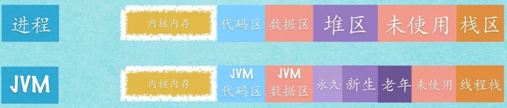

注意：

1. 如果不做特殊注明，本文提到的所有内存均指虚拟内存
2. 本文涉及的操作系统层面内容均指 Linux 操作系统
3. 本文的 JVM 特指 Hotspot 虚拟机

# 

# 从进程的角度看待 JVM

绝大部分的资料、数据描述的都是 java 运行时内存模型：

但每个 JVM 实例都做作为一个**进程**运行在操作系统当中，那么

1. JVM 的内存布局是怎样的
2. JVM 是如何使用内存的
3. java 运行时内存分布与虚拟内存段的对应关系是什么？

带着这几个问题，进入接下来的分析。

## JVM 的内存布局

### Linxu 操作系统的内存关系

JVM 以一个进程（Process）的身份运行在 Linux 系统上，了解 Linux 与进程的内存关系，是理解 JVM 与 Linux 内存的关系的基础。下图给出了硬件、系统、进程三个层面的内存之间的概要关系。

### JVM 进程内存模型

这个图表述的并不完善，例如 native 指的是那一部分呢？

## JVM 是如何使用内存的

### JIT

## GC

### Class Lolder

## java 运行时内存与虚拟内存对应关系

## Java Heap Memory

# Java 运行时内存模型

# Heap

# Java 内存模型

# 参考

[Java Garbage Collection Basics](https://www.oracle.com/webfolder/technetwork/tutorials/obe/java/gc01/index.html)

[getting started with the G1 garbage collector](http://yuweijun.github.io/blog/java/2017/09/21/getting-started-with-the-G1-garbage-collector.html)

[Understanding JVM Architecture](https://medium.com/platform-engineer/understanding-jvm-architecture-22c0ddf09722)

[Understanding Java Memory Model](https://medium.com/platform-engineer/understanding-java-memory-model-1d0863f6d973)

[Understanding Java Garbage Collection](https://medium.com/platform-engineer/understanding-java-garbage-collection-54fc9230659a)

[Java (JVM) Memory Model – Memory Management in Java](https://www.journaldev.com/2856/java-jvm-memory-model-memory-management-in-java)

[Java Memory Management for Java Virtual Machine (JVM)](https://betsol.com/java-memory-management-for-java-virtual-machine-jvm/)

[Java内存模型](http://ifeve.com/java-memory-model-6/)

[Java内存模型FAQ](http://ifeve.com/jmm-faq/)