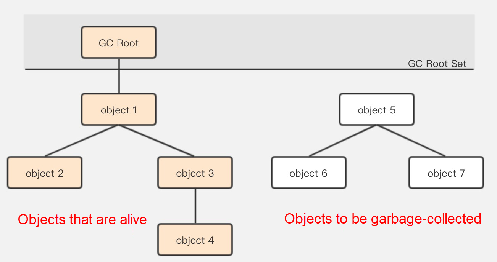
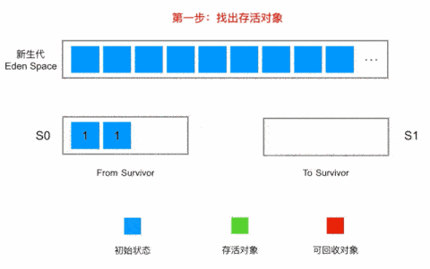
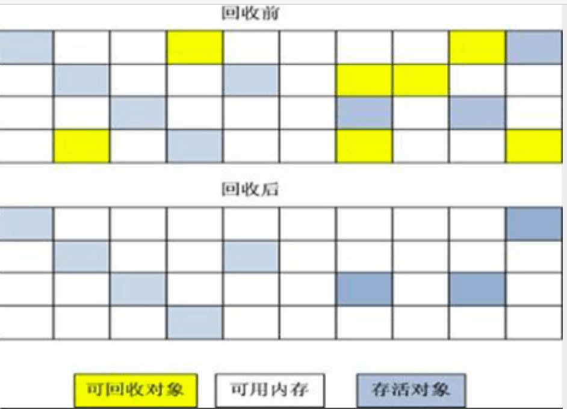
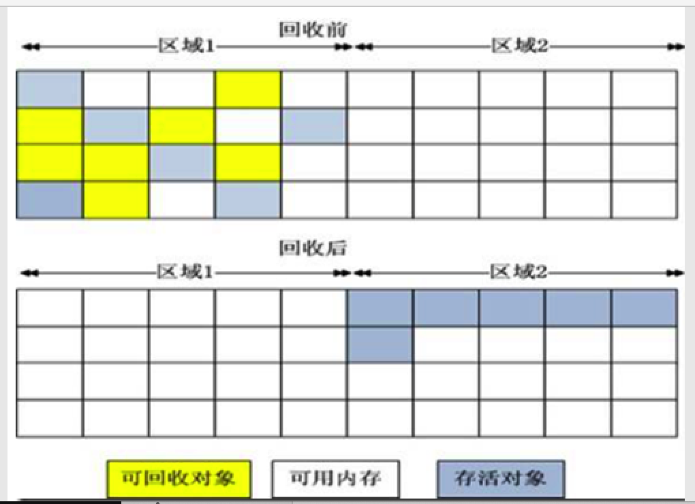
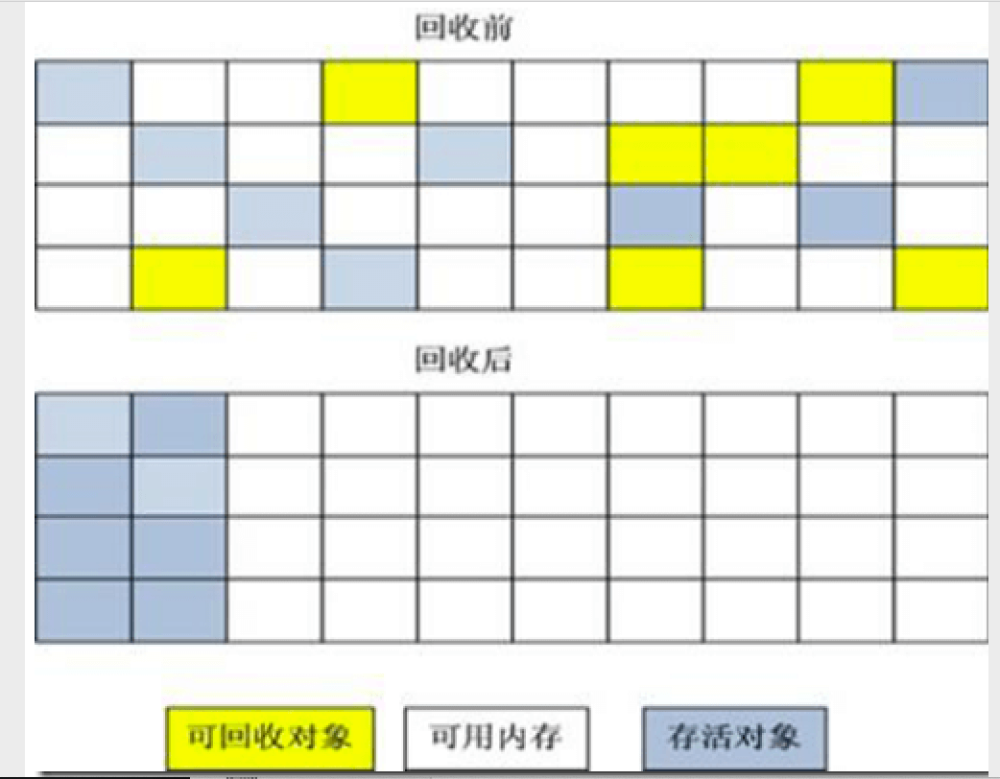
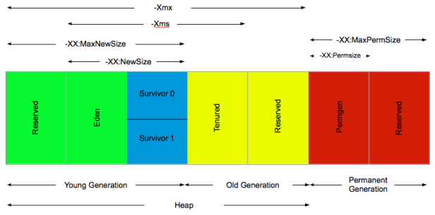

<font color = red>如果您阅读到此文章，请您带着批判的眼光看待内容，如有错误或不严谨的地方请联系我，我将不尽感激：im_dsd@126.com，谢谢。</font>

# 概述

> Java与C++之间有一堵由内存动态分配和垃圾收集技术所围成的高墙，墙外面的人想进去，墙里面的人却想出来。
>
> ​                                                                                                                                                           周志明 ——《深入理解 JVM 虚拟机》


垃圾回收集（Garbage Collection，下文简称GC）并不是因为 Java 而诞生的，在1960年诞生于麻省理工学院的 Lisp 是第一门开始使用内存动态分配和垃圾收集技术的语言。经过 60 年的发展内存自动回收技术已经逐步成熟，看似一切都已经进入了自动化的时代。那么还为什么要学习垃圾回收和内存分配策略呢？答案很简单：当需要排查各种内存溢出、内存泄漏问题时，当垃圾收集成为系统达到更高并发量的瓶颈时，我们就必须对这些“自动化”的技术实施必要的监控和调节。


GC 需要解答三个问题：

1. 哪些内存需要回收？
2. 什么时候回收？
3. 如何回收？

在  [「 内存管理 — JVM」](2. 内存管理 — JVM.md) 一节中已经对 Java 运行时各个内存区域有过介绍。其中程序计数器、虚拟机栈、本地方法栈都是伴随着线程由生到灭，而栈帧的大小基本上在编译器就已经确定好了，随着方法的调用栈帧会经历入栈出栈的过程，当栈帧出栈时内存就会自动被回收。可见程序计数器、虚拟栈、本地方法栈三部分使用的内存大小是确定的而且回首时机是稳定的

而  Java 堆和方法区的内存回收就没那么确定了。例如一个方法执行时因判断的条件不同所需要的内存不同、一个接口的具体实现类只有运行时才能确定所需的内存动态的，这就造成了内存开辟的不确定性，而且每个对象的生命周期各不相同，何时自动回收也是个难题。

综上所述可以得知：

|                                | 编译器可确定内存大小 | 回收时机稳定 |
| ------------------------------ | -------------------- | ------------ |
| 程序计数器、虚拟栈、本地方法栈 | 是                   | 是           |
| Java 堆、方法区                | 否                   | 否           |

而 Java 垃圾回收器针对的就是 Java 堆、方法区这两块内存空间。


# 对象已死

在分析完那些内存需要回收后，就需要解答什么时候回收这个问题。

对于 C\C++ 程序而言，所有的内存开辟和回收工作都交由开发人员决定。这样的好处是程序员明确知道对象的生命周期，可以准确的指定在回收时机。而 Java GC 将手动回收工作转换为了自动操作。那么就需要一些手段来判定哪些对象”已死“，可以被回收。

PS：这里对象已死可以理解为对象被判处了死刑，但是还没有正式执行。


## 引用计数

引用计数方案是使用一块内存存储一个对象被*引用*了多少次。当引用的次数为 0 时，即可认定此对象的任务完成，可以功成身退了。虽然引用计数器需要额外的空间用来计数，但它原理简单，判断也清晰，是一个简单高效额的方法。但是在一些特定的场景下有很多例外情况要考虑，必须要配合大量额外处理才能保证正确地工作，譬如单纯的引用计数就很难解决对象之间相互循环引用的问题。


## 可达性分析算法     

目前主流商业语言的内存管理子系统都是使用可达性分析算法判定对象是否”已死“的。这个算法的主要思路是依据一系列称为 “GC Root” 的根对象作为起始节点集，从这些节点开始根据*引用*关系向下搜索，搜索所走的过程称作引用链。如果一个对象没有到 GC Root 之间没有任何引用链相链，或者用图论的术语来说 GC Root 到此对象不可达，则证明此对象不可在被使用。



在 Java 中可以固定作为 GC Root 对象的有以下几种：

1. 虚拟机栈（栈帧中的局部变量表）中对象的引用，例如，参数、局部变量、临时变量。[关于局部变量、临时变量参见此处](https://blog.csdn.net/f9db33t79p/article/details/72629152)
2. 方法区内的常量、静态变量
3. 在本地方法栈中JNI（即通常所说的Native方法）引用的对象。


## 再谈 Java 引用

无论是引用计数、还是可达性分析都离不开引用的概念。在 JDK 1.2 以前 Java 对引用（reference）的定义是这样的：

> 如果reference类型的数据中存储的数值代表的是另外一块内存的起始地址，就称该reference数据是代表某块内存、某个对象的引用

==PS: 这侧面证明了为什么 Java 的数据类型 = 8 大基本数据类型 + 引用类型==

但是这个定义范围太宽了，对于一些中间状态的对象就没有办法给出明确的描述。譬如那些当内存紧张才回收，不紧张就不会说的对象。所以在 JDK 1.2 中对引用的类型做了更加详细的划分：强引用、软引用、弱引用、虚引用（幻影引用）


### 强引用

强引用是最常见的，是指代码中普遍存在的引用赋值，例如：

```java
Object object = new Object();
```

无论何时存在强引用的对象都不会被 GC，宁可发生 OOM 也不会被回收。

### 软引用

软引用是用来描述一些还有用，但非必须的对象。<font color=red>只存在</font>软引用的对象会在内存不足即将 OOM 的时候被回收。如果这次回收还没有足够的内存，才会抛出内存溢出异常。在 JDK 1.2版之后提供了`SoftReference`类来实现软引用。

### 弱引用

弱引用是用来描述可有可无的对象，它比软引用要弱一些。<font color=red>只存在</font>弱引用的对象只能存活到下一次 GC。当垃圾收集器开始工作，无论当前内存是否足够，都会回收掉只被弱引用关联的对象。在JDK 1.2版之后提供了`WeakReference`类来实现弱引用。

### 虚引用

虚引用是最弱的一种存在，一个对象是否存在虚引用不会对其生命周期造成任何影响，通过虚引用也获取不到对象的实例。他的作用仅仅实在对象回收的时候得到一个通知。在JDK 1.2版之后提供了`PhantomReference`类来实现虚引用。


```java
/**
 * Java 多引用类型实验
 * <p>
 * Create by im_dsd 2020/8/3 16:42
 */
class ReferenceDemo {
    public static void main(String[] args) throws InterruptedException {
        // 强引用
        final Object object = new Object();

        // 软引用
        Object softStr =  new Object();
        ReferenceQueue<Object> softReferenceQueue = new ReferenceQueue<>();
        SoftReference<Object> softReference = new SoftReference<>(softStr, softReferenceQueue);
        System.out.println("soft:" + softReference.get());
        System.out.println("soft queue:" + softReferenceQueue.poll());
        // 手动 GC
        softStr = null;
        System.gc();
        Thread.sleep(1000);
        System.out.println("gc 之后的对象存活状态");
        System.out.println("soft:" + softReference.get());
        System.out.println("soft queue:" + softReferenceQueue.poll());
        System.out.println();

        // 弱引用
        Object weakStr =  new Object();
        ReferenceQueue<Object> weakReferenceQueue = new ReferenceQueue<>();
        WeakReference<Object> weakReference = new WeakReference<>(weakStr, weakReferenceQueue);
        System.out.println("weak:" + weakReference.get());
        System.out.println("weak queue:" + weakReferenceQueue.poll());
        // 手动 GC
        weakStr = null;
        System.gc();
        Thread.sleep(1000);
        System.out.println("gc 之后的对象存活状态");
        System.out.println("weak:" + weakReference.get());
        System.out.println("weak queue:" + weakReferenceQueue.poll());
        System.out.println();

        // 弱引用
         Object phantomStr =  new Object();
        ReferenceQueue<Object> phantomReferenceQueue = new ReferenceQueue<>();
        PhantomReference<Object> phantomReference = new PhantomReference<>(phantomStr, phantomReferenceQueue);
        System.out.println("phantom:" + phantomReference.get());
        System.out.println("phantom queue:" + phantomReferenceQueue.poll());
        // 手动 GC
        phantomStr = null;
        System.gc();
        Thread.sleep(1000);
        System.out.println("gc 之后的对象存活状态");
        System.out.println("phantom:" + phantomReference.get());
        System.out.println("phantom queue:" + phantomReferenceQueue.poll());
        System.out.println();
    }
}
```

输出结果

```
soft:java.lang.Object@4dc63996
soft queue:null
gc 之后的对象存活状态
soft:java.lang.Object@4dc63996
soft queue:null

weak:java.lang.Object@d716361
weak queue:null
gc 之后的对象存活状态
weak:null
weak queue:java.lang.ref.WeakReference@6ff3c5b5

phantom:null
phantom queue:null
gc 之后的对象存活状态
phantom:null
phantom queue:java.lang.ref.PhantomReference@3764951d
```


## 不稳定的 finalize

即使被可达性分析算法判定为不可达的对象，也不是说对象“已死”或者说“非死不可”。此时的对象仅仅相当于被判处了死刑，还没有执行。此时对象还有个自我救赎的机会：finalize

真正要回收一个对象的内存至少要经历两个过程：

1. GC Roots 到对象不可达时, 对象将会被第一次标记。
2. 随后进行一次筛选，筛选的条件是此对象是否有必要执行finalize()方法。**如果对象没有重写 finalize() 方法或者 finalize() 已经执行过者视为没必要执行。**


如果虚拟机判断执行 finalize() 是必要的，这回将对象放置到一个名为 F-Queue 的队列中，稍后会有一个虚拟自创的、低优先级的线程 : Finalizer 去执行 finalize() 方法。

要注意这里说的执行只是指虚拟机承诺会触发 finalize() 的调用，但是并不保证 finalize() 一定会执行完毕。这是因为如果某个对象的finalize()方法执行缓慢，或者更极端地发生了死循环，将很可能导致F-Queue队列中的其他对象永久处于等待，甚至导致整个内存回收子系统的崩溃。

finalize 是对象自我救赎的最后一次机会，稍后收集器会对  F-Queue 内对象进行第二次规模标记，如果在 Finalizer 触发finalize() 执行时，对象有变的可达（譬如把自己（this关键字）赋值给某个类变量或者对象的成员变量）那么第二次遍历的时候就会移除回收的范围。如果没有逃脱接下来就会被回收了。


可见 finalize 运行代价高昂

>1. 需要单独的队列（F-Queue）承载对象
>2. 需要在单独进程 Finalizer 中执行这些对象的 finalize() 方法

不确定性大、无法保证各个对象的调用顺序

>1. 并不是每次都会执行，执行的时机不确定
>2. 不保证 finalize() 内容会全部执行完毕

如今已被官方明确声明为不推荐使用的语法。

```java
/**
 * 通过 finalize() 方法躲避GC
 * Create by im_dsd 2020/8/3 16:31
 */
class FinalizeEscapeGC {
    private static FinalizeEscapeGC SAVE;
    private String name = "";

    private void isAlive() {
        System.out.println(name + "我还想在活500年！哈哈哈哈，我自救成功了！");
    }

    @Override
    protected void finalize() throws Throwable {
        super.finalize();
        System.out.println(name + "要死了吗？不，我要自救。");
        // 不想死把自己存起来
        SAVE = this;
    }

    public static void main(String[] args) throws InterruptedException {
        FinalizeEscapeGC finalizeEscapeGC = new FinalizeEscapeGC();
        finalizeEscapeGC.name = "小强";
        // 置空引用，等待 GC
        finalizeEscapeGC = null;
        System.gc();
        Thread.sleep(1000);
        if (SAVE != null) {
            SAVE.isAlive();
        } else {
            System.out.println("小强已经死翘翘，第一次");
        }

        // 再次不可达
        SAVE = null;
        System.gc();
        Thread.sleep(1000);
        if (SAVE != null) {
            SAVE.isAlive();
        } else {
            System.out.println("小强已经死翘翘，第二次");
        }
    }
}
```

输出结果

> 小强要死了吗？不，我要自救。
> 小强还想活500年！嘿嘿，我自救成功了！
> 小强已经死翘翘，第二次


## 方法区的回收

方法区垃圾收集的“性价比”通常也是比较低的：在Java堆中，尤其是在新生代中，对常规应用进行一次垃圾收集通常可以回收70%至99%的内存空间，相比之下，方法区回收囿于苛刻的判定条件，其区域垃圾收集的回收成果往往远低于此。

方法区的垃圾收集主要回收两部分内容：废弃的常量和不再使用的类型。回收废弃常量与回收Java堆中的对象非常类似。举个常量池中字面量回收的例子，假如一个字符串“java”曾经进入常量池中，但是当前系统又没有任何一个字符串对象的值是“java”，换句话说，已经没有任何字符串对象引用常量池中的“java”常量，且虚拟机中也没有其他地方引用这个字面量。如果在这时发生内存回收，而且垃圾收集器判断确有必要的话，这个“java”常量就将会被系统清理出常量池。常量池中其他类（接口）、方法、字段的符号引用也与此类似。

判定一个常量是否“废弃”还是相对简单，而要判定一个类型是否属于“不再被使用的类”的条件就比较苛刻了。需要同时满足下面三个条件：

* 该类所有的实例都已经被回收，也就是Java堆中不存在该类及其任何派生子类的实例。

* 加载该类的类加载器已经被回收，这个条件除非是经过精心设计的可替换类加载器的场景，如OSGi、JSP的重加载等，否则通常是很难达成的。

* 该类对应的java.lang.Class对象没有在任何地方被引用，无法在任何地方通过反射访问该类的方法。


# GC 算法

## 分代理论


目前主流的 JVM 都是基于分代理论设计的，说是理论其实是基于开发人竟然总结出来的，它建立的标准建立在两个假说上：

1. 弱分代假说（Weak Generational Hypothesis）：大多数对象都是朝生夕灭的
2. 强分代加收（Strong Generational Hypothesis）：经历过多次 GC 还存活的对象，就越难被消除。





* 部分收集（Partial GC）：指目标不是完整收集整个Java堆的垃圾收集，其中又分为：
* 新生代收集（Minor GC/Young GC）：指目标只是新生代的垃圾收集。
* 老年代收集（Major GC/Old GC）：指目标只是老年代的垃圾收集。目前只有CMS收集器会有单独收集老年代的行为。另外请注意“Major GC”这个说法现在有点混淆，在不同资料上常有不同所指，读者需按上下文区分到底是指老年代的收集还是整堆收集。
* 混合收集（Mixed GC）：指目标是收集整个新生代以及部分老年代的垃圾收集。目前只有G1收集器会有这种行为。
* 整堆收集（Full GC）：收集整个Java堆和方法区的垃圾收集。

## 标记-清除




## 标记-复制



## 标记-整理




# 对象内存分配策略



## 对象优先分配在 Eden 区

```java
class MinorGCDemo {
    private static final int _1M = 1024 * 1024;

    /**
     * VM 参数 -verbose:-gc -Xms20M、-Xmx20M、-Xmn10M -XX:+PrintGCDetails -XX:SurvivorRatio=8
     */
    public static void main(String[] args) {
        System.out.println("allocation1");
        final byte[] allocation1 = new byte[2 * _1M];
        System.out.println("allocation2");
        final byte[] allocation2 = new byte[2 * _1M];
        System.out.println("allocation3");
        final byte[] allocation3 = new byte[2 * _1M];
        System.out.println("allocation4");
        // 此处将发生一次 Minor GC
        final byte[] allocation4 = new byte[4 * _1M];
    }
}
```


执行结果

```
allocation1
allocation2
allocation3
allocation4
Heap
 PSYoungGen      total 9216K, used 8192K [0x00000007bf600000, 0x00000007c0000000, 0x00000007c0000000)
  eden space 8192K, 100% used [0x00000007bf600000,0x00000007bfe00000,0x00000007bfe00000)
  from space 1024K, 0% used [0x00000007bff00000,0x00000007bff00000,0x00000007c0000000)
  to   space 1024K, 0% used [0x00000007bfe00000,0x00000007bfe00000,0x00000007bff00000)
 ParOldGen       total 10240K, used 4096K [0x00000007bec00000, 0x00000007bf600000, 0x00000007bf600000)
  object space 10240K, 40% used [0x00000007bec00000,0x00000007bf000010,0x00000007bf600000)
 Metaspace       used 3299K, capacity 4496K, committed 4864K, reserved 1056768K
  class space    used 368K, capacity 388K, committed 512K, reserved 1048576K
```


## 大对象直接进入老年区


# 参考

《深入理解 JVM 虚拟机》周志明

[How Does Garbage Collection Work in Java?](https://www.alibabacloud.com/blog/how-does-garbage-collection-work-in-java_595387)

[你想要的Android性能优化系列：内存优化 ！](https://mp.weixin.qq.com/s?__biz=MzU2NjgwNjc0NQ==&mid=2247484069&idx=1&sn=3d286b61e01005bd35d669c202d8e67c&chksm=fca79313cbd01a0599e8a657875cc0780a460a08bb816566f60a853eeb82a305401c53820d02&scene=158#rd)