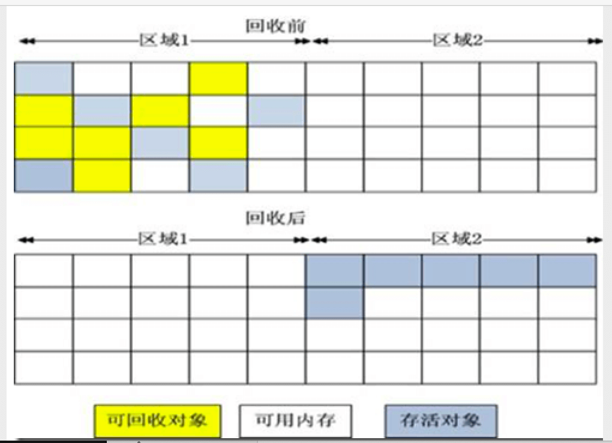
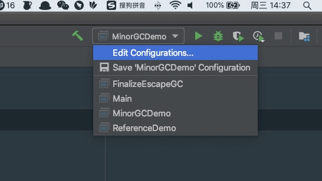

<font color = red>如果您阅读到此文章，请您带着批判的眼光看待内容，如有错误或不严谨的地方请联系我，我将不尽感激：im_dsd@126.com，谢谢。</font>

# 概述

> Java与C++之间有一堵由内存动态分配和垃圾收集技术所围成的高墙，墙外面的人想进去，墙里面的人却想出来。
>
> ​                                                                                                                                                           周志明 ——《深入理解 JVM 虚拟机》


垃圾回收集（Garbage Collection，下文简称GC）并不是为 Java 而诞生的，在1960年诞生于麻省理工学院的 Lisp 是第一门开始使用内存动态分配和垃圾收集技术的语言。经过 60 年的发展内存自动回收技术已经逐步成熟，看似一切都已经进入了自动化的时代。那么还为什么要学习垃圾回收和内存分配策略呢？答案很简单：当需要排查各种内存溢出、内存泄漏问题时，当垃圾收集成为系统达到更高并发量的瓶颈时，我们就必须对这些“自动化”的技术实施必要的监控和调节。


GC 需要解答三个问题：

1. 哪些内存需要回收？
2. 什么时候回收？
3. 如何回收？

在  [「 内存管理 — JVM」](2. 内存管理 — JVM.md) 一节中已经对 Java 运行时各个内存区域有过介绍。其中程序计数器、虚拟机栈、本地方法栈都是伴随着线程由生到灭，而栈帧的大小基本上在编译期就已经确定，随着方法的调用栈帧会经历入栈出栈的过程，当栈帧出栈时内存就会自动回收。可见程序计数器、虚拟栈、本地方法栈三部分使用的内存大小是确定的而且回收时机是稳定的。

而  Java 堆和方法区的内存回收就没那么确定了。例如一个方法执行时因判断的条件不同所需要的内存大小不同、一个接口的具体实现类只有运行时才能确定所需的内存动态的，这就造成了内存开辟的不确定性，而且每个对象的生命周期各不相同，何时自动回收也是个难题。

综上所述可以得知：

|                                | 编译器可确定内存大小 | 回收时机稳定 |
| ------------------------------ | -------------------- | ------------ |
| 程序计数器、虚拟栈、本地方法栈 | 是                   | 是           |
| Java 堆、方法区                | 否                   | 否           |

而 Java 垃圾回收器针对的就是 Java 堆、方法区这两块内存空间。


# 对象已死

在分析完哪些内存需要回收后，就需要解答什么时候回收这个问题。

对于 C\C++ 程序而言，所有的内存开辟和回收工作都交由开发人员决定。这样的好处是程序员明确知道对象的生命周期，可以准确的指定回收时机。而 Java GC 将手动回收工作转换为了自动操作。那么就需要一些手段来判定哪些对象”已死“，可以被回收。

PS：这里对象已死可以理解为对象被判处了死刑，但是还没有正式执行。


## 引用计数

引用计数方案是使用一块内存存储一个对象被*引用*了多少次。当引用的次数为 0 时，即可认定此对象的任务完成，可以功成身退了。虽然引用计数器需要额外的空间用来计数，但它原理简单，判断也清晰，是一个简单高效的方法。但是在一些特定的场景下有很多例外情况要考虑，必须要配合大量额外判断才能保证正确性，譬如单纯的引用计数就很难解决对象之间相互循环引用的问题。


## 可达性分析算法     

目前主流商业语言的内存管理子系统都是使用可达性分析算法判定对象是否”已死“的。这个算法的主要思路是依据一系列称为 “GC Root” 的根对象作为起始节点集，从这些节点开始根据*引用*关系向下搜索，搜索所走的过程称作引用链。如果一个对象到 GC Root 之间没有任何引用链相链，或者用图论的术语来说 GC Root 到此对象不可达，则证明此对象不可在被使用。


在 Java 中可以固定作为 GC Root 对象的有以下几种：

1. 虚拟机栈（栈帧中的局部变量表）中对象的引用，例如，参数、局部变量、临时变量。[关于局部变量、临时变量参见此处](https://blog.csdn.net/f9db33t79p/article/details/72629152)
2. 方法区内的常量、静态变量
3. 在本地方法栈中JNI（即通常所说的Native方法）引用的对象。


## 再谈 Java 引用

无论是引用计数、还是可达性分析都离不开引用的概念。在 JDK 1.2 以前 Java 对引用（reference）的定义是这样的：

> 如果 reference 类型的数据中存储的数值代表的是另外一块内存的起始地址，就称该 reference 数据是代表某块内存、某个对象的引用

==PS: 这侧面证明了为什么 Java 的数据类型 = 8 大基本数据类型 + 引用类型==

但是这个定义范围太宽了，对于一些中间状态的对象就没有办法给出明确的描述。譬如那些当内存紧张才回收，不紧张就不回收的对象。所以在 JDK 1.2 中对引用的类型做了更加详细的划分：强引用、软引用、弱引用、虚引用（幻影引用）


### 强引用

强引用是最常见的，是指代码中普遍存在的引用赋值，例如：

```java
Object object = new Object();
```

无论何时存在强引用的对象都不会被 GC，宁可发生 OOM 也不会被回收。

### 软引用

软引用是用来描述一些还有用，但非必须的对象。<font color=red>只存在</font>软引用的对象会在内存不足即将 OOM 的时候被回收。如果这次回收还没有足够的内存，才会抛出内存溢出异常。在 JDK 1.2版之后提供了`SoftReference`类来实现软引用。

### 弱引用

弱引用是用来描述可有可无的对象，它比软引用要弱一些。<font color=red>只存在</font>弱引用的对象只能存活到下一次 GC。当垃圾收集器开始工作，无论当前内存是否足够，都会回收掉只被弱引用关联的对象。在JDK 1.2版之后提供了`WeakReference`类来实现弱引用。

### 虚引用

虚引用是最弱的一种存在，一个对象是否存在虚引用不会对其生命周期造成任何影响，通过虚引用也获取不到对象的实例。他的作用仅仅实在对象回收的时候得到一个通知。在JDK 1.2版之后提供了`PhantomReference`类来实现虚引用。

## Java 多引用类型实验

```java
/**
 * Java 多引用类型实验
 * <p>
 * Create by im_dsd 2020/8/3 16:42
 */
class ReferenceDemo {
    public static void main(String[] args) throws InterruptedException {
        // 强引用
        final Object object = new Object();

        // 软引用
        Object softStr =  new Object();
        ReferenceQueue<Object> softReferenceQueue = new ReferenceQueue<>();
        SoftReference<Object> softReference = new SoftReference<>(softStr, softReferenceQueue);
        System.out.println("soft:" + softReference.get());
        System.out.println("soft queue:" + softReferenceQueue.poll());
        // 手动 GC
        softStr = null;
        System.gc();
        Thread.sleep(1000);
        System.out.println("gc 之后的对象存活状态");
        System.out.println("soft:" + softReference.get());
        System.out.println("soft queue:" + softReferenceQueue.poll());
        System.out.println();

        // 弱引用
        Object weakStr =  new Object();
        ReferenceQueue<Object> weakReferenceQueue = new ReferenceQueue<>();
        WeakReference<Object> weakReference = new WeakReference<>(weakStr, weakReferenceQueue);
        System.out.println("weak:" + weakReference.get());
        System.out.println("weak queue:" + weakReferenceQueue.poll());
        // 手动 GC
        weakStr = null;
        System.gc();
        Thread.sleep(1000);
        System.out.println("gc 之后的对象存活状态");
        System.out.println("weak:" + weakReference.get());
        System.out.println("weak queue:" + weakReferenceQueue.poll());
        System.out.println();

        // 弱引用
         Object phantomStr =  new Object();
        ReferenceQueue<Object> phantomReferenceQueue = new ReferenceQueue<>();
        PhantomReference<Object> phantomReference = new PhantomReference<>(phantomStr, phantomReferenceQueue);
        System.out.println("phantom:" + phantomReference.get());
        System.out.println("phantom queue:" + phantomReferenceQueue.poll());
        // 手动 GC
        phantomStr = null;
        System.gc();
        Thread.sleep(1000);
        System.out.println("gc 之后的对象存活状态");
        System.out.println("phantom:" + phantomReference.get());
        System.out.println("phantom queue:" + phantomReferenceQueue.poll());
        System.out.println();
    }
}
```

输出结果

```
soft:java.lang.Object@4dc63996
soft queue:null
gc 之后的对象存活状态
soft:java.lang.Object@4dc63996
soft queue:null

weak:java.lang.Object@d716361
weak queue:null
gc 之后的对象存活状态
weak:null
weak queue:java.lang.ref.WeakReference@6ff3c5b5

phantom:null
phantom queue:null
gc 之后的对象存活状态
phantom:null
phantom queue:java.lang.ref.PhantomReference@3764951d
```


## 不稳定的 finalize

即使被可达性分析算法判定为不可达的对象，也不是说对象“已死”或者说“非死不可”。此时的对象仅仅相当于被判处了死刑，还没有执行。此时对象还有个自我救赎的机会：finalize

真正要回收一个对象的内存至少要经历两个过程：

1. GC Roots 到对象不可达时, 对象将会被第一次标记。
2. 随后进行一次筛选，筛选的条件是此对象是否有必要执行finalize()方法。**如果对象没有重写 finalize() 方法或者 finalize() 已经执行过者视为没必要执行。**


如果虚拟机判断执行 finalize() 是必要的，这回将对象放置到一个名为 F-Queue 的队列中，稍后会有一个虚拟自创的、低优先级的**线程** : Finalizer 去执行 finalize() 方法。

要注意这里说的执行只是指虚拟机承诺会触发 finalize() 的调用，但是并不保证 finalize() 一定会执行完毕。这是因为如果某个对象的finalize()方法执行缓慢，或者更极端地发生了死循环，将很可能导致F-Queue队列中的其他对象永久处于等待，甚至导致整个内存回收子系统的崩溃。

finalize 是对象自我救赎的最后一次机会，稍后收集器会对  F-Queue 内对象进行第二次规模标记，如果在 Finalizer 触发finalize() 执行时，对象有变的可达（譬如把自己（this关键字）赋值给某个类变量或者对象的成员变量）那么第二次遍历的时候就会移除回收的范围。如果没有逃脱接下来就会被回收了。


可见 finalize 运行代价高昂

>1. 需要单独的队列（F-Queue）承载对象
>2. 需要在单独线程 Finalizer 中执行这些对象的 finalize() 方法

不确定性大、无法保证各个对象的调用顺序

>1. 并不是每次都会执行，执行的时机不确定
>2. 不保证 finalize() 内容会全部执行完毕

如今已被官方明确声明为不推荐使用的语法。

##  finalize() 躲避 GC 实验

```java
/**
 * 通过 finalize() 方法躲避GC
 * Create by im_dsd 2020/8/3 16:31
 */
class FinalizeEscapeGC {
    private static FinalizeEscapeGC SAVE;
    private String name = "";

    private void isAlive() {
        System.out.println(name + "我还想在活500年！哈哈哈哈，我自救成功了！");
    }

    @Override
    protected void finalize() throws Throwable {
        super.finalize();
        System.out.println(name + "要死了吗？不，我要自救。");
        // 不想死把自己存起来
        SAVE = this;
    }

    public static void main(String[] args) throws InterruptedException {
        FinalizeEscapeGC finalizeEscapeGC = new FinalizeEscapeGC();
        finalizeEscapeGC.name = "小强";
        // 置空引用，等待 GC
        finalizeEscapeGC = null;
        System.gc();
        Thread.sleep(1000);
        if (SAVE != null) {
            SAVE.isAlive();
        } else {
            System.out.println("小强已经死翘翘，第一次");
        }

        // 再次不可达
        SAVE = null;
        System.gc();
        Thread.sleep(1000);
        if (SAVE != null) {
            SAVE.isAlive();
        } else {
            System.out.println("小强已经死翘翘，第二次");
        }
    }
}
```

输出结果

> 小强要死了吗？不，我要自救。
> 小强还想活500年！嘿嘿，我自救成功了！
> 小强已经死翘翘，第二次


## 方法区的回收

方法区垃圾收集的“性价比”通常也是比较低的：在Java堆中，尤其是在新生代中，对常规应用进行一次垃圾收集通常可以回收70%至99%的内存空间，相比之下，方法区回收有着苛刻的判定条件，其区域垃圾收集的回收成果往往远低于 Heap。

方法区的垃圾收集主要回收两部分内容：废弃的常量和不再使用的类型。回收废弃常量与回收 Java 堆中的对象非常类似。

举个常量池中字符串回收的例子：假如一个字符串“java”曾经进入常量池中，但是当前系统又没有任何一个字符串对象的值是“java”，换句话说，已经没有任何字符串对象引用常量池中的“java”常量，且虚拟机中也没有其他地方引用这个字面量。如果在这时发生内存回收，而且垃圾收集器判断确有必要的话，这个“java”常量就将会被系统清理出常量池。常量池中其他类（接口）、方法、字段的符号引用也与此类似。

判定一个常量是否“废弃”还是相对简单，而要判定一个类型是否属于“不再被使用的类”的条件就比较苛刻了。需要同时满足下面三个条件：

* 该类所有的实例都已经被回收，也就是Java堆中不存在该类及其任何派生子类的实例。

* 加载该类的类加载器已经被回收，这个条件除非是经过精心设计的可替换类加载器的场景，如OSGi、JSP的重加载等，否则通常是很难达成的。

* 该类对应的java.lang.Class对象没有在任何地方被引用，无法在任何地方通过反射访问该类的方法。


# GC 算法

## 分代理论


目前主流的 JVM 都是基于分代理论设计的，说是理论其实是基于开发人竟然总结出来的，它建立在两个假说上：

1. <font color = red>弱分代假说（Weak Generational Hypothesis）：大多数对象都是朝生夕灭的</font>
2. <font color = red>强分代加收（Strong Generational Hypothesis）：经历过多次 GC 还存活的对象，就越难被消除。</font>


这两个分代假说奠定了常见回收器的设计原则：收集器将堆划分成不同的区域，按照对象的年龄对应存储。显而易见将年轻的、容易销毁的对象统一存储，每次 GC 只关注少数存活对象，这样就能以少量成本释放大量空间；而将年老的不易销毁的对象统一存放，就可以放慢 GC 脚步，使用低频策略回收对象释放空间。这就兼容了时间开销和空间释放率。


把分代收集理论具体放到现在的商用 Java 虚拟机里，设计者一般至少会把 Java 堆划分为新生代（Young Generation）和老年代（Old Generation）两个区域。顾名思义，在新生代中，每次垃圾收集时都发现有大批对象死去，而每次回收后存活的少量对象，将会逐步晋升到老年代中存放。

对于不同区域的 GC 各有各的名称：

* 部分收集（Partial GC）：指目标不是完整收集整个Java堆的垃圾收集，其中又分为：
* 新生代收集（Minor GC/Young GC）：指目标只是新生代的垃圾收集。
* 老年代收集（Major GC/Old GC）：指目标只是老年代的垃圾收集。目前只有 CMS 收集器会有单独收集老年代的行为。另外请注意“Major GC”这个说法现在有点混淆，在不同资料上常有不同所指，读者需按上下文区分到底是指老年代的收集还是整堆收集。
* 混合收集（Mixed GC）：指目标是收集整个新生代以及部分老年代的垃圾收集。目前只有G1收集器会有这种行为。
* 整堆收集（Full GC）：收集整个Java堆和方法区的垃圾收集。


## 标记-清除


标记-清除算法是在可达性分析算法的基础上对存活对象或者可回收对象进行标记，然后回收。但这样带来一个问题就是内存碎片化。


## 标记-复制



标记-复制算法在标记-清除算法的基础上，将内存划分为为两个大小相等的区域，每次只使用其中一个区域。当需要 GC 时将存活对象复制到另一个区域，然后统一回收”已死“对象。此算法解决了内存碎片化的问题，但每次只是用一个区域，对内存的容量是一个挑战。虽然每次复制会有性能上的消耗，但是根据弱分代假说每次复制的数据并不会很大。


在1989年，Andrew Appel 针对具备“朝生夕灭”特点的对象，提出了一种更优化的半区复制分代策略，现在称为“Appel式回收”。他将年轻代的内存划分成了一个较大的 Eden 区域和两个较小的 Survivor 区。每次分配内存时只会同时使用 Eden 和一个 Survivor 区域。每次创建对象的时候优先使用 Eden 区域，在垃圾回收时，将 Eden 与 Survivor 中存活的对象统一复制到另外一个 Survivor 区域中。然后直接清理 Eden 和已经使用过的 Survivor 区域。在 HotSot 中 Eden 与 Survivor 的默认比例为 8 ：1 ：1。即每次新生代中只有 90% 的内存时可用的，另外的 10% 处于空闲状态。

但当存活的对象大于了 10% 的空间即超越了 Survivor 的大小，会怎样呢？对此 Appel 回收设计了一个 ”逃生门“的方式来应对：当此情况发生时，存活的对象直接放到老年代进行担保。


## 标记-整理


标记-复制算法因其复制数据的特点不适用有大量对象存活的老年代；更关键的是标记-清除算法必须有一个空闲空间作为存活对象复制的目标，这就无法应对可能有 100% 存活对象的老年代了。


针对老年代对象的存亡特征，1974年Edward Lueders提出了另外一种有针对性的“标记-整理”（Mark-Compact）算法。此算法前期和标记-清除算法相同，但在后续的阶段里标记-整理算法不会直接释放可回收对象，而是将存活对象统一移动到内存空间的一侧，然后回收另一侧内存。


## Stop The World

在 GC 时（扫描 + 回收）垃圾回收器会暂停所有的线程，这种状态被称作 Stop The World （STW），这样做的原因有二：

1. 试想一个母亲在打扫房间，而小孩子坐在椅子上不停的向下扔纸屑，母亲一边扫孩子一边扔，这岂不是“永远”打扫不完了。GC 也是如此，GC 就是一个要打扫 Java Heap 的母亲，而线程就是小孩子，如果 GC 一边扫描对象，线程一边创建新对象，收集器无法标记谁是要回收的谁是要保留的。所以最好的办法就是让孩子坐在椅子上一动不动。
2. 同理如果在复制（标记-复制算法） 、移动（标记-整理算法）对象时，不停的有新对象进来搅局，岂不是成了一锅粥谁也分不清谁。


# 对象内存分配策略

在介绍过内存回收相关的理论之后，接下来我们就有 HotSpot 虚拟机来探讨一下对象分配那些事儿。笔者的 JVM 为 JDK1.8 的 HotSpot，所有的实验结果均在此 JVM 版本下进行。

> java version "1.8.0_121"
> Java(TM) SE Runtime Environment (build 1.8.0_121-b13)
> Java HotSpot(TM) 64-Bit Server VM (build 25.121-b13, mixed mode)

通过 JVM 参数我们可以更好的模拟 GC 场景、了解 GC 前后 Java Heap 的变化。对于 IntelliJ 可以通过以下方式配置：




## 对象优先分配在 Eden 区

大多数的情况下对象会优先分配在 Eden 区。当 Eden 没有足够空间的时候会发生一次 Minor GC。为了更简单的观察 GC 前后的 Java Heap 变化，我们需要设置如下 VM 参数：

* ` -verbose:g`c 来开启 GC 日志；

* ` -XX:+UseSerialGC` 指定更简单的 Serial 为 GC 收集器；
* `-XX:+PrintHeapAtGC`开启 GC 前后日志打印;
* `-Xms20M -Xmx20M -Xmn10M` 指定堆大小为固定（最大最小相当不可动态拓展）的 20M，其中新生代 10M，剩余的给老年代也是 10M；
* ` -XX:+PrintGCDetails` 指定在程序退出时输出 Heap 内存情况
* `-XX:SurvivorRatio=8`指定了新生代中 Eden 区与一个 Survivor 区的空间比例是8∶1

对于更多的参数请参见[JVM GC 日志详解](https://juejin.im/post/6844903791909666823)


```java
class MinorGCDemo {
    private static final int _1M = 1024 * 1024;

    /**
     * VM 参数 -verbose:gc -XX:+UseSerialGC -XX:+PrintHeapAtGC -XX:+PrintGCDetails -XX:SurvivorRatio=8 -Xms20M -Xmx20M -Xmn10M
     */
    public static void main(String[] args) {
        final byte[] allocation1 = new byte[2 * _1M];
        final byte[] allocation2 = new byte[2 * _1M];
        final byte[] allocation3 = new byte[2 * _1M];
        System.out.println("---------allocation4 start---------\n");
        // 此处将发生一次 Minor GC
        final byte[] allocation4 = new byte[4 * _1M];
        System.out.println("\n---------allocation4 end---------\n");
    }
}
```

执行结果

```shell
---------allocation4 start---------
# GC 前的内存状态：年轻代内存总共10M，每次仅能只用 9M(total 9216K) = Eden8M（eden space 8192） + 一个 Survivor 1M( space 1024K)
# 在分配前三个对象的时候已经使用了8M（used 8021K) 这 8M 来自allcation[1、2、3]使用的6M + 下文解释说明1中用掉的 2M，此时年轻代没有空余的内存容纳 4M 的 allocation4 对象，即将发生 Minor GC
{Heap before GC invocations=0 (full 0):
 def new generation   total 9216K, used 8021K [0x00000007bec00000, 0x00000007bf600000, 0x00000007bf600000)
  eden space 8192K,  97% used [0x00000007bec00000, 0x00000007bf3d5608, 0x00000007bf400000)
  from space 1024K,   0% used [0x00000007bf400000, 0x00000007bf400000, 0x00000007bf500000)
  to   space 1024K,   0% used [0x00000007bf500000, 0x00000007bf500000, 0x00000007bf600000)
 tenured generation   total 10240K, used 0K [0x00000007bf600000, 0x00000007c0000000, 0x00000007c0000000)
   the space 10240K,   0% used [0x00000007bf600000, 0x00000007bf600000, 0x00000007bf600200, 0x00000007c0000000)
 Metaspace       used 3305K, capacity 4496K, committed 4864K, reserved 1056768K
  class space    used 369K, capacity 388K, committed 512K, reserved 1048576K
# 分配内存失败触发了 GC; [DefNew: 8021K->428K(9216K), 0.0068981 secs] 表示年轻代从8021K的内存使用减少到了428K(总共空间为9216K) ，GC 耗时 0.0068981 secs]
[GC (Allocation Failure) [DefNew: 8021K->428K(9216K), 0.0068981 secs] 8021K->6572K(19456K), 0.0069267 secs] [Times: user=0.00 sys=0.00, real=0.01 secs] 
# GC 后，Survivor 区域无法容纳 Minor GC 后存活的对象，需要使用老年代进行担保 -> allcation[1、2、3]进入老年代，
# 所有老年代消耗了（used 6144K）使用了 60% 内存空间。
Heap after GC invocations=1 (full 0):
 def new generation   total 9216K, used 428K [0x00000007bec00000, 0x00000007bf600000, 0x00000007bf600000)
  eden space 8192K,   0% used [0x00000007bec00000, 0x00000007bec00000, 0x00000007bf400000)
  from space 1024K,  41% used [0x00000007bf500000, 0x00000007bf56b058, 0x00000007bf600000)
  to   space 1024K,   0% used [0x00000007bf400000, 0x00000007bf400000, 0x00000007bf500000)
 tenured generation   total 10240K, used 6144K [0x00000007bf600000, 0x00000007c0000000, 0x00000007c0000000)
   the space 10240K,  60% used [0x00000007bf600000, 0x00000007bfc00030, 0x00000007bfc00200, 0x00000007c0000000)
 Metaspace       used 3305K, capacity 4496K, committed 4864K, reserved 1056768K
  class space    used 369K, capacity 388K, committed 512K, reserved 1048576K
}

---------allocation4 end---------
# 程序退出时内存状态：allocation4 进入 Eden 区域 used 4764K 内存，而 allcation[1、2、3]进入老年代消耗 6M 内存
Heap
 def new generation   total 9216K, used 4764K [0x00000007bec00000, 0x00000007bf600000, 0x00000007bf600000)
  eden space 8192K,  52% used [0x00000007bec00000, 0x00000007bf03c328, 0x00000007bf400000)
  from space 1024K,  41% used [0x00000007bf500000, 0x00000007bf56b058, 0x00000007bf600000)
  to   space 1024K,   0% used [0x00000007bf400000, 0x00000007bf400000, 0x00000007bf500000)
 tenured generation   total 10240K, used 6144K [0x00000007bf600000, 0x00000007c0000000, 0x00000007c0000000)
   the space 10240K,  60% used [0x00000007bf600000, 0x00000007bfc00030, 0x00000007bfc00200, 0x00000007c0000000)
 Metaspace       used 3311K, capacity 4496K, committed 4864K, reserved 1056768K
  class space    used 369K, capacity 388K, committed 512K, reserved 1048576K
```

### 解释说明 1：

在笔者的实验环境下，就算全部是空实现也会消耗 2M 的 Java Heap，具体原因未知。

```java
class MinorGCDemo {
    private static final int _1M = 1024 * 1024;

    /**
     * VM 参数 -verbose:gc -XX:+UseSerialGC -XX:+PrintHeapAtGC -XX:+PrintGCDetails -XX:SurvivorRatio=8 -Xms20M -Xmx20M -Xmn10M
     */
    public static void main(String[] args) {

    }
}
```


```shell
Heap
 def new generation   total 9216K, used 2041K [0x00000007bec00000, 0x00000007bf600000, 0x00000007bf600000)
  eden space 8192K,  24% used [0x00000007bec00000, 0x00000007bedfe6a8, 0x00000007bf400000)
  from space 1024K,   0% used [0x00000007bf400000, 0x00000007bf400000, 0x00000007bf500000)
  to   space 1024K,   0% used [0x00000007bf500000, 0x00000007bf500000, 0x00000007bf600000)
 tenured generation   total 10240K, used 0K [0x00000007bf600000, 0x00000007c0000000, 0x00000007c0000000)
   the space 10240K,   0% used [0x00000007bf600000, 0x00000007bf600000, 0x00000007bf600200, 0x00000007c0000000)
 Metaspace       used 3310K, capacity 4496K, committed 4864K, reserved 1056768K
  class space    used 369K, capacity 388K, committed 512K, reserved 1048576K
```


# 参考

《深入理解 JVM 虚拟机》周志明

[How Does Garbage Collection Work in Java?](https://www.alibabacloud.com/blog/how-does-garbage-collection-work-in-java_595387)

[你想要的Android性能优化系列：内存优化 ！](https://mp.weixin.qq.com/s?__biz=MzU2NjgwNjc0NQ==&mid=2247484069&idx=1&sn=3d286b61e01005bd35d669c202d8e67c&chksm=fca79313cbd01a0599e8a657875cc0780a460a08bb816566f60a853eeb82a305401c53820d02&scene=158#rd)