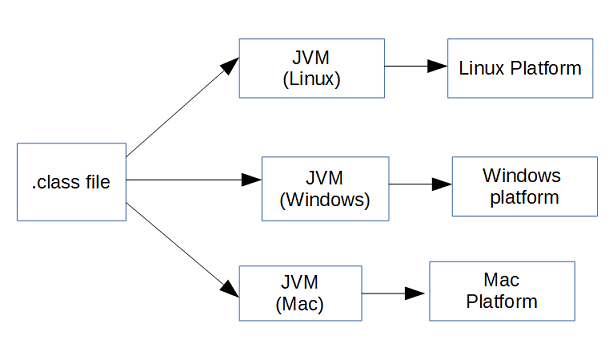

众所周知 Android 以 Java 、Kotlin 为编程语言，在编译时 Anrdoid 会将代码产出的字节码文件经优化后形成.dex 文件保存于 Apk 中，而 Android 中所有的应用程序都运行在 Android 虚拟机中。那么既然都已 Class 文件为原材料、以虚拟机为运行载体 Android 虚拟机与 JVM 在内存管理方法有什么差异呢？

# JVM vs Android VM

在前面的文章已经对 JVM 内存管理相关的内容作了介绍，在此我们总结一下 JVM 的特点。

JVM 是一个介于 Java 程序与运行平台之间的一个抽象层，JVM 是依赖具体平台的，不同的平台都有自己的实现。

### JVM

例如，你有一个 HelloWorld.java 文件，当你想运行他的时候，需要使用 javac 工具将其编译为 Bytecode 字节码文件，这意味着 javac 并不会和其他编译器一样将程序直接编译为机器码。Bytecode 是一个二进制文件，里面的内容都是以8个字节为宽度的，不同的位置都有着特殊的含义。Bytecode 作为平台无关性的中间码可以作为输入材料运行在各种平台的虚拟机上，这就是  Java 当年最响亮的广告语：Write Once and Run Anywhere （一次编写到处运行）的来源。



从上图可以看出，一旦你生成了 .class 文件，你就可以把他运行在各种平台上，并且它会被虚拟机转换为原生机器码。


## Android VM

目前 Android 虚拟机有两种类型：Dalvik 和 ART，他们都是用来运行 Android App 的。在移动端上，所有的资源都是受限制的例如，电池电量、 CPU 运算能力、内存资源。所以必须优化程序让他能在低功率的设备上运行。


从上面的图可以看出，除了最后两步其余都和 JVM 相同。差异在于在 Apk 编译期会使用 Dex 编译器优化 .class 文件，生成 .dex 文件作为 Android VM 的执行代码源头。


对比 JVM 和 Android VM，从架构的角度来看二者最大的差异在于 JVM 的指令是基于栈的，而 Android VM 的指令是基于寄存器的。最直观的效果就是 Android VM 执行程序的效率更高，这是因为寄存器离 CPU 更近、数据传输更快。而且基于栈模型的 JVM 在执行时， CPU 需要处理更多的指令去搬运数据，很明显 Android VM 在执行程序时需要的指令会更少，而且省去了存储部分内存太小（对于 JVM 运行架构的更多内容请阅读《深入理解 Java 虚拟机》第八章 - 虚拟机字节码执行引擎）


| Android VM                                                   | JVM                                         |
| ------------------------------------------------------------ | ------------------------------------------- |
| 基于寄存器模式，运行时速度更快更节省内存                     | 基于栈模式                                  |
| 使用自己的特有的字节码且输入源为 .dex 文件从 Android 2.2 开始 Dalvik 虚拟机引入了 JIT 及时编译功能 | 执行字节码输入源为 .class 文件拥有 JIT 功能 |
| 每一个 Application 都有一个单独的 VM                         | 一个 JVM 实例可以共享个多个 Application     |
| 是 Android 平台特有的，不支持其他平台操作系统                | JVM 支持多平台操作系统                      |
| 每个 Application 都有常量池                                  | 每个 .class 都有常量池                      |
| 可执行文件是 apk                                             | 可执行文件是 jar                            |


## 为什么 Android 自造虚拟机去替代 JVM？

为什么 Android 放弃现成的 JVM 不用非得自己造虚拟机出来呢？原因有以下几点。

>* Though JVM is free, it was under GPL license, which is not good for Android as most the Android is under Apache license.
>
>* JVM was designed for desktops and it is too heavy for embedded devices.
>
>* DVM takes less memory, runs and loads faster compared to JVM.
>
>  ​                                                                                                             — **The OHIO State University**

翻译过来是：

- 尽管JVM是免费的，但它已获得GPL许可，这对Android不利，因为大多数Android均已获得Apache许可。
- JVM是为台式机设计的，对于嵌入式设备而言太重了。
- 与JVM相比，DVM占用更少的内存，运行和加载速度更快。

​                                                                                                                        — **俄亥俄州立大学**


## 总结

Android VM 是基于优化过的 Bytecode 字节码文件工作的，它针对移动平台优化。这是因为移动平台相比 PC 具有更少的内存、较低的功耗、效率更低的CPU。


# 进程间的内存分配

Android OS 使用内存分页和内存映射（Memory-mapped ）来管理内存。在 Android OS 运行时不会浪费任何内存空间，它会尝试使用所有的内存。例如，==系统会在应有关闭后将其保存在内存当中，以便用户快速切换应用程序。==因此，通常情况下 Android OS 几乎没有空闲的内存。要在系统进程和许多应用直接正确分配内存，内存管理至关重要。

## 内存类型

Android 设备包含是三种不同类型的内存：RAM、zRAM和存储器（CPU 和 GPU 访问同一个 RAM）。


* RAM：RAM 就是我们常常听到的手机内存，但通常容量有限，一般高端设备拥有更大的 RAM。
* zRAM：相当于 swap 区域是用于交换空间的 RAM 分区。==Android 系统没有使用磁盘作为交换空间，而是直接在 RAM 上开辟了一个单独的区域。== 这样的好处就是更快，但弊端也很明显：缩小了 RAM 的体积。所有数据在放入 zRAM 时都会被压缩，在换出的时候在解压，这是典型的时间换空间的方式。zRAM 拥有动态拓展功能，其空间大小会随着数据的换入换出而增大缩小。设备制造商可以设置 zRAM 大小上限。
* 存储器可以类比磁盘，它包含了很多持久化存储的数据，存储器相比上面两种类型的内存容量要大很多。在 Android 上，为了避免因频繁写入导致的损坏、缩短存储器的寿命，所以 Android 没有像 Linxu 那样用磁盘作为交换空间。

## 内存共享

为了在 RAM 中容纳所需要的一切，Android 会尝试跨进程共享 RAM 页面。可以通过以下方式实现：

* Zygote。系统启动并加载通用框架代码和资源时，Zygote 随之启动。在 Android 中每一个进程都是通过 Zygote fork 而来，这样新启动的进程就拥有了系统资源的内存映射表，然后在新进程中加载并运行应用代码。这种方法可以使为框架代码和资源分的 RAM 在不同进程之间共享。
* 大多数的静态数据会映射到一个进程中。这种方式可以使数据在不同的进程中共享的同时，还能换入换出。静态数据示例包括：Dalvik 代码（通过将其放入预先链接的 `.odex` 文件中进行直接内存映射）、应用资源（通过将资源表格设计为可内存映射的结构以及通过对齐 APK 的 zip 条目）和传统项目元素（如 `.so` 文件中的原生代码）。
* 在很多地方，Android 使用明确分配的共享内存区域（通过 ashmem 或 gralloc）在进程间共享同一动态 RAM。例如，窗口 surface 使用在应用和屏幕合成器之间共享的内存，而光标缓冲区则使用在内容提供器和客户端之间共享的内存。

## 限制应用内存

为了维持多任务环境的正常运行，Android 会为每个应用的堆大小设置硬性上限。不同设备的确切堆大小上限取决于设备的总体可用 RAM 大小。如果您的应用在达到堆容量上限后尝试分配更多内存，则可能会收到 `OutOfMemoryError`。

在某些情况下，例如，为了确定在缓存中保存多少数据比较安全，您可能需要查询系统以确定当前设备上确切可用的堆空间大小。您可以通过调用 [ActivityManager#getMemoryClass()](https://developer.android.com/reference/android/app/ActivityManager#getMemoryClass()) 向系统查询此数值。此方法返回一个整数，表示应用堆的可用兆字节数。


## 内存页面

同样的 Android 也会将内存分页管理，每个页也是 4k 大小。系统会将页面视为 「可用」和「已使用」两种。可用页面就是未使用的 RAM。已使用的页面就是系统目前正在使用的 RAM，并分为以下类别：

* 缓存页面：在存储器中有文件对象的内存。
  * 私有页面：某个进程独占的
    * 干净页面：映射为文件系统中未经过修改的文件副本；可以由 `kswapd`删除释放内存（因为文件未经过修改，所以可以再次读取到一模一样的数据，删了也没关系）
    * 脏页面：存储器中经过修改的文件，可由`kswapd` 移动到 zRAM 中增加内存空间
  * 贡献页面：多个进程之间共享的
    * 干净页面：同上。
    * 脏页面：存储器中经过修改的文件，通过 `kswapd`或者通过其他方法将更改写回到存储器，咱家可用空间
* 匿名页面：存储器中没有对应文件的内存。
  * 脏页面：可由 `kswapd` 移动到 zRAM/在 zRAM 中进行压缩以增加可用内存


## 内存不足的处理策略

Android 系统在面临内存不足时有两种解决策略：内核交换守护进程和低内存终止进程。

### 内核交换守护进程

内核交换守护进程 kswapd 是 Linux 内核的一部分，用于将已使用的内存转换为可用内存。等设备上的内存不足之处 kswapd 将变化为活跃状态。Linux 内核对于可用内存设有上下阈值，当可用内存下降到下限阈值以下时，kswapd 开始回收内存。当可用内存大于上限阈值的时候，kswapd 停止回收内存。

`kswapd` 可以删除干净页来回收他们，因为这些页受到存储器的支持且未经过修改。如果某个进程需要使用已经删除的干净页的时候，则系统会将该页面从存储器复制到 RAM。此操作称为“请求分页”。


对于脏页面 `kswapd`  可以将缓存的私有脏页和匿名脏页移动到 zRAM 进行压缩。这样可以释放 RAM 中可用的内存。如果某个进程尝试处理 zRAM 中的脏页，该页将被解压缩并回到 RAM。如果与压缩页面关联的内存被终止了，则该页面会在 zRAM 中被删除。


### 低内存终止守护进程

很多时候通过 `kswapd` 内核交换进程释放出来的内存并不够使用，这种情况下，系统会使用 `onTrimMemeory()`来通知应用进程**内存不足**，开发者应该减少内存的使用量。如果这还不够，内核则开始启动低内存守护进程（LMK）杀进程。

LMK 使用一个名为 `oom_abj_score`的评分机制来计算优先级，分数高的将优先被杀死。一般情况下，后台应用最先被杀系统进程最后被终止。下表列出了从高到低的 LMK 评分类别。评分最高的类别，即第一行中的项目将最先被终止：


# 应用内存管理

内存资源在手机设备上是非常宝贵的，虽然 Android VM （ART、Dalivk）都有自动内存回收策略（GC），但是这并不意味着我们可以对内存置之不理，开发者仍然需要避免内存泄漏，并在适当的时候释放对象引用（Reference）。

在设备出厂的时候，不同的厂商会根据设备情况制定单个应用的最大可内存限制，通过以下命令行查看：

```shell
// dvm 最大可用堆内存：
adb shell getprop | grep dalvik.vm.heapsize
```

```shell
// 单个程序限制最大可用堆内存：
adb shell getprop | grep heapgrowthlimit
```

**超过单个程序限制最大堆内存则会抛出OOM，如果设置了手机开启了 largeHeap ,则可提高到 dvm 最大堆内存才OOM。**


## 监控可用内存和内存使用量

目前 Android Stuido 的 profile 工具已经很强大，开发者可以内存性能剖析器直观的查找和诊断内存问题。Android Studio 的官方文档对此介绍已经非常详尽，对此不再赘述，参见：[内存性能剖析器](https://developer.android.com/studio/profile/memory-profiler)。

### 释放内存以响应事件

在上面的一节「内存不足的处理策略」中我们提到 Android 设备在内存不足的时候会使用多种内存回收方式回收内存，或者杀死应用。为了能够感知到系统内存不足的情况并避免系统杀死应用进程，Android 提供了 [ComponentCallbacks2](https://developer.android.com/reference/android/content/ComponentCallbacks2) 接口。此接口需要在 Activity 中实现，在 Activity 启动后会将 callback 注册进入，并在内存情况发生变化的时候回调  [onTrimMemory(int level)](https://developer.android.com/reference/android/content/ComponentCallbacks2#onTrimMemory(int)) 方法。如果要随机检测当前 level 可以使用[ActivityManager.getMyMemoryState(RunningAppProcessInfo](https://developer.android.com/reference/android/app/ActivityManager#getMyMemoryState(android.app.ActivityManager.RunningAppProcessInfo))方法。

```kotlin
 import android.content.ComponentCallbacks2
    // Other import statements ...

    class MainActivity : AppCompatActivity(), ComponentCallbacks2 {

        // Other activity code ...

        /**
         * Release memory when the UI becomes hidden or when system resources become low.
         * @param level the memory-related event that was raised.
         */
        override fun onTrimMemory(level: Int) {

            // Determine which lifecycle or system event was raised.
            when (level) {

                ComponentCallbacks2.TRIM_MEMORY_UI_HIDDEN -> {
                    /*
                       Release any UI objects that currently hold memory.

                       The user interface has moved to the background.
                    */
                }

                ComponentCallbacks2.TRIM_MEMORY_RUNNING_MODERATE,
                ComponentCallbacks2.TRIM_MEMORY_RUNNING_LOW,
                ComponentCallbacks2.TRIM_MEMORY_RUNNING_CRITICAL -> {
                    /*
                       Release any memory that your app doesn't need to run.

                       The device is running low on memory while the app is running.
                       The event raised indicates the severity of the memory-related event.
                       If the event is TRIM_MEMORY_RUNNING_CRITICAL, then the system will
                       begin killing background processes.
                    */
                }

                ComponentCallbacks2.TRIM_MEMORY_BACKGROUND,
                ComponentCallbacks2.TRIM_MEMORY_MODERATE,
                ComponentCallbacks2.TRIM_MEMORY_COMPLETE -> {
                    /*
                       Release as much memory as the process can.

                       The app is on the LRU list and the system is running low on memory.
                       The event raised indicates where the app sits within the LRU list.
                       If the event is TRIM_MEMORY_COMPLETE, the process will be one of
                       the first to be terminated.
                    */
                }

                else -> {
                    /*
                      Release any non-critical data structures.

                      The app received an unrecognized memory level value
                      from the system. Treat this as a generic low-memory message.
                    */
                }
            }
        }
    }
```


### 查看您应该使用多少内存

为了允许多个进程同时运行，Android 针对为每个应用分配的堆大小设置了硬性限制。设备的确切堆大小限制因设备总体可用的 RAM 多少而异。如果您的应用已达到堆容量上限并尝试分配更多内存，系统就会抛出 `OutOfMemoryError`。

为了避免用尽内存，您可以查询系统以确定当前设备上可用的堆空间。您可以通过调用 `getMemoryInfo()` 向系统查询此数值。它将返回一个 `ActivityManager.MemoryInfo` 对象，其中会提供与设备当前的内存状态有关的信息，包括可用内存、总内存和内存阈值（如果达到此内存级别，系统就会开始终止进程）。`ActivityManager.MemoryInfo` 对象还会提供一个简单的布尔值`lowMemory`，您可以根据此值确定设备是否内存不足。

以下代码段示例演示了如何在应用中使用 `getMemoryInfo()` 方法。


```kotlin
    fun doSomethingMemoryIntensive() {

        // Before doing something that requires a lot of memory,
        // check to see whether the device is in a low memory state.
        if (!getAvailableMemory().lowMemory) {
            // Do memory intensive work ...
        }
    }

    // Get a MemoryInfo object for the device's current memory status.
    private fun getAvailableMemory(): ActivityManager.MemoryInfo {
        val activityManager = getSystemService(Context.ACTIVITY_SERVICE) as ActivityManager
        return ActivityManager.MemoryInfo().also { memoryInfo ->
            activityManager.getMemoryInfo(memoryInfo)
        }
    }
    
```


# 使用经过优化的数据容器

编程语言所提供的部分类并未针对移动设备做出优化。例如，常规 `HashMap` 实现的内存效率可能十分低下，因为每个映射都需要分别对应一个单独的条目对象。

Android 框架包含几个经过优化的数据容器，包括 `SparseArray`、`SparseBooleanArray` 和 `LongSparseArray`。 例如，`SparseArray` 类的效率更高，因为它们可以避免系统需要对键（有时还对值）进行自动装箱（这会为每个条目分别再创建 1-2 个对象）。

如果需要，您可以随时切换到原始数组以获得非常精简的数据结构。


# 参考

[内存管理概览](https://developer.android.com/topic/performance/memory-overview)

[进程间的内存分配](https://developer.android.com/topic/performance/memory-management)

[管理应用内存](https://developer.android.com/topic/performance/memory)

[Android内存管理分析总结](https://www.jianshu.com/p/8b1d9c86fa84)

[使用Logcat写入和查看日志](https://developer.android.com/studio/debug/am-logcat#memory-logs)

[调查 RAM 使用情况](https://developer.android.com/studio/profile/investigate-ram)

《深入解析Android虚拟机》

《深入理解Android：Java虚拟机ART》
