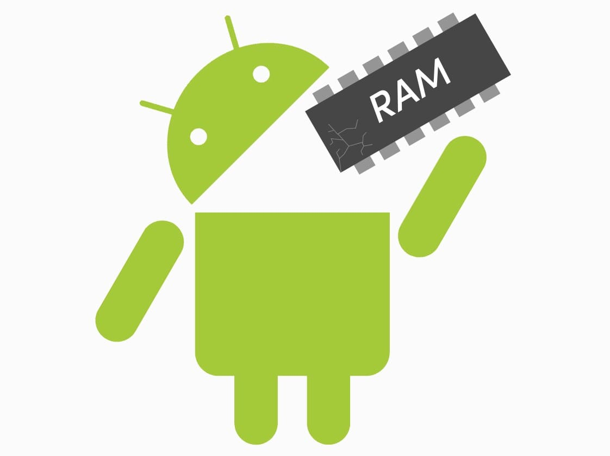

众所周知 Android 以 Java 、Kotlin 为编程语言，在编译时 Anrdoid 会将代码产出的字节码文件经优化后形成.dex 文件保存于 Apk 中，而 Android 中所有的应用程序都运行在 Android 虚拟机中。那么既然都已 Class 文件为原材料、以虚拟机为运行载体 Android 虚拟机与 JVM 在内存管理方法有什么差异呢？

# JVM vs Android VM

在前面的文章已经对 JVM 内存管理相关的内容作了介绍，在此我们总结一下 JVM 的特点。

JVM 是一个介于 Java 程序与运行平台之间的一个抽象层，JVM 是依赖具体平台的，不同的平台都有自己的实现。

### JVM

例如，你有一个 HelloWorld.java 文件，当你想运行他的时候，需要使用 javac 工具将其编译为 Bytecode 字节码文件，这意味着 javac 并不会和其他编译器一样将程序直接编译为机器码。Bytecode 是一个二进制文件，里面的内容都是以8个字节为宽度的，不同的位置都有着特殊的含义。Bytecode 作为平台无关性的中间码可以作为输入材料运行在各种平台的虚拟机上，这就是  Java 当年最响亮的广告语：Write Once and Run Anywhere （一次编写到处运行）的来源。


从上图可以看出，一旦你生成了 .class 文件，你就可以把他运行在各种平台上，并且它会被虚拟机转换为原生机器码。


## Android VM

目前 Android 虚拟机有两种类型：Dalvik 和 ART，他们都是用来运行 Android App 的。在移动端上，所有的资源都是受限制的例如，电池电量、 CPU 运算能力、内存资源。所以必须优化程序让他能在低功率的设备上运行。


从上面的图可以看出，除了最后两步其余都和 JVM 相同。差异在于在 Apk 编译期会使用 Dex 编译器优化 .class 文件，生成 .dex 文件作为 Android VM 的执行代码源头。


对比 JVM 和 Android VM，从架构的角度来看二者最大的差异在于 JVM 的指令是基于栈的，而 Android VM 的指令是基于寄存器的。最直观的效果就是 Android VM 执行程序的效率更高，这是因为寄存器离 CPU 更近、数据传输更快。而且基于栈模型的 JVM 在执行时， CPU 需要处理更多的指令去搬运数据，很明显 Android VM 在执行程序时需要的指令会更少，而且省去了存储部分内存太小


| Android VM                                                   | JVM                                         |
| ------------------------------------------------------------ | ------------------------------------------- |
| 基于寄存器模式，运行时速度更快更节省内存                     | 基于栈模式                                  |
| 使用自己的特有的字节码且输入源为 .dex 文件从 Android 2.2 开始 Dalvik 虚拟机引入了 JIT 及时编译功能 | 执行字节码输入源为 .class 文件拥有 JIT 功能 |
| 每一个 Application 都有一个单独的 VM                         | 一个 JVM 实例可以共享个多个 Application     |
| 是 Android 平台特有的，不支持其他平台操作系统                | JVM 支持多平台操作系统                      |
| 每个 Application 都有常量池                                  | 每个 .class 都有常量池                      |
| 可执行文件是 apk                                             | 可执行文件是 jar                            |


## 为什么 Android 自造虚拟机去替代 JVM？

为什么 Android 放弃现成的 JVM 不用非得自己造虚拟机出来呢？原因有以下几点。

>* Though JVM is free, it was under GPL license, which is not good for Android as most the Android is under Apache license.
>
>* JVM was designed for desktops and it is too heavy for embedded devices.
>
>* DVM takes less memory, runs and loads faster compared to JVM.
>
>  ​                                                                                                             — **The OHIO State University**

翻译过来是：

- 尽管JVM是免费的，但它已获得GPL许可，这对Android不利，因为大多数Android均已获得Apache许可。
- JVM是为台式机设计的，对于嵌入式设备而言太重了。
- 与JVM相比，DVM占用更少的内存，运行和加载速度更快。

​                                                                                                                        — **俄亥俄州立大学**


## 总结

Android VM 是基于优化过的 Bytecode 字节码文件工作的，它针对移动平台优化。这是因为移动平台相比 PC 具有更少的内存、较低的功耗、效率更低的CPU，这也是为啥 Andrdoid 使用 Linux 内核的原因。


# Android 内存管理概述

Android 运行时虚拟机 ART 和 Dalvik 都是用分页和内存映射的方式管理内存。


# 进程间的内存分配

# 应用内存管理

# 垃圾回收策略


# Android GC 日志解读

```
Explicit concurrent copying GC freed 97546(4MB) AllocSpace objects, 54(20MB) LOS objects, 50% free, 15MB/31MB, paused 229us total 201.196ms
```


```shell
07-01 16:00:44.690: I/art(801): Explicit concurrent mark sweep GC freed 65595(3MB) AllocSpace objects, 9(4MB) LOS objects, 34% free, 38MB/58MB, paused 1.195ms total 87.219ms
```


| **#** | **Field**           | **Value**             | **Description**                                              |
| ----- | ------------------- | --------------------- | ------------------------------------------------------------ |
| 1     | Timestamp           | 07-01 16:00:44.690    | Timestamp at which this garbage collection event ran.        |
| 2     | GC Reason           | Explicit              | Reason why garbage collection event was triggered. ‘Explicit’ indicates that garbage collection was explicitly requested by an app, for example, by calling [gc()](https://developer.android.com/reference/java/lang/System.html) or [gc()](https://developer.android.com/reference/java/lang/Runtime.html). Please refer here for [different types of GC Reasons](https://blog.gceasy.io/2017/05/09/android-run-time-gc-reason). |
| 3     | GC Name             | concurrent mark sweep | ART has various different GCs which can get run. In this case, ‘Concurrent Mark Sweep’ indicates – a whole heap collector which frees collects all spaces other than the image space. Please refer here for [different types of GC Names](https://blog.gceasy.io/2017/05/09/android-run-time-gc-name/). |
| 4     | Objects freed       | 65595(3MB)            | Amount of objects garbage collected from non-large objects space. Totally 65595 unique objects, whose cumulative size of 3mb is garbage collected (i.e. freed) in this event. |
| 5     | Large objects freed | 9(4MB)                | Amount of objects garbage collected from Large objects space. Totally 9 unique objects, whose cumulative size of 4mb is garbage collected (i.e. freed) |
| 6     | Heap usage          | 38MB/58MB             | 38mb of objects is alive after this particular GC event. Total allocated heap size for this application is 58mb. |
| 7     | GC Pause Time       | 1.195ms               | During certain phases of GC event, the application is paused. In this GC event, pause time is 1.195ms. During pause time, application freezes. One should target for low pause time. |
| 8     | GC Total Time       | 87.219ms              | Amount of time this GC event took to complete. It includes the GC Pause time as well. |

# 参考

[内存管理概览](https://developer.android.com/topic/performance/memory-overview)

[进程间的内存分配](https://developer.android.com/topic/performance/memory-management)

[管理应用内存](https://developer.android.com/topic/performance/memory)

[调试 ART 垃圾回收](https://source.android.com/devices/tech/dalvik/gc-debug)

[在 Android Runtime (ART) 中验证应用行为](https://developer.android.com/guide/practices/verifying-apps-art)

[Technical details of Android Garbage Collector](https://stackoverflow.com/questions/4818869/technical-details-of-android-garbage-collector)

[Collecting the Garbage: A brief history of GC over Android versions](https://proandroiddev.com/collecting-the-garbage-a-brief-history-of-gc-over-android-versions-f7f5583e433c)

[Understanding Android Garbage Collection Logs](https://dzone.com/articles/understanding-android-gc-logs)

[Android内存管理分析总结](https://www.jianshu.com/p/8b1d9c86fa84)

[使用Logcat写入和查看日志](https://developer.android.com/studio/debug/am-logcat#memory-logs)

《深入解析Android虚拟机》

《深入理解Android：Java虚拟机ART》


搜索资料

https://www.google.com/search?sxsrf=ALeKk00_YL4efMdQK9zzu45vRQULVNFkCA%3A1596634952937&ei=SLcqX_nhOMSIr7wPvLG6sAw&q=Android+GC&oq=Android+GC&gs_lcp=CgZwc3ktYWIQAzIECCMQJzIECCMQJzIHCAAQFBCHAjICCAAyAggAMgIIADICCAAyBAgAEAoyAggAMgUIABDLAToHCAAQRxCwAzoKCAAQsQMQFBCHAjoECAAQQzoFCAAQsQNQ0ghY0A1g6Q9oAXAAeACAAccBiAGnBZIBAzAuNJgBAKABAaoBB2d3cy13aXrAAQE&sclient=psy-ab&ved=0ahUKEwj5pdLZmITrAhVExIsBHbyYDsYQ4dUDCAw&uact=5