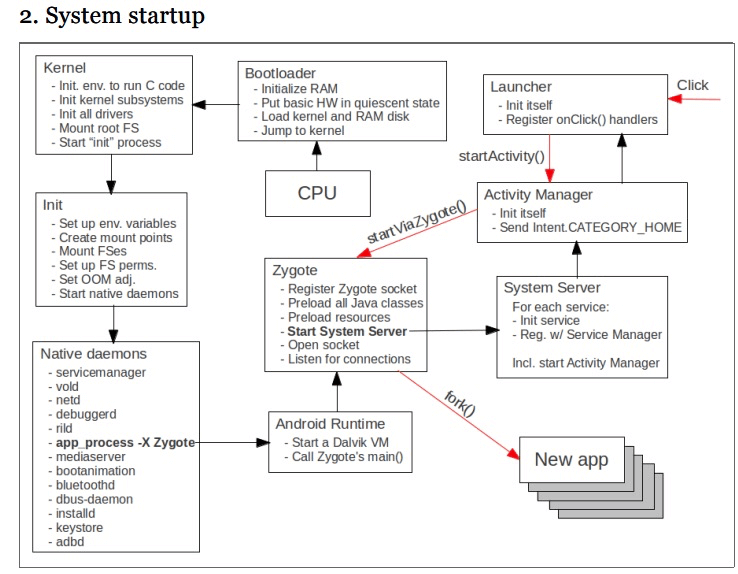

# 堆内存布局


# 垃圾回收算法

Dalvik GC 实现的比 JVM 要宽松很多，最明显的就是 Dalvik GC 没有前台进程碎片整理，也就是说对象创建完毕后，内存地址就是固定的。

看了很多介绍 Android GC 的资料总结下来：

1. 早期的 Dalvik GC 完全是蛮荒时代，内存分配和回收都非常慢，这是因为那时候的 Dalvik GC 处理器使用的是在标记对象的时候单线程模式的，每次执行 GC 都会 stop the wold 暂停所有的线程运行。
2. 而且当时的 Dalvik GC 只使用了 CMS 并发标记清除算法(这个并发只是在回收内存上)，没有使用分代算法，这样一来只有堆内存已满不足以分配足够内存空间的时候才会触发 GC。也就是说对象不会立马被回收，而是等到内存耗尽了才开始回收资源，这会导致大量的无用对象长期存活，浪费空间。
3. Dalvik GC 只会对后台进程进行内存整理，前台进程是不会整理内存的，那么由于标记清除算法造成的内存碎片就无法分配给大对象使用，造成了内存的浪费。

触发 GC 的时机

1. 内存分配失败
2. 当对大小到达阈值的时候
3. 手动触发 GC    

Dalvik 有两种基本的 GC 模式， GC_CONCURRENT 和 GC_FOR_ALLOC ，这两种你都可以在 logcat 中看到。

- GC_CONCURRENT 对于每次收集将阻塞主线程大约 5ms 。因为每个操作都比一帧(16ms)要小，GC_CONCURRENT 通常不会造成你的应用丢帧。
- GC_FOR_ALLOC 是一种 stop-the-world 收集，可能会阻塞主线程达到 125ms 以上。GC_FOR_ALLOC 几乎每次都会造成你的应用丢失多个帧，导致视觉卡顿，特别是在滑动的时候。

不幸的是，Dalvik 似乎甚至连适度的分配（例如一个 16kb 的缓冲区）都处理得不是很好。重复的中等分配，或即使单次大的分配（比如说一个 Bitmap ），将会导致 GC_FOR_ALLOC 。因此，你分配的内存越多，就会招来越多 stop-the-world 的 GC，而你的应用将有更多的丢帧。

通过复用中到大尺寸的资源， Glide 可以帮你尽可能地减少这种 GC，以保持应用的流畅。


Dalvik GC 主要分为四步

1. 查找所有 Root Sets(简单理解为 Root 对象):GC 会暂停所有线程, 然后开始查找 Root sets,Root sets 一般指局部变量, thread 对象, 静态变量等. 或者说, Root sets 就是你的应用可访问到的, 活着的对象. 这一步会比较耗时, 而且期间你的 App 会暂停运行.

2. 标记可达对象(一): 这个阶段, GC 会把刚找到的 Root sets 标记为可达(reachable), 剩余的就是不可达对象, 等待后续阶段回收. 标记可达的这一阶段是并发执行的, 也就是在这期间你的 App 会恢复运行. 但是这个并发带来了新问题, 因为标记的同时又在给新的对象分配内存.
3.  标记可达对象(二): 给新的对象分配内存的时候, GC 又要重新查找 Root sets, 执行第 1 步操作, 暂停你的 App. 这个时候你的 App 会显得卡顿, 感觉上像是手机在执行什么高负荷的任务.
4. 回收: GC 把所有没有被标记为可达的对象进行回收. 这一阶段是并发执行的.

没有分代算法，没有内存整理功能。只实现了一种算法还是标记-清除。这就意味着每次 GC 的时候都是 stop the world 的。不仅如此在扫描 GC Root 标记对象的时候用的还是单线程。


到了 ART 时期，Google 对 GC 进行了多次优化主要是

1. 垃圾回收器的整体重写
2. CMS 算法的优化。
3. 使用 RegionTLAB 碰撞指针分配器，优先分配 TLAB 内存。


ART 与 Dalvik 相比，在 GC 有以下明显的改动：

1. ART 将扫描期的暂停降低到一次。Dalvik 第一次暂停主要是为了寻找 GC Root

# Android GC 日志解读

```
Explicit concurrent copying GC freed 97546(4MB) AllocSpace objects, 54(20MB) LOS objects, 50% free, 15MB/31MB, paused 229us total 201.196ms
```


```shell
07-01 16:00:44.690: I/art(801): Explicit concurrent mark sweep GC freed 65595(3MB) AllocSpace objects, 9(4MB) LOS objects, 34% free, 38MB/58MB, paused 1.195ms total 87.219ms
```


| **#** | **Field**           | **Value**             | **Description**                                              |
| ----- | ------------------- | --------------------- | ------------------------------------------------------------ |
| 1     | Timestamp           | 07-01 16:00:44.690    | Timestamp at which this garbage collection event ran.        |
| 2     | GC Reason           | Explicit              | Reason why garbage collection event was triggered. ‘Explicit’ indicates that garbage collection was explicitly requested by an app, for example, by calling [gc()](https://developer.android.com/reference/java/lang/System.html) or [gc()](https://developer.android.com/reference/java/lang/Runtime.html). Please refer here for [different types of GC Reasons](https://blog.gceasy.io/2017/05/09/android-run-time-gc-reason). |
| 3     | GC Name             | concurrent mark sweep | ART has various different GCs which can get run. In this case, ‘Concurrent Mark Sweep’ indicates – a whole heap collector which frees collects all spaces other than the image space. Please refer here for [different types of GC Names](https://blog.gceasy.io/2017/05/09/android-run-time-gc-name/). |
| 4     | Objects freed       | 65595(3MB)            | Amount of objects garbage collected from non-large objects space. Totally 65595 unique objects, whose cumulative size of 3mb is garbage collected (i.e. freed) in this event. |
| 5     | Large objects freed | 9(4MB)                | Amount of objects garbage collected from Large objects space. Totally 9 unique objects, whose cumulative size of 4mb is garbage collected (i.e. freed) |
| 6     | Heap usage          | 38MB/58MB             | 38mb of objects is alive after this particular GC event. Total allocated heap size for this application is 58mb. |
| 7     | GC Pause Time       | 1.195ms               | During certain phases of GC event, the application is paused. In this GC event, pause time is 1.195ms. During pause time, application freezes. One should target for low pause time. |
| 8     | GC Total Time       | 87.219ms              | Amount of time this GC event took to complete. It includes the GC Pause time as well. |


# 参考

[调查 RAM 使用情况](https://developer.android.com/studio/profile/investigate-ram)

[调试 ART 垃圾回收](https://source.android.com/devices/tech/dalvik/gc-debug)

[Android Runtime (ART) 和 Dalvik](https://source.android.com/devices/tech/dalvik)

[在 Android Runtime (ART) 中验证应用行为](https://developer.android.com/guide/practices/verifying-apps-art)

[Technical details of Android Garbage Collector](https://stackoverflow.com/questions/4818869/technical-details-of-android-garbage-collector)

[Collecting the Garbage: A brief history of GC over Android versions](https://proandroiddev.com/collecting-the-garbage-a-brief-history-of-gc-over-android-versions-f7f5583e433c)

[Understanding Android Garbage Collection Logs](https://dzone.com/articles/understanding-android-gc-logs)

[Android GC进化史](https://www.cnblogs.com/cottony/p/12675072.html)





# 