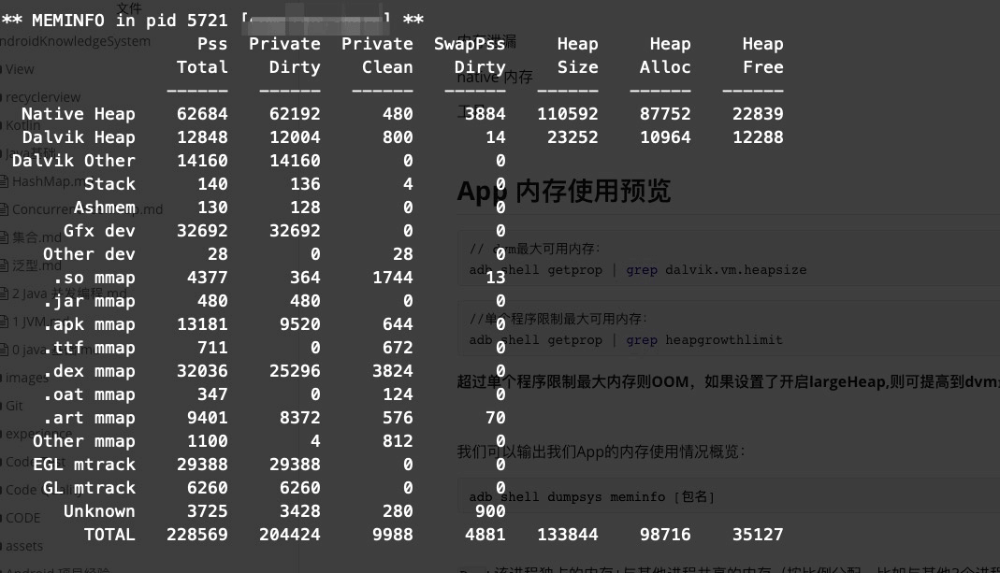

内存泄漏

native 内存

工具


## App 内存使用预览

```shell
// dvm最大可用内存：
adb shell getprop | grep dalvik.vm.heapsize
```

```shell
//单个程序限制最大可用内存：
adb shell getprop | grep heapgrowthlimit
```

**超过单个程序限制最大内存则OOM，如果设置了开启largeHeap,则可提高到dvm最大内存才OOM。**


我们可以输出我们App的内存使用情况概览：

```java
adb shell dumpsys meminfo [包名]
```



`Pss`: 该进程独占的内存+与其他进程共享的内存（按比例分配，比如与其他3个进程共享9K内存，则这部分为3K）

`Privete Dirty`:该进程独享内存

`Heap Size`:分配的内存

`Heap Alloc`:已使用的内存

`Heap Free`:空闲内存

