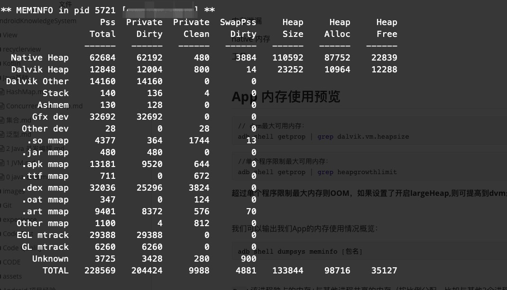

# 


内存泄漏

native 内存

工具


我们可以输出我们App的内存使用情况概览：

```java
adb shell dumpsys meminfo [进程名称一般是包名]
```



`Pss`: 该进程独占的内存+与其他进程共享的内存（按比例分配，比如与其他3个进程共享9K内存，则这部分为3K）

`Privete Dirty`:该进程独享内存

`Heap Size`:分配的内存

`Heap Alloc`:已使用的内存

`Heap Free`:空闲内存


[调查 RAM 使用情况](https://developer.android.com/studio/profile/investigate-ram)