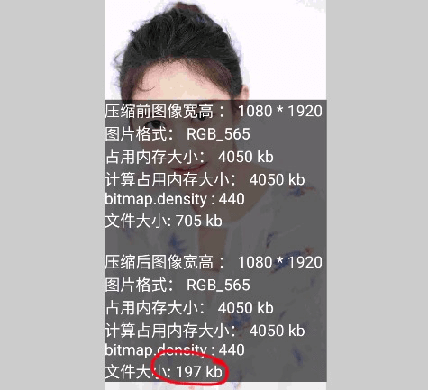
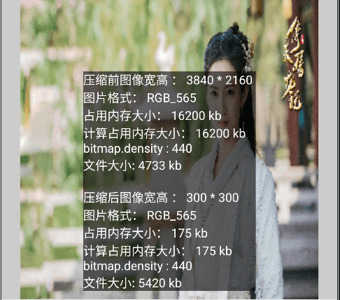

Google 极力推荐使用 Glide 作为图片加载的唯一工具，因为 Glide 内部对图片资源进行了良好的管理，不容易造成内存问题。

# Bitmap 体积

Bitmap 的计算公式分为两种：

1. 资源文件下：with * height *（nTargetDensity/inDensity）^ 2 * 每个像素的大小（inDensity默认为图片所在文件夹对应的密度；inTargetDensity为当前系统密度。）
2. with * height * 每个像素的大小

Btimap 的每一个像素的体积都由 Config 控制着，其中最常用的有两个配置

1. ARGB_8888 ：每个像素共占用 8 * 4 = 32个字节即 4byte
2. RGB_565：每个像素占用 5 + 6 +5 = 16 个字节即 2byte

可见 RGB_565 要比 ARGB_8888 少使用一半的内存，所以在没有特殊要求的情况下Config 最好指定为 RGB_565。


# 高效加载大型位图

## Bitmap.compress 的坑

quality 说的的是一个图片的质量（品质）就是0到100，不能循环压缩， 反复的使用  bitmap.compress 进行质量压缩会导致结果越来越大

```java
    fun compressQuality(bitmap: Bitmap, declineQuality: Int = 10): ByteArray {
        val outputStream = ByteArrayOutputStream()
        var quality = declineQuality
        bitmap.compress(Bitmap.CompressFormat.JPEG, quality, outputStream)
        return outputStream.toByteArray()
    }
```


同样的质量重复压缩十遍，结果变大了

```java
    fun compressQuality(bitmap: Bitmap, declineQuality: Int = 10): ByteArray {
        val outputStream = ByteArrayOutputStream()
        var quality = declineQuality
        var count = 10
        while (count-- > 0) {
            bitmap.compress(Bitmap.CompressFormat.JPEG, quality, outputStream)
        }
        return outputStream.toByteArray()
    }
```



质量依次递减多次压缩，结果大于原始文件体积

```java
    fun compressQuality(bitmap: Bitmap, declineQuality: Int = 10): ByteArray {
        val outputStream = ByteArrayOutputStream()
        var quality = declineQuality
        while (quality > declineQuality) {
            quality -= declineQuality
            bitmap.compress(Bitmap.CompressFormat.JPEG, quality, outputStream)
        }
        return outputStream.toByteArray()
    }
```


0到100是一个绝对值，就是说一个图片的质量（品质）就是0到100，不能循环压缩，你可以试一下，用一个已经是0得图片再次压缩到50，那么它的大小不但不会小，返回会增大！！！说到这里我们就再拿到我们主角Bitmap的compress上说，我们得出两个结论：

一、与PS的操作结果一样，compress也有一个压缩的最大限度，所以这个方法不能压缩到任意值。

二、与PS的操作结果一样，compress如果对已经被压缩的图片进行重新压缩，图片可能再次变大！因为你的图片本身就已经被压缩过了！！


## 压缩尺寸

```java
    /**
     * 压缩尺寸 1
     */
    fun compressSize(bitmap: Bitmap, width: Int, height: Int): Bitmap {
        val result = Bitmap.createBitmap(width, height, Bitmap.Config.RGB_565)
        val canvas = Canvas(result)
        val rect = Rect(0, 0, width, height)
        canvas.drawBitmap(bitmap, null, rect, null)
        return result
    }
```

```java
		/**
		 * 尺寸压缩 2
		*/
    fun compressScale(bitmap: Bitmap, width: Int, height: Int): Bitmap {
        return Bitmap.createScaledBitmap(bitmap, width, height, true)
    }
}
```

二者的结果相同




