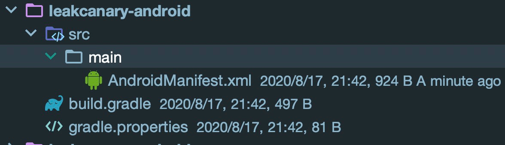
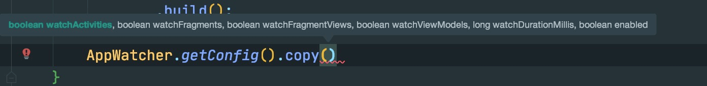
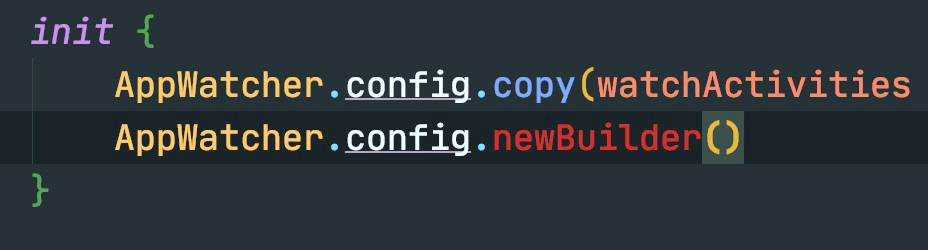

# 1 自动安装原理

在2.0版本开始，LeakCanary 已经不需要手动初始化了，只需要引入以来即可:

```groovy
   // leakCanary
    debugImplementation 'com.squareup.leakcanary:leakcanary-android:2.4'
```

那么他是如何进行初始化的呢？答案是 ContentProvider 的方式。

我们引入的 leakcanary-android 在源代码中其实只是个空壳：



内部没有任何代码，仅仅是在 build.gradle 中引入了 `leakcanary-android-core` 的本地依赖。**为什么要这样做呢？**==我猜测是为了封装屏蔽变化，向外部保留稳定的依赖工程，屏蔽底层大规模的修改==


初始化的 ContentProvider 注册在 leakcanary-object-watcher-android 项目的 AndroidManifest 文件中

```xml
<?xml version="1.0" encoding="utf-8"?>
<manifest
    xmlns:android="http://schemas.android.com/apk/res/android"
    package="com.squareup.leakcanary.objectwatcher">

  <application>
    <provider
        // 初始化入口
        android:name="leakcanary.internal.AppWatcherInstaller$MainProcess"
        android:authorities="${applicationId}.leakcanary-installer"
        android:enabled="@bool/leak_canary_watcher_auto_install"
        android:exported="false"/>
  </application>
</manifest>

```


## 浅析 ContentProvider 初始化流程

需要handlerBinderHelper 

1. ContentProvider 初始化要比 Application 要早

==待学习完善==

# 2 初始化流程

在  「leakcanary-object-watcher-android」 项目的 AppWatcherInstaller onCreate 方法内，可以找到初始化代码

```kotlin
  override fun onCreate(): Boolean {
    val application = context!!.applicationContext as Application
    AppWatcher.manualInstall(application)
    return true
  }
```

[AppWatcher](https://github.com/square/leakcanary/blob/main/leakcanary-object-watcher-android/src/main/java/leakcanary/AppWatcher.kt) 是一个向外暴露的单例，它包含了配置和初始化两部分工作，在初始化这部分其实也体现了封装的概念，将  AppWatcher.manualInstall 作为统一出入口，而真正实现的 InternalAppWatcher 则被 internal 修饰不对外保留。**注意注释有很重要信息**

```kotlin
  /**
   * [AppWatcher] is automatically installed in the main process on startup. You can
   * disable this behavior by overriding the `leak_canary_watcher_auto_install` boolean resource:
   * [AppWatcher] 在主进程启动的时候将自动安装，通过 `leak_canary_watcher_auto_install` 属性你可以不使用这个行为。
   *
   * ```
   * <?xml version="1.0" encoding="utf-8"?>
   * <resources>
   *   <bool name="leak_canary_watcher_auto_install">false</bool>
   * </resources>
   * ```
   *
   * If you disabled automatic install then you can call this method to install [AppWatcher].
   * 如果你不使用自动安装，那么你可以调用这个方法去安装
   */
  fun manualInstall(application: Application) {
    InternalAppWatcher.install(application)
  }
```


## 插曲一：限制 Kotlin 内代码仅  Java 可访问

在配置文件这快，注意到了一块很有趣的代码：

```kotlin

   /**
     * Construct a new Config via [AppWatcher.Config.Builder].
     * Note: this method is intended to be used from Java code only. For idiomatic Kotlin use
     * `copy()` to modify [AppWatcher.config].
     */
    @Suppress("NEWER_VERSION_IN_SINCE_KOTLIN")
    @SinceKotlin("999.9") // Hide from Kotlin code, this method is only for Java code
    fun newBuilder(): Builder = Builder(this)
```

意思是说 newBuilder 方法是专门给 Java 用的，对于 data class kotlin 中常用的方法是 copy()

```kotlin
/**
   * AppWatcher configuration data class. Properties can be updated via [copy].
   * Config 是个数据类
   * @see [config]
   */
  data class Config(
    /**
     * Whether AppWatcher should automatically watch destroyed activity instances.
     *
     * Defaults to true.
     */
    val watchActivities: Boolean = true,
    ……
  )
```

为此我做了个实验，对比一下这两个的关系与区别

java 代码：按照注释说明 Java 中应该这样使用, 所有的参数都是可选的

```java
    AppWatcher.Config.Builder builder = AppWatcher.getConfig().newBuilder();
    builder.watchActivities(true)
           .watchDurationMillis(1000)
           .build();
```

但是如果在 Java 中使用 copy 就必须填入所有参数，不能使用 Builder 模式了。



Kotlin 代码也一样，使用 copy 方法便可间接完成 Builder 模式。

```kotlin
AppWatcher.config.copy(watchActivities = true, watchFragments = true, watchDurationMillis = 1000)
```

但是如果调用 newBuilder 方法你是获取不到的



那么从中我们学到了什么呢？

==如果我们想在 Kotlin 中实现仅能让 Java 方法的代码, 你可以通过 @SinceKotlin(“999.9”) 来限制==（填入1000会报错，最大也就999.9）

```kotlin
    @Suppress("NEWER_VERSION_IN_SINCE_KOTLIN")
    @SinceKotlin("999.9") // Hide from Kotlin code, this method is only for Java code
    fun newBuilder(): Builder = Builder(this)
```


## 初始化核心: InternalAppWatcher 

```kotlin
  fun install(application: Application) {
    checkMainThread()
    if (this::application.isInitialized) {
      return
    }
    SharkLog.logger = DefaultCanaryLog()
    InternalAppWatcher.application = application

    val configProvider = { AppWatcher.config }
    // 注册 Activity 生命周期回调监听 见 [3.1]
    ActivityDestroyWatcher.install(application, objectWatcher, configProvider)
    // 注册 Fragment 生命周期回调监听 见 [3.3]
    FragmentDestroyWatcher.install(application, objectWatcher, configProvider)
    // 主要工作是接受 watcher 的通知 见 [4]
    onAppWatcherInstalled(application)
  }
```

在 InternalAppWatcher#install 中主要的逻辑可以分为注册生命周期回调和接受 watcher 两部分。监听的目的就是为了感知对象的销毁时机，从而进一步分析是否存内存泄漏。而 Activity Fragment 作为承载所有可见组件的容器就是我们主要的监测目标。在 LeakCanary 的早起版本是不支持监测 Fragment 内存泄漏了，而此功能在 2.x 开始得到了支持。ActivityDestroyWatcher、FragmentDestroyWatcher 是判定是否可能存在内存泄漏的核心，会在下面详细分析。

onAppWatcherInstalled 是一个高阶函数类型（对于Kotlin高阶函数请参见：[高阶函数与 lambda 表达式]([https://www.kotlincn.net/docs/reference/lambdas.html#%E9%AB%98%E9%98%B6%E5%87%BD%E6%95%B0%E4%B8%8E-lambda-%E8%A1%A8%E8%BE%BE%E5%BC%8F](https://www.kotlincn.net/docs/reference/lambdas.html#高阶函数与-lambda-表达式))）他的最终是现实是通过反射获得的 `leakcanary.internal.InternalLeakCanary` 对象。**为啥要用反射搞呢？**

## 插曲二：InternalLeakCanary 的反射。

```kotlin
private val onAppWatcherInstalled: (Application) -> Unit
 ……
  init {
    val internalLeakCanary = try {
      val leakCanaryListener = Class.forName("leakcanary.internal.InternalLeakCanary")
      leakCanaryListener.getDeclaredField("INSTANCE")
          .get(null)
    } catch (ignored: Throwable) {
      NoLeakCanary
    }
    @kotlin.Suppress("UNCHECKED_CAST")
    onAppWatcherInstalled = internalLeakCanary as (Application) -> Unit
  }
```

目光来到「 leakcanary-object-watcher-android」的 build.gradle 文件中，我们发现 「 leakcanary-object-watcher-android」 并没有依赖 `leakcanary.internal.InternalLeakCanary`  实现项目 「leakcanary-android-core」所以在 「 leakcanary-object-watcher-android」 中我们并不能获取到`leakcanary.internal.InternalLeakCanary`  的实现类，这也是使用反射的表现原因。


==对于根本原因我的猜测是为了隔离与分层== 「 leakcanary-object-watcher-android」作为底层实现他是稳定的，他并不依赖上层可变的实现，他仅需要一个固定的实现类 `leakcanary.internal.InternalLeakCanary`   即可。

<font color = red>但是为什么不定义接口呢？</font>虽然我认为使用反射的方式没有定义接口优雅，但是这并不妨碍我们学习这种写法的优点：==在底层逻辑并不关心上层逻辑的具体实现的同时，也解决了底层模块依赖上层模块的引用关系这大大降低了模块间耦合。==

所以，以后遇到这种情况我们就有了两种选择：

1. <font color = red>在父类中定义接口，让上层模块自己注入具体实现（最优解）</font>
2. 反射实现类。


# 3 判断是否可能存在内存泄漏

## 3.1 ActivityDestroyWatcher

ActivityDestoryWatcher 是监听 Activity 生命周期回调的入口，通过源码可以看到主要的核心逻辑就是监听 App 内所有 Activity destory 的生命周期的回调。

```kotlin
 companion object {
    fun install(
      application: Application,
      objectWatcher: ObjectWatcher,
      configProvider: () -> Config
    ) {
      val activityDestroyWatcher =
        ActivityDestroyWatcher(objectWatcher, configProvider)
      // 在 Application 上注册生命周期回调。重点在 lifecycleCallbacks 的实现上
      application.registerActivityLifecycleCallbacks(activityDestroyWatcher.lifecycleCallbacks)
    }
  }
```

```kotlin
  private val lifecycleCallbacks =
    object : Application.ActivityLifecycleCallbacks by noOpDelegate() {
      override fun onActivityDestroyed(activity: Activity) {
        if (configProvider().watchActivities) {
          // 将 Destroyed 的 Activity 装载入 objectWatcher 中
          objectWatcher.watch(
              activity, "${activity::class.java.name} received Activity#onDestroy() callback"
          )
        }
      }
    }
```

那么重点来了 objectWatcher.watch 干了些什么？

## 3.2 ObjectWatcher

*PS 对源码进行过删减仅保留核心逻辑*

```kotlin
/**
 * Watches the provided [watchedObject].
 * 
 * @param description Describes why the object is watched.
 */
@Synchronized fun watch(watchedObject: Any, description: String) {
  // 移除弱引用对象 [3.2.3]
  removeWeaklyReachableObjects()
  val key = UUID.randomUUID().toString()
  val watchUptimeMillis = clock.uptimeMillis()
  // 构建 KeyedWeakReference 使用 UUID 作为 key 标识唯一引用 详情见：[3.2.1]。这个 Key 将会是[3.2.4]的关键。
  val reference = KeyedWeakReference(watchedObject, key, description, watchUptimeMillis, queue)
  watchedObjects[key] = reference // 将引用存入 watchedReferences
  // 在 IternalAppWatcher 中实现，基于 Handler + 5s 延时实现 [3.2.2]
  checkRetainedExecutor.execute {
    // 5s 后开始整理 watchedObjects 判定那些对象可能存在内存泄漏
    moveToRetained(key) // 如果当前引用未被移除，仍在 watchedReferences  队列中，
                        // 说明仍未被 GC，移入 retainedReferences 队列中,暂时标记为泄露 见[3.2.4]
  }
}
```

### 3.2.1 KeyedWeakReference

KeyedWeakReference 是 WeakRefercen （弱引用）一个实现，使用[key]跟踪尚未进入应有队列的弱引用。简单说 KeyedWeakReference 实现的目的就是为了跟踪那些还没有不回收的对象

```kotlin
/**
 * A weak reference used by [ObjectWatcher] to determine which objects become weakly reachable
 * and which don't. [ObjectWatcher] uses [key] to keep track of [KeyedWeakReference] instances that
 * haven't made it into the associated [ReferenceQueue] yet.
 *
 * [heapDumpUptimeMillis] should be set with the current time from [Clock.uptimeMillis] right
 * before dumping the heap, so that we can later determine how long an object was retained.
 */
class KeyedWeakReference(
  referent: Any,
  val key: String,
  val description: String,
  val watchUptimeMillis: Long,
  referenceQueue: ReferenceQueue<Any>
) : WeakReference<Any>(
    referent, referenceQueue
) {
  /**
   * Time at which the associated object ([referent]) was considered retained, or -1 if it hasn't
   * been yet.
   */
  @Volatile
  var retainedUptimeMillis = -1L

  companion object {
    @Volatile
    @JvmStatic var heapDumpUptimeMillis = 0L
  }

}
```


### 3.2.2 checkRetainedExecutor

checkRetainedExecutor 是基于主线程 Handler 实现 + 5s 延时，具体代码我也粘贴在下面了

```kotlin
  private val checkRetainedExecutor = Executor {
    mainHandler.postDelayed(it, AppWatcher.config.watchDurationMillis)
  }
```

mainHandler ：基于主线程的 Handler

```kotlin
  private val mainHandler by lazy {
    Handler(Looper.getMainLooper())
  }
```

watchDurationMillis：默认 5s 

```kotlin
  /**
     * How long to wait before reporting a watched object as retained.
     *
     * Default to 5 seconds.
     */
    val watchDurationMillis: Long = TimeUnit.SECONDS.toMillis(5),
```

原来 Executor 是个接口！！！！

```java
public interface Executor {

    /**
     * Executes the given command at some time in the future.  The command
     * may execute in a new thread, in a pooled thread, or in the calling
     * thread, at the discretion of the {@code Executor} implementation.
     *
     * @param command the runnable task
     * @throws RejectedExecutionException if this task cannot be
     * accepted for execution
     * @throws NullPointerException if command is null
     */
    void execute(Runnable command);
}
```

### 3.2.3  removeWeaklyReachableObjects

```kotlin
private fun removeWeaklyReachableObjects() {
  // WeakReferences are enqueued as soon as the object to which they point to becomes weakly
  // reachable. This is before finalization or garbage collection has actually happened.
  //  弱引用一旦变得弱可达，就会立即入队。这将在 finalization 或者 GC 之前发生。
  var ref: KeyedWeakReference?
  do {
    ref = queue.poll() as KeyedWeakReference? // 队列 queue 中的对象都是会被 GC 的
    if (ref != null) {
      watchedObjects.remove(ref.key)
    }
    // 移除 watchedReferences 队列中的会被 GC 的 ref 对象，剩下的就是可能泄露的对象
  } while (ref != null)
}
```

这里有个关键点：==弱引用的对象变为弱可达，就会将引用立即入队，这个操作发生在 finalization 和 GC 之前==这个和我之前学习的不一样：

1. 当一个对象仅存在弱引用的时候其可达性变为弱可达，而没有任何应用的对象才是不可达
2. 引用进入应用队列的时机并不会 GC 之后，而是在可达性分析后，在 finalization 和 GC 之前
3. 在 finalization 之前这说明对象可能存在自我救赎的机会。

**问题：如果这个对象在自我救赎成功之后，弱引用会自动出队再次变为可用的吗？**

看了引用队列的源码只看到了入队的函数的函数，并没有出队的所以做个试验搞一下：

### 插曲三：弱引用队列入队试验

```java

/**
 * 弱引用队列试验
 * Create by im_dsd 2020/8/19 01:42
 */
class WeakReferenceDemo {
    private static final int _1M = 1024 * 1024;

    /**
     * VM 参数 -XX:+UseSerialGC -XX:SurvivorRatio=8 -Xms20M -Xmx20M -Xmn10M
     */
    public static void main(String[] args) {
        Allocation allocation1 = new Allocation("张三", 2);
        Allocation allocation2 = new Allocation("王五", 2);
        Allocation allocation3 = new Allocation("赵四", 2);
        // 设置弱引用和引用队列
        ReferenceQueue<Allocation> queue = new ReferenceQueue<>();
        WeakReference<Allocation> reference = new WeakReference<>(allocation3, queue);
        System.out.println("原始: " + reference.get());
        System.out.println("原始 queue:" + queue.poll() + "\n");
        allocation3.setRefInfo(reference, queue);
        // 置为 null,可以被 GC 回收
        allocation3 = null;
        // 这里将会发生一次 GC，此时将会尝试回收 allocation3
        Allocation allocation4 = new Allocation("李雷", 4);
        System.out.println("GC:" + reference.get());
        System.out.println("GC queue:" + queue.poll() + "\n");
    }

    private static class Allocation {
        private final byte[] allocation;
        private static Allocation SAVE;
        private final String mName;
        private WeakReference<Allocation> mReference;
        private ReferenceQueue<Allocation> mQueue;

        public Allocation(String name, int sizeMB) {
            mName = name;
            allocation = new byte[sizeMB * _1M];
        }

        public void setRefInfo(WeakReference<Allocation> reference, ReferenceQueue<Allocation> queue) {
            mReference = reference;
            mQueue = queue;
        }

        @Override
        protected void finalize() throws Throwable {
            System.out.println("finalize:" + mReference.get());
            System.out.println("finalize queue:" + mQueue.poll());
            super.finalize();
            System.out.println(mName + "  我要死了吗？不，我要自救。" + "\n");
            SAVE = this;
        }
    }
}

```


```shell
# 一开始持有 allocation3 的弱引用
原始: com.darius.gc.WeakReferenceDemo$Allocation@60e53b93
原始 queue:null

# 在 finalization GC 之前弱引用已经入队。
finalize:null
finalize queue:java.lang.ref.WeakReference@77e6ac9
赵四  我要死了吗？不，我要自救。

# 在自我救赎后，队列和弱引用都为 null
GC:null
GC queue:null
```

==试验证明了 KeyedWeakReference 上面的注释是对的：弱引用一旦变得弱可达，就会立即入队。这将在 finalization 或者 GC 之前发生。但是如果 finalize 中自我救赎成功会自动出队，但弱引用还是为 null ，不会重新赋值==之前的逻辑是：只要引入进入队列就可以认为被回收，这条结论还适用。

### 3.2.4 moveToRetained

```kotlin
// 此方法将会在 Activity destory 5s 后调用！ 
@Synchronized private fun moveToRetained(key: String) {
    // 清理一遍引用,排除可以被 GC 的
    removeWeaklyReachableObjects()
    val retainedRef = watchedObjects[key]
    if (retainedRef != null) {
      // 5 秒后还能获取到指定 key 的对象引用，说明此对象可能存在内存泄漏
      retainedRef.retainedUptimeMillis = clock.uptimeMillis()
      // 调用通知，开始 dump Heap 见 [4]
      onObjectRetainedListeners.forEach { it.onObjectRetained() }
    }
  }
```


## 3.3 FragmentDestroyWatcher


## 总结

判定是否可能存在内存泄漏的原理就是监听 Activity 与 Fragment 的 onDestroy 方法。如果 onDestroy 得到了回调说明此 Activity 和 Fragment 理应被销毁，但过了一段时间发现并没有被销毁则可能存在内存泄漏。

对于 Activity 而言 LeakCanary 将已执行 onDestroy 的 Activity 放入 ObjectWatcher 中进行判断，判断的依据是弱引用 + 引用队列技术。在 Activity 进入 ObjectWatcher 时（即 watch 方法被调用时）立即会执行一次引用队列检查工作排除哪些已经入队可被回收的引用。然后创建新加入对象的一个弱引用，并使用 UUID 作为此弱引用的唯一标识。因为 GC 是全自动，什么时候会触发 GC 我们不得而知，所以 LeakCanary 使用了经验值 5s 延时判定此弱引用是否已经入队，如果没有入队则说明可能存在内存泄漏。至此内存泄漏的**可能**性已经判定完成，接下来就要使用手动 GC +  Heap dump  的方式来**确定**是否存在内存泄漏。

# 4 确定是否有内存泄漏

## onAppWatcherInstalled

在 InternalAppWatcher.install 的最后一个步骤中，对 onAppWatcherInstalled 进行了初始化 

```kotlin
onAppWatcherInstalled(application)
```

而 onAppWatcherInstalled 的最终实现是通过反射获取 InternalLeakCanary 实现，当 `onAppWatcherInstalled(application)`调用时最终得到执行的是 InternalLeakCanary.invoke() 方法（这是高进函数使用方法）

```kotlin
    override fun invoke(application: Application) {
        _application = application

        checkRunningInDebuggableBuild()
        // 注册 watcher 监听，获取内存可能泄露的回调。
        AppWatcher.objectWatcher.addOnObjectRetainedListener(this)

        val heapDumper = AndroidHeapDumper(application, createLeakDirectoryProvider(application))
        // GC 触发器
        val gcTrigger = GcTrigger.Default

        val configProvider = { LeakCanary.config }

        // 创建一个 HandlerThread 用于后台执行。
        val handlerThread = HandlerThread(LEAK_CANARY_THREAD_NAME)
        // 必须手动开启。
        handlerThread.start()
        val backgroundHandler = Handler(handlerThread.looper)
        // dump 触发器
        heapDumpTrigger = HeapDumpTrigger(
                application, backgroundHandler, AppWatcher.objectWatcher, gcTrigger, heapDumper,
                configProvider
        )
        // 监听 App 可见性回调
        application.registerVisibilityListener { applicationVisible ->
            this.applicationVisible = applicationVisible
            heapDumpTrigger.onApplicationVisibilityChanged(applicationVisible)
        }
        registerResumedActivityListener(application)
        // 添加 LeakCanary 快捷方式
        addDynamicShortcut(application)

        disableDumpHeapInTests()
    }
```

## 插曲四：判定 App 可见性

```kotlin
internal class VisibilityTracker(
  private val listener: (Boolean) -> Unit
) :
    Application.ActivityLifecycleCallbacks by noOpDelegate() {

  private var startedActivityCount = 0

  /**
   * Visible activities are any activity started but not stopped yet. An activity can be paused
   * yet visible: this will happen when another activity shows on top with a transparent background
   * and the activity behind won't get touch inputs but still need to render / animate.
   */
  private var hasVisibleActivities: Boolean = false

  override fun onActivityStarted(activity: Activity) {
   // 每当启动一个 Activity count + 1
    startedActivityCount++
    if (!hasVisibleActivities && startedActivityCount == 1) {
      // 可见性设置为 true
      hasVisibleActivities = true
      // 执行回调
      listener.invoke(true)
    }
  }

  override fun onActivityStopped(activity: Activity) {
    // This could happen if the callbacks were registered after some activities were already
    // started. In that case we effectively considers those past activities as not visible.
    if (startedActivityCount > 0) {
      startedActivityCount--
    }
    if (hasVisibleActivities && startedActivityCount == 0 && !activity.isChangingConfigurations) {
      // 如果可见数量变为 0 则证明 App 没有可见的 Activity 了，这可以证明 App 退到后台了
      hasVisibleActivities = false
      listener.invoke(false)
    }
  }
}

// 拓展函数：监听 App 是否可见
internal fun Application.registerVisibilityListener(listener: (Boolean) -> Unit) {
  // 根本还是使用了 ActivityLifecycleCallbacks
  registerActivityLifecycleCallbacks(VisibilityTracker(listener))
}
```


在接收到  `onObjectRetainedListeners.forEach { it.onObjectRetained() }` 的通知后，经过多个步骤 checkRetainedObjects 将会得到执行。总的来说 checkRetainedObjects 方法是在多次确认存在内存泄漏的可能性下手动触发 GC ，然后在大于等于五个泄漏点、60秒内仅触发一次的默认限制下去 dump heap。

```kotlin
 private fun checkRetainedObjects(reason: String) {
   ...
   
    // 获取还存在的对象引用数量（retainedObjectCount 内部还会移除一遍引用）
    var retainedReferenceCount = objectWatcher.retainedObjectCount
    // 还存在可能内存泄漏的引用
    if (retainedReferenceCount > 0) {
      // 手动触发 GC
      gcTrigger.runGc()
      // 在获取一遍最新引用数量
      retainedReferenceCount = objectWatcher.retainedObjectCount
    }
    // 检查 retained object 数量：是否不为0、是否大于阈值 retainedVisibleThreshold 默认为 5
    if (checkRetainedCount(retainedReferenceCount, config.retainedVisibleThreshold)) return

    ...

    val now = SystemClock.uptimeMillis()
    val elapsedSinceLastDumpMillis = now - lastHeapDumpUptimeMillis
    // 60s 内仅做一次 dump
    if (elapsedSinceLastDumpMillis < WAIT_BETWEEN_HEAP_DUMPS_MILLIS) {
        if (applicationVisible || applicationInvisibleLessThanWatchPeriod) {
        // 当前应用可见，或者不可见时间间隔少于 5s，重新安排到 2s 后
            if (countChanged) {
                onRetainInstanceListener.onEvent(BelowThreshold(retainedKeysCount))
           }
       ......
        }  
      ......
      return
    }
   
    ...
   
    dismissRetainedCountNotification()
    // 开始 dump
    dumpHeap(retainedReferenceCount, retry = true)
```


## 插曲四： ShortcutManager 与 activity-alias 


## GcTrigger

GcTrigger 内部使用了 Runtime.getRuntime.gc() 方式来触发 GC，按照注释的描述此方式比 System.gc() 更加稳定触发 GC

```kotlin
  /**
   * Default implementation of [GcTrigger].
   */
  object Default : GcTrigger {
    override fun runGc() {
      // Code taken from AOSP FinalizationTest:
      // https://android.googlesource.com/platform/libcore/+/master/support/src/test/java/libcore/
      // java/lang/ref/FinalizationTester.java
      // System.gc() does not garbage collect every time. Runtime.gc() is
      // more likely to perform a gc.
      // Stystem.gc() 并不会每次都触发 GC 而 Runtime.gc 更加容易触发 GC 
      Runtime.getRuntime().gc()
      …………
    }

```

## dumpHeap

```kotlin
 private fun dumpHeap(
    retainedReferenceCount: Int,
    retry: Boolean
  ) {
    saveResourceIdNamesToMemory()
    val heapDumpUptimeMillis = SystemClock.uptimeMillis()
    KeyedWeakReference.heapDumpUptimeMillis = heapDumpUptimeMillis
    // 获取 dump 文件
    // 1. toast 提示
    // 2. 使用 Android 系统接口 dump heap -> Debug.dumpHprofData(heapDumpFile.absolutePath)
    val heapDumpFile = heapDumper.dumpHeap()
    if (heapDumpFile == null) {
      ......
      return
    }
    lastDisplayedRetainedObjectCount = 0
    lastHeapDumpUptimeMillis = SystemClock.uptimeMillis()
    // 清理已经分析过得对象
    objectWatcher.clearObjectsWatchedBefore(heapDumpUptimeMillis)
    // 开启前台服务分析 heap dump 文件
    HeapAnalyzerService.runAnalysis(application, heapDumpFile)
  }

// ObjectWatcher.kt
@Synchronized fun clearObjectsWatchedBefore(heapDumpUptimeMillis: Long) {        
  val weakRefsToRemove =                                                         
    watchedObjects.filter { it.value.watchUptimeMillis <= heapDumpUptimeMillis } 
  weakRefsToRemove.values.forEach { it.clear() }                                 
  watchedObjects.keys.removeAll(weakRefsToRemove.keys)                           
}
```

首先使用 `heapDumper.dumpHeap` 获取 hprof 文件，接着调用 `objectWatcher.clearObjectsWatchedBefore` 清理应用，然后启动 HeapAnalyzerService 分析 hprof 文件。


## HeapAnalyzerService

HeapAnalzerService 继承自 IntentService 。主要逻辑位于 analyzeHeap 中

```kotlin
  private fun analyzeHeap(
    heapDumpFile: File,
    config: Config
  ): HeapAnalysis {
    val heapAnalyzer = HeapAnalyzer(this)
......
    // heapAnalyzer.analyze 是核心。他的作用是分析 Hprof 文件寻找内存泄漏的点，并搜索 GC Root 的最短路径
    return heapAnalyzer.analyze(
        heapDumpFile = heapDumpFile,
        leakingObjectFinder = config.leakingObjectFinder,
        referenceMatchers = config.referenceMatchers,
        computeRetainedHeapSize = config.computeRetainedHeapSize,
        objectInspectors = config.objectInspectors,
        metadataExtractor = config.metadataExtractor,
        proguardMapping = proguardMappingReader?.readProguardMapping()
    )
  }
```

heapAnalyzer.analyze 是核心。他的作用是分析 Hprof 文件寻找内存泄漏的点，并搜索 GC Root 的最短路径

      Hprof.open(heapDumpFile)
          .use { hprof ->
            val graph = HprofHeapGraph.indexHprof(hprof, proguardMapping)
            val helpers =
              FindLeakInput(graph, referenceMatchers, computeRetainedHeapSize, objectInspectors)
            helpers.analyzeGraph(
                metadataExtractor, leakingObjectFinder, heapDumpFile, analysisStartNanoTime
            )
          }
[详细的分析过程我就不关心了具体详情可以参见这篇文件的响应内容]([https://linxiaotao.github.io/2020/03/03/leakcanary2-source-analysis/#%E8%A7%A3%E6%9E%90-hprof-%E6%96%87%E4%BB%B6](https://linxiaotao.github.io/2020/03/03/leakcanary2-source-analysis/#解析-hprof-文件))