> 本文由 [简悦 SimpRead](http://ksria.com/simpread/) 转码， 原文地址 [developer.aliyun.com](https://developer.aliyun.com/article/71687)

> **摘要：**为了更好地让开发者们更加深入了解阿里开源，阿里云云栖社区在 3 月 1 号了举办 “阿里开源项目最佳实践” 在线技术峰会，直播讲述了当前阿里新兴和经典开源项目实战经验以及背后的开发思路。在本次在线技术峰会上，阿里云资深开发工程师刘志龙分享了 Android 平台页面路由框架 ARouter 的技术方案、解决的问题以及在实际场景中的最佳实践。
>
> **演讲嘉宾介绍：**
> 刘志龙（花名正纬），阿里云资深开发工程师，主要从事 Android 端应用开发，负责阿里云 APP 的 Android 端架构设计、中间件开发；阿里云 APP 服务于阿里云官网用户，用户可以便捷的在移动端管控云上资源，了解云栖社区资讯等。

**本次分享将主要围绕以下几个方面：** 
一、为什么需要路由框架 
二、ARouter 的技术方案 
三、使用 ARouter 的最佳实践 
四、未来开发计划

# **一、为什么需要路由框架**

## 原生的路由方案存在的问题

首先谈一谈原生的路由方案存在的问题以及为什么需要路由框架。我们所使用的原生路由方案一般是通过显式 intent 和隐式 intent 两种方式实现的，而在**显式 intent 的情况下，因为会存在直接的类依赖的问题，导致耦合非常严重**；而在隐式 intent 情况下，则会出现规则集中式管理，导致协作变得非常困难。而且一般而言配置规则都是在 Manifest 中的，这就导致了扩展性较差。除此之外，使用原生的路由方案会出现跳转过程无法控制的问题，因为一旦使用了 StartActivity() 就无法插手其中任何环节了，只能交给系统管理，这就导致了在跳转失败的情况下无法降级，而是会直接抛出运营级的异常。

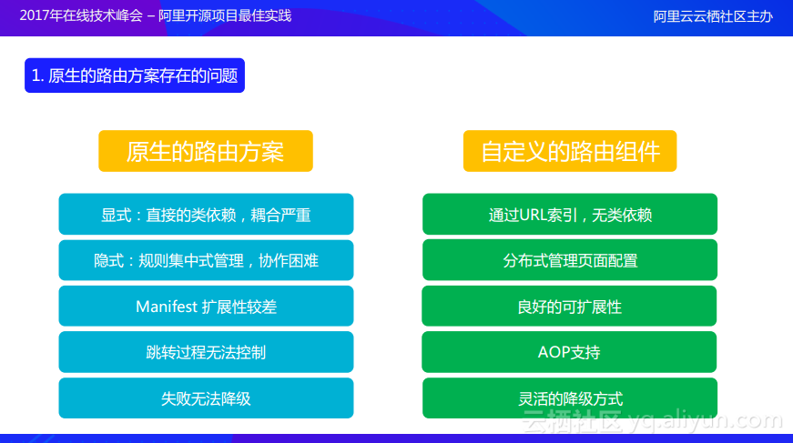  

这时候如果考虑使用自定义的路由组件就可以解决以上的一些问题，比如通过 URL 索引就可以解决类依赖的问题；通过分布式管理页面配置可以解决隐式 intent 中集中式管理 Path 的问题；自己实现整个路由过程也可以拥有良好的扩展性，还可以通过 AOP 的方式解决跳转过程无法控制的问题，与此同时也能够提供非常灵活的降级方式。  

## 为什么要用路由组件

前面提到的主要是开发与协作中的问题，而使用一款路由框架时还会涉及到其他的两个大方面：一方面是组件化，而另一方面就是 Native 和 H5 的问题。刚才所提到的主要是开发和协作中作为开发者所需要面对的问题，而一旦一款 APP 达到一定体量的时候，业务就会膨胀得比较严重，而开发团队的规模也会越来越大，这时候一般都会提出组件化的概念。**组件化就是将 APP 按照一定的功能和业务拆分成多个小组件，不同的组件由不同的开发小组来负责，这样就可以解决大型 APP 开发过程中的开发与协作的问题，将这些问题分散到小的 APP 中**。目前而言组件化已经有非常多比较成熟的方案了，而自定义路由框架也可以非常好地解决整个 APP 完成组件化之后模块之间没有耦合的问题，因为没有耦合时使用原生的路由方案肯定是不可以的。

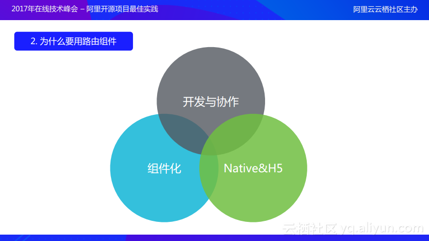  

另外一个问题就是 Native 与 H5 的问题，因为现在的 APP 很少是纯 Native 的，也很少会有纯 H5 的，一般情况下都是将两者进行结合。这时候就需要非常便捷并且统一的跳转方案，因为在 H5 中是无法使用 StartActivity() 跳转到 Native 页面的，而从 Native 跳转到 H5 页面也只能通过配置浏览器的方式实现。

## **路由框架的特点**  

为了解决以上的问题就需要实现一个自定义的路由框架，而路由框架一般都具有以下的三种特点：

1.  **分发**：把一个 URL 或者请求按照一定的规则分配给一个服务或者页面来处理，这个流程就是分发，分发是路由框架最基本的功能，当然也可以理解成为简单的跳转。
2.  **管理**：将组件和页面按照一定的规则管理起来，在分发的时候提供搜索、加载、修改等操作，这部分就是管理，也是路由框架的基础，上层功能都是建立在管理之上。
3.  **控制**：就像路由器一样，路由的过程中，会有限速、屏蔽等一些控制操作，路由框架也需要在路由的过程中，对路由操作做一些定制性的扩展，比方刚才提到的 AOP，后期的功能更新，也是围绕这个部分来做的。

今天分享的主题是 ARouter，ARouter 是阿里巴巴开源的 Android 平台中对页面、服务提供路由功能的中间件，提倡的是**简单且够用**。

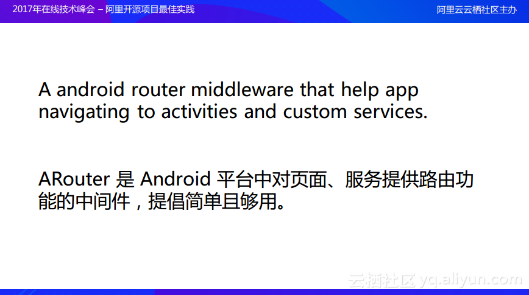  

## **ARouter 的 7 个优势**

ARouter 大致有以下 7 个优势：

  

*   优势一：直接解析 URL 路由，解析参数并赋值到对应目标字段的页面中。
*   优势二：支持多模块项目，因为现在很少有 APP 是单模块的项目，一般都是多模块单工程的，由不同的团队负责不同的模块开发，这时候支持多模块项目开发就显得尤为重要。
*   优势三：支持 InstantRun，目前很多路由框架并不支持 InstantRun，而 InstantRun 是 Google 在 AndroidStudio2.0 阿尔法版本中提供的新功能，其类似于代码的日更新，其只不过面向的是开发过程，这样做可以在开发的过程中减少开发和编译的次数，可以简单地将代码修改即时地同步到 APK 中，从而可以大规模降低开发复杂度。
*   优势四：允许自定义拦截器，ARouter 是支持拦截器的，而拦截器其实就是 AOP 的实现，可以自定义多个拦截器解决一些面向行为编程上出现的问题。
*   优势五：ARouter 可以提供 IoC 容器，IoC 其实就是控制反转，这一部分做过服务端开发的朋友可能比较了解，因为服务端开发经常用到的 Spring 框架能够提供的一个非常重要的能力就是控制反转。
*   优势六：映射关系自动注册，在页面不是很多的小型 APP 上面，自动注册并不会体现出太大优势，但是对于大型 APP 而言，可能页面数量已经达到的几十个或者数百个，在这样的情况下，自动注册就显得非常重要了，因为不可能将每一个页面都通过代码的方式进行注册。
*   优势七：灵活的降级策略，ARouter 可以提供很多种降级策略供用户自行选择，而原生的路由方案存在无法灵活降级的问题，StartActivity() 一旦失败将会抛出运营级异常。

# **二、ARouter 的技术方案**

接下来进入分享的第二部分：ARouter 的技术方案。其实如果大家看过 ARouter 的源码就会知道 ARouter 提供了两个 SDK，分别是面向两个不同的阶段。本身 API 这个 SDK 是面向运行期的，而 Compiler 这个 SDK 则是作用于编译期的，从工程上 ARouter 就是划分成了这两个 SDK。

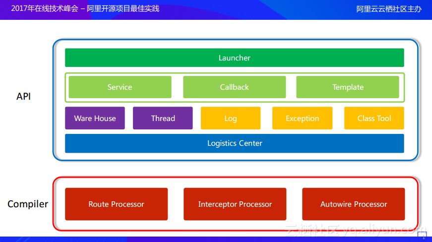  

最基础的就是 Compiler 这个 SDK，其内部有三个处理器，分别是：Route Processor，Interceptor Processor 以及 Autowire Processor，通过名字就可以看出这三个处理器分别是处理路径路由、拦截器和进行自动装配的。而 API 的 SDK 是用户在运行期使用的，这一部分主要分为四层。最上层是 Launcher 层，这一层是开发者可以直接用到的，其实所有的 API 都是在这一层中。在 Launcher 层的下一层就是 Frossard 层，从上图中可以看到 Frossard 层也是绿色的，表示这一层也是可以被外部调用的，Frossard 层其实包含了三部分，分别是：Service、Callback 和 Template，这里的 Service 概念和服务端的 Service 概念是相似的，也是在客户端的简单引申，但是却不同于 Android 组件中的 Service，这里的 Service 是 ARouter 抽象出来的概念，从本质上讲，这里的 Service 是接口，从意义上讲是将一定的功能和组件封装成接口，并对外提供能力。Template 则是模板，主要用于在编译期执行的 SDK，这个 SDK 会在编译期生成一些映射文件，而这些映射文件会按照 Template 组件中提供的模板来生成，这样按照一定的规则和约束生成映射文件也方便 Route 在运行的时候进行读取。再往下一层就完全是 SDK 的内部实现了，这一层包括了 Ware House、Thread、Log、Exception 以及 Class 工具。Ware House 主要存储了 ARouter 在运行期间加载的一些配置文件以及映射关系；而 Thread 则是提供了线程池，因为存在多个拦截器的时候以及跳转过程中都是需要异步执行的；Class 工具则是用于解决不同类型 APK 的兼容问题的。再下一层就是 Logistics Center，从名字上翻译就是物流中心，整个 SDK 的流转以及内部调用最终都会下沉到这一层，当然也会按照功能模块进行划分。

下图是按照功能组件的方式来对于整个框架进行划分的，其实 ARouter 在设计上使用了三种思想：Bootstrapping、Extensibility 以及 Simple & Enough。首先，ARouter 的组件是**自举的**（啥意思？），这个概念借鉴了编程中的自举；除此之外 ARouter 组件还具有良好的扩展性，因为像 Route 这样的东西是整个 APK 的基础组件，不可能经常变更，也不可能经常升级，所以应该具有良好的扩展性，而不需要通过经常升级来解决问题；而 ARouter 最重要的宗旨就是简单并且够用，ARouter 不会有非常复杂的使用方式和调用方式，但是功能却是非常全面的。

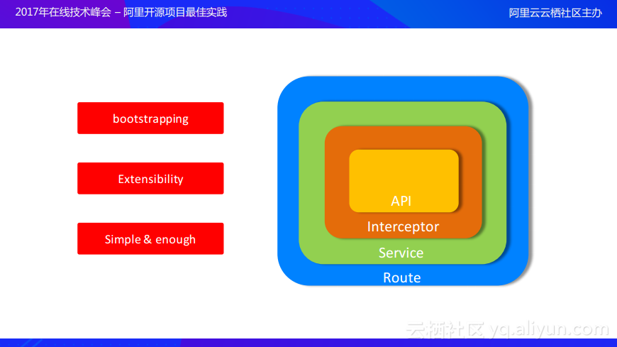  

可以从图中看出 ARouter 的最外面一层就是 Route，这一层是整个框架的基础，而这一层也应该非常稳定，几乎不会发生变更。再往上一层就是 Service 层，这一层是依赖于底层的 Route 构建起来的，也就是说 Service 层是通过 Route 才实现的功能。再往上一层就是 Interceptor 层，拦截器层则是通过 Service 的机制实现的，拦截器和 Service 都会作用于整个路由的过程中，所以说组件之间是自举的，因为 Service 和 Interceptor 在没有 Route 时是不会出现的，它们都是由 Route 层构建起来的，反过来又会作用于 Route 层，这也是 ARouter 的可扩展性的表现，后续的扩展都会基于 Service 层来实现。

接下来分享一下 ARouter 的具体解决方案，也就是 ARouter 是如何解决上述问题的。

## **页面注册：注解 & 注解处理器**

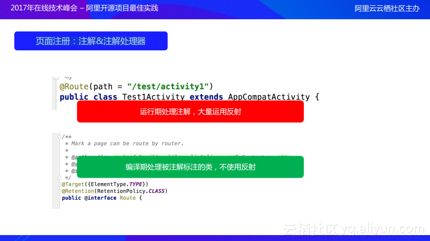  

首先，对于页面自动注册的问题，ARouter 是可以**自动注册映射关系的**（如何实现的），因为大型 APP 的页面往往很多，会存在几十甚至上百个页面，所以手动注册映射关系会非常麻烦，需要写很多重复冗余的代码，并且需要调用很多接口，而为了避免这样的麻烦，ARouter 实现了页面的自动注册。而为了解决隐式 intent 的问题和将所有配置都存储在 Manifest 中这样集中式的问题，首先想到的就是分布式管理，可以将所有的配置都放在目标页面，这样就实现了 “All In One”，就是一个页面中所有的配置都要聚合在该页面中，这样就解决上面的问题。不同的页面由不同的配置负责，这样修改也变得非常容易，而不需要将配置散落在整个 APP 四处。

其实配置相当于一个注解，所以 ARouter 采用的方案就是在每个目标页面上使用注解来标注一些参数，比方上图中的 Path 标注就是其路径，图中也可以看到对于注解的声明。使用注解时会遇到的第一个问题就是需要找到处理注解注解的时机，如果在运行期处理注解则会大量地运用反射，而这在软件开发中是非常不合适的，因为反射本身就存在性能问题，如果大量地使用反射会严重影响 APP 的用户体验，而又因为路由框架是非常基础的框架，所以大量使用反射也会使得跳转流程的用户体验非常差。所以 ARouter 最终使用的方式是==在编译期处理被注解的类，而可以做到在运行中尽可能不使用反射==。其实这一部分就是注解处理器，注解处理器其实是作用在 JVM 上的，可以通过插入一部分代码来处理被注解标注的类。

**页面注册的整个流程**如下图所示：首先通过注解处理器扫出被标注的类文件；然后按照不同种类的源文件进行分类，这是因为 ARouter 是一个框架，其能够提供的功能非常多，所以不仅仅提供了跳转功能，它也能够实现模块之间的解耦，除此之外 ARouter 还能够提供很多的功能，像刚才提到的拦截器可以实现自动注册，其实 ARouter 中的所有组件都是自动注册的（一直在说这个自动注册，注册的到底是啥东西？）；在按照不同种类的源文件进行分类完成之后，就能够按照固定的命名格式生成映射文件，这部分完成之后就意味着编译期的部分已经结束了；而最后一步的初始化其实是发生在运行期的，在运行期只需要通过固定的包名来加载映射文件就可以了，因为生成是由开发者自己完成的，所以会了解其中的规则，就可以在使用的时候利用相应的规则反向地提取出来。这就是页面自动注册的整个流程。

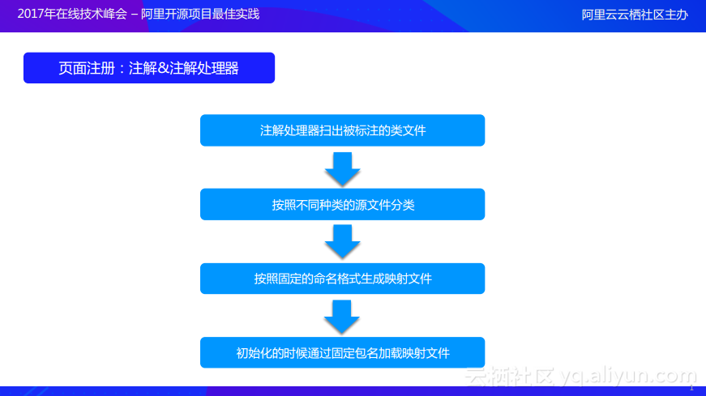  

下图是 ARouter 在编译期生成的类文件，命名规则就是工程名 + 模块名。可以看出这里面包含了 Group、Interceptor 以及 Route，所以会有很多种不同的映射文件，对于这部分而言，大家可以在 GitHub 上自行下载 Demo，运行一下看看在 Build 目录下生成的一些映射文件。

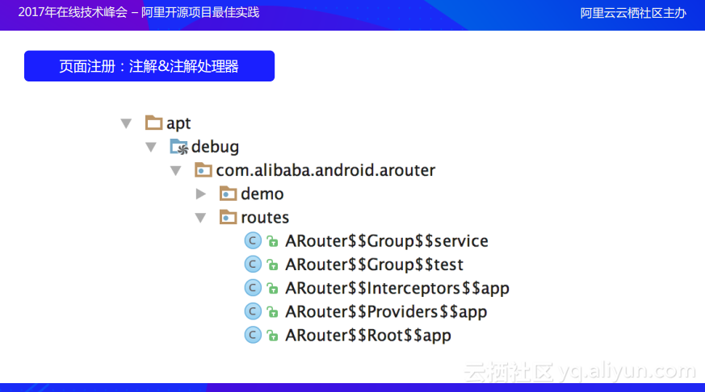  

## **加载：分组管理，按需加载**

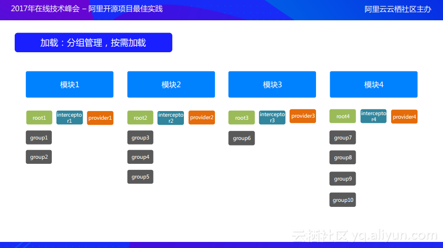  

接下来要分享的就是加载，刚才已经解决了注册的问题，这时候就到了运行期，而在运行期就需要将映射关系加载进来。而加载的时候就会遇到另一个问题，因为需要面对长久的 APP 的设计，所以不可能一次性把所有的页面都加载进来，当 APP 有一百或者几百个页面的时候，一次性将所有页面都加载到内存中本身对于内存的损耗是非常可怕的，同时对于性能的损耗也是不可忽视的。所以 ARouter 中提出了分组的概念，ARouter 允许某一个模块下有多个分组，所有的分组最终会被一个 root 节点管理。如上图中所示，假设有 4 个模块，每个模块下面都有一个 root 结点，每个 root 结点都会管理整个模块中的 group 节点，每个 group 结点则包含了该分组下的所有页面，也就是说可以按照一定的业务规则或者命名规范把一部分页面聚合成一个分组，每个分组其实就相当于路径中的第一段，而每个模块中都会有一个拦截器节点就是 Interceptor 结点，除此之外每个模块还会有控制拦截反转的 provider 结点。

下图表现的就是刚才提到的按需加载。ARouter 在初始化的时候只会一次性地加载所有的 root 结点，而不会加载任何一个 Group 结点，这样就会极大地降低初始化时加载结点的数量。因为每个模块中可能有 N 个分组，每个分组中可能有 N 个页面，如果一次性地将所有的页面全部加载进来，那么整个复杂度可能不只是 O(N^2)，但是每个模块都只加载其根节点，从算法的角度考虑可能就是复杂度为 O(N) 的方案，也就是有多少个模块就只需要加载多少个结点。下图中的三个圈中体现的就是 ARouter 初始化时加载的状况。那么什么时候加载分组结点呢？其实就是当某一个分组下的某一个页面第一次被访问的时候，整个分组的全部页面都会被加载进去，这就是 ARouter 的按需加载。其实在整个 APP 运行的周期中，并不是所有的页面都需要被访问到，可能只有 20% 的页面能够被访问到，所以这时候使用按需加载的策略就显得非常重要了，这样就会减轻很大的内存压力。

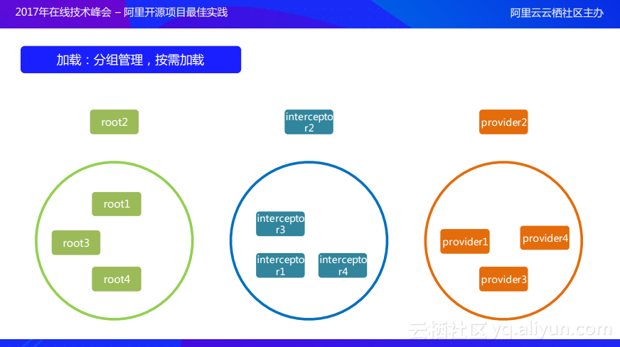  

## **拦截器**

分享完分组管理和按需加载之后，接下来分享一下关于拦截器的内容。原生的路由方案中存在的问题就是其无法在页面跳转的过程中插入一些自定义逻辑，而拦截器就是 ARouter 中提出的针对 AOP 思想的实现。

  

那么 ARouter 是如何实现拦截器的呢？其实 ARouter 对于拦截器的实现方式与刚才提到的路径注册方式是一样的，只是使用了不同的注解而已。如上图中所显示的，存在拦截器 1 至 5，但是这 5 个拦截器并不是会都生效。在上图中可以看出从 A 页面到 B 页面的跳转流程中只有三个拦截器生效了，首先跳转到第一个拦截器，如果跳转的条件符合那么只需要在拦截器进行一些自定义的操作，等拦截器处理完成之后会放行给下一个拦截器，以此类推当经过了所有的拦截器之后才会结束整个跳转的流程，如果每个拦截器都放过的话才能够跳转到最终的页面。这里因为是自动注册的，所以可以将不同功能的拦截器放在不同功能的模块中，只有模块被打包到整个项目中，因为自动注册机制所以拦截器就会生效，如果不将这些拦截器放到模块并打包到项目中，那就不会生效，这样就不用去做很多注册与反注册的工作。如图所示的拦截器 2 就是没有被打包进来的，所以就不会生效，如果修改打包参数，将拦截器 2 打包到 APP 中就会生效，这部分就是对于拦截器的实现。

直接讲拦截器可能不容易让大家理解，那么就用这样形象的比喻来解释一下，拦截器就是像是一个汉堡，汉堡中夹心的无论是生菜、牛肉还是芝士都像拦截器一样，当在做汉堡时就相当于在做 APK，打包了哪些模块就相当于在汉堡中放了哪些层，在吃的时候就会把这一层都咬掉，但是汉堡的每一层都有可能是芝士、牛肉或者铁片，当遇到某一层是铁片的时候就无法咬下去了，也就是被拦截住了。同样的拦截器就是需要当条件符合的时候才能让跳转流程继续执行，同样像汉堡一样，如果使用了太多的拦截器最终会导致汉堡变成了 “巨无霸”，所有的拦截器会在任意两次跳转之间生效，声明了大量的拦截器会影响整个跳转流程的性能，拦截器的更详细内容会在第三部分的最佳实践中继续为大家介绍。

## **InstantRun 兼容**

接下来分享一下 ARouter 如何实现对于 InstantRun 的兼容。市面上的框架一般对于这一部分的兼容都是缺失的，对于 InstantRun 的兼容从技术上看并不是非常难以实现的，在实现时只需仔细阅读 InstantRun 的源码就可以了。在实现对于 InstantRun 的兼容时是存在如下图所示的四种情况的，当 AndroidSDK 版本大于 21 的时候，会存在 SplitAPK 的特性支持的，会允许将一个 APK 切分成多个小 APK，当然其实这并不是 APK 的切分，而实际上是 Dex 的切分，也就每个依赖都会打包成小的 Dex 放在 APP + 包名的目录下的，这与传统情况下是不同的。

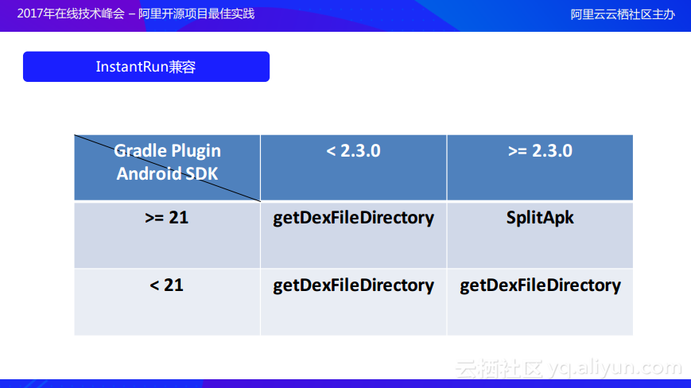  

所以只需要参照这张表格并根据 AndroidSDK 和 GradlePlugin 的版本就可以解决了。如果 Android 版本超过 21 并且 Gradle 插件的版本超过 2.3.0，这时候就会支持 SplitAPK，从中可以获取所有 Dex 的位置，进而实现映射关系的加载。除此之外的三种情况都不支持 SplitAPK 的，这种情况下就需要看一下 InstantRun 的源码，就会发现在源码中原本应该存放业务代码的 Dex 的地方替换成了 InstantRun 的 SDK 的 Dex，而是将业务代码打包在一个 ZIP 中，此时只需要通过运行时的反射拿到 InstantRun 的 SDK 的一个类的 Path，而在获取 Path 时是存在静态方法的 getDexFileDirectory，只需要执行一下就可以知道当前版本将真实的 Dex 放在什么地方，通过对于这两种方式的兼容就可以实现对于 InstantRun 的兼容。

## **依赖注入的实现**  

接下来分享依赖注入的实现，这一部分是路由框架在进行大规模组件之间解耦时比较重要的一点。其实依赖注入就是对于控制反转思想的实现，这部分服务端使用的比较多，客户端可能使用不是非常多。ARouter 对于依赖注入的实现主要分成如下图所示的两个部分。

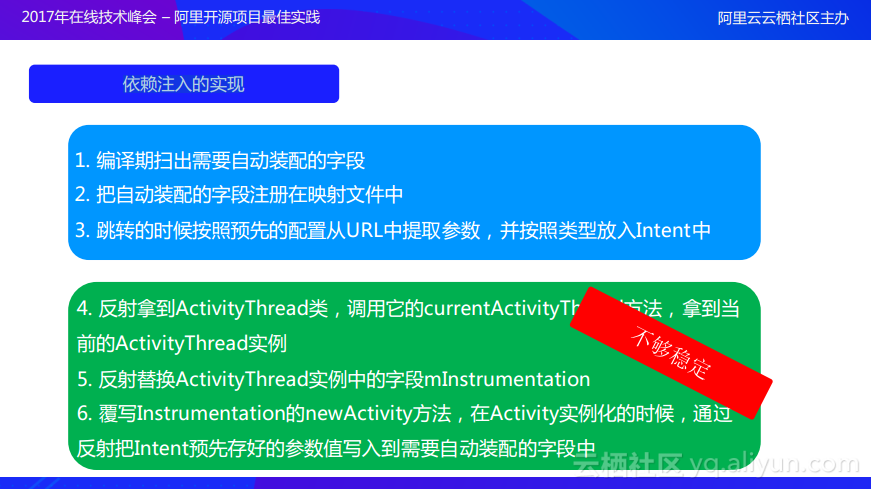  

首先编译期扫出需要自动装配的字段，之前对于自动装配也已经提到了，就是在 Compiler 中的处理器 Autowire Processor，自动体现在将字段自动地进行赋值而不需要用户手动干预，在扫除自动转配的字段之后，需要把自动装配的字段注册在映射文件中，然后跳转的时候按照预先的配置从 URL 中提取参数，并按照类型放入 Intent 中，这样就解决了如何通过 URL 跳转到 Native 页面，并将 URL 中的参数传递进来。上图中绿色的部分则是在运行期的早期实现，这部分通过反射拿到 ActivityThread 类，调用它的 currentActivityThread 方法，拿到当前的 ActivityThread 实例，之后通过反射替换 ActivityThread 实例中的字段 mInstrumentation，并覆写 Instrumentation 的 newActivity 方法，在 Activity 实例化的时候，通过反射把 Intent 预先存好的参数值写入到需要自动装配的字段中。这是早期的做法，这种做法有一个非常严重的问题就是会不够稳定，路由框架作为整个 APP 的基础如果不足够稳定，那么造成的影响是非常严重的。用户如果使用自动装配这样的功能的时候失败的话，问题就非常严重了，可能导致用户的代码出现 NPE，出现这样的问题就不简单是用户体验的问题了，有可能导致 APP 崩溃。

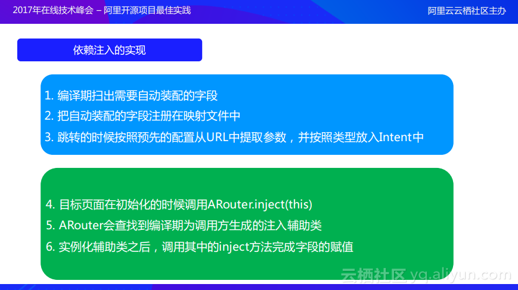  

所以目前的实现方式则换成了上图的方式，在编译期基本没有变化，但是在运行期进行了调整。在运行期会在目标页面进行初始化的时候调用 ARouter.inject(this)，将自身的实例传递进去。ARouter 会查找到编译期为调用方生成的注入辅助类，而这里提到的注入辅助类就是比方在编译期是扫描到一个 A 页面需要进行自动装配，此时就会为 A 页面生成一个注入辅助类，在运行的时候调用注入辅助类的方法对于字段进行赋值，这其实就是模拟用户对于字段进行赋值，虽然看起来可能麻烦一些，但是可以保证注入的稳定性，而且最终体现的效果是相同的，用户不需要写重复冗余的代码，而且在实现时并不需要在每一个目标页面上都调用这一行代码，完全可以将这些代码放在基类中，而在实例化辅助类之后，调用其中的 inject 方法完成对于字段的赋值。

下图所示的代码就是在编译期生成的注入辅助类，这部分实际上就是模仿了用户的写法，通过一定的工具和规则生成这样的代码，免去用户手写重复和冗余的代码，在用户的角度来看也是自动注入，这一部分就是依赖注入的具体实现，大家也可以参考 GitHub 上的源码来研究具体实现。

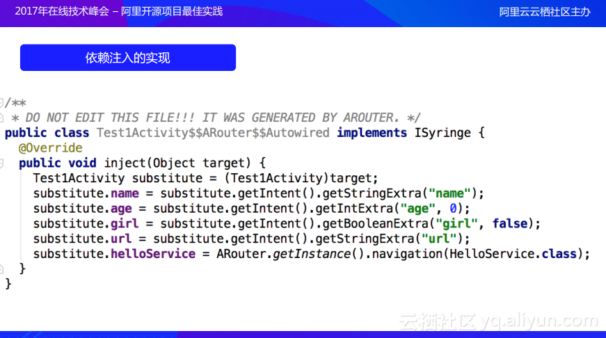  

# **三、最佳实践**

接下来就进入到了本次分享的重点：ARouter 的最佳实践，在这部分将分享如何在项目中运用 ARouter，如何让 ARouter 帮助我们加快开发的速度。

**页面跳转**

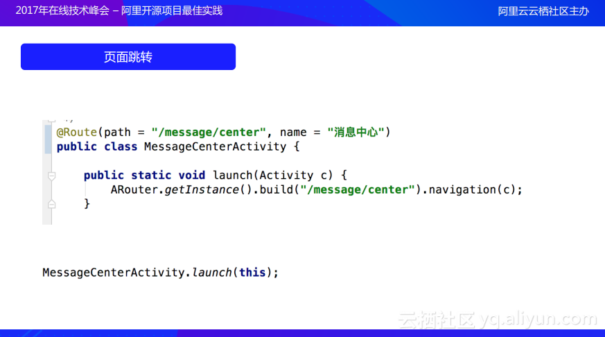  

分享的第一个最佳实践就是页面跳转。大家可能提出这样的问题：如果我们在使用 ARouter 这样的路由框架的时候，将每一个目标页面都通过一定的规则注解上如图所示的 Path，在任何场景下都通过 Path 跳转，会不会出现**在写代码的时候完全不知道要跳转到哪里，也不知道当前页面会从哪些页面跳进来的问题。其实这样的问题在编程实现的时候对于开发者而言是非常难受的，这也是无耦合所带来的代价**，但是其实也可以简单地通过类似于语法糖的写法解决这样的问题。其实在进行了组件化之后，在写代码时也不是所有的页面都需要 Route 进行跳转的，但是在最终实现上却希望所有的页面都通过 Route 进行管理。为了实现这样的目标，其实只需要在目标页面上放一个静态的 launch（这里的 launch 可以换成任何一个你喜欢的方法名字），然后在这个 launch 方法中调用 Route 跳转到当前页面，这样在无法耦合到当前类的时候可以直接使用 ARouter 的 API 并通过 Path 的方式跳转进来。在可以依赖到这个类的场景下，可以直接调用这个类的静态方法跳转到这个页面，这样就解决了我们在日常开发中同一个模块之间的跳转还需要使用 Route 的非常尴尬的情况，而且这样也可以最终实现所有的页面都被 Route 管理，但是看起来并非所有的跳转都需要通过 Route，这样至少在开发中是非常舒服的。

> 这里提出了一个启动页面的解决方案：
>
> 1. 如果在同一个模块下，可以编写一个静态方法来启动页面，但是这个静态方法的内部实现还是 ARouter 实现的；
> 2. 不同模块之间存在着低耦合，直接使用 ARouter 跳转；
>
> 但是静态方法本身存在着继承缺陷，即无法分清一个静态方法是属于父类还是子类，而且没有办法复写这样会导致本想启动子类却启动父类这种问题。所以这种静态 launch 方法包含 ARouter 的方案，虽然比较简洁、简单，但是我认为并不适合无偏差实践。

## **从外部导航到内部页面**  

接下来要分享的也是路由框架的一个非常重要的功能：从外部导航到内部页面。可以看到下图中的两个截图分别是使用了自定义的 Scheme，另一张图则是使用了原生的 HTTPS 的 Scheme。

  

对于这些 URL 进行逐段分析，在 Scheme 后面的就是域名，再之后就是 test/activity1，这部分就是真实的页面上所标注的注解，也就是需要将这一行 URL 映射到标注了 test/activity1 的页面上。当然我们可以想到之前使用隐式 intent 也可以做的很好，但是隐式 intent 却存在着很多的局限性，而且无法将参数也注入进去。可以看到 URL 中 “？” 之后就是参数，通过 ARouter 这样的路由框架不但可以跳转到目标页面也可以将后面的一些 Get 参数注入到目标页面的对应字段中。

接下来具体分享这部分是如何实现的，首先需要在 APP 的 Manifest 声明一个 activity，但是是这个 activity 不需要页面，只需要注册一个 intent-filter 就可以了。这个 intent-filter 就是用于监听刚刚生成的 Scheme 的，而且 Scheme 可以换成任何想要的，比如 HTTP 或者 HTTPS，也可以使用自定义 Scheme。为什么说这里是一个最佳实践呢，其实通常情况下使用隐式 intent 的时候，每一个从外面跳转进来的页面都需要注册上 intent-filter，每个页面都需要设置 export=true，也就是需要让每一个页面都可以导出，在外部可以访问到。但是这样做会带来非常严重的安全风险，就像是一个房子有十个门还是只有一个门，看门的成本是不同的。而现在使用的这种场景只需要对外暴露出一个 activity，然后在这个 activity 中注册一个 intent-filter，这样之后所有的外部路由请求都会经过这唯一的门，然后在这个 activity 中获取到 URL 并将其交给 ARouter，剩下的就由路由框架做分发了。

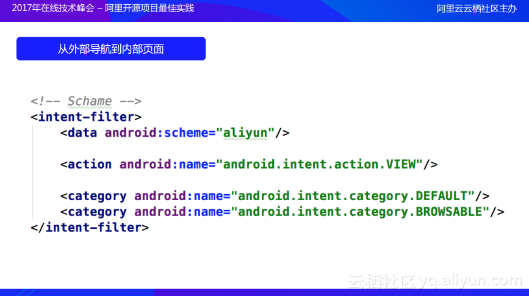  

下面这张图就是基类，其实每个 APP 都有自己的基类，比方像沉浸式状态栏等统一的配置都会做成基类。为了实现自动装配的功能，所以需要将这一行代码加入基类的 onCreate 中，然后传一个 this。

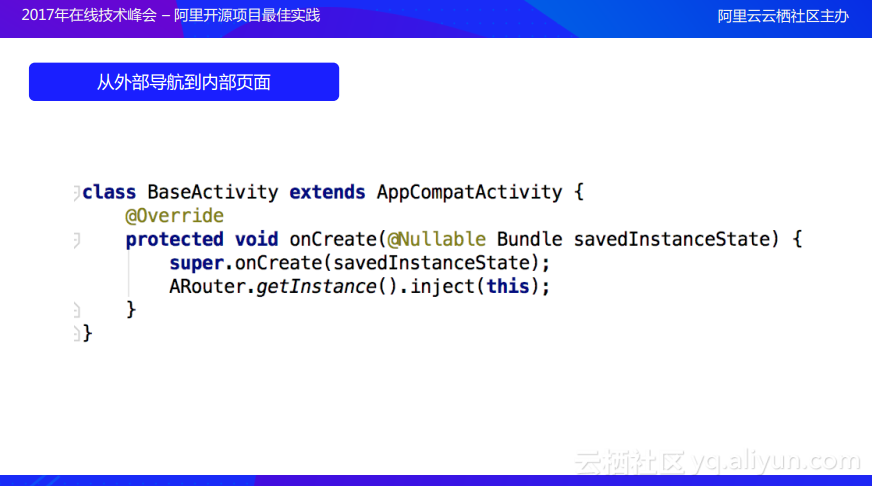  

只需要在基类中加入这一行代码，下图就是目标页面，刚刚我们在浏览器中访问之前的 URL 的时候最终会导入到这个目标页面中，而这个页面首先在上面标注好了目标地址，下面也可以看到为什么可以将每一个 Get 参数解析到对应的字段中。在实现时需要声明出需要进行解析的字段，其名字会映射到外面的 URL 的参数上，然后需要将其标注好 Autowired 这样的注解，Autowired 注解中有一个属性就是 name，相当于别名，标注了别名之后 ARouter 会自动提取别名所对应的参数。可以看到只要继承自刚才看到的基类，就不需要在每一个页面都重复地写 inject 方法了，这样就可以实现无论通过什么样的途径跳转进来都可以拿到对应的参数，完全不需要使用 getIntent 这样冗余的代码，可以简化开发，这就是使用路由框架所带来的好处之一。对于这一部分而言，GitHub 上也有更加详细的文档供大家查看学习。

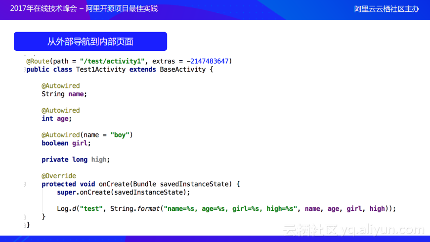  

## **处理登录逻辑 : 拦截器的运用**

以上分享的就是如何从外部的 URL 跳转到内部的页面并解析参数，接下来分享如何处理登录逻辑。登录逻辑是每个 APP 都会有的功能，有的 APP 是只要用户进入就需要登录的，也有的 APP 是对于一些页面需要登录，另外一些页面也不需要登录，而对于后面的这种 APP 而言，在每个页面中都需要判断是否用户登录了则是非常不合适的做法，这也是最开始考虑到系统原生的路由方案不支持在系统中插入自定义跳转逻辑的比较坑的状况。所以假如使用 ARouter，就能够使用 ARouter 所提供的拦截器的机制解决登录问题。使用 ARouter 解决登录逻辑只需要实现登录拦截器就可以了，不需要在每一个页面都判断是不是需要登录，而只需要在登录拦截器中进行判断。登录拦截器会作用在所有的跳转之间，假设从来源页面跳转到下面的 A、B、C 和 D 这四个目标页面，可以看到图中绿色的是不需要登录页面的，可以直接跳转进入，也就是如绿色的箭头展示的一样是可以直接放行的；而对于 C 页面而言，则属于需要登录的页面，这时就会被拦截器拦截并直接导航到登录页，在用户完成登录或者取消登录后，通过回调或者广播等形式回到拦截器，然后根据从拦截器中得到的结果判断可以直接往下跳转还是终止本次跳转流程，每一个拦截器中都有一个回调，这个回调可以终止本次路由过程也允许直接放行。这就是典型的面向切面编程，当然登录拦截器只是诸多拦截器之一，可以声明 N 个拦截器可以实现登录的判断以及用户权限的判断等，这些就交给开发者自由发挥了。谈到这部分还会存在一个问题就是如何才能在一个地方判断出所有的页面哪些需要登录，哪些不需要登录，如果这时候保存两个非常大的列表，一个用于保存需要登录的页面，另一个保存不需要登录的页面，将会是非常不合适的了。

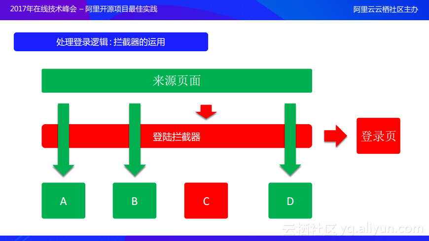  

## **标识目标页面信息 : 配置 extra 参数**

所以接下来分享一下如何配置页面的参数，刚刚提到了 “All In One”，这是什么意思呢？其实就是希望所有页面中的配置都能够浓缩到这一个页面中，也就是高内聚低耦合的思想，不希望页面的配置逃出页面，配置到像 Manifest 的其他地方。像在拦截器中配置哪些地方需要登录哪些不需要登录的话就违背了刚才提出的这个原则，ARouter 框架的设计思想就是希望所有的属性标注在自己的页面中。可以看一下页面中标注的页面注解，如下图所示可注解中在 IDE 的提示中有 extras 这样的参数，大家看到这个数字应该非常熟悉，这个数字就是 int 的最小值，而为什么 extras 这个参数是 int 呢？其实是因为 int 本身在 Java 中是由 4 个字节实现的，每个字节是 8 位，所以一共是 32 个标志位，去除掉符号位还剩下 31 个，也就是说转化成为二进制之后，一个 int 中可以配置 31 个 1 或者 0，而每一个 0 或者 1 都可以表示一项配置，这时候只需要从这 31 个位置中随便挑选出一个表示是否需要登录就可以了，只要将标志位置为 1，就可以在刚才声明的拦截器中获取到这个标志位，通过位运算的方式判断目标页面是否需要登录，这样是简单并且高效的，因为位运算的速度要远远高于字符串比对以及其他的方式的，而且一个 int 值就可以提供 31 个开关。目前而言没有一个目标页面需要配置 30 多个属性，所以使用 int 是足够的，而开发者只需要实现一个简单的位运算的工具类就可以提取出二进制 int 中的每一位，并对其中每一个值进行判断。

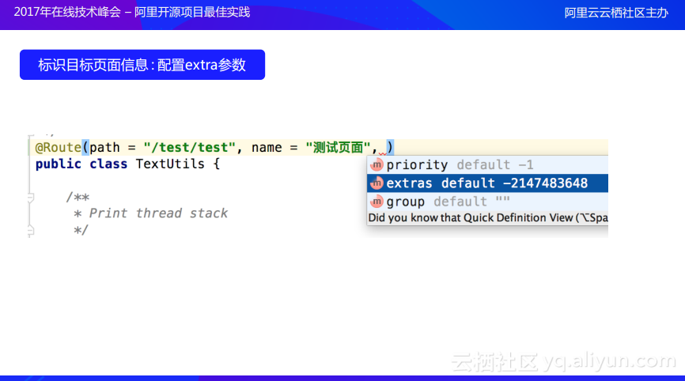  

如下图所示，一个 int 中有 31 个开关，可以针对每一位进行定制。这部分在 ARouter 中是没有任何限制的，ARouter 在拦截器中会把目标页面的信息封装一个类，这个类就包含了目标页面注解上标识的各种信息。对于按需加载中的各种信息并不是通过反射来做的，所以性能还是很高的。

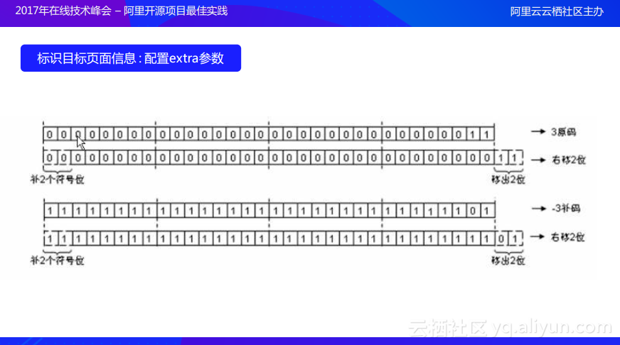  

## **模块间通信解耦 ：控制反转**

除此之外，另一个比较重要的问题就是如何实现模块间的通信解耦。实现组件化的时候希望对于不同的组件进行分别打包，而且模块之间应该不存在任何依赖，可以看出下图中左边的图中的四个组件完全是耦合依赖的，这样就导致四个组件之间根本无法解耦，所以打包的时候也必须一起打包，否则就会出现 No Class Found 的问题，所以现在的实现是如下图右边所示的，通过 IoC 容器，也就是控制反转容器将耦合解开。为什么这样能将耦合解开呢？其实是因为这样就可以让各个组件之间不产生直接依赖，而是通过 IoC 控制反转容器拿到对方的实例，这样我们在写代码的时候就不会存在直接依赖的问题。而 ARouter 本身也是一个 IoC 容器，它在实现这部分功能的时候用到的一个元素就是 Service，如果大家做过服务端开发的话就会对于 Service 很熟悉了，Service 就是将一部分功能和组件封装起来成为接口，以接口的形式对外提供能力，所以在这部分就可以将每个功能作为一个 Service，而 Service 的实现就是具体的业务功能，这部分也需要通过 IoC 容器进行获取。这样整个的流程将通过用户的直接依赖转化成通过控制反转容器依赖的这种形式。

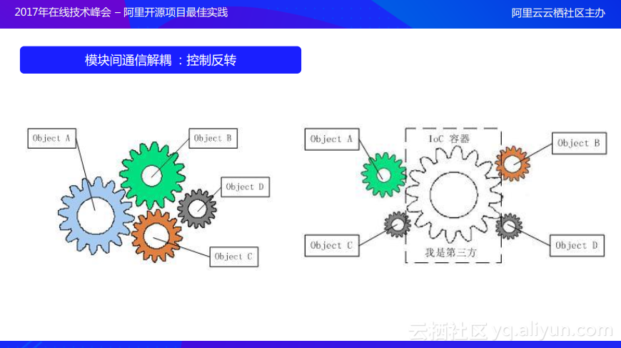  

接下来分享一下在工程中如何将控制反转的流程运用起来。首先需要声明一个服务，而服务在表现上其实就是一个接口。只需要声明如下图中的 HelloService 控制反转，使其实现了 IProvider，IProvider 就是最开始提到的 ARouter 架构中的 Template 中提供的很多模板中的一项，IProvider 用于约束服务，其中只有一个方法就是 init()，也就是实例化服务时需要调用的初始化方法。服务本身也是按需加载的，所以不会一次性全部加载。在下图的例子中 HelloService 中只有一个自己的方法就是 sayHello()，图中的下半部分就是表示如何实现这个服务的。其实可以随便声明一个类让他实现这个服务，因为实现 HelloService 的同时也需要实现 IProvider 中的 init()，可以看到 init() 方法中使用到了上下文也就是 Context，除此之外就是实现了 sayHello() 方法，之后将服务的实现使用 Route 注解标注起来，当然这个注解可以按照个人喜好书写，但是还是需要进行标注。之前提到的了 ARouter 中的所有组件是自举的并且是自动注册的，而服务这部分就是自动注册的。其实通过注解可以看出，ARouter 在处理注解在服务和基础路由上的方案是基本一致的，所以也存在分组加载和按需加载的情况，而服务是全局单例的，只有在第一次使用到的时候才会被初始化，而服务的初始化就是调用了自己的 init() 方法，这里需要注意一下的就是拦截器使用的是 IInterceptor 这样的接口，而 IInterceptor 接口中也只有一个方法就是 init()。拦截器和服务不一样，所有的服务不会因为在一个生命周期中都用到，只有 20% 的服务可能在一次生命周期中使用到，所以如果一次性都初始化对于内存也会造成很大的压力，而拦截器则是不同的，因为拦截器会在任意一次跳转中生效，所以拦截器的初始化是在整个 SDK 启动的时候进行的，这部分也是服务和拦截器的区别。

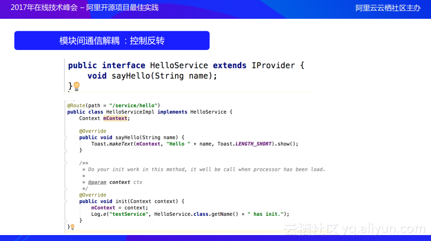  

下面这张图则主要介绍了如何使用服务，也就是将服务交给 IoC 容器管理和如何去调用服务。其实这里和获取跳转之间的 intent 参数里面的方法是一样的，只需要声明一个字段，这个字段就是刚刚使用的服务，然后通过 Autowired 的注解进行标注，这样只需要在基类中写刚才的那句 ARouter.getInstance().inject() 方法，这些服务就会在运行的时候自动注入进来，完全不需要用户进行手动操作。可以看到 Autowired 上面是有几个属性的，首先会有一个 Name，这个 Name 和 intent 参数中的 Name 是一致的，这个 Name 就是别名，一旦标识了 Name，ARouter 在内部实现的时候会通过依赖查找的方式来对这个服务进行搜索。而依赖查找和依赖注入就是对于控制反转的两种实现。依赖查找是用户主动触发的，是通过 IoC 容器进行查找的，并不是由用户实例化这个类的，所以控制权还在 IoC 容器中。而不标注 Name 的这种形式 SDK 会通过直接的方式进行获取，其实这也是依赖查找，但是从用户的角度来看这就是依赖注入了，因为在 SDK 的具体实现上实际是通过依赖查找实现的，后面也会有例子进行介绍。

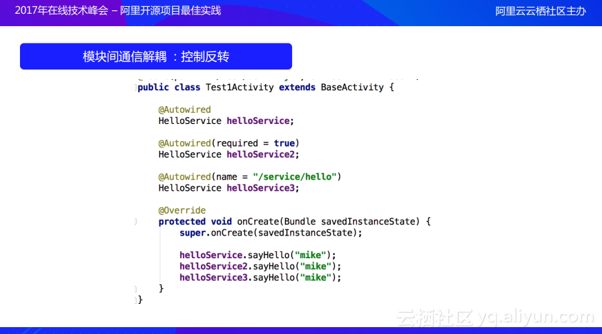  

这里还需要谈一下为什么在一些场景下还需要标注 Name。因为在 Java 中接口是可以被多实现的，也就是一个接口有多个具体的实现方式，通过 ByType 的方式可能难以拿到想要的多种实现，这时候就可以通过 Name 的方式获取真实想要的服务。所以其实大多数情况是不需要标识 Name 的，如果有多实现的时候就需要标注上别名了。可以看到在上图的例子中的 onCreate() 方法中可以直接调用这个接口的方法，这样就完成了模块间的解耦，因为完全没有依赖到服务的具体实现，而服务的具体实现的控制权完全掌握在 IoC 容器的 Route 层。

下图就具体地解释了刚才提到的两种情况也就是 ByName 和 ByType 的依赖查找的方式，而上一张图中则是依赖注入。依赖查找是应用在不希望在类初始化的时候就把一些功能注入进来的场景以及在某些页面上才会触发这样的功能的情况下，那么只需要在使用到的时候去获取这个服务就可以了。而这种情况就是通过用户的主动依赖查找来获取服务，其实就是图中所示的 ByName 和 ByType 的依赖查找的方式。

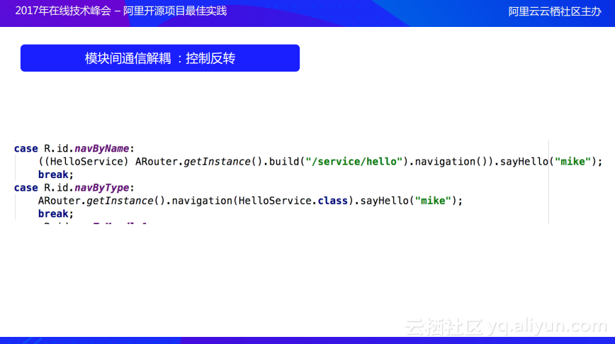  

## **解决运行期动态修改路由的问题**

然后需要分享的就是如何解决运行期动态修改路由的问题。如下图所示，这种情况下只需要实现一个服务就可以了，从下图也可以看出为什么说 ARouter 的组件都是自举的，因为服务的查找还是需要依赖于底层路由的查找的，所以服务功能的实现是由路由层作为基础的，并且服务是用来解决动态修改路由的问题的，所以只需要实现一个服务。其实这个 PathReplaceService 就是 ARouter 提供的一个服务，是在 ARouter 的 Frossard 层提供的服务，其实就是一个接口，只需要将其实现并标注上就可以，因为有自动注册的机制，所以在 APP 启动的时候就会注册到 ARouter 框架上，这样之后框架在跳转的时候就会跳转到这个服务，而如果没有实现，框架就无法调用，自然也就不会有这部分功能。这样就实现了 ARouter 框架的非常好的可扩展性，后期 ARouter 框架不需要更改其底层基础，只需要声明更多的服务，由用户主动实现，并在最后运行期的时候通过自动注册的方式将这些服务加载到框架中。

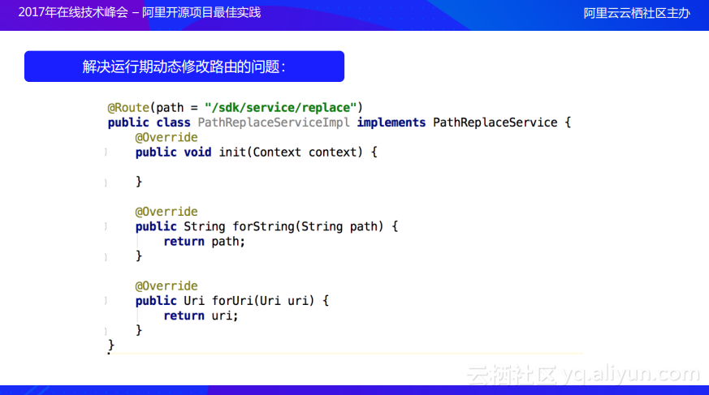  

而对于 PathReplaceService 这个服务而言，可以看到它有三个方法，首先 init() 用于初始化，下面的两个方法分别是 forString() 以及 forUri()。forUri() 是从外部通过 URI 的形式跳转到页面的时候会使用到的一个方法，参数中的 URI 就是原始的 URI，如果你有需要的话可以在这个方法中按照自己的一些逻辑和规则进行替换，然后直接 return 回来就可以了。这里 return 之后就会交给 ARouter 的框架继续处理，这时候就实现了对于目标页面的重定向。而 forString() 则是在正常情况下通过 ARouter 的 API 写代码的时候会使用到的方法。以上的这两个方法可以使用同样的逻辑来做，实现运行期动态地修改路由。

## **解决降级问题**  

接下来分享的就是关于解决降级的问题。其实这部分的方法和刚才的方法是异曲同工的，只需要实现另一个服务就好了，ARouter 在发展中会越来越多地为大家提供各种服务让用户自己进行具体的实现，当然如果不实现也不会有这部分功能，如果 APP 实现了降级服务，那么随便标识一个注解就可以了，当然这个注解是由用户决定的，可以选择自己喜欢的规则，可以将这些服务都放在不同的分组下或者都放在同一个分组下。而现在相当于放在了 SDK 这个分组下面，对于这一部分只需要实现 onLost() 方法就可以了，ARouter 如果发现在目标跳转的情况下失败了，就会回调这个 onLost() 方法。onLost() 方法的第二个参数 postCard 翻译过来就是明信片，这里面就包含了本次跳转中所有的内容，通过拿到这些内容就可以实现自己的降级方案。下图中所列举的例子是通过跳转到第三方的 H5 的错误页面来解决的，因为 APP 不能够重复发布，但是 H5 是可以重复发布的，所以可以通过 H5 的方式解决降级问题，把去向的目标页面作为目标的参数传递到 H5 中。

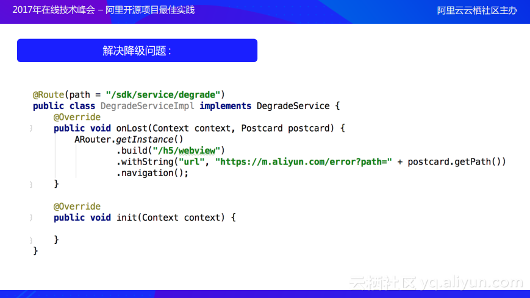  

# **四、未来的开发计划**

最后想分享的就是 ARouter 的未来开发计划。未来 ARouter 会支持插件化并且支持生成映射关系文档，因为插件化是现在很多大型 APP 中会使用的技术方案，很多的 Dex 和功能是动态地下发到 APP 中的，而在这种情况下，是无法找到所有的 Dex 文件的，也就是对于没有加载过的 Dex 而言，里面的映射关系是跳转不过去的，所以一旦 Dex 文件位置发生变动，常规的方案是无法找到 Dex 的，也不能实现映射文件初始化，这一部分会在后面的版本中进行支持。因为像手淘和 360 等很多插件化的方案之后也许会开源，这样可能越来越多的 APP 会支持插件化，如果 ARouter 作为一个技术组件如果不能支持插件化的话，就会造成麻烦。

  

未来的另一个发展方向就是生成映射关系文档，目前因为在多个模块下需要支持生成映射关系文档，而且多个模块之间是没有耦合的，如果没有生成映射关系文档的功能，可能就不知道一个功能模块中有哪些页面是可以被路由进去的，所以后续的版本会对这部分进行简化并添加版本控制解决多版本的兼容性问题，也将可以帮助用户生成方便快捷的文档。这两部分就是未来 ARouter 需要重点进行支持的。

ARouter 是从去年的年底时开始开源的，到现在大概经过了两三个月，目前已经有一千多个 Star，已经有一部分开发者在关注了，而我们也有一个沟通与交流的群，大家如果感兴趣的话可以直接到 GitHub 上找到 ARouter 的源码来分析具体的实现，如果大家有更好的思路和方案也可以贡献代码，和我们一起更好地完善 ARouter。当然一个技术选型肯定是简单又好用的，并且应该是长期进行维护保证足够稳定的，ARouter 也具有这样的特点，欢迎大家选用并贡献代码。

