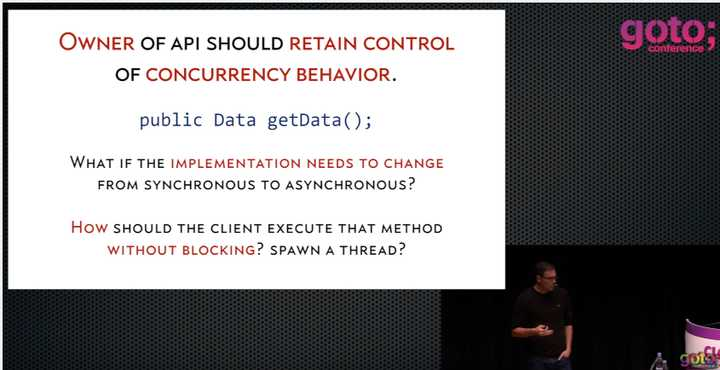
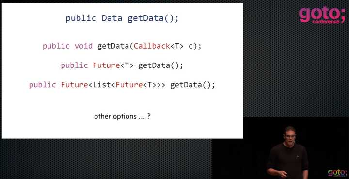

在16年，我还在一名大三学生学生的时候就听说了 RxJava 的大名，然后是18年自己独立开发 App 也是用到了 RxAndroid + Okhttp 封装网络请求，但很遗憾直到如今（21年）我都对 RxJava 都了解的很少，可谓一脸懵逼。随着经验的积累看待问题的角度和知识面都有了提高，所以趁这个机会简单了解一下 RxJava 的核心概念。


# 是什么

说到 RxJava 就不得不提到大名鼎鼎的 [ReactiveX](http://reactivex.io/intro.html), 官方定义如下

> ReactiveX 是一个使用可观察序列来编写异步、基于事件的程序的库。

而 RxJava 是 ReactiveX 在 JVM 平台上的一个实现。简单来讲 ReactiveX 的实现目标是用同步编程的方式实现异步编程。


# 解决了什么问题

关于这个问题的解答推荐阅读这篇文章 [一篇不太一样的RxJava介绍](https://juejin.cn/post/6844903518915002375)。

==总的来说 ReactiveX (后面简称 RX) lib 是让你和写同步代码一样的方式异步处理数据集的，这个数据集这也就是定义里面所说的：可观察序列。而 RX 的出现正是使用 `IEnumerable` (在 Java 中为 `Iterable`) 推导出来的==


我们先来看一下 Netfilx 最初为什么使用或者说创造RxJava：



他举得例子也是很常见。如果一切都是同步的。那么没有问题，你调用这个 getData() 就会得到 Data。但是如果服务器端这是异步的呢？ 你的下文还需要这个Data怎么办？



他举了很多例子。 比如我们传统常见的 CallBack， Future。 但是如果一旦数据逻辑变得复杂，就很难办容易造成 Callback Hell（**回调地狱**）。 比如图中所示的 Future<List<Future<T>>>。

对比同步方法，在异步方法中作为接收方我们是**被动**的，我们没办法和同步方法一样立即获得数据。所以异步方法没有办法完成链式调用（参见： 啥是回调地狱）。而且在异步方法中只有生产方自己才知道他有没有完成生产，所以他在完成生产后通知我们，并把结果交给我们这是一种**直观**的解决方案。而Java或者其他高级语言没有提供这一方案。我们才自定义CallBack来实现回调。


ps: 啥是回调地狱

简单举例：三个异步方法，getA(Callback c)、getB(Callback c)、getC(Callback c) 要依次执行，代码你咋写：

```java
getA(new Callback() {
    public void onNotify(User user) {
        getB(new Callback() {
             public void onNotify(User user) {
                 getC(new Callback() {
                     public void onNotify(User user) {
                     }
                 })
             }
        })
    }
})
```

这就是 Callback Hell（**回调地狱**）这才三个方法，要是更多呢？不堪想象。

# 如何解决的

借用 [一篇不太一样的RxJava介绍](https://juejin.cn/post/6844903518915002375) 一文章例子

代理、封装、传递。


从中可见 Observable 是一组异步数据的集合，和 Collection 一样他可以包含 0 至 n 个数据，当我们在处理Collection出现异常时（比如NullPointerException），我们的程序会崩溃，不会有接下来的处理。所以我们的Observable在收到onError之后，也不会再有数据推送给我们。


# 优点

1. 首先，这种推送数据的方式才是我们**直观**的，异步操作方法，


# 应该如何选择

数据量比较的且对数据操作次数非常多（需要调用多个处理方法），要不就不要滥用

1. 他复杂，各种变换函数，学习成本很高，只看注释很难搞懂各种变换的真是目的、各自的差异等。