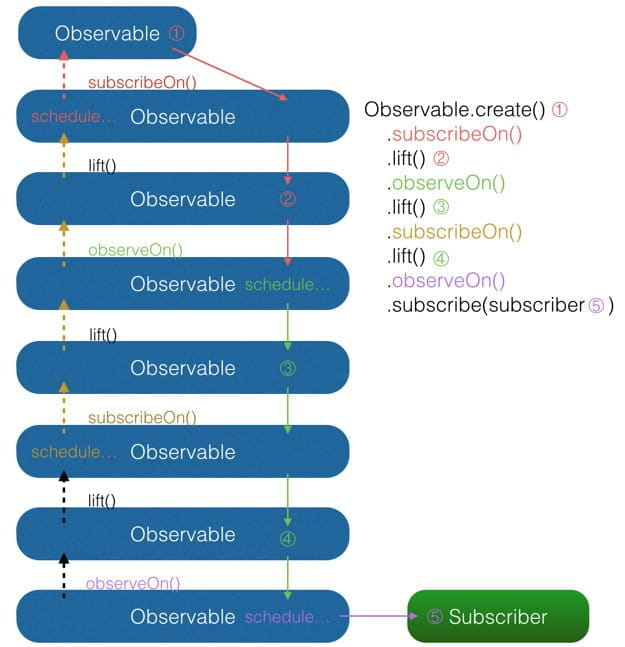

> 本文由 [简悦 SimpRead](http://ksria.com/simpread/) 转码， 原文地址 [gank.io](https://gank.io/post/560e15be2dca930e00da1083?from=timeline&isappinstalled=0#toc_1)

### 前言

我从去年开始使用 RxJava ，到现在一年多了。今年加入了 Flipboard 后，看到 Flipboard 的 Android 项目也在使用 RxJava ，并且使用的场景越来越多 。而最近这几个月，我也发现国内越来越多的人开始提及 RxJava 。有人说『RxJava 真是太好用了』，有人说『RxJava 真是太难用了』，另外更多的人表示：我真的百度了也谷歌了，但我还是想问： RxJava 到底是什么？

鉴于 RxJava 目前这种既火爆又神秘的现状，而我又在一年的使用过程中对 RxJava 有了一些理解，我决定写下这篇文章来对 RxJava 做一个相对详细的、针对 Android 开发者的介绍。

这篇文章的目的有两个：

1. 给对 RxJava 感兴趣的人一些入门的指引

2. 给正在使用 RxJava 但仍然心存疑惑的人一些更深入的解析

在正文开始之前的最后，放上 `GitHub` 链接和引入依赖的 `gradle` 代码：

Github：  
https://github.com/ReactiveX/RxJava   https://github.com/ReactiveX/RxAndroid  
引入依赖：  
`compile 'io.reactivex:rxjava:1.0.14'`  
`compile 'io.reactivex:rxandroid:1.0.1'`  
（版本号是文章发布时的最新稳定版）

### RxJava 到底是什么

一个词：**异步**。

RxJava 在 GitHub 主页上的自我介绍是 "a library for composing asynchronous and event-based programs using observable sequences for the Java VM"（一个在 Java VM 上使用可观测的序列来组成异步的、基于事件的程序的库）。这就是 RxJava ，概括得非常精准。

然而，对于初学者来说，这太难看懂了。因为它是一个『总结』，而初学者更需要一个『引言』。

其实， RxJava 的本质可以压缩为异步这一个词。说到根上，它就是一个实现异步操作的库，而别的定语都是基于这之上的。

### RxJava 好在哪

换句话说，『同样是做异步，为什么人们用它，而不用现成的 AsyncTask / Handler / XXX / ... ？』

一个词：**简洁**。

异步操作很关键的一点是程序的简洁性，因为在调度过程比较复杂的情况下，异步代码经常会既难写也难被读懂。 Android 创造的 `AsyncTask` 和`Handler` ，其实都是为了让异步代码更加简洁。RxJava 的优势也是简洁，但它的简洁的与众不同之处在于，**随着程序逻辑变得越来越复杂，它依然能够保持简洁。**


假设有这样一个需求：界面上有一个自定义的视图 `imageCollectorView` ，它的作用是显示多张图片，并能使用 `addImage(Bitmap)` 方法来任意增加显示的图片。现在需要程序将一个给出的目录数组 `File[] folders` 中每个目录下的 png 图片都加载出来并显示在 `imageCollectorView` 中。需要注意的是，由于读取图片的这一过程较为耗时，需要放在后台执行，而图片的显示则必须在 UI 线程执行。常用的实现方式有多种，我这里贴出其中一种： 

```
new Thread() {
    @Override
    public void run() {
        super.run();
        for (File folder : folders) {
            File[] files = folder.listFiles();
            for (File file : files) {
                if (file.getName().endsWith(".png")) {
                    final Bitmap bitmap = getBitmapFromFile(file);
                    getActivity().runOnUiThread(new Runnable() {
                        @Override
                        public void run() {
                            imageCollectorView.addImage(bitmap);
                        }
                    });
                }
            }
        }
    }
}.start();
```

而如果使用 RxJava ，实现方式是这样的：

```
Observable.from(folders)
    .flatMap(new Func1<File, Observable<File>>() {
        @Override
        public Observable<File> call(File file) {
            return Observable.from(file.listFiles());
        }
    })
    .filter(new Func1<File, Boolean>() {
        @Override
        public Boolean call(File file) {
            return file.getName().endsWith(".png");
        }
    })
    .map(new Func1<File, Bitmap>() {
        @Override
        public Bitmap call(File file) {
            return getBitmapFromFile(file);
        }
    })
    .subscribeOn(Schedulers.io())
    .observeOn(AndroidSchedulers.mainThread())
    .subscribe(new Action1<Bitmap>() {
        @Override
        public void call(Bitmap bitmap) {
            imageCollectorView.addImage(bitmap);
        }
    });
```

那位说话了：『你这代码明明变多了啊！简洁个毛啊！』大兄弟你消消气，我说的是逻辑的简洁，不是单纯的代码量少（逻辑简洁才是提升读写代码速度的必杀技对不？）。观察一下你会发现， RxJava 的这个实现，是一条从上到下的链式调用，没有任何嵌套，这在逻辑的简洁性上是具有优势的。当需求变得复杂时，这种优势将更加明显（试想如果还要求只选取前 10 张图片，常规方式要怎么办？如果有更多这样那样的要求呢？再试想，在这一大堆需求实现完两个月之后需要改功能，当你翻回这里看到自己当初写下的那一片迷之缩进，你能保证自己将迅速看懂，而不是对着代码重新捋一遍思路？）。

另外，如果你的 IDE 是 Android Studio  ，其实每次打开某个 Java 文件的时候，你会看到被自动 Lambda 化的预览，这将让你更加清晰地看到程序逻辑：

```
Observable.from(folders)
    .flatMap((Func1) (folder) -> { Observable.from(file.listFiles()) })
    .filter((Func1) (file) -> { file.getName().endsWith(".png") })
    .map((Func1) (file) -> { getBitmapFromFile(file) })
    .subscribeOn(Schedulers.io())
    .observeOn(AndroidSchedulers.mainThread())
    .subscribe((Action1) (bitmap) -> { imageCollectorView.addImage(bitmap) });
```

> 如果你习惯使用 Retrolambda ，你也可以直接把代码写成上面这种简洁的形式。而如果你看到这里还不知道什么是 Retrolambda ，我不建议你现在就去学习它。原因有两点：1. Lambda 是把双刃剑，它让你的代码简洁的同时，降低了代码的可读性，因此同时学习 RxJava 和 Retrolambda 可能会让你忽略 RxJava 的一些技术细节；2. Retrolambda 是 Java 6/7 对 Lambda 表达式的非官方兼容方案，它的向后兼容性和稳定性是无法保障的，因此对于企业项目，使用 Retrolambda 是有风险的。所以，与很多 RxJava 的推广者不同，我并不推荐在学习 RxJava 的同时一起学习 Retrolambda。事实上，我个人虽然很欣赏 Retrolambda，但我从来不用它。

在 Flipboard 的 Android 代码中，有一段逻辑非常复杂，包含了多次内存操作、本地文件操作和网络操作，对象分分合合，线程间相互配合相互等待，一会儿排成人字，一会儿排成一字。如果使用常规的方法来实现，肯定是要写得欲仙欲死，然而在使用 RxJava 的情况下，依然只是一条链式调用就完成了。它很长，但很清晰。

所以， RxJava 好在哪？就好在简洁，好在那把什么复杂逻辑都能穿成一条线的简洁。

### API 介绍和原理简析

这个我就做不到一个词说明了…… 因为这一节的主要内容就是一步步地说明 RxJava 到底怎样做到了异步，怎样做到了简洁。

#### 1. 概念：扩展的观察者模式

RxJava 的异步实现，是通过一种扩展的观察者模式来实现的。

##### 观察者模式

先简述一下观察者模式，已经熟悉的可以跳过这一段。 

观察者模式面向的需求是：A 对象（观察者）对 B 对象（被观察者）的某种变化高度敏感，需要在 B 变化的一瞬间做出反应。举个例子，新闻里喜闻乐见的警察抓小偷，警察需要在小偷伸手作案的时候实施抓捕。在这个例子里，警察是观察者，小偷是被观察者，警察需要时刻盯着小偷的一举一动，才能保证不会漏过任何瞬间。程序的观察者模式和这种真正的『观察』略有不同，观察者不需要时刻盯着被观察者（例如 A 不需要每过 2ms 就检查一次 B 的状态），而是采用**注册** (Register) **或者称为**订阅 **(Subscribe)** 的方式，告诉被观察者：我需要你的某某状态，你要在它变化的时候通知我。 Android 开发中一个比较典型的例子是点击监听器 `OnClickListener` 。对设置 `OnClickListener` 来说， `View` 是被观察者， `OnClickListener` 是观察者，二者通过 `setOnClickListener()` 方法达成订阅关系。订阅之后用户点击按钮的瞬间，Android Framework 就会将点击事件发送给已经注册的 `OnClickListener` 。采取这样被动的观察方式，既省去了反复检索状态的资源消耗，也能够得到最高的反馈速度。当然，这也得益于我们可以随意定制自己程序中的观察者和被观察者，而警察叔叔明显无法要求小偷『你在作案的时候务必通知我』。

OnClickListener 的模式大致如下图：


如图所示，通过 `setOnClickListener()` 方法，`Button` 持有 `OnClickListener` 的引用（这一过程没有在图上画出）；当用户点击时，`Button` 自动调用 `OnClickListener` 的 `onClick()` 方法。另外，如果把这张图中的概念抽象出来（`Button` -> 被观察者、`OnClickListener` -> 观察者、`setOnClickListener()` -> 订阅，`onClick()` -> 事件），就由专用的观察者模式（例如只用于监听控件点击）转变成了通用的观察者模式。如下图：


而 RxJava 作为一个工具库，使用的就是通用形式的观察者模式。

##### RxJava 的观察者模式

RxJava 有四个基本概念：`Observable` (可观察者，即被观察者)、 `Observer` (观察者)、 `subscribe` (订阅)、事件。`Observable` 和 `Observer` 通过 `subscribe()` 方法实现订阅关系，从而 `Observable` 可以在需要的时候发出事件来通知 `Observer`。

与传统观察者模式不同， RxJava 的事件回调方法除了普通事件 `onNext()` （相当于 `onClick()` / `onEvent()`）之外，还定义了两个特殊的事件：`onCompleted()` 和 `onError()`。

*   `onCompleted()`: 事件队列完结。RxJava 不仅把每个事件单独处理，还会把它们看做一个队列。RxJava 规定，当不会再有新的 `onNext()` 发出时，需要触发 `onCompleted()` 方法作为标志。
*   `onError()`: 事件队列异常。在事件处理过程中出异常时，`onError()` 会被触发，同时队列自动终止，不允许再有事件发出。
*   在一个正确运行的事件序列中, `onCompleted()` 和 `onError()` 有且只有一个，并且是事件序列中的最后一个。需要注意的是，`onCompleted()` 和 `onError()` 二者也是互斥的，即在队列中调用了其中一个，就不应该再调用另一个。

RxJava 的观察者模式大致如下图：


#### 2. 基本实现

基于以上的概念， RxJava 的基本实现主要有三点：

##### 1) 创建 Observer

Observer 即观察者，它决定事件触发的时候将有怎样的行为。 RxJava 中的 `Observer` 接口的实现方式：

```
Observer<String> observer = new Observer<String>() {
    @Override
    public void onNext(String s) {
        Log.d(tag, "Item: " + s);
    }

    @Override
    public void onCompleted() {
        Log.d(tag, "Completed!");
    }

    @Override
    public void onError(Throwable e) {
        Log.d(tag, "Error!");
    }
};
```

除了 `Observer` 接口之外，RxJava 还内置了一个实现了 `Observer` 的抽象类：`Subscriber`。 `Subscriber` 对 `Observer` 接口进行了一些扩展，但他们的基本使用方式是完全一样的：

```
Subscriber<String> subscriber = new Subscriber<String>() {
    @Override
    public void onNext(String s) {
        Log.d(tag, "Item: " + s);
    }

    @Override
    public void onCompleted() {
        Log.d(tag, "Completed!");
    }

    @Override
    public void onError(Throwable e) {
        Log.d(tag, "Error!");
    }
};
```

不仅基本使用方式一样，实质上，在 RxJava 的 subscribe 过程中，`Observer` 也总是会先被转换成一个 `Subscriber` 再使用。所以如果你只想使用基本功能，选择 `Observer` 和 `Subscriber` 是完全一样的。它们的区别对于使用者来说主要有两点：

1.  `onStart()`: 这是 `Subscriber` 增加的方法。它会在 subscribe 刚开始，而事件还未发送之前被调用，可以用于做一些准备工作，例如数据的清零或重置。这是一个可选方法，默认情况下它的实现为空。需要注意的是，如果对准备工作的线程有要求（例如弹出一个显示进度的对话框，这必须在主线程执行）， `onStart()` 就不适用了，因为它总是在 subscribe 所发生的线程被调用，而不能指定线程。要在指定的线程来做准备工作，可以使用 `doOnSubscribe()` 方法，具体可以在后面的文中看到。
2.  `unsubscribe()`: 这是 `Subscriber` 所实现的另一个接口 `Subscription` 的方法，用于取消订阅。在这个方法被调用后，`Subscriber` 将不再接收事件。一般在这个方法调用前，可以使用 `isUnsubscribed()` 先判断一下状态。 `unsubscribe()` 这个方法很重要，因为在 `subscribe()` 之后， `Observable` 会持有 `Subscriber` 的引用，这个引用如果不能及时被释放，将有内存泄露的风险。所以最好保持一个原则：要在不再使用的时候尽快在合适的地方（例如 `onPause()` `onStop()` 等方法中）调用 `unsubscribe()` 来解除引用关系，以避免内存泄露的发生。

##### 2) 创建 Observable

Observable 即被观察者，它决定什么时候触发事件以及触发怎样的事件。 RxJava 使用 `create()` 方法来创建一个 Observable ，并为它定义事件触发规则：

```
Observable observable = Observable.create(new Observable.OnSubscribe<String>() {
    @Override
    public void call(Subscriber<? super String> subscriber) {
        subscriber.onNext("Hello");
        subscriber.onNext("Hi");
        subscriber.onNext("Aloha");
        subscriber.onCompleted();
    }
});
```

可以看到，这里传入了一个 `OnSubscribe` 对象作为参数。`OnSubscribe` 会被存储在返回的 `Observable` 对象中，它的作用相当于一个计划表，当 `Observable` 被订阅的时候，`OnSubscribe` 的 `call()` 方法会自动被调用，事件序列就会依照设定依次触发（对于上面的代码，就是观察者`Subscriber` 将会被调用三次 `onNext()` 和一次 `onCompleted()`）。这样，由被观察者调用了观察者的回调方法，就实现了由被观察者向观察者的事件传递，即观察者模式。

> 这个例子很简单：事件的内容是字符串，而不是一些复杂的对象；事件的内容是已经定好了的，而不像有的观察者模式一样是待确定的（例如网络请求的结果在请求返回之前是未知的）；所有事件在一瞬间被全部发送出去，而不是夹杂一些确定或不确定的时间间隔或者经过某种触发器来触发的。总之，这个例子看起来毫无实用价值。但这是为了便于说明，实质上只要你想，各种各样的事件发送规则你都可以自己来写。至于具体怎么做，后面都会讲到，但现在不行。只有把基础原理先说明白了，上层的运用才能更容易说清楚。

`create()` 方法是 RxJava 最基本的创造事件序列的方法。基于这个方法， RxJava 还提供了一些方法用来快捷创建事件队列，例如：

*   `just(T...)`: 将传入的参数依次发送出来。

```
Observable observable = Observable.just("Hello", "Hi", "Aloha");
// 将会依次调用：
// onNext("Hello");
// onNext("Hi");
// onNext("Aloha");
// onCompleted();
```

*   `from(T[])` / `from(Iterable<? extends T>)` : 将传入的数组或 `Iterable` 拆分成具体对象后，依次发送出来。

```
String[] words = {"Hello", "Hi", "Aloha"};
Observable observable = Observable.from(words);
// 将会依次调用：
// onNext("Hello");
// onNext("Hi");
// onNext("Aloha");
// onCompleted();
```

上面 `just(T...)` 的例子和 `from(T[])` 的例子，都和之前的 `create(OnSubscribe)` 的例子是等价的。

##### 3) Subscribe (订阅)

创建了 `Observable` 和 `Observer` 之后，再用 `subscribe()` 方法将它们联结起来，整条链子就可以工作了。代码形式很简单：

```
observable.subscribe(observer);
// 或者：
observable.subscribe(subscriber);
```

> 有人可能会注意到， `subscribe()` 这个方法有点怪：它看起来是『`observalbe` 订阅了 `observer` / `subscriber`』而不是『`observer` / `subscriber` 订阅了 `observalbe`』，这看起来就像『杂志订阅了读者』一样颠倒了对象关系。这让人读起来有点别扭，不过如果把 API 设计成 `observer.subscribe(observable)` / `subscriber.subscribe(observable)` ，虽然更加符合思维逻辑，但对流式 API 的设计就造成影响了，比较起来明显是得不偿失的。

`Observable.subscribe(Subscriber)` 的内部实现是这样的（仅核心代码）：

```
// 注意：这不是 subscribe() 的源码，而是将源码中与性能、兼容性、扩展性有关的代码剔除后的核心代码。
// 如果需要看源码，可以去 RxJava 的 GitHub 仓库下载。
public Subscription subscribe(Subscriber subscriber) {
    subscriber.onStart();
    onSubscribe.call(subscriber);
    return subscriber;
}
```

可以看到，`subscriber()` 做了 3 件事：

1.  调用 `Subscriber.onStart()` 。这个方法在前面已经介绍过，是一个可选的准备方法。
2.  调用 `Observable` 中的 `OnSubscribe.call(Subscriber)` 。在这里，事件发送的逻辑开始运行。从这也可以看出，在 RxJava 中， `Observable` 并不是在创建的时候就立即开始发送事件，而是在它被订阅的时候，即当 `subscribe()` 方法执行的时候。
3.  将传入的 `Subscriber` 作为 `Subscription` 返回。这是为了方便 `unsubscribe()`.

整个过程中对象间的关系如下图：


或者可以看动图：


除了 `subscribe(Observer)` 和 `subscribe(Subscriber)` ，`subscribe()` 还支持不完整定义的回调，RxJava 会自动根据定义创建出 `Subscriber` 。形式如下：

```
Action1<String> onNextAction = new Action1<String>() {
    // onNext()
    @Override
    public void call(String s) {
        Log.d(tag, s);
    }
};
Action1<Throwable> onErrorAction = new Action1<Throwable>() {
    // onError()
    @Override
    public void call(Throwable throwable) {
        // Error handling
    }
};
Action0 onCompletedAction = new Action0() {
    // onCompleted()
    @Override
    public void call() {
        Log.d(tag, "completed");
    }
};

// 自动创建 Subscriber ，并使用 onNextAction 来定义 onNext()
observable.subscribe(onNextAction);
// 自动创建 Subscriber ，并使用 onNextAction 和 onErrorAction 来定义 onNext() 和 onError()
observable.subscribe(onNextAction, onErrorAction);
// 自动创建 Subscriber ，并使用 onNextAction、 onErrorAction 和 onCompletedAction 来定义 onNext()、 onError() 和 onCompleted()
observable.subscribe(onNextAction, onErrorAction, onCompletedAction);
```

简单解释一下这段代码中出现的 `Action1` 和 `Action0`。 `Action0` 是 RxJava 的一个接口，它只有一个方法 `call()`，这个方法是无参无返回值的；由于 `onCompleted()` 方法也是无参无返回值的，因此 `Action0` 可以被当成一个包装对象，将 `onCompleted()` 的内容打包起来将自己作为一个参数传入 `subscribe()` 以实现不完整定义的回调。这样其实也可以看做将 `onCompleted()`方法作为参数传进了 `subscribe()`，相当于其他某些语言中的『闭包』。 `Action1` 也是一个接口，它同样只有一个方法 `call(T param)`，这个方法也无返回值，但有一个参数；与 `Action0` 同理，由于 `onNext(T obj)` 和 `onError(Throwable error)` 也是单参数无返回值的，因此 `Action1` 可以将 `onNext(obj)` 和 `onError(error)` 打包起来传入 `subscribe()` 以实现不完整定义的回调。事实上，虽然 `Action0` 和 `Action1` 在 API 中使用最广泛，但 RxJava 是提供了多个 `ActionX` 形式的接口 (例如 `Action2`, `Action3`) 的，它们可以被用以包装不同的无返回值的方法。

> 注：正如前面所提到的，`Observer` 和 `Subscriber` 具有相同的角色，而且 `Observer` 在 `subscribe()` 过程中最终会被转换成 `Subscriber` 对象，因此，从这里开始，后面的描述我将用 `Subscriber` 来代替 `Observer` ，这样更加严谨。

##### 4) 场景示例

下面举两个例子：

> 为了把原理用更清晰的方式表述出来，本文中挑选的都是功能尽可能简单的例子，以至于有些示例代码看起来会有『画蛇添足』『明明不用 RxJava 可以更简便地解决问题』的感觉。当你看到这种情况，不要觉得是因为 RxJava 太啰嗦，而是因为在过早的时候举出真实场景的例子并不利于原理的解析，因此我刻意挑选了简单的情景。

###### a. 打印字符串数组

将字符串数组 `names` 中的所有字符串依次打印出来：

```
String[] names = ...;
Observable.from(names)
    .subscribe(new Action1<String>() {
        @Override
        public void call(String name) {
            Log.d(tag, name);
        }
    });
```

###### b. 由 id 取得图片并显示

由指定的一个 drawable 文件 id `drawableRes` 取得图片，并显示在 `ImageView` 中，并在出现异常的时候打印 Toast 报错：

```
int drawableRes = ...;
ImageView imageView = ...;
Observable.create(new OnSubscribe<Drawable>() {
    @Override
    public void call(Subscriber<? super Drawable> subscriber) {
        Drawable drawable = getTheme().getDrawable(drawableRes));
        subscriber.onNext(drawable);
        subscriber.onCompleted();
    }
}).subscribe(new Observer<Drawable>() {
    @Override
    public void onNext(Drawable drawable) {
        imageView.setImageDrawable(drawable);
    }

    @Override
    public void onCompleted() {
    }
 
    @Override
    public void onError(Throwable e) {
        Toast.makeText(activity, "Error!", Toast.LENGTH_SHORT).show();
    }
});
```

正如上面两个例子这样，创建出 `Observable` 和 `Subscriber` ，再用 `subscribe()` 将它们串起来，一次 RxJava 的基本使用就完成了。非常简单。

然而，


在 RxJava 的默认规则中，事件的发出和消费都是在同一个线程的。也就是说，如果只用上面的方法，实现出来的只是一个同步的观察者模式。观察者模式本身的目的就是『后台处理，前台回调』的异步机制，因此异步对于 RxJava 是至关重要的。而要实现异步，则需要用到 RxJava 的另一个概念： `Scheduler` 。

#### 3. 线程控制 —— Scheduler (一)

在不指定线程的情况下， RxJava 遵循的是线程不变的原则，即：在哪个线程调用 `subscribe()`，就在哪个线程生产事件；在哪个线程生产事件，就在哪个线程消费事件。如果需要切换线程，就需要用到 `Scheduler` （调度器）。

##### 1) Scheduler 的 API (一)

在 RxJava 中，`Scheduler` ——调度器，相当于线程控制器，RxJava 通过它来指定每一段代码应该运行在什么样的线程。RxJava 已经内置了几个 `Scheduler` ，它们已经适合大多数的使用场景：

*   `Schedulers.immediate()`: 直接在当前线程运行，相当于不指定线程。这是默认的 `Scheduler`。
*   `Schedulers.newThread()`: 总是启用新线程，并在新线程执行操作。
*   `Schedulers.io()`: I/O 操作（读写文件、读写数据库、网络信息交互等）所使用的 `Scheduler`。行为模式和 `newThread()` 差不多，区别在于 `io()` 的内部实现是是用一个无数量上限的线程池，可以重用空闲的线程，因此多数情况下 `io()` 比 `newThread()` 更有效率。不要把计算工作放在 `io()` 中，可以避免创建不必要的线程。
*   `Schedulers.computation()`: 计算所使用的 `Scheduler`。这个计算指的是 CPU 密集型计算，即不会被 I/O 等操作限制性能的操作，例如图形的计算。这个 `Scheduler` 使用的固定的线程池，大小为 CPU 核数。不要把 I/O 操作放在 `computation()` 中，否则 I/O 操作的等待时间会浪费 CPU。
*   另外， Android 还有一个专用的 `AndroidSchedulers.mainThread()`，它指定的操作将在 Android 主线程运行。

有了这几个 `Scheduler` ，就可以使用 `subscribeOn()` 和 `observeOn()` 两个方法来对线程进行控制了。 * `subscribeOn()`: 指定 `subscribe()` 所发生的线程，即 `Observable.OnSubscribe` 被激活时所处的线程。或者叫做事件产生的线程。 * `observeOn()`: 指定 `Subscriber` 所运行在的线程。或者叫做事件消费的线程。

文字叙述总归难理解，上代码：

```
Observable.just(1, 2, 3, 4)
    .subscribeOn(Schedulers.io()) // 指定 subscribe() 发生在 IO 线程
    .observeOn(AndroidSchedulers.mainThread()) // 指定 Subscriber 的回调发生在主线程
    .subscribe(new Action1<Integer>() {
        @Override
        public void call(Integer number) {
            Log.d(tag, "number:" + number);
        }
    });
```

上面这段代码中，由于 `subscribeOn(Schedulers.io())` 的指定，被创建的事件的内容 `1`、`2`、`3`、`4` 将会在 IO 线程发出；而由于 `observeOn(AndroidScheculers.mainThread()`) 的指定，因此 `subscriber` 数字的打印将发生在主线程 。事实上，这种在 `subscribe()` 之前写上两句 `subscribeOn(Scheduler.io())`和 `observeOn(AndroidSchedulers.mainThread())` 的使用方式非常常见，它适用于多数的 『后台线程取数据，主线程显示』的程序策略。

而前面提到的由图片 id 取得图片并显示的例子，如果也加上这两句：

```
int drawableRes = ...;
ImageView imageView = ...;
Observable.create(new OnSubscribe<Drawable>() {
    @Override
    public void call(Subscriber<? super Drawable> subscriber) {
        Drawable drawable = getTheme().getDrawable(drawableRes));
        subscriber.onNext(drawable);
        subscriber.onCompleted();
    }
})
.subscribeOn(Schedulers.io()) // 指定 subscribe() 发生在 IO 线程
.observeOn(AndroidSchedulers.mainThread()) // 指定 Subscriber 的回调发生在主线程
.subscribe(new Observer<Drawable>() {
    @Override
    public void onNext(Drawable drawable) {
        imageView.setImageDrawable(drawable);
    }

    @Override
    public void onCompleted() {
    }
 
    @Override
    public void onError(Throwable e) {
        Toast.makeText(activity, "Error!", Toast.LENGTH_SHORT).show();
    }
});
```

那么，加载图片将会发生在 IO 线程，而设置图片则被设定在了主线程。这就意味着，即使加载图片耗费了几十甚至几百毫秒的时间，也不会造成丝毫界面的卡顿。

##### 2) Scheduler 的原理 (一)

RxJava 的 Scheduler API 很方便，也很神奇（加了一句话就把线程切换了，怎么做到的？而且 `subscribe()` 不是最外层直接调用的方法吗，它竟然也能被指定线程？）。然而 Scheduler 的原理需要放在后面讲，因为它的原理是以下一节《变换》的原理作为基础的。

好吧这一节其实我屁也没说，只是为了让你安心，让你知道我不是忘了讲原理，而是把它放在了更合适的地方。

#### 4. 变换

终于要到牛逼的地方了，不管你激动不激动，反正我是激动了。

RxJava 提供了对事件序列进行变换的支持，这是它的核心功能之一，也是大多数人说『RxJava 真是太好用了』的最大原因。**所谓变换，就是将事件序列中的对象或整个序列进行加工处理，转换成不同的事件或事件序列。**概念说着总是模糊难懂的，来看 API。

##### 1) API

首先看一个 `map()` 的例子：

```
Observable.just("images/logo.png") // 输入类型 String
    .map(new Func1<String, Bitmap>() {
        @Override
        public Bitmap call(String filePath) { // 参数类型 String
            return getBitmapFromPath(filePath); // 返回类型 Bitmap
        }
    })
    .subscribe(new Action1<Bitmap>() {
        @Override
        public void call(Bitmap bitmap) { // 参数类型 Bitmap
            showBitmap(bitmap);
        }
    });
```

这里出现了一个叫做 `Func1` 的类。它和 `Action1` 非常相似，也是 RxJava 的一个接口，用于包装含有一个参数的方法。 `Func1` 和 `Action` 的区别在于， `Func1` 包装的是有返回值的方法。另外，和 `ActionX` 一样， `FuncX` 也有多个，用于不同参数个数的方法。`FuncX` 和 `ActionX` 的区别在 `FuncX` 包装的是有返回值的方法。

可以看到，`map()` 方法将参数中的 `String` 对象转换成一个 `Bitmap` 对象后返回，而在经过 `map()` 方法后，事件的参数类型也由 `String` 转为了 `Bitmap`。这种直接变换对象并返回的，是最常见的也最容易理解的变换。不过 RxJava 的变换远不止这样，它不仅可以针对事件对象，还可以针对整个事件队列，这使得 RxJava 变得非常灵活。我列举几个常用的变换：

*   `map()`: 事件对象的直接变换，具体功能上面已经介绍过。它是 RxJava 最常用的变换。   `map()` 的示意图： 
  
*   `flatMap()`: 这是一个很有用但**非常难理解**的变换，因此我决定花多些篇幅来介绍它。 首先假设这么一种需求：假设有一个数据结构『学生』，现在需要打印出一组学生的名字。实现方式很简单：
  

```
Student[] students = ...;
Subscriber<String> subscriber = new Subscriber<String>() {
    @Override
    public void onNext(String name) {
        Log.d(tag, name);
    }
    ...
};
Observable.from(students)
    .map(new Func1<Student, String>() {
        @Override
        public String call(Student student) {
            return student.getName();
        }
    })
    .subscribe(subscriber);
```

  很简单。那么再假设：如果要打印出每个学生所需要修的所有课程的名称呢？（需求的区别在于，每个学生只有一个名字，但却有多个课程。）首先可以这样实现：

```
Student[] students = ...;
Subscriber<Student> subscriber = new Subscriber<Student>() {
    @Override
    public void onNext(Student student) {
        List<Course> courses = student.getCourses();
        for (int i = 0; i < courses.size(); i++) {
            Course course = courses.get(i);
            Log.d(tag, course.getName());
        }
    }
    ...
};
Observable.from(students)
    .subscribe(subscriber);
```

  依然很简单。那么如果我不想在 `Subscriber` 中使用 for 循环，而是希望 `Subscriber` 中直接传入单个的 `Course` 对象呢（这对于代码复用很重要）？用 `map()` 显然是不行的，因为 `map()` 是一对一的转化，而我现在的要求是一对多的转化。那怎么才能把一个 Student 转化成多个 Course 呢？

  这个时候，就需要用 `flatMap()` 了：

```
Student[] students = ...;
Subscriber<Course> subscriber = new Subscriber<Course>() {
    @Override
    public void onNext(Course course) {
        Log.d(tag, course.getName());
    }
    ...
};
Observable.from(students)
    .flatMap(new Func1<Student, Observable<Course>>() {
        @Override
        public Observable<Course> call(Student student) {
            return Observable.from(student.getCourses());
        }
    })
    .subscribe(subscriber);
```

  从上面的代码可以看出， `flatMap()` 和 `map()` 有一个相同点：它也是把传入的参数转化之后返回另一个对象。但需要注意，和 `map()` 不同的是， `flatMap()` 中返回的是个 `Observable` 对象，并且这个 `Observable` 对象并不是被直接发送到了 `Subscriber` 的回调方法中。 `flatMap()` 的原理是这样的：1. 使用传入的事件对象创建一个 `Observable` 对象；2. 并不发送这个 `Observable`, 而是将它激活，于是它开始发送事件；3. 每一个创建出来的 `Observable` 发送的事件，都被汇入同一个 `Observable` ，而这个 `Observable` 负责将这些事件统一交给 `Subscriber` 的回调方法。这三个步骤，把事件拆成了两级，通过一组新创建的 `Observable` 将初始的对象『铺平』之后通过统一路径分发了下去。而这个『铺平』就是 `flatMap()` 所谓的 flat。

  `flatMap()` 示意图：


扩展：由于可以在嵌套的 `Observable` 中添加异步代码， `flatMap()` 也常用于嵌套的异步操作，例如嵌套的网络请求。示例代码（Retrofit + RxJava）：

```
networkClient.token() // 返回 Observable<String>，在订阅时请求 token，并在响应后发送 token
    .flatMap(new Func1<String, Observable<Messages>>() {
        @Override
        public Observable<Messages> call(String token) {
            // 返回 Observable<Messages>，在订阅时请求消息列表，并在响应后发送请求到的消息列表
            return networkClient.messages();
        }
    })
    .subscribe(new Action1<Messages>() {
        @Override
        public void call(Messages messages) {
            // 处理显示消息列表
            showMessages(messages);
        }
    });
```

  传统的嵌套请求需要使用嵌套的 Callback 来实现。而通过 `flatMap()` ，可以把嵌套的请求写在一条链中，从而保持程序逻辑的清晰。

*   `throttleFirst()`: 在每次事件触发后的一定时间间隔内丢弃新的事件。常用作去抖动过滤，例如按钮的点击监听器：`RxView.clickEvents(button) // RxBinding 代码，后面的文章有解释     .throttleFirst(500, TimeUnit.MILLISECONDS) // 设置防抖间隔为 500ms     .subscribe(subscriber);`    妈妈再也不怕我的用户手抖点开两个重复的界面啦。

此外， RxJava 还提供很多便捷的方法来实现事件序列的变换，这里就不一一举例了。

##### 2) 变换的原理：lift()

这些变换虽然功能各有不同，但实质上都是**针对事件序列的处理和再发送**。而在 RxJava 的内部，它们是基于同一个基础的变换方法： `lift(Operator)`。首先看一下 `lift()` 的内部实现（仅核心代码）：

```
// 注意：这不是 lift() 的源码，而是将源码中与性能、兼容性、扩展性有关的代码剔除后的核心代码。
// 如果需要看源码，可以去 RxJava 的 GitHub 仓库下载。
public <R> Observable<R> lift(Operator<? extends R, ? super T> operator) {
    return Observable.create(new OnSubscribe<R>() {
        @Override
        public void call(Subscriber subscriber) {
            Subscriber newSubscriber = operator.call(subscriber);
            newSubscriber.onStart();
            onSubscribe.call(newSubscriber);
        }
    });
}
```

这段代码很有意思：它生成了一个新的 `Observable` 并返回，而且创建新 `Observable` 所用的参数 `OnSubscribe` 的回调方法 `call()` 中的实现竟然看起来和前面讲过的 `Observable.subscribe()` 一样！然而它们并不一样哟~ 不一样的地方关键就在于第二行 `onSubscribe.call(subscriber)` 中的 **`onSubscribe` 所指代的对象不同**（高能预警：接下来的几句话可能会导致身体的严重不适）——

*   `subscribe()` 中这句话的 `onSubscribe` 指的是 `Observable` 中的 `onSubscribe` 对象，这个没有问题，但是 `lift()` 之后的情况就复杂了点。
*   当含有 `lift()` 时：  
    1.`lift()` 创建了一个 `Observable` 后，加上之前的原始 `Observable`，已经有两个 `Observable` 了；  
    2. 而同样地，新 `Observable` 里的新 `OnSubscribe` 加上之前的原始 `Observable` 中的原始 `OnSubscribe`，也就有了两个 `OnSubscribe`；  
    3. 当用户调用经过 `lift()` 后的 `Observable` 的 `subscribe()` 的时候，使用的是 `lift()` 所返回的新的 `Observable` ，于是它所触发的 `onSubscribe.call(subscriber)`，也是用的新 `Observable` 中的新 `OnSubscribe`，即在 `lift()` 中生成的那个 `OnSubscribe`；  
    4. 而这个新 `OnSubscribe` 的 `call()` 方法中的 `onSubscribe` ，就是指的原始 `Observable` 中的原始 `OnSubscribe` ，在这个 `call()` 方法里，新 `OnSubscribe` 利用 `operator.call(subscriber)` 生成了一个新的 `Subscriber`（`Operator` 就是在这里，通过自己的 `call()` 方法将新 `Subscriber` 和原始 `Subscriber` 进行关联，并插入自己的『变换』代码以实现变换），然后利用这个新 `Subscriber` 向原始 `Observable` 进行订阅。  
    这样就实现了 `lift()` 过程，有点**像一种代理机制，通过事件拦截和处理实现事件序列的变换。**

精简掉细节的话，也可以这么说：在 `Observable` 执行了 `lift(Operator)` 方法之后，会返回一个新的 `Observable`，这个新的 `Observable` 会像一个代理一样，负责接收原始的 `Observable` 发出的事件，并在处理后发送给 `Subscriber`。

如果你更喜欢具象思维，可以看图：


或者可以看动图：


两次和多次的 `lift()` 同理，如下图：


举一个具体的 `Operator` 的实现。下面这是一个将事件中的 `Integer` 对象转换成 `String` 的例子，仅供参考：

```
observable.lift(new Observable.Operator<String, Integer>() {
    @Override
    public Subscriber<? super Integer> call(final Subscriber<? super String> subscriber) {
        // 将事件序列中的 Integer 对象转换为 String 对象
        return new Subscriber<Integer>() {
            @Override
            public void onNext(Integer integer) {
                subscriber.onNext("" + integer);
            }

            @Override
            public void onCompleted() {
                subscriber.onCompleted();
            }

            @Override
            public void onError(Throwable e) {
                subscriber.onError(e);
            }
        };
    }
});
```

> 讲述 `lift()` 的原理只是为了让你更好地了解 RxJava ，从而可以更好地使用它。然而不管你是否理解了 `lift()` 的原理，RxJava 都不建议开发者自定义 `Operator` 来直接使用 `lift()`，而是建议尽量使用已有的 `lift()` 包装方法（如 `map()` `flatMap()` 等）进行组合来实现需求，因为直接使用 lift() 非常容易发生一些难以发现的错误。

##### 3) compose: 对 Observable 整体的变换

除了 `lift()` 之外， `Observable` 还有一个变换方法叫做 `compose(Transformer)`。它和 `lift()` 的区别在于， **`lift()` 是针对事件项和事件序列的，而 `compose()` 是针对 `Observable` 自身进行变换。**举个例子，假设在程序中有多个 `Observable` ，并且他们都需要应用一组相同的 `lift()` 变换。你可以这么写：

```
observable1
    .lift1()
    .lift2()
    .lift3()
    .lift4()
    .subscribe(subscriber1);
observable2
    .lift1()
    .lift2()
    .lift3()
    .lift4()
    .subscribe(subscriber2);
observable3
    .lift1()
    .lift2()
    .lift3()
    .lift4()
    .subscribe(subscriber3);
observable4
    .lift1()
    .lift2()
    .lift3()
    .lift4()
    .subscribe(subscriber1);
```

你觉得这样太不软件工程了，于是你改成了这样：

```
private Observable liftAll(Observable observable) {
    return observable
        .lift1()
        .lift2()
        .lift3()
        .lift4();
}
...
liftAll(observable1).subscribe(subscriber1);
liftAll(observable2).subscribe(subscriber2);
liftAll(observable3).subscribe(subscriber3);
liftAll(observable4).subscribe(subscriber4);
```

可读性、可维护性都提高了。可是 `Observable` 被一个方法包起来，这种方式对于 `Observale` 的灵活性似乎还是增添了那么点限制。怎么办？这个时候，就应该用 `compose()` 来解决了：

```
public class LiftAllTransformer implements Observable.Transformer<Integer, String> {
    @Override
    public Observable<String> call(Observable<Integer> observable) {
        return observable
            .lift1()
            .lift2()
            .lift3()
            .lift4();
    }
}
...
Transformer liftAll = new LiftAllTransformer();
observable1.compose(liftAll).subscribe(subscriber1);
observable2.compose(liftAll).subscribe(subscriber2);
observable3.compose(liftAll).subscribe(subscriber3);
observable4.compose(liftAll).subscribe(subscriber4);
```

像上面这样，使用 `compose()` 方法，`Observable` 可以利用传入的 `Transformer` 对象的 `call` 方法直接对自身进行处理，也就不必被包在方法的里面了。

`compose()` 的原理比较简单，不附图喽。

#### 5. 线程控制：Scheduler (二)

除了灵活的变换，RxJava 另一个牛逼的地方，就是线程的自由控制。

##### 1) Scheduler 的 API (二)

前面讲到了，可以利用 `subscribeOn()` 结合 `observeOn()` 来实现线程控制，让事件的产生和消费发生在不同的线程。可是在了解了 `map()` `flatMap()` 等变换方法后，有些好事的（其实就是当初刚接触 RxJava 时的我）就问了：能不能多切换几次线程？

答案是：能。因为 `observeOn()` 指定的是 `Subscriber` 的线程，而这个 `Subscriber` 并不是（严格说应该为『不一定是』，但这里不妨理解为『不是』）`subscribe()` 参数中的 `Subscriber` ，而是 `observeOn()` 执行时的当前 `Observable` 所对应的 `Subscriber` ，即它的直接下级 `Subscriber` 。换句话说，`observeOn()` 指定的是它之后的操作所在的线程。因此如果有多次切换线程的需求，只要在每个想要切换线程的位置调用一次 `observeOn()` 即可。上代码：

```
Observable.just(1, 2, 3, 4) // IO 线程，由 subscribeOn() 指定
    .subscribeOn(Schedulers.io())
    .observeOn(Schedulers.newThread())
    .map(mapOperator) // 新线程，由 observeOn() 指定
    .observeOn(Schedulers.io())
    .map(mapOperator2) // IO 线程，由 observeOn() 指定
    .observeOn(AndroidSchedulers.mainThread) 
    .subscribe(subscriber);  // Android 主线程，由 observeOn() 指定
```

如上，通过 `observeOn()` 的多次调用，程序实现了线程的多次切换。

不过，不同于 `observeOn()` ， `subscribeOn()` 的位置放在哪里都可以，但它是只能调用一次的。

又有好事的（其实还是当初的我）问了：如果我非要调用多次 `subscribeOn()` 呢？会有什么效果？

这个问题先放着，我们还是从 RxJava 线程控制的原理说起吧。

##### 2) Scheduler 的原理（二）

其实， `subscribeOn()` 和 `observeOn()` 的内部实现，也是用的 `lift()`。具体看图（不同颜色的箭头表示不同的线程）：

`subscribeOn()` 原理图：


`observeOn()` 原理图：


从图中可以看出，`subscribeOn()` 和 `observeOn()` 都做了线程切换的工作（图中的 "schedule..." 部位）。不同的是， `subscribeOn()` 的线程切换发生在 `OnSubscribe` 中，即在它通知上一级 `OnSubscribe` 时，这时事件还没有开始发送，因此 `subscribeOn()` 的线程控制可以从事件发出的开端就造成影响；而 `observeOn()` 的线程切换则发生在它内建的 `Subscriber` 中，即发生在它即将给下一级 `Subscriber` 发送事件时，因此 `observeOn()` 控制的是它后面的线程。

最后，我用一张图来解释当多个 `subscribeOn()` 和 `observeOn()` 混合使用时，线程调度是怎么发生的（由于图中对象较多，相对于上面的图对结构做了一些简化调整）：



图中共有 5 处含有对事件的操作。由图中可以看出，①和②两处受第一个 `subscribeOn()` 影响，运行在红色线程；③和④处受第一个 `observeOn()` 的影响，运行在绿色线程；⑤处受第二个 `onserveOn()` 影响，运行在紫色线程；而第二个 `subscribeOn()` ，由于在通知过程中线程就被第一个 `subscribeOn()` 截断，因此对整个流程并没有任何影响。这里也就回答了前面的问题：当使用了多个 `subscribeOn()` 的时候，只有第一个 `subscribeOn()` 起作用。

##### 3) 延伸：doOnSubscribe()

然而，虽然超过一个的 `subscribeOn()` 对事件处理的流程没有影响，但在流程之前却是可以利用的。

在前面讲 `Subscriber` 的时候，提到过 `Subscriber` 的 `onStart()` 可以用作流程开始前的初始化。然而 `onStart()` 由于在 `subscribe()` 发生时就被调用了，因此不能指定线程，而是只能执行在 `subscribe()` 被调用时的线程。这就导致如果 `onStart()` 中含有对线程有要求的代码（例如在界面上显示一个 ProgressBar，这必须在主线程执行），将会有线程非法的风险，因为有时你无法预测 `subscribe()` 将会在什么线程执行。

而与 `Subscriber.onStart()` 相对应的，有一个方法 `Observable.doOnSubscribe()` 。它和 `Subscriber.onStart()` 同样是在 `subscribe()` 调用后而且在事件发送前执行，但区别在于它可以指定线程。默认情况下， `doOnSubscribe()` 执行在 `subscribe()` 发生的线程；而如果在 `doOnSubscribe()` 之后有 `subscribeOn()` 的话，它将执行在离它最近的 `subscribeOn()`所指定的线程。

示例代码：

```
Observable.create(onSubscribe)
    .subscribeOn(Schedulers.io())
    .doOnSubscribe(new Action0() {
        @Override
        public void call() {
            progressBar.setVisibility(View.VISIBLE); // 需要在主线程执行
        }
    })
    .subscribeOn(AndroidSchedulers.mainThread()) // 指定主线程
    .observeOn(AndroidSchedulers.mainThread())
    .subscribe(subscriber);
```

如上，在 `doOnSubscribe()`的后面跟一个 `subscribeOn()` ，就能指定准备工作的线程了。

### RxJava 的适用场景和使用方式

#### 1. 与 Retrofit 的结合

> Retrofit 是 Square 的一个著名的网络请求库。没有用过 Retrofit 的可以选择跳过这一小节也没关系，我举的每种场景都只是个例子，而且例子之间并无前后关联，只是个抛砖引玉的作用，所以你跳过这里看别的场景也可以的。

Retrofit 除了提供了传统的 `Callback` 形式的 API，还有 RxJava 版本的 `Observable` 形式 API。下面我用对比的方式来介绍 Retrofit 的 RxJava 版 API 和传统版本的区别。

以获取一个 `User` 对象的接口作为例子。使用 Retrofit 的传统 API，你可以用这样的方式来定义请求：

```
@GET("/user")
public void getUser(@Query("userId") String userId, Callback<User> callback);
```

在程序的构建过程中， Retrofit 会把自动把方法实现并生成代码，然后开发者就可以利用下面的方法来获取特定用户并处理响应：

```
getUser(userId, new Callback<User>() {
    @Override
    public void success(User user) {
        userView.setUser(user);
    }
    
    @Override
    public void failure(RetrofitError error) {
        // Error handling
        ...
    }
};
```

而使用 RxJava 形式的 API，定义同样的请求是这样的：

```
@GET("/user")
public Observable<User> getUser(@Query("userId") String userId);
```

使用的时候是这样的：

```
getUser(userId)
    .observeOn(AndroidSchedulers.mainThread())
    .subscribe(new Observer<User>() {
        @Override
        public void onNext(User user) {
            userView.setUser(user);
        }
        
        @Override
        public void onCompleted() {
        }
        
        @Override
        public void onError(Throwable error) {
            // Error handling
            ...
        }
    });
```

看到区别了吗？

当 RxJava 形式的时候，Retrofit 把请求封装进 `Observable` ，在请求结束后调用 `onNext()` 或在请求失败后调用 `onError()`。

对比来看， `Callback` 形式和 `Observable` 形式长得不太一样，但本质都差不多，而且在细节上 `Observable` 形式似乎还比 `Callback` 形式要差点。那 Retrofit 为什么还要提供 RxJava 的支持呢？

因为它好用啊！从这个例子看不出来是因为这只是最简单的情况。而一旦情景复杂起来， `Callback`形式马上就会开始让人头疼。比如：

假设这么一种情况：你的程序取到的 `User` 并不应该直接显示，而是需要先与数据库中的数据进行比对和修正后再显示。使用 `Callback` 方式大概可以这么写：

```
getUser(userId, new Callback<User>() {
    @Override
    public void success(User user) {
        processUser(user); // 尝试修正 User 数据
        userView.setUser(user);
    }
    
    @Override
    public void failure(RetrofitError error) {
        // Error handling
        ...
    }
};
```

有问题吗？

很简便，但不要这样做。为什么？因为这样做会影响性能。数据库的操作很重，一次读写操作花费 10~20ms 是很常见的，这样的耗时很容易造成界面的卡顿。所以通常情况下，如果可以的话一定要避免在主线程中处理数据库。所以为了提升性能，这段代码可以优化一下：

```
getUser(userId, new Callback<User>() {
    @Override
    public void success(User user) {
        new Thread() {
            @Override
            public void run() {
                processUser(user); // 尝试修正 User 数据
                runOnUiThread(new Runnable() { // 切回 UI 线程
                    @Override
                    public void run() {
                        userView.setUser(user);
                    }
                });
            }).start();
    }
    
    @Override
    public void failure(RetrofitError error) {
        // Error handling
        ...
    }
};
```

性能问题解决，但…… 这代码实在是太乱了，迷之缩进啊！杂乱的代码往往不仅仅是美观问题，因为代码越乱往往就越难读懂，而如果项目中充斥着杂乱的代码，无疑会降低代码的可读性，造成团队开发效率的降低和出错率的升高。

这时候，如果用 RxJava 的形式，就好办多了。 RxJava 形式的代码是这样的：

```
getUser(userId)
    .doOnNext(new Action1<User>() {
        @Override
        public void call(User user) {
            processUser(user);
        })
    .observeOn(AndroidSchedulers.mainThread())
    .subscribe(new Observer<User>() {
        @Override
        public void onNext(User user) {
            userView.setUser(user);
        }
        
        @Override
        public void onCompleted() {
        }
        
        @Override
        public void onError(Throwable error) {
            // Error handling
            ...
        }
    });
```

后台代码和前台代码全都写在一条链中，明显清晰了很多。

再举一个例子：假设 `/user` 接口并不能直接访问，而需要填入一个在线获取的 `token` ，代码应该怎么写？

`Callback` 方式，可以使用嵌套的 `Callback`：

```
@GET("/token")
public void getToken(Callback<String> callback);

@GET("/user")
public void getUser(@Query("token") String token, @Query("userId") String userId, Callback<User> callback);

...

getToken(new Callback<String>() {
    @Override
    public void success(String token) {
        getUser(token, userId, new Callback<User>() {
            @Override
            public void success(User user) {
                userView.setUser(user);
            }
    
            @Override
            public void failure(RetrofitError error) {
                // Error handling
                ...
            }
        };
    }
    
    @Override
    public void failure(RetrofitError error) {
        // Error handling
        ...
    }
});
```

倒是没有什么性能问题，可是迷之缩进毁一生，你懂我也懂，做过大项目的人应该更懂。

而使用 RxJava 的话，代码是这样的：

```
@GET("/token")
public Observable<String> getToken();

@GET("/user")
public Observable<User> getUser(@Query("token") String token, @Query("userId") String userId);

...

getToken()
    .flatMap(new Func1<String, Observable<User>>() {
        @Override
        public Observable<User> onNext(String token) {
            return getUser(token, userId);
        })
    .observeOn(AndroidSchedulers.mainThread())
    .subscribe(new Observer<User>() {
        @Override
        public void onNext(User user) {
            userView.setUser(user);
        }
        
        @Override
        public void onCompleted() {
        }
        
        @Override
        public void onError(Throwable error) {
            // Error handling
            ...
        }
    });
```

用一个 `flatMap()` 就搞定了逻辑，依然是一条链。看着就很爽，是吧？

2016/03/31 更新，加上我写的一个 Sample 项目：  
[rengwuxian RxJava Samples](https://github.com/rengwuxian/RxJavaSamples)

好，Retrofit 部分就到这里。

#### 2. RxBinding

[RxBinding](https://github.com/JakeWharton/RxBinding) 是 Jake Wharton 的一个开源库，它提供了一套在 Android 平台上的基于 RxJava 的 Binding API。所谓 Binding，就是类似设置 `OnClickListener` 、设置 `TextWatcher` 这样的注册绑定对象的 API。

举个设置点击监听的例子。使用 `RxBinding` ，可以把事件监听用这样的方法来设置：

```
Button button = ...;
RxView.clickEvents(button) // 以 Observable 形式来反馈点击事件
    .subscribe(new Action1<ViewClickEvent>() {
        @Override
        public void call(ViewClickEvent event) {
            // Click handling
        }
    });
```

看起来除了形式变了没什么区别，实质上也是这样。甚至如果你看一下它的源码，你会发现它连实现都没什么惊喜：它的内部是直接用一个包裹着的 `setOnClickListener()` 来实现的。然而，仅仅这一个形式的改变，却恰好就是 `RxBinding` 的目的：扩展性。通过 `RxBinding` 把点击监听转换成 `Observable` 之后，就有了对它进行扩展的可能。扩展的方式有很多，根据需求而定。一个例子是前面提到过的 `throttleFirst()` ，用于去抖动，也就是消除手抖导致的快速连环点击：

```
RxView.clickEvents(button)
    .throttleFirst(500, TimeUnit.MILLISECONDS)
    .subscribe(clickAction);
```

如果想对 `RxBinding` 有更多了解，可以去它的 [GitHub 项目](https://github.com/JakeWharton/RxBinding) 下面看看。

#### 3. 各种异步操作

前面举的 `Retrofit` 和 `RxBinding` 的例子，是两个可以提供现成的 `Observable` 的库。而如果你有某些异步操作无法用这些库来自动生成 `Observable`，也完全可以自己写。例如数据库的读写、大图片的载入、文件压缩 / 解压等各种需要放在后台工作的耗时操作，都可以用 RxJava 来实现，有了之前几章的例子，这里应该不用再举例了。

#### 4. RxBus

RxBus 名字看起来像一个库，但它并不是一个库，而是一种模式，它的思想是使用 RxJava 来实现了 EventBus ，而让你不再需要使用 `Otto` 或者 GreenRobot 的 `EventBus`。至于什么是 RxBus，可以看[这篇文章](http://nerds.weddingpartyapp.com/tech/2014/12/24/implementing-an-event-bus-with-rxjava-rxbus/)。顺便说一句，Flipboard 已经用 RxBus 替换掉了 `Otto` ，目前为止没有不良反应。

### 最后

对于 Android 开发者来说， RxJava 是一个很难上手的库，因为它对于 Android 开发者来说有太多陌生的概念了。可是它真的很牛逼。因此，我写了这篇《给 Android 开发者的 RxJava 详解》，希望能给始终搞不明白什么是 RxJava 的人一些入门的指引，或者能让正在使用 RxJava 但仍然心存疑惑的人看到一些更深入的解析。无论如何，只要能给各位同为 Android 工程师的你们提供一些帮助，这篇文章的目的就达到了。