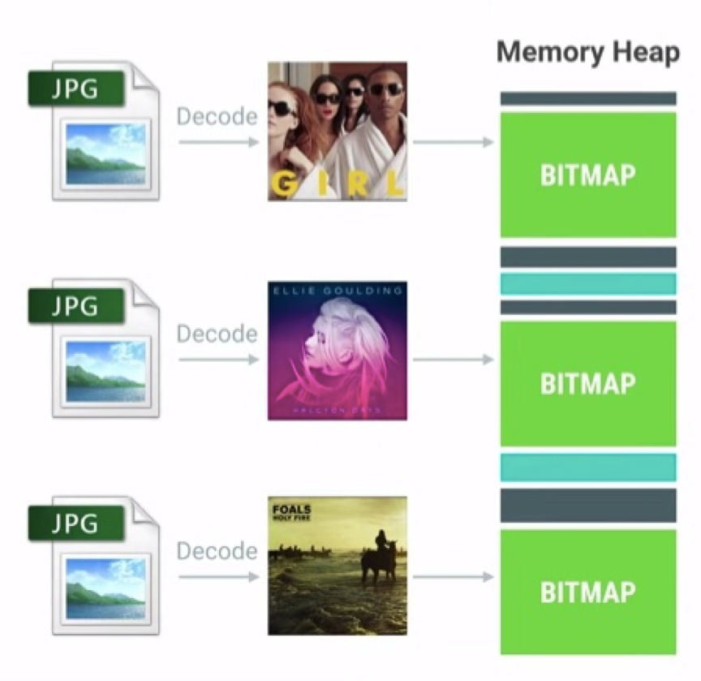
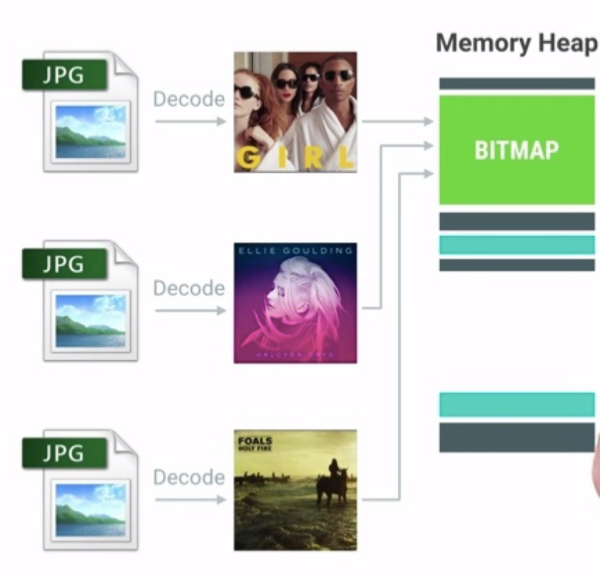

|                    复用前                    |                    复用后                    |
| :------------------------------------------: | :------------------------------------------: |
|  |  |

在「[解决的挑战](0、解决的挑战.md)」一篇中我们提到了，UI 不流畅是图片加载需要面临的一大挑战，虽然加载 Bitmap 的工作是在子线程中进行的不会阻塞主线程，但是过大的体积会引起频发 GC，导致所有的线程 Stop-The-World 造成卡顿感。

