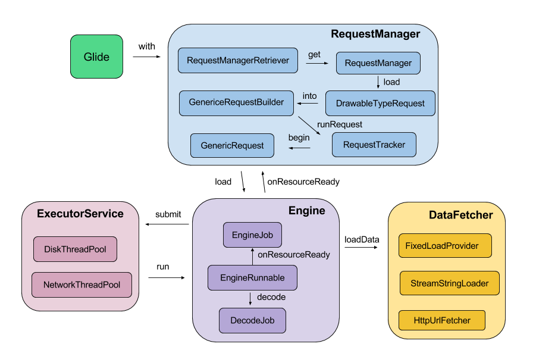
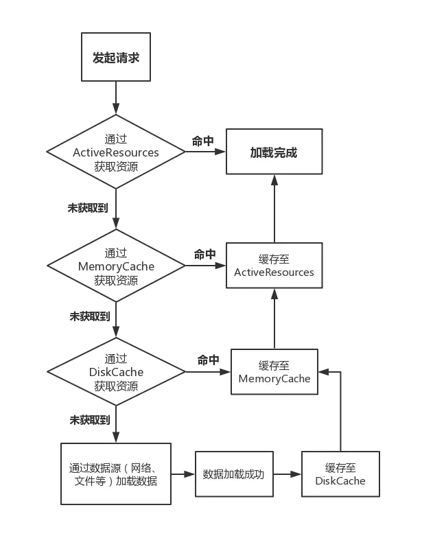
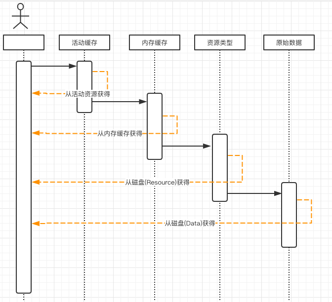

# 带着问题读源码

1. 如何区分文件加载类型的
2. 加载流程是这样的
3. 缓存分为几级，每级核心任务是什么，如何实现的。
4. 缓存之间的关系是什么。
5. LRUCache 缓存原理、内存缓存如何控制大小
6. 如何做图片转换的、例如采样率、尺寸限制、对大图如何处理的。
7. Glide本地文件IO和网络请求是一个线程吗？如果不是，怎么实现线程切换？
8. 如何防止 OOM 和内存泄漏的（图片正在获取中，如果突然关闭页面，这个页面会造成内存泄漏吗）
9. 如何解决列表图片加载错乱问题
10. Glide加载一个100x100的图片，是否会压缩后再加载？放到一个300x300的view上会怎样
11. 生命周期绑定原理
12. 初始化流程及原理
13. 整体架构如何，如果我是作者我会怎样设计
14. 与其他图片加载框架的对比


# 缓存缓存策略

## 入口类：Engine

> Responsible for starting loads and managing active and cached resources

负责启动加载任务并管理活跃资源、缓存资源

### 核心函数：load()

==根据注释可获得信息：==

1. 此方法的作用是根据参数启动不同的加载任务

2. 这个方法必须在主线程中执行

3. 加载流程如下：
   1. 检查当前活动使用的资源的集合，返回活动的资源（如果存在），然后将任何新的非活动的资源移动到内存缓存中。

   2. 检查内存缓存，并提供缓存的资源（如果有）。

   3. 检查当前一组正在进行的负载，并将 callback 添加到正在进行的 load 中（如果有）。

   4. 开始新的加载。

4. 活动资源是指已提供给至少一个请求但尚未释放的资源。 一旦资源的所有使用者都释放了该资源，该资源便进入高速缓存。 如果资源曾经从缓存返回给新的使用者，则将其重新添加到活动资源中。 如果将资源从缓存中逐出，则将其资源回收并在可能的情况下重新使用，并丢弃该资源。 没有严格的要求，即消费者释放其资源，以使活动资源持有量很弱

### 获取==内存缓存==封装函数：loadFromMemory()

```java
  @Nullable
  private EngineResource<?> loadFromMemory(
      EngineKey key, boolean isMemoryCacheable, long startTime) {
    if (!isMemoryCacheable) {
      return null;
    }
	// 一级内存缓存：ActiveResources
    EngineResource<?> active = loadFromActiveResources(key);
    if (active != null) {
      if (VERBOSE_IS_LOGGABLE) {
        logWithTimeAndKey("Loaded resource from active resources", startTime, key);
      }
      return active;
    }
	// 二级内存缓存：memory cache
    EngineResource<?> cached = loadFromCache(key);
    if (cached != null) {
      if (VERBOSE_IS_LOGGABLE) {
        logWithTimeAndKey("Loaded resource from cache", startTime, key);
      }
      return cached;
    }

    return null;
  }
```


## 一级内存缓存：ActiveResource （活动资源缓存）

ActiveResource 是 Glide 提供的第一级内存缓存，它的定义已经在 `Engine#load()`方法的注释上给出了，即还在使用尚未回收的资源。

### 设计的目的、解决了怎样的问题

内存的缓存无疑是最快的，如果能够多次直接复用同一张图片是最经济的选择。如果这样想岂不是一层内存缓存就足够了？为啥还有单独搞出来一层 ActiveResource 呢？


假设在加载图片的时候并没有 ActiveResource 可用，但是 memory cache 中存在可复用的资源。

```java
 private EngineResource<?> loadFromCache(Key key) {
    EngineResource<?> cached = getEngineResourceFromCache(key);
    if (cached != null) {
      //【重点2】
      cached.acquire();
      activeResources.activate(key, cached);
    }
    return cached;
  }

  private EngineResource<?> getEngineResourceFromCache(Key key) {
    //【重点1】
    Resource<?> cached = cache.remove(key);

    final EngineResource<?> result;
    if (cached == null) {
      result = null;
    } else if (cached instanceof EngineResource) {
      // Save an object allocation if we've cached an EngineResource (the typical case).
      result = (EngineResource<?>) cached;
    } else {
      result =
          new EngineResource<>(
              cached, /*isMemoryCacheable=*/ true, /*isRecyclable=*/ true, key, /*listener=*/ this);
    }
    return result;
  }
```

通过 【重点1】、【重点2】可以看到 Glide 回家获取到的图片主动从 MemoryCache 中移除，加入到 ActivityResource 中。==这样做的目的是为了保证正在展示的图片，不会因为内存紧张等问题被从 MemeoryCache 中释放掉==

<font color = red>缓存到 ActiveResources 中的 EngineResource 是正在被使用的，也就是有其它对象持有（引用）它。EngineResource 中有个 acquire 变量表示有几个地方持有了这个 Resource，如果 acquire 等于 0 了，这时才会把 EngineResorce 从ActiveResource 中移除放到 Memory Cache 中</font>


但是还有一种特殊情况：用于展示的 Target 被 GC 回收了，此时就会面对两个问题：

1. 如何清理 ActivityResource 内对于 EngineResource 的引用，如不清理就会内存泄漏
2. 清理后如何将 Resource 返还给 Memory Cache。

面对问题1，ActivityResource  使用弱引用 + 引用队列的的方式解决，不定期扫描引用队列，将已经入队的引用从 HashMap 中清除。

解决了问题1，问题2就简单了，只要对 EngineResource 进行一次弱引用的封装，让封装类，强引用真正的 resource，然后在扫描出添加一个返还给 Memory Cache 的逻辑即可。


，所以 ActivityResource  选择使用弱引用持有 EngineResource  防止内存泄漏，这是如果持有了弱引用，就没有办法获取 EngineResource 的实例再保存会 Memory Cache 了。面对这个问题 ActivityResource 使用了代理的方式，将 EngineResource 封装成了 ResourceWeakReference :

```java
static final class ResourceWeakReference extends WeakReference<EngineResource<?>> {
 	......
    Resource<?> resource;

    @Synthetic
    @SuppressWarnings("WeakerAccess")
    ResourceWeakReference(
        @NonNull Key key,
        @NonNull EngineResource<?> referent,
        @NonNull ReferenceQueue<? super EngineResource<?>> queue,
        boolean isActiveResourceRetentionAllowed) {
      super(referent, queue);
      this.key = Preconditions.checkNotNull(key);
      // 强引用真正的资源文件
      this.resource =
          referent.isMemoryCacheable() && isActiveResourceRetentionAllowed
              ? Preconditions.checkNotNull(referent.getResource())
              : null;
      isCacheable = referent.isMemoryCacheable();
    }

    void reset() {
      resource = null;
      clear();
    }
  }
}
```


如果 `GlideBuilder#setIsActiveResourceRetentionAllowed(Boolean)` 设置为 true 的话 ResourceWeakReference 内部就会持有真正资源的强引用，这样就不会让资源被回收了。


那么资源就会一直存在于 ActivityResource 就不会重新放回 Memory Cache 中，但是如果还想要返还 Memory Cache 应该怎么办呢？ActiveResource 给出了 弱引用 + 引用队列 的方式来返还资源到 Memory Cache


### 如何实现的、实现细节

ActiveResource 的实现比较短从中可以看出它并没有使用 LRU 功能进行资源管理，而是采用了弱引用 + 引用队列的方式来判断哪些资源可以被复用、哪些资源需要回收。

**特殊的回收流程**

ActiveResource 使用 HashMap 持有 EngineResource 的弱引用（ResourceWeakReference），并开启一个低优先级（Process.THREAD_PRIORITY_BACKGROUND）的线程扫描引用队列，凡是能从引用队列中获取到的元素都已经是被 GC 的，此时需要从 HashMap 中手动移除。然后回调由 Engin 注册进来的 `listener.onResourceReleased` ，将被回收的 EngineResource 重新放回 Memory Cache。

```java
// 存储 EngineResource 的引用 Map。
final Map<Key, ResourceWeakReference> activeEngineResources = new HashMap<>();
// 
final ReferenceQueue<EngineResource<?>> resourceReferenceQueue = new ReferenceQueue<>();
```


**重新放回 Memory Cache 流程**

既然持有的是 EngineResource 的弱引用，如果已经被回收了还咋放回 Memory Cache 呢？这里 Glide 对 EngineResource 进行了一层 ResourceWeakReference 代理封装：

```java
   ResourceWeakReference(
        @NonNull Key key,
        @NonNull EngineResource<?> referent,
        @NonNull ReferenceQueue<? super EngineResource<?>> queue,
        boolean isActiveResourceRetentionAllowed) {
      super(referent, queue);
      this.key = Preconditions.checkNotNull(key);
       // 单独存储了 resource 资源
      this.resource =
          referent.isMemoryCacheable() && isActiveResourceRetentionAllowed
              ? Preconditions.checkNotNull(referent.getResource())
              : null;
      isCacheable = referent.isMemoryCacheable();
    }
```

这样就单独为 resource 保留了一个强引用，就算 EngineResource 被回收了，真正的资源也存在。

==但是这个功能默认是关闭的，如果想要开启需要在 `GlideBuilder#setIsActiveResourceRetentionAllowed(Boolean)` 开启。==

### **弊端**：

虽然 get 方法会清理

```java
  synchronized EngineResource<?> get(Key key) {
    ResourceWeakReference activeRef = activeEngineResources.get(key);
    if (activeRef == null) {
      return null;
    }

    EngineResource<?> active = activeRef.get();
    if (active == null) {
      // 如果弱引用已经别回收，这清理 HashMap
      cleanupActiveReference(activeRef);
    }
    return active;
  }
```


但是这里存在一个时间差：扫描线程是低优先级的，可能很久都不会被执行，那么岂不是 HashMap 会一直持有 EngineResource 的弱引用。这样内存使用率

低优先级的回收策略，图片会一直存在内存中，使内存更紧张，更容易出现 OOM


### 收货：

1. 如果回收 Value 是弱引用的 HashMap。

   

## 二级内存缓存：memory cache




## 总结

> 默认情况下 Glide 的缓存分为以下4部分：
>
> 1. 活动缓存（Active Resources）：当前图片正在被使用
> 2. 内存缓存（Memory Cache）图片最近被加载过，并且当前没有使用过这个图片
> 3. 资源磁盘缓存（Resource Disk Cache）被解码后的图片写入磁盘缓存，解码的过程可能修改了图片的参数：inSampleSize、inPreferredConfig
> 4. 原始数据磁盘缓存：(Data Disk Cache) 原始数据的磁盘缓存（从网络、文件直接获取的原始数据）


