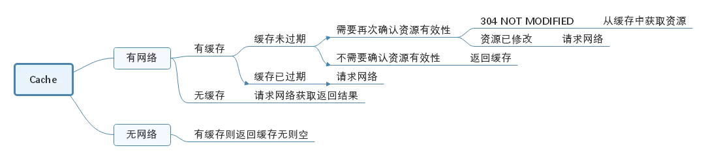

> 本文由 [简悦 SimpRead](http://ksria.com/simpread/) 转码， 原文地址 [blog.yorek.xyz](https://blog.yorek.xyz/android/3rd-library/okhttp/#11)

OkHttp 是一个默认有效的 HTTP 客户端：

*   HTTP/2 支持允许对同一主机的所有请求共享套接字。
*   连接池减少了请求延迟（如果 HTTP/2 不可用）。
*   transparent GZIP 压缩了下载大小。
*   Response 缓存可以完全避免网络的重复请求。

当网络故障时，OkHttp 会自动重试：它将从常见的连接问题中静默地恢复。如果您的服务有多个 IP 地址，如果第一次连接失败，OkHttp 将尝试备用地址；这对于 IPv4 + IPv6 以及在冗余数据中心中托管的服务是必需的。OkHttp 还支持现代 TLS 功能（TLS 1.3，ALPN，certificate pinning）。It can be configured to fall back for broad connectivity.

--- [okhttp/README.md](https://github.com/square/okhttp/blob/master/README.md)

* * *

本章主要介绍`OkHttp`的实现，代码基于 [okhttp-3.8.0](https://github.com/square/okhttp/tree/parent-3.8.0)  
使用`OkHttp`实现`GET`请求非常简单，例子如下：

```java
public class GetExample {
  OkHttpClient client = new OkHttpClient();

  String run(String url) throws IOException {
    Request request = new Request.Builder()
        .url(url)
        .build();

    try (Response response = client.newCall(request).execute()) {
      return response.body().string();
    }
  }

  public static void main(String[] args) throws IOException {
    GetExample example = new GetExample();
    String response = example.run("https://raw.github.com/square/okhttp/master/README.md");
    System.out.println(response);
  }
}
```

这个简单的例子，展示了 OkHttp 的使用过程：

1.  创建`OkHttpClient`对象
2.  构造请求`Request`
3.  调用`OkHttpClient`发送`Request`
4.  解析请求结果

下面，我们以这个简单的例子为切入点，开始分析 OkHttp 内部的实现。

1. OkHttpClient 以及 Request 的构造器 [¶](#1-okhttpclientrequest "Permanent link")
----------------------------------------------------------------------------

先看看`OkHttpClient`的构造器：

```java
public OkHttpClient() {
  this(new Builder());
}

OkHttpClient(Builder builder) {
  this.dispatcher = builder.dispatcher;
  this.proxy = builder.proxy;
  this.protocols = builder.protocols;
  this.connectionSpecs = builder.connectionSpecs;
  this.interceptors = Util.immutableList(builder.interceptors);
  this.networkInterceptors = Util.immutableList(builder.networkInterceptors);
  this.eventListenerFactory = builder.eventListenerFactory;
  this.proxySelector = builder.proxySelector;
  this.cookieJar = builder.cookieJar;
  this.cache = builder.cache;
  this.internalCache = builder.internalCache;
  this.socketFactory = builder.socketFactory;

  boolean isTLS = false;
  for (ConnectionSpec spec : connectionSpecs) {
    isTLS = isTLS || spec.isTls();
  }

  if (builder.sslSocketFactory != null || !isTLS) {
    this.sslSocketFactory = builder.sslSocketFactory;
    this.certificateChainCleaner = builder.certificateChainCleaner;
  } else {
    X509TrustManager trustManager = systemDefaultTrustManager();
    this.sslSocketFactory = systemDefaultSslSocketFactory(trustManager);
    this.certificateChainCleaner = CertificateChainCleaner.get(trustManager);
  }

  this.hostnameVerifier = builder.hostnameVerifier;
  this.certificatePinner = builder.certificatePinner.withCertificateChainCleaner(
      certificateChainCleaner);
  this.proxyAuthenticator = builder.proxyAuthenticator;
  this.authenticator = builder.authenticator;
  this.connectionPool = builder.connectionPool;
  this.dns = builder.dns;
  this.followSslRedirects = builder.followSslRedirects;
  this.followRedirects = builder.followRedirects;
  this.retryOnConnectionFailure = builder.retryOnConnectionFailure;
  this.connectTimeout = builder.connectTimeout;
  this.readTimeout = builder.readTimeout;
  this.writeTimeout = builder.writeTimeout;
  this.pingInterval = builder.pingInterval;
}
```

构造器实现很简单，在默认构造器中传入了一个`OkHttpClient.Builder`建造者对象，然后将其中的参数复制给自己。  
在`OkHttpClient.Builder`的构造器中有很多默认的值，如下注释：

```java
public Builder() {
  dispatcher = new Dispatcher();    // 分发器，另有一个带线程池参数的构造器
  protocols = DEFAULT_PROTOCOLS;    // 支持的协议，默认为HTTP_2、HTTP_1_1
  connectionSpecs = DEFAULT_CONNECTION_SPECS;  // 传输层版本、连接协议
  // 事件监听器，3.8版本set方法还是package级别的，暂时不能设置
  eventListenerFactory = EventListener.factory(EventListener.NONE);
  proxySelector = ProxySelector.getDefault();   // 代理选择器
  cookieJar = CookieJar.NO_COOKIES;             // 读写Cookie的容器
  socketFactory = SocketFactory.getDefault();   // Socket工厂
  hostnameVerifier = OkHostnameVerifier.INSTANCE;// 主机名验证器
  certificatePinner = CertificatePinner.DEFAULT;
  proxyAuthenticator = Authenticator.NONE;      // 代理认证器
  authenticator = Authenticator.NONE;           // 本地认证器
  connectionPool = new ConnectionPool();        // 连接池
  dns = Dns.SYSTEM;                             // 域名
  followSslRedirects = true;                    // SSL重定向
  followRedirects = true;                       // 普通重定向
  retryOnConnectionFailure = true;              // 连接失败重试
  connectTimeout = 10_000;                      // 连接超时时间
  readTimeout = 10_000;                         // 读超时时间
  writeTimeout = 10_000;                        // 写超时时间
  pingInterval = 0;
}
```

上面各种属性都从名字大致可以知道是干啥用的。

此外，`Request`的构造也很简单，字段如下：

```java
final HttpUrl url;                // 请求的url
final String method;              // 请求方式
final Headers headers;            // 请求头
final @Nullable RequestBody body; // 请求体
final Object tag;                 // 请求的tag
```


2. Call & RealCall
--------------------------------------------------------

我们接着看`client.newCall(request).execute()`这一行代码。 
首先是`OkHttpCient.newCall(Request)`方法：

```java
/**
  * Prepares the {@code request} to be executed at some point in the future.
  */
@Override public Call newCall(Request request) {
  return new RealCall(this, request, false /* for web socket */);
}
```

 这里创建了一个`RealCall`对象，而`RealCall`实现了`Call`接口。`Call`接口声明如下：

```java
public interface Call extends Cloneable {
  /** 获得原始请求 */
  Request request();

  /** 同步执行请求 */
  Response execute() throws IOException;

  /** 异步执行请求 */
  void enqueue(Callback responseCallback);

  /** 尽可能取消请求。已经完成了的请求不能被取消 */
  void cancel();

  /**
   * 调用了execute()或者enqueue(Callback)后都是true
   */
  boolean isExecuted();

  boolean isCanceled();

  /** 创建一个新的、完全一样的Call对象，即使原对象状态为enqueued或者executed */
  Call clone();

  interface Factory {
    Call newCall(Request request);
  }
}
```

回到`RealCall`，看看其的构造器以及成员变量：

```java
final OkHttpClient client;
final RetryAndFollowUpInterceptor retryAndFollowUpInterceptor;
final EventListener eventListener;

/** The application's original request unadulterated by redirects or auth headers. */
final Request originalRequest;
final boolean forWebSocket;

// Guarded by this.
private boolean executed;

RealCall(OkHttpClient client, Request originalRequest, boolean forWebSocket) {
  // 事件监听器，默认为null，目前3.8版本也无法设置
  final EventListener.Factory eventListenerFactory = client.eventListenerFactory();

  this.client = client;
  this.originalRequest = originalRequest;
  this.forWebSocket = forWebSocket;
  // 创建一个重试、重定向拦截器
  this.retryAndFollowUpInterceptor = new RetryAndFollowUpInterceptor(client, forWebSocket);

  // TODO(jwilson): this is unsafe publication and not threadsafe.
  this.eventListener = eventListenerFactory.create(this);
}
```

3. RealCall.execute
-----------------------------------------------------------

接着看看重点`RealCall.execute`方法：

```java
@Override public Response execute() throws IOException {
  synchronized (this) {
    if (executed) throw new IllegalStateException("Already Executed");
    executed = true;
  }
  captureCallStackTrace();
  try {
    client.dispatcher().executed(this);
    Response result = getResponseWithInterceptorChain();
    if (result == null) throw new IOException("Canceled");
    return result;
  } finally {
    client.dispatcher().finished(this);
  }
}
```

在上面的方法中我们可以到，一旦`Call.execute`方法被执行，那么其`executed`就会被设置为`true`，如果多次调用就会报错。  
然后调用`client.dispatcher().executed(this);`，该方法就是将 call 加入到`Dispatcher.runningSyncCalls`队列中，没有其他多余的代码：

```java
/** Used by {@code Call#execute} to signal it is in-flight. */
synchronized void executed(RealCall call) {
  runningSyncCalls.add(call);
}
```

接着调用`getResponseWithInterceptorChain`进行网络请求并获取 Response，该方法是`OkHttp`中的最重要的点，我们稍后在介绍`RealCall.enqueue`方法时再一起说。  
紧接着就是 finally 代码块里面的`client.dispatcher().finished(this)`。该方法也很简单，就是`Call`执行完毕后将其从`Dispatcher.runningSyncCalls`队列中移除，见下面的代码；同时，如果`promoteCalls`为 true（此处入参 false），还会执行`promoteCalls`方法，此方法是给异步调用准备的，具体代码后面会谈到；最后如果`runningAsyncCalls`、`runningSyncCalls`这俩正在执行的同步、异步队列之和为 0，说明 dispatcher 处理空闲状态，那么调用`idleCallback.run`通知外界 dispatcher 已经空闲了，_该方法目前仅在测试用例中发现_。

```java
/** Used by {@code Call#execute} to signal completion. */
void finished(RealCall call) {
  finished(runningSyncCalls, call, false);
}

private <T> void finished(Deque<T> calls, T call, boolean promoteCalls) {
  int runningCallsCount;
  Runnable idleCallback;
  synchronized (this) {
    if (!calls.remove(call)) throw new AssertionError("Call wasn't in-flight!");
    if (promoteCalls) promoteCalls();
    runningCallsCount = runningCallsCount();
    idleCallback = this.idleCallback;
  }

  if (runningCallsCount == 0 && idleCallback != null) {
    idleCallback.run();
  }
}
```

4. RealCall.enqueue
-----------------------------------------------------------

顺便也说一下`RealCall.enqueue`的方法。  
同`execute`方法类似，一旦`Call.enqueue`方法被执行，那么其`executed`就会被设置为`true`，如果多次调用就会报错。 
然后调用`client.dispatcher().enqueue(new AsyncCall(responseCallback));`方法开始了异步调用。 

```java
@Override public void enqueue(Callback responseCallback) {
  synchronized (this) {
    if (executed) throw new IllegalStateException("Already Executed");
    executed = true;
  }
  captureCallStackTrace();
  client.dispatcher().enqueue(new AsyncCall(responseCallback));
}
```

这里先看一下`AsyncCall`的相关代码，`execute`方法具体代码下面再说：

```java
final class AsyncCall extends NamedRunnable {
  private final Callback responseCallback;

  AsyncCall(Callback responseCallback) {
    super("OkHttp %s", redactedUrl());
    this.responseCallback = responseCallback;
  }
  ...
  @Override protected void execute() {
    ...
  }
}
```

`AsyncCall`的父类`NamedRunnable`是一个有`name`属性的`Runnable`抽象类，在执行代码前，会将当前线程名设置为`name`，执行完毕后恢复。

```
/**
 * Runnable implementation which always sets its thread name.
 */
public abstract class NamedRunnable implements Runnable {
  protected final String name;

  public NamedRunnable(String format, Object... args) {
    this.name = Util.format(format, args);
  }

  @Override public final void run() {
    String oldName = Thread.currentThread().getName();
    Thread.currentThread().setName(name);
    try {
      execute();
    } finally {
      Thread.currentThread().setName(oldName);
    }
  }

  protected abstract void execute();
}
```

在了解了`AsyncCall`的大致结构，我们返回`Dispatcher.enqueue`方法：

|  | 

```
private int maxRequests = 64;
private int maxRequestsPerHost = 5;

synchronized void enqueue(AsyncCall call) {
  if (runningAsyncCalls.size() < maxRequests && runningCallsForHost(call) < maxRequestsPerHost) {
    runningAsyncCalls.add(call);
    executorService().execute(call);
  } else {
    readyAsyncCalls.add(call);
  }
}


```

 |

`maxRequests`和`maxRequestsPerHost`都有默认值，且有 setter 方法可以设置具体值，两者的 setter 方法最后会执行`promoteCalls`方法尝试执行异步任务。  
在`enqueue`方法中，首先会检查「正在运行的异步请求数」以及「call 对应的 host 上的异步请求数」是否达到了阈值。如果还没有达到阈值，那么加入到`runningAsyncCalls`队列中，同时开始执行请求；否则加入到`readyAsyncCalls`队列中进行等待。

这里出现了一个`executorService()`，这是一个单例实现的线程池，该线程池也可以在`Dispatcher`的构造器中注入。

```
/** Executes calls. Created lazily. */
private @Nullable ExecutorService executorService;

public Dispatcher(ExecutorService executorService) {
  this.executorService = executorService;
}

public synchronized ExecutorService executorService() {
  if (executorService == null) {
    executorService = new ThreadPoolExecutor(0, Integer.MAX_VALUE, 60, TimeUnit.SECONDS,
        new SynchronousQueue<Runnable>(), Util.threadFactory("OkHttp Dispatcher", false));
  }
  return executorService;
}
```

这里我们可以看出来，这是一个典型的`CachedThreadPool`。  
这是一个线程数量不定的线程池，他只有非核心线程，并且其最大线程数为`Integer.MAX_VALUE`。线程池中的空闲线程都有超时机制，这个超时时常为 60s，超过这个时间的闲置线程就会被回收。`SynchronousQueue`可以简单的理解为一个无法存储元素的队列，因此这将导致任何任务都会立刻执行。  
从其特性来看，这类线程池适合执行大量耗时较少的任务。当整个线程池处理闲置状态时，线程池中的线程都会因为超时而被停止，这个时候`CachedThreadPool`之中实际上是没有线程的，它几乎不占用任何系统资源。

提交到线程池后，`AsyncCall.run`方法就会被调用，又因为`AsyncCall`继承了`NamedRunnable`，所以最后执行的是`AsyncCall.execute`方法：

```
@Override protected void execute() {
  boolean signalledCallback = false;
  try {
    Response response = getResponseWithInterceptorChain();
    if (retryAndFollowUpInterceptor.isCanceled()) {
      signalledCallback = true;
      responseCallback.onFailure(RealCall.this, new IOException("Canceled"));
    } else {
      signalledCallback = true;
      responseCallback.onResponse(RealCall.this, response);
    }
  } catch (IOException e) {
    if (signalledCallback) {
      // Do not signal the callback twice!
      Platform.get().log(INFO, "Callback failure for " + toLoggableString(), e);
    } else {
      responseCallback.onFailure(RealCall.this, e);
    }
  } finally {
    client.dispatcher().finished(this);
  }
}
```

首先调用`getResponseWithInterceptorChain`进行网络请求并获取 Response，然后根据请求是否被取消，调用对应的回调方法。最后调用`client.dispatcher().finished(this)`方法在`runningAsyncCalls`方法中移除 call，并尝试执行其他的异步方法。

我们先看`client.dispatcher().finished(this)`方法，最后再看`getResponseWithInterceptorChain`方法的实现：

```
/** Used by {@code AsyncCall#run} to signal completion. */
void finished(AsyncCall call) {
  finished(runningAsyncCalls, call, true);
}

private <T> void finished(Deque<T> calls, T call, boolean promoteCalls) {
  int runningCallsCount;
  Runnable idleCallback;
  synchronized (this) {
    if (!calls.remove(call)) throw new AssertionError("Call wasn't in-flight!");
    if (promoteCalls) promoteCalls();
    runningCallsCount = runningCallsCount();
    idleCallback = this.idleCallback;
  }

  if (runningCallsCount == 0 && idleCallback != null) {
    idleCallback.run();
  }
}

private void promoteCalls() {
  if (runningAsyncCalls.size() >= maxRequests) return; // Already running max capacity.
  if (readyAsyncCalls.isEmpty()) return; // No ready calls to promote.

  for (Iterator<AsyncCall> i = readyAsyncCalls.iterator(); i.hasNext(); ) {
    AsyncCall call = i.next();

    if (runningCallsForHost(call) < maxRequestsPerHost) {
      i.remove();
      runningAsyncCalls.add(call);
      executorService().execute(call);
    }

    if (runningAsyncCalls.size() >= maxRequests) return; // Reached max capacity.
  }
}
```

两个`finished`方法不用多说；`promoteCalls`方法的代码也很清晰明了，这是一个将等待队列中的任务移到`runningAsyncCalls`且执行的过程。

5. getResponseWithInterceptorChain
------------------------------------------------------------------------------------------

最后，终于来到了`getResponseWithInterceptorChain`方法，如下所示。

```java
Response getResponseWithInterceptorChain() throws IOException {
  // Build a full stack of interceptors.
  List<Interceptor> interceptors = new ArrayList<>();
  interceptors.addAll(client.interceptors());
  interceptors.add(retryAndFollowUpInterceptor);
  interceptors.add(new BridgeInterceptor(client.cookieJar()));
  interceptors.add(new CacheInterceptor(client.internalCache()));
  interceptors.add(new ConnectInterceptor(client));
  if (!forWebSocket) {
    interceptors.addAll(client.networkInterceptors());
  }
  interceptors.add(new CallServerInterceptor(forWebSocket));

  Interceptor.Chain chain = new RealInterceptorChain(
      interceptors, null, null, null, 0, originalRequest);
  return chain.proceed(originalRequest);
}
```

首先将以下拦截器依次加入到 List 中：

1.  OkHttpClient 设置的拦截器`interceptors()`
2.  重试、重定向拦截器`RetryAndFollowUpInterceptor`
3.  把用户请求转换为服务器请求、把服务器返响应转换为用户响应的`BridgeInterceptor`
4.  读取缓存直接返回、将响应写入到缓存中的`CacheInterceptor`
5.  与服务器建立连接的`ConnectInterceptor`
6.  OkHttpClient 设置的网络拦截器`networkInterceptors()`
7.  真正执行网络请求的`CallServerInterceptor`

将所有的拦截器保存在`interceptors`后，创建一个拦截器责任链`RealInterceptorChain`，并调用其`proceed`开始处理网络请求。

**下面解释一下责任链模式是如何表现出来的？**

首先看上面创建`RealInterceptorChain`的方法以及`RealInterceptorChain`的代码：

```java
// RealCall.java
Interceptor.Chain chain = new RealInterceptorChain(
    interceptors, null, null, null, 0, originalRequest);
return chain.proceed(originalRequest);

// RealInterceptorChain.java
public final class RealInterceptorChain implements Interceptor.Chain {
  private final List<Interceptor> interceptors;
  ...
  private final int index;
  private final Request request;

  public RealInterceptorChain(List<Interceptor> interceptors, StreamAllocation streamAllocation,
      HttpCodec httpCodec, RealConnection connection, int index, Request request) {
    this.interceptors = interceptors;
    ...
    this.index = index;
    this.request = request;
  }
  ...
  @Override public Response proceed(Request request) throws IOException {
    return proceed(request, streamAllocation, httpCodec, connection);
  }

  public Response proceed(Request request, StreamAllocation streamAllocation, HttpCodec httpCodec,
      RealConnection connection) throws IOException {
    if (index >= interceptors.size()) throw new AssertionError();
    ...
    // Call the next interceptor in the chain.
    RealInterceptorChain next = new RealInterceptorChain(
        interceptors, streamAllocation, httpCodec, connection, index + 1, request);
    Interceptor interceptor = interceptors.get(index);
    Response response = interceptor.intercept(next);
    ...
    return response;
  }
}
```

在不考虑`OkHttpClient.interceptor()`的情况下，上面这段代码的解释如下：

1.  在`getResponseWithInterceptorChain`创建了一个`index`为 0 的`RealInterceptorChain`（下称链），接着就调用了其`proceed`方法
2.  在`RealInterceptorChain.proceed`方法中：`index=0`
3.  创建了一个`index`为 index+1 的链`next`
4.  然后对当前`index`的拦截器（即`RetryAndFollowUpInterceptor`）执行`interceptor.intercept(next)`。  
    在`RetryAndFollowUpInterceptor`方法中执行了`chain.proceed`方法，而这里的`chain`是`RealInterceptorChain`实例，所以回到了`RealInterceptorChain.proceed`方法中
5.  此时`index=1`, 同理链条可以一直执行下去；index=2..n-1
6.  直到遇到最后一个拦截器`CallServerInterceptor`，因此这是最后一个拦截器了，因此链肯定不能继续下去，不然就报错了`if (index >= interceptors.size()) throw new AssertionError();`，而且在`CallServerInterceptor.intercept`方法中也所搜不到`proceed`关键字。  
    又因为这是最后一个拦截器，所以肯定是负责和服务器建立实际通讯的。
7.  Response 的返回与 Request 相反，会从最后一个开始依次往前经过这些`Intercetor`

下图为 OkHttp 工作的大致流程，参考自[拆轮子系列：拆 OkHttp](https://blog.piasy.com/2016/07/11/Understand-OkHttp/index.html)


接下来，我们看一下各个拦截器具体的代码。

6. RetryAndFollowUpInterceptor[¶](#6-retryandfollowupinterceptor "Permanent link")
----------------------------------------------------------------------------------

> Comments

> This interceptor recovers from failures and follows redirects as necessary.  
> How many redirects and auth challenges should we attempt? Chrome follows 21 redirects; Firefox, curl, and wget follow 20; Safari follows 16; and HTTP/1.0 recommends 5.

```java
@Override public Response intercept(Chain chain) throws IOException {
  Request request = chain.request();

  streamAllocation = new StreamAllocation(
      client.connectionPool(), createAddress(request.url()), callStackTrace);

  int followUpCount = 0;
  Response priorResponse = null;
  while (true) {
    if (canceled) {
      streamAllocation.release();
      throw new IOException("Canceled");
    }

    Response response = null;
    boolean releaseConnection = true;
    // 1️⃣
    try {
      response = ((RealInterceptorChain) chain).proceed(request, streamAllocation, null, null);
      releaseConnection = false;
    } catch (RouteException e) {
      // The attempt to connect via a route failed. The request will not have been sent.
      if (!recover(e.getLastConnectException(), false, request)) {
        throw e.getLastConnectException();
      }
      releaseConnection = false;
      continue;
    } catch (IOException e) {
      // An attempt to communicate with a server failed. The request may have been sent.
      boolean requestSendStarted = !(e instanceof ConnectionShutdownException);
      if (!recover(e, requestSendStarted, request)) throw e;
      releaseConnection = false;
      continue;
    } finally {
      // We're throwing an unchecked exception. Release any resources.
      if (releaseConnection) {
        streamAllocation.streamFailed(null);
        streamAllocation.release();
      }
    }

    // 2️⃣
    // Attach the prior response if it exists. Such responses never have a body.
    if (priorResponse != null) {
      response = response.newBuilder()
          .priorResponse(priorResponse.newBuilder()
                  .body(null)
                  .build())
          .build();
    }

    // 3️⃣
    Request followUp = followUpRequest(response);

    if (followUp == null) {
      if (!forWebSocket) {
        streamAllocation.release();
      }
      return response;
    }

    closeQuietly(response.body());

    if (++followUpCount > MAX_FOLLOW_UPS) {
      streamAllocation.release();
      throw new ProtocolException("Too many follow-up requests: " + followUpCount);
    }

    if (followUp.body() instanceof UnrepeatableRequestBody) {
      streamAllocation.release();
      throw new HttpRetryException("Cannot retry streamed HTTP body", response.code());
    }

    if (!sameConnection(response, followUp.url())) {
      streamAllocation.release();
      streamAllocation = new StreamAllocation(
          client.connectionPool(), createAddress(followUp.url()), callStackTrace);
    } else if (streamAllocation.codec() != null) {
      throw new IllegalStateException("Closing the body of " + response
          + " didn't close its backing stream. Bad interceptor?");
    }

    request = followUp;
    priorResponse = response;
  }
}
```

上面这些代码比较简单

1.  首先正常进行请求，如果遇到了异常，根据情况看是否可以恢复：若不能恢复，则抛出异常，结束请求；若正常请求成功，那么在 finally 块中释放资源
2.  如果请求是重试后的请求，那么将重试前请求的响应体设置为 null 并加到当前响应体`priorResponse`字段中
3.  根据 Response 的响应码判断是否需要重试：否不需要，则返回 respone；若需要，则会检查重试次数是否达到阈值、是否可以继续重试
4.  继续执行 while 循环，返回步骤 1

这里需要注意的是，在调用`chain.proceed`方法时，将创建好的`StreamAllocation`对象作为参数传入了`proceed`方法，所以之后的`RealInterceptorChain.streamAllocation`就可以使用了。

```java
streamAllocation = new StreamAllocation(
    client.connectionPool(), createAddress(request.url()), callStackTrace);
response = ((RealInterceptorChain) chain).proceed(request, streamAllocation, null, null);
```

7. BridgeInterceptor[¶](#7-bridgeinterceptor "Permanent link")
--------------------------------------------------------------

> Comments

> Bridges from application code to network code. First it builds a network request from a user request. Then it proceeds to call the network. Finally it builds a user response from the network response.

直接上代码：

```java
@Override public Response intercept(Chain chain) throws IOException {
  Request userRequest = chain.request();
  Request.Builder requestBuilder = userRequest.newBuilder();

  // 1️⃣
  RequestBody body = userRequest.body();
  if (body != null) {
    MediaType contentType = body.contentType();
    if (contentType != null) {
      requestBuilder.header("Content-Type", contentType.toString());
    }

    long contentLength = body.contentLength();
    if (contentLength != -1) {
      requestBuilder.header("Content-Length", Long.toString(contentLength));
      requestBuilder.removeHeader("Transfer-Encoding");
    } else {
      requestBuilder.header("Transfer-Encoding", "chunked");
      requestBuilder.removeHeader("Content-Length");
    }
  }

  if (userRequest.header("Host") == null) {
    requestBuilder.header("Host", hostHeader(userRequest.url(), false));
  }

  if (userRequest.header("Connection") == null) {
    requestBuilder.header("Connection", "Keep-Alive");
  }

  // If we add an "Accept-Encoding: gzip" header field we're responsible for also decompressing
  // the transfer stream.
  boolean transparentGzip = false;
  if (userRequest.header("Accept-Encoding") == null && userRequest.header("Range") == null) {
    transparentGzip = true;
    requestBuilder.header("Accept-Encoding", "gzip");
  }

  List<Cookie> cookies = cookieJar.loadForRequest(userRequest.url());
  if (!cookies.isEmpty()) {
    requestBuilder.header("Cookie", cookieHeader(cookies));
  }

  if (userRequest.header("User-Agent") == null) {
    requestBuilder.header("User-Agent", Version.userAgent());
  }

  // 2️⃣
  Response networkResponse = chain.proceed(requestBuilder.build());

  HttpHeaders.receiveHeaders(cookieJar, userRequest.url(), networkResponse.headers());

  Response.Builder responseBuilder = networkResponse.newBuilder()
      .request(userRequest);

  if (transparentGzip
      && "gzip".equalsIgnoreCase(networkResponse.header("Content-Encoding"))
      && HttpHeaders.hasBody(networkResponse)) {
    GzipSource responseBody = new GzipSource(networkResponse.body().source());
    Headers strippedHeaders = networkResponse.headers().newBuilder()
        .removeAll("Content-Encoding")
        .removeAll("Content-Length")
        .build();
    responseBuilder.headers(strippedHeaders);
    responseBuilder.body(new RealResponseBody(strippedHeaders, Okio.buffer(responseBody)));
  }

  return responseBuilder.build();
}
```

上面代码总体来说干了两件事： 1. 对原始的 Request 进行检查，设置`Content-Type`、`Content-Length`、`Transfer-Encoding`、`Host`、`Connection`、`Accept-Encoding`、`Cookie`、`User-Agent`这些 header 2. 进行网络请求。若是 gzip 编码，则对响应进行 Gzip 处理；否则直接返回

在上面的过程中，用到了`CookieJar`的实例。  
在请求前，会调用下面的方法读取 url 的 Cookie：

```java
List<Cookie> cookies = cookieJar.loadForRequest(userRequest.url());
if (!cookies.isEmpty()) {
  requestBuilder.header("Cookie", cookieHeader(cookies));
}
```

`cookieHeader`就是将 cookies 里面的键值对拼接成一个字符串`k1=v1; k2=v2`，其实现如下：

```java
/** Returns a 'Cookie' HTTP request header with all cookies, like {@code a=b; c=d}. */
private String cookieHeader(List<Cookie> cookies) {
  StringBuilder cookieHeader = new StringBuilder();
  for (int i = 0, size = cookies.size(); i < size; i++) {
    if (i > 0) {
      cookieHeader.append("; ");
    }
    Cookie cookie = cookies.get(i);
    cookieHeader.append(cookie.name()).append('=').append(cookie.value());
  }
  return cookieHeader.toString();
}
```

收到响应后，会调用下面的方法存储 url 的 Cookie：

```java
HttpHeaders.receiveHeaders(cookieJar, userRequest.url(), networkResponse.headers());
```

`HttpHeaders.receiveHeaders`实现如下：

```java
// HttpHeaders.java
public static void receiveHeaders(CookieJar cookieJar, HttpUrl url, Headers headers) {
  if (cookieJar == CookieJar.NO_COOKIES) return;

  List<Cookie> cookies = Cookie.parseAll(url, headers);
  if (cookies.isEmpty()) return;

  cookieJar.saveFromResponse(url, cookies);
}

// Cookie.java
/** Returns all of the cookies from a set of HTTP response headers. */
public static List<Cookie> parseAll(HttpUrl url, Headers headers) {
  List<String> cookieStrings = headers.values("Set-Cookie");
  List<Cookie> cookies = null;

  for (int i = 0, size = cookieStrings.size(); i < size; i++) {
    Cookie cookie = Cookie.parse(url, cookieStrings.get(i));
    if (cookie == null) continue;
    if (cookies == null) cookies = new ArrayList<>();
    cookies.add(cookie);
  }

  return cookies != null
      ? Collections.unmodifiableList(cookies)
      : Collections.<Cookie>emptyList();
}
```

`Cookie.parse`的实现比较复杂，我们只需要这是将每一个`Set-Cookie`的值取出来，然后解析成为一个个`Cookie`对象即可。

**所以，使用 OkHttp 的 Cookie 功能时，自定义一个 CookieJar 就好了，不需要新增拦截器专门处理 Cookie 问题。**

8. ## CacheInterceptor[¶](#8-cacheinterceptor "Permanent link")
------------------------------------------------------------

> Comments
>
> Serves requests from the cache and writes responses to the cache.

首先需要注意的是，OkHttp 中的 Cache 策略采用的是`DiskLruCache`，关于`DiskLruCache`可以参考 [DiskLruCache](https://blog.yorek.xyz/android/framework/Bitmap%E7%9A%84%E7%BC%93%E5%AD%98%E4%B8%8E%E5%8A%A0%E8%BD%BD/#22-disklrucache)。key 的计算为：

```java
ByteString.encodeUtf8(url.toString()).md5().hex()
```


Cache 的一般策略如下图：



下面是`CacheInterceptor`的主要代码：

```java
@Override public Response intercept(Chain chain) throws IOException {
  // 根据是否设置了缓存以及网络请求，得到一个候选缓存
  Response cacheCandidate = cache != null
      ? cache.get(chain.request())
      : null;

  long now = System.currentTimeMillis();

  // 根据当前时间、请求对象以及候选缓存，获取缓存策略
  // 在缓存策略中，有两个重要的对象
  // networkRequest: 网络请求，若为null表示不使用网络
  // cacheResponse: 响应缓存，若为null表示不使用缓存
  CacheStrategy strategy = new CacheStrategy.Factory(now, chain.request(), cacheCandidate).get();
  Request networkRequest = strategy.networkRequest;
  Response cacheResponse = strategy.cacheResponse;

  if (cache != null) {
    cache.trackResponse(strategy);
  }

  // 如果有候选缓存但是没有响应缓存，说明候选缓存不可用
  // 关闭它，以免内存泄漏
  if (cacheCandidate != null && cacheResponse == null) {
    closeQuietly(cacheCandidate.body()); // The cache candidate wasn't applicable. Close it.
  }

  // If we're forbidden from using the network and the cache is insufficient, fail.
  // 不进行网络请求，且缓存以及过期了，返回504错误
  if (networkRequest == null && cacheResponse == null) {
    return new Response.Builder()
        .request(chain.request())
        .protocol(Protocol.HTTP_1_1)
        .code(504)
        .message("Unsatisfiable Request (only-if-cached)")
        .body(Util.EMPTY_RESPONSE)
        .sentRequestAtMillis(-1L)
        .receivedResponseAtMillis(System.currentTimeMillis())
        .build();
  }

  // If we don't need the network, we're done.
  // 不需要网络请求，此时缓存命中，直接返回缓存，后面的拦截器的步骤也不会经过了
  if (networkRequest == null) {
    return cacheResponse.newBuilder()
        .cacheResponse(stripBody(cacheResponse))
        .build();
  }

  // 没有缓存命中，则进行网络请求
  Response networkResponse = null;
  try {
    networkResponse = chain.proceed(networkRequest);
  } finally {
    // If we're crashing on I/O or otherwise, don't leak the cache body.
    if (networkResponse == null && cacheCandidate != null) {
      closeQuietly(cacheCandidate.body());
    }
  }

  // If we have a cache response too, then we're doing a conditional get.
  // 如果缓存策略中，网络响应和响应缓存都不为null，需要更新响应缓存
  // (比如 需要向服务器确认缓存是否可用的情况)
  if (cacheResponse != null) {
    // 304的返回是不带body的,此时必须获取cache的body
    if (networkResponse.code() == HTTP_NOT_MODIFIED) {
      Response response = cacheResponse.newBuilder()
          .headers(combine(cacheResponse.headers(), networkResponse.headers()))
          .sentRequestAtMillis(networkResponse.sentRequestAtMillis())
          .receivedResponseAtMillis(networkResponse.receivedResponseAtMillis())
          .cacheResponse(stripBody(cacheResponse))
          .networkResponse(stripBody(networkResponse))
          .build();
      networkResponse.body().close();

      // Update the cache after combining headers but before stripping the
      // Content-Encoding header (as performed by initContentStream()).
      cache.trackConditionalCacheHit();
      cache.update(cacheResponse, response);
      return response;
    } else {
      closeQuietly(cacheResponse.body());
    }
  }

  // 走到这里，已经进行过网络请求了，请求响应不为空
  // 构建响应对象，等待返回
  Response response = networkResponse.newBuilder()
      .cacheResponse(stripBody(cacheResponse))
      .networkResponse(stripBody(networkResponse))
      .build();

  if (cache != null) {
    // 将请求放到缓存中
    if (HttpHeaders.hasBody(response) && CacheStrategy.isCacheable(response, networkRequest)) {
      // Offer this request to the cache.
      CacheRequest cacheRequest = cache.put(response);
      return cacheWritingResponse(cacheRequest, response);
    }

    // 如果请求不能被缓存，则移除该请求
    if (HttpMethod.invalidatesCache(networkRequest.method())) {
      try {
        cache.remove(networkRequest);
      } catch (IOException ignored) {
        // The cache cannot be written.
      }
    }
  }

  return response;
}
```

接下来看看另外一个要点：`CacheStrategy`是如何决定使不使用网络请求、响应缓存的。

**CacheStrategy.java**

```java
/** Returns a strategy to use assuming the request can use the network. */
private CacheStrategy getCandidate() {
  // No cached response.
  // 没有缓存
  if (cacheResponse == null) {
    return new CacheStrategy(request, null);
  }

  // Drop the cached response if it's missing a required handshake.
  // https请求，但没有必要的握手信息，丢弃缓存
  if (request.isHttps() && cacheResponse.handshake() == null) {
    return new CacheStrategy(request, null);
  }

  // If this response shouldn't have been stored, it should never be used
  // as a response source. This check should be redundant as long as the
  // persistence store is well-behaved and the rules are constant.
  // 不应该被缓存，丢弃缓存
  if (!isCacheable(cacheResponse, request)) {
    return new CacheStrategy(request, null);
  }

  CacheControl requestCaching = request.cacheControl();
  ...
  // 根据缓存的缓存时间，缓存可接受最大过期时间等等HTTP协议上的规范，来判断缓存是否可用
  if (!responseCaching.noCache() && ageMillis + minFreshMillis < freshMillis + maxStaleMillis) {
    Response.Builder builder = cacheResponse.newBuilder();
    if (ageMillis + minFreshMillis >= freshMillis) {
      builder.addHeader("Warning", "110 HttpURLConnection \"Response is stale\"");
    }
    long oneDayMillis = 24 * 60 * 60 * 1000L;
    if (ageMillis > oneDayMillis && isFreshnessLifetimeHeuristic()) {
      builder.addHeader("Warning", "113 HttpURLConnection \"Heuristic expiration\"");
    }
    return new CacheStrategy(null, builder.build());
  }

  // Find a condition to add to the request. If the condition is satisfied, the response body
  // will not be transmitted.
  // 请求条件, 当etag、lastModified、servedDate这三种属性存在时，需要向服务器确认缓存的有效性
  String conditionName;
  String conditionValue;
  if (etag != null) {
    conditionName = "If-None-Match";
    conditionValue = etag;
  } else if (lastModified != null) {
    conditionName = "If-Modified-Since";
    conditionValue = lastModifiedString;
  } else if (servedDate != null) {
    conditionName = "If-Modified-Since";
    conditionValue = servedDateString;
  } else {
    return new CacheStrategy(request, null); // No condition! Make a regular request.
  }

  Headers.Builder conditionalRequestHeaders = request.headers().newBuilder();
  Internal.instance.addLenient(conditionalRequestHeaders, conditionName, conditionValue);

  // 构造一个请求询问服务器资源是否过期
  Request conditionalRequest = request.newBuilder()
      .headers(conditionalRequestHeaders.build())
      .build();
  return new CacheStrategy(conditionalRequest, cacheResponse);
}
```

9. ## ConnectInterceptor[¶](#9-connectinterceptor "Permanent link")
----------------------------------------------------------------

> Comments
>
> Opens a connection to the target server and proceeds to the next interceptor.

```java
@Override public Response intercept(Chain chain) throws IOException {
  RealInterceptorChain realChain = (RealInterceptorChain) chain;
  Request request = realChain.request();
  StreamAllocation streamAllocation = realChain.streamAllocation();

  // We need the network to satisfy this request. Possibly for validating a conditional GET.
  boolean doExtensiveHealthChecks = !request.method().equals("GET");
  HttpCodec httpCodec = streamAllocation.newStream(client, doExtensiveHealthChecks);
  RealConnection connection = streamAllocation.connection();

  return realChain.proceed(request, streamAllocation, httpCodec, connection);
}
```

上面的代码只有几行，其作用注释也说的很清楚了：与服务器建立连接，然后传递到下一个拦截器。

其中`StreamAllocation`是一个重点，它是`Connections`、`Streams`、`Calls`三者的一个纽带，此类的实例使用一个或多个 connections 上的一个或多个 stream 来执行 call。

*   **Connections:** 连接到远程服务器的物理的 socket。connections 可能建立很慢，因此必须能够取消当前已经连接上的 connection。
*   **Streams:** 位于 Connections 上的逻辑上的 HTTP 请求、响应对。每个 connection 都有自己的 allocation limit，这决定了 connection 可以承载多少可以并发的 stream。HTTP/1.x connections 一次可以承载 1 个流，HTTP/2 通常可以承载多个。
*   **Calls:** streams 的逻辑序列，通常是初始请求及其后续请求。我们希望将单个 call 的所有 streams 保持在同一个 connection 上，以获得更好的表现。

`streamAllocation.newStream`方法就是打开连接的关键，看看到底怎么操作的：

```java
public HttpCodec newStream(OkHttpClient client, boolean doExtensiveHealthChecks) {
  int connectTimeout = client.connectTimeoutMillis();
  int readTimeout = client.readTimeoutMillis();
  int writeTimeout = client.writeTimeoutMillis();
  boolean connectionRetryEnabled = client.retryOnConnectionFailure();

  try {
    RealConnection resultConnection = findHealthyConnection(connectTimeout, readTimeout,
        writeTimeout, connectionRetryEnabled, doExtensiveHealthChecks);
    HttpCodec resultCodec = resultConnection.newCodec(client, this);

    synchronized (connectionPool) {
      codec = resultCodec;
      return resultCodec;
    }
  } catch (IOException e) {
    throw new RouteException(e);
  }
}
```

该方法有两处要点，第一处就是调用`findHealthyConnection`得到一个可用的 connection，第二处就是调用`resultConnection.newCodec`得到一个对 HTTP 请求进行编码、HTTP 响应进行解码的`HttpCodec`。

先看跟踪`findHealthyConnection`方法，该方法会调用`findConnection`得到一个 connection，然后对其调用`isHealth(true)`方法进行健康诊断。如果健康，那么就可以返回该 connection 了；否则，从连接池中移除，并继续 while 循环。

```java
/**
  * Finds a connection and returns it if it is healthy. If it is unhealthy the process is repeated
  * until a healthy connection is found.
  */
private RealConnection findHealthyConnection(int connectTimeout, int readTimeout,
    int writeTimeout, boolean connectionRetryEnabled, boolean doExtensiveHealthChecks)
    throws IOException {
  while (true) {
    RealConnection candidate = findConnection(connectTimeout, readTimeout, writeTimeout,
        connectionRetryEnabled);

    // If this is a brand new connection, we can skip the extensive health checks.
    synchronized (connectionPool) {
      if (candidate.successCount == 0) {
        return candidate;
      }
    }

    // Do a (potentially slow) check to confirm that the pooled connection is still good. If it
    // isn't, take it out of the pool and start again.
    if (!candidate.isHealthy(doExtensiveHealthChecks)) {
      noNewStreams();
      continue;
    }

    return candidate;
  }
}
```

在`findConnection`方法中，会先看已经存在的 connection，然后再看连接池，最后都没有就创建新的 connection。

```java
/**
  * Returns a connection to host a new stream. This prefers the existing connection if it exists,
  * then the pool, finally building a new connection.
  */
private RealConnection findConnection(int connectTimeout, int readTimeout, int writeTimeout,
    boolean connectionRetryEnabled) throws IOException {
  Route selectedRoute;
  synchronized (connectionPool) {
    if (released) throw new IllegalStateException("released");
    if (codec != null) throw new IllegalStateException("codec != null");
    if (canceled) throw new IOException("Canceled");

    // Attempt to use an already-allocated connection.
    RealConnection allocatedConnection = this.connection;
    if (allocatedConnection != null && !allocatedConnection.noNewStreams) {
      return allocatedConnection;
    }

    // Attempt to get a connection from the pool.
    Internal.instance.get(connectionPool, address, this, null);
    if (connection != null) {
      return connection;
    }

    selectedRoute = route;
  }

  // If we need a route, make one. This is a blocking operation.
  if (selectedRoute == null) {
    selectedRoute = routeSelector.next();
  }

  RealConnection result;
  synchronized (connectionPool) {
    if (canceled) throw new IOException("Canceled");

    // Now that we have an IP address, make another attempt at getting a connection from the pool.
    // This could match due to connection coalescing.
    Internal.instance.get(connectionPool, address, this, selectedRoute);
    if (connection != null) return connection;

    // Create a connection and assign it to this allocation immediately. This makes it possible
    // for an asynchronous cancel() to interrupt the handshake we're about to do.
    route = selectedRoute;
    refusedStreamCount = 0;
    result = new RealConnection(connectionPool, selectedRoute);
    acquire(result);
  }

  // Do TCP + TLS handshakes. This is a blocking operation.
  result.connect(connectTimeout, readTimeout, writeTimeout, connectionRetryEnabled);
  routeDatabase().connected(result.route());

  Socket socket = null;
  synchronized (connectionPool) {
    // Pool the connection.
    Internal.instance.put(connectionPool, result);

    // If another multiplexed connection to the same address was created concurrently, then
    // release this connection and acquire that one.
    if (result.isMultiplexed()) {
      socket = Internal.instance.deduplicate(connectionPool, address, this);
      result = connection;
    }
  }
  closeQuietly(socket);

  return result;
}
```

在创建新 connection 时，会执行 TCP + TLS 握手，然后放入连接池中。  
在调用`connect`进行握手时会调用`establishProtocol`方法确定协议：

```java
private void establishProtocol(ConnectionSpecSelector connectionSpecSelector) throws IOException {
  if (route.address().sslSocketFactory() == null) {
    protocol = Protocol.HTTP_1_1;
    socket = rawSocket;
    return;
  }

  connectTls(connectionSpecSelector);

  if (protocol == Protocol.HTTP_2) {
    socket.setSoTimeout(0); // HTTP/2 connection timeouts are set per-stream.
    http2Connection = new Http2Connection.Builder(true)
        .socket(socket, route.address().url().host(), source, sink)
        .listener(this)
        .build();
    http2Connection.start();
  }
}
```

也就是说，在建立连接时，如果是 HTTP_2，就会初始化一个`http2Connection`。

我们回到`streamAllocation.newStream`方法的`resultConnection.newCodec`语句中：

```java
public HttpCodec newCodec(
    OkHttpClient client, StreamAllocation streamAllocation) throws SocketException {
  if (http2Connection != null) {
    return new Http2Codec(client, streamAllocation, http2Connection);
  } else {
    socket.setSoTimeout(client.readTimeoutMillis());
    source.timeout().timeout(client.readTimeoutMillis(), MILLISECONDS);
    sink.timeout().timeout(client.writeTimeoutMillis(), MILLISECONDS);
    return new Http1Codec(client, streamAllocation, source, sink);
  }
}
```

我们发现，这里根据`http2Connection`有没有初始化，也就是是不是 HTTP_2 协议来创建对应的`HttpCodec`对象。

在拦截器的最后，调用`realChain.proceed(request, streamAllocation, httpCodec, connection)`将请求传递给下一个拦截器。

10. ## CallServerInterceptor[¶](#10-callserverinterceptor "Permanent link")
------------------------------------------------------------------------

Comments

This is the last interceptor in the chain. It makes a network call to the server.

下面这些代码看起来也很清晰，就是利用`HttpCodec`进行请求数据、响应数据的读写。其中读写的不详细描述。

```java
@Override public Response intercept(Chain chain) throws IOException {
  RealInterceptorChain realChain = (RealInterceptorChain) chain;
  HttpCodec httpCodec = realChain.httpStream();
  StreamAllocation streamAllocation = realChain.streamAllocation();
  RealConnection connection = (RealConnection) realChain.connection();
  Request request = realChain.request();

  long sentRequestMillis = System.currentTimeMillis();
  httpCodec.writeRequestHeaders(request);

  Response.Builder responseBuilder = null;
  if (HttpMethod.permitsRequestBody(request.method()) && request.body() != null) {
    // If there's a "Expect: 100-continue" header on the request, wait for a "HTTP/1.1 100
    // Continue" response before transmitting the request body. If we don't get that, return what
    // we did get (such as a 4xx response) without ever transmitting the request body.
    if ("100-continue".equalsIgnoreCase(request.header("Expect"))) {
      httpCodec.flushRequest();
      responseBuilder = httpCodec.readResponseHeaders(true);
    }

    if (responseBuilder == null) {
      // Write the request body if the "Expect: 100-continue" expectation was met.
      Sink requestBodyOut = httpCodec.createRequestBody(request, request.body().contentLength());
      BufferedSink bufferedRequestBody = Okio.buffer(requestBodyOut);
      request.body().writeTo(bufferedRequestBody);
      bufferedRequestBody.close();
    } else if (!connection.isMultiplexed()) {
      // If the "Expect: 100-continue" expectation wasn't met, prevent the HTTP/1 connection from
      // being reused. Otherwise we're still obligated to transmit the request body to leave the
      // connection in a consistent state.
      streamAllocation.noNewStreams();
    }
  }

  httpCodec.finishRequest();

  if (responseBuilder == null) {
    responseBuilder = httpCodec.readResponseHeaders(false);
  }

  Response response = responseBuilder
      .request(request)
      .handshake(streamAllocation.connection().handshake())
      .sentRequestAtMillis(sentRequestMillis)
      .receivedResponseAtMillis(System.currentTimeMillis())
      .build();

  int code = response.code();
  if (forWebSocket && code == 101) {
    // Connection is upgrading, but we need to ensure interceptors see a non-null response body.
    response = response.newBuilder()
        .body(Util.EMPTY_RESPONSE)
        .build();
  } else {
    response = response.newBuilder()
        .body(httpCodec.openResponseBody(response))
        .build();
  }

  if ("close".equalsIgnoreCase(response.request().header("Connection"))
      || "close".equalsIgnoreCase(response.header("Connection"))) {
    streamAllocation.noNewStreams();
  }

  if ((code == 204 || code == 205) && response.body().contentLength() > 0) {
    throw new ProtocolException(
        "HTTP " + code + " had non-zero Content-Length: " + response.body().contentLength());
  }

  return response;
}
```

11. # 小结 [¶](#11 "Permanent link")
--------------------------------

至此，OkHttp3 的源码大致就过了一遍，这里小结一下。

在 OkHttp 中，`RealCall`是 Call 的实现类，负责执行网络请求。其中，异步请求由`Dispatcher`进行调度，并放到线程池（一个典型的`CachedThreadPool`）中执行。

执行网络请求的过程中，请求会依次经过下列拦截器组成的责任链，最后发送到服务器。

1.  `interceptors()`
2.  重试、重定向拦截器`RetryAndFollowUpInterceptor`
3.  把用户请求转换为服务器请求、把服务器返响应转换为用户响应的`BridgeInterceptor`
4.  读取缓存直接返回、将响应写入到缓存中的`CacheInterceptor`
5.  与服务器建立连接的`ConnectInterceptor`
6.  `networkInterceptors()`
7.  真正执行网络请求的`CallServerInterceptor`

而响应会从`CallServerInterceptor`开始往前依次经过这些拦截器，最后客户端进行处理。

下图为 OkHttp 工作的大致流程，参考自[拆轮子系列：拆 OkHttp](https://blog.piasy.com/2016/07/11/Understand-OkHttp/index.html)

 OkHttp 总体工作流程

FAQ[¶](#faq "Permanent link")
-----------------------------

[Retrofit/FAQ](https://blog.yorek.xyz/android/3rd-library/retrofit/#faq)

参考文献 [¶](#_1 "Permanent link")
------------------------------

*   [Retrofit 和 OkHttp 使用网络缓存数据](https://www.jianshu.com/p/e0dd6791653d)

* * *

最后更新: 2020 年 1 月 13 日