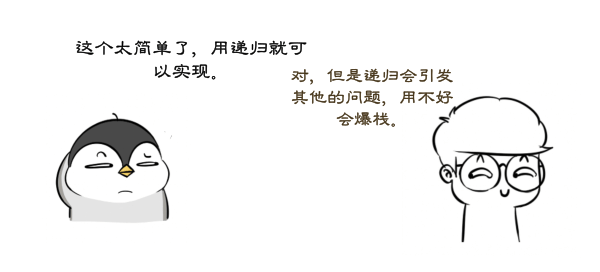
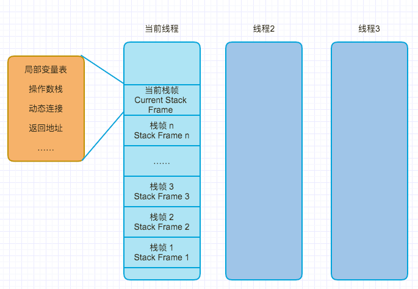
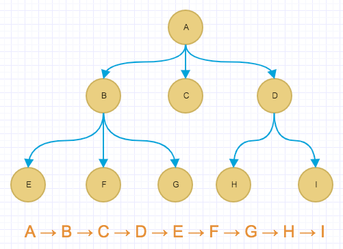
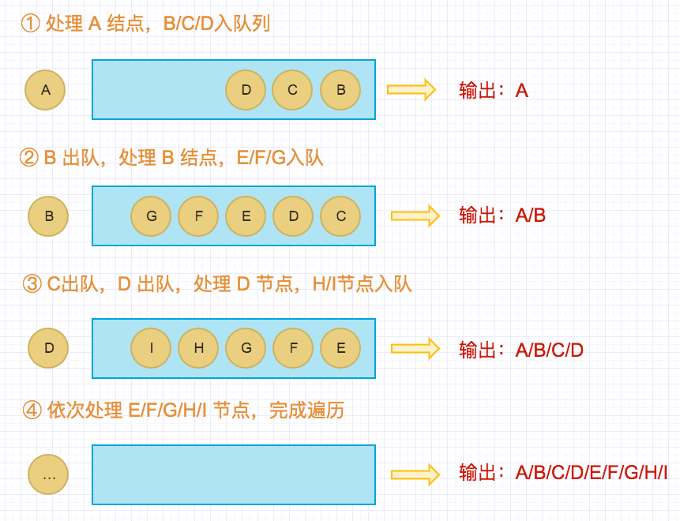
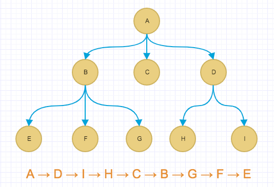
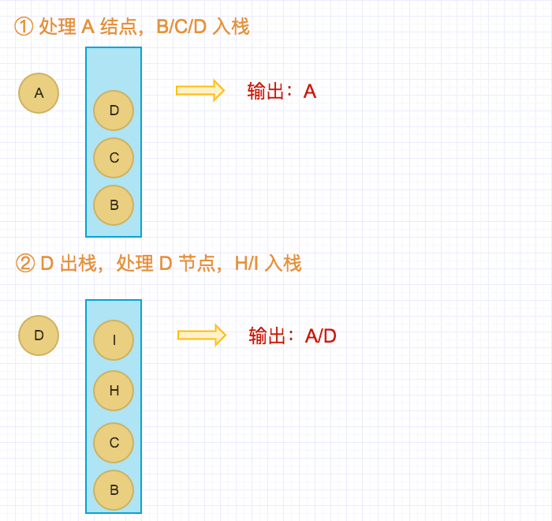
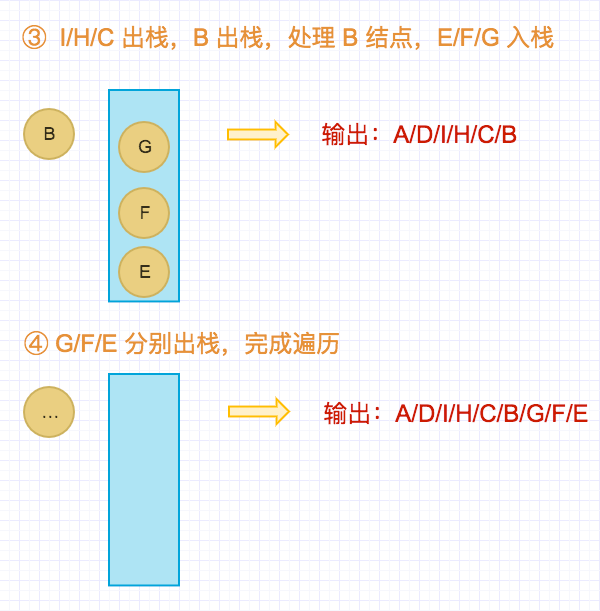

> 本文由 [简悦 SimpRead](http://ksria.com/simpread/) 转码， 原文地址 [cloud.tencent.com](https://cloud.tencent.com/developer/article/1513280)

> 在 Android 下，UI 的布局结构，对标到数据结构中，本质就是一个由 View 和 ViewGroup 组成的多叉树结构。其中 View 只能作为叶子节点...


一. 审题
-----

**面试题：**

**给定一个 RootView，打印其内 View Tree 的每个 View。**

在 Android 下，UI 的布局结构，对标到数据结构中，本质就是一个由 View 和 ViewGroup 组成的多叉树结构。其中 View 只能作为叶子节点，而 ViewGroup 是可以存在子节点的。


上图就是一个典型的 ViewTree 的结构，而想要遍历这个 ViewTree，还需要用到两个 ViewGroup 的方法。

*   `getChildCount()`：获取其子 View 的个数。
*   `getChildAt(int)`：获取对应索引的子 View。

对于 View，无需过多处理，直接打印输出即可。而 ViewGroup，除了打印自身的这个节点之外，还需要打印其子节点。

二. 解题的三种实现
----------

### 2.1 递归实现



**当一个大问题，可以被拆分成多个小问题，并且分解后的小问题，和大问题相比，只是数据规模不同，求解思路完全一致的问题，非常适合递归来实现。**

```kotlin
fun recursionPrint(root: View) {
    printView(root)
    if (root is ViewGroup) {
        for (childIndex in 0 until root.childCount) {
            val childView = root.getChildAt(childIndex)
            recursionPrint(childView)
        }
    }
}
```

递归确实可以很清晰的实现功能，但是它有一个致命的问题，当递归深度过深的时候，会爆栈。反应在程序上，就是会抛出 `StackOverflowError`这个异常。

面试的时候，面试者解决问题的思路，**使用了递归思想，通常都会很自然的问问 JVM 的栈帧，以及为什么会出现 StackOverflowError 异常。**

当然这不是本文的重点，大家了解一下即可。

简单来说，每启动一个线程，JVM 都会为其分配一个 Java 栈，每调用一个方法，都会被封装成一个栈帧，进行**压栈**操作，当方法执行完成之后，又会执行**弹栈**操作。而每个栈帧中，当前调用的方法的一些局部变量、动态连接，以及返回地址等数据。

Java 栈和数据结构的栈结构一样，有两个操作，压栈（入栈）、弹栈（出栈），是一个先入后出（FILO）的结构。这一块的东西，延伸出来就比较多了，你可以简单的理解为调用方法就会压栈，方法执行完会弹栈。



每次方法的调用，执行压栈的操作，但是每个栈帧，都是要消耗内存的。一旦超过了限制，就会爆掉，抛出 StackOverflowError。

递归的代码确实清晰简单，但是问题不少。面试官也不担心面试者写递归代码，后续可以有一连串问题等着。

### 2.2 广度优先实现

前面也提到，这道题本质上就是数据结构中，多叉树的遍历。那最先想到的就是深度优先和广度优先两种遍历策略。

我们先来看看广度优先的实现

广度优先的过程，就是对每一层节点依次访问，访问完了再进入下一层。就是**按树的深度，一层层的遍历访问**。



ABCDEFGHI 就是上图这个多叉树，使用广度优先算法的遍历结果。

**广度优先非常适合用先入先出的队列来实现**，每次子 View 都入队尾，而从对头取新的 View 进行处理。



代码如下：

```kotlin
fun breadthFirst(root :View){
    val viewDeque = LinkedList<View>()
    var view = root
    viewDeque.push(view)
    while (!viewDeque.isEmpty()){
        view = viewDeque.poll()
        printView(view)
        if(view is ViewGroup){
            for(childIndex in 0 until view.childCount){
                val childView = view.getChildAt(childIndex)
                viewDeque.addLast(childView)
            }
        }
    }
}
```

这里直接利用 `LinkedList` 来实现队列，它本身就实现了双端队列 `Deque`接口。

### 2.3 深度优先实现

说完广度深度，再继续看看深度优先。

深度优先的过程，就是对每个可能的分支路径，深度到叶子节点，并且每个节点只访问一次。



ADIHCBGFE 就是上图这个多叉树，使用深度优先算法的遍历结果。

在实现上，**深度优先非常适合用先入后出的栈来实现**。逻辑不复杂，直接上执行时，栈的数据变换。





代码实现如下：

```kotlin
fun depthFirst(root :View){
    val viewDeque = LinkedList<View>()
    var view = root
    viewDeque.push(view)
    while (!viewDeque.isEmpty()){
        view = viewDeque.pop()
        printView(view)
        if(view is ViewGroup){
            for(childIndex in 0 until view.childCount){
                val childView = view.getChildAt(childIndex)
                viewDeque.push(childView)
            }
        }
    }
}
```

依然利用 `LinkedList` 来当栈使用，利用 `push()` 和 `pop()` 实现栈的逻辑。

三. 小结时刻
-------

今天聊的 View 树的遍历，本质上就是数据结构中，多叉树的遍历，不同的实现方式用来解决不同的问题。

其实这道题，还有一些变种，例如统计 ViewGroup 子 View 的数量、分层打印 ViewTree、查找 ID 为 Xxx 的 View 等，有兴趣可以试着写写代码。

算法题就是这样，有一些是考验编码能力，另一些是解决问题的思路，多思考多写，才是正道。
