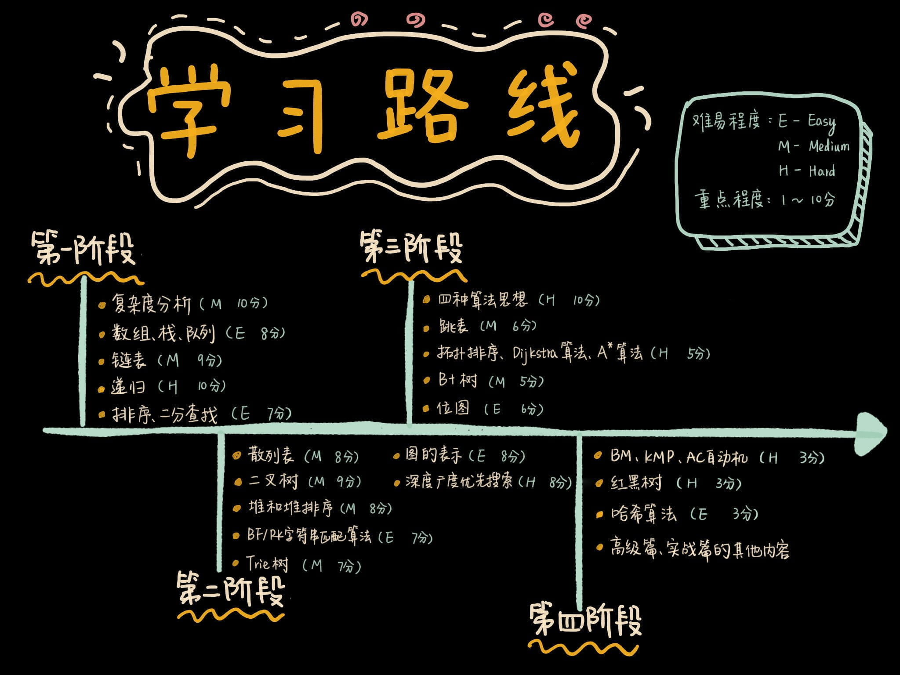

主要按照极客时间算法与数据结构之美学习，每一个算法都单独写一个笔记，再附上LeetCode上对应的联系提解题思路，解题思路要附加上演变过程。

对于极客时间的补充[玩转数据结构](https://pan.baidu.com/disk/home?#/all?vmode=list&path=%2FDEVELOPER%2F算法%2F[01]数据结构 Java)

[leetCode C++ 刷题](https://pan.baidu.com/disk/home?#/all?vmode=list&path=%2FDEVELOPER%2F算法%2F[02]刷题 C%2B%2B)

经典问题题解：[算法通关40讲]([https://pan.baidu.com/disk/home?#/all?vmode=list&path=%2FDEVELOPER%2F%E7%AE%97%E6%B3%95%2F70-%E7%AE%97%E6%B3%95%E9%9D%A2%E8%AF%95%E9%80%9A%E5%85%B340%E8%AE%B2](https://pan.baidu.com/disk/home?#/all?vmode=list&path=%2FDEVELOPER%2F算法%2F70-算法面试通关40讲))

先刷《剑指 Offer 》的题，然后刷算法通关40讲的题，这两个是面试常考的题，在根据**[ Just-Code](https://github.com/YaxeZhang/Just-Code)**做专项练习，刷大厂面试常见题

#### 资料

较详细：[极客大学算法训练营毕业总结](https://blog.csdn.net/Miaoshuowen/article/details/103582532)

[极客时间 算法训练营 毕业总结](https://blog.csdn.net/leacock1991/article/details/103554929?utm_medium=distribute.pc_relevant.none-task-blog-BlogCommendFromMachineLearnPai2-1.nonecase&depth_1-utm_source=distribute.pc_relevant.none-task-blog-BlogCommendFromMachineLearnPai2-1.nonecase)

[算法训练营总结](https://blog.csdn.net/leacock1991/category_9538790.html)

极客时间数据结构与算法之美学习路线图

[leetcode刷题总结之二叉搜索树](https://blog.csdn.net/qq_43152052/article/details/1039546130)

[leetcode刷题总结之链表](https://xiaoneng.blog.csdn.net/article/details/104007259)

[leetcode刷题总结之回溯法](https://blog.csdn.net/qq_43152052/article/details/103274637)