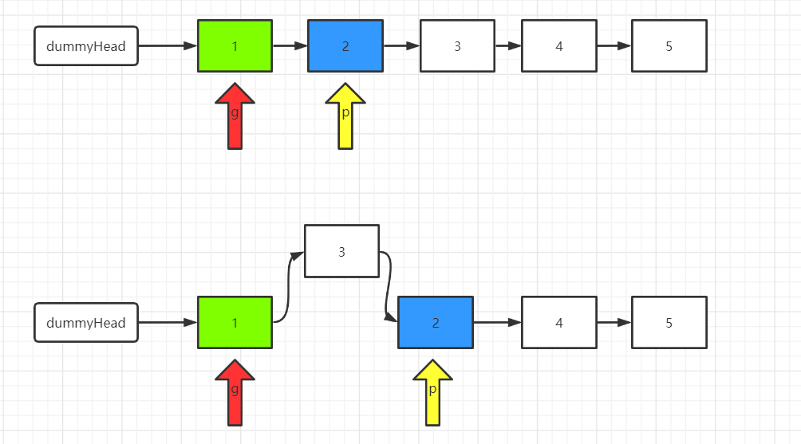

[toc]


# 排序

```java
/**
 * 快速排序
 * <p>
 * Create by im_dsd 2020/9/19 5:44 下午
 */
class QuickSort {
    public static int[] quickSort(int[] array, int start, int end) {
        if (array == null || start < 0 || end >= array.length || start >= end) {
            return array;
        }
        int index = partition(array, start, end);
        quickSort(array, start, index - 1);
        quickSort(array, index + 1, end);
        return array;
    }

    public static int partition(int[] array, int start, int end) {
        int pivot = array[end];
        int i = (start - 1);
        for (int j = start; j < end; j++) {
            if (array[j] < pivot) {
                i++;
                swap(array, i, j);
            }
        }
        swap(array, i + 1, end);
        return i + 1;
    }

    public static void swap(int[] array, int i, int j) {
        int swapTemp = array[i];
        array[i] = array[j];
        array[j] = swapTemp;
    }
}
```


## [二分查找](https://leetcode-cn.com/problems/binary-search/)

```java
class Solution {
    public int search(int[] nums, int target) {
        int pivot, left = 0, right = nums.length - 1;
        while (left <= right) {
          	// 防止 right + left 溢出整数范围
            pivot = left + (right - left) / 2;
            if (nums[pivot] == target) {
                return pivot;
            } 
            if (target < nums[pivot]) {
                right = pivot - 1;
            } else {
                left = pivot + 1;
            }
        }
        return -1;
    }
}
```


# [反转链表](https://leetcode-cn.com/problems/fan-zhuan-lian-biao-lcof/)

2020/09/13

```java
public class Solution {
    public ListNode ReverseList(ListNode head) {
        if (head == null || head.next == null) {
            return head;
        }
        ListNode dummy = new ListNode(Integer.MIN_VALUE);
        ListNode curNode = dummy;
        while (head != null) {
            ListNode next = head.next;
            head.next = dummy.next;
            dummy.next = head;
            head = next;
        }
        return dummy.next;
    }
}
```

# [反转链表 II](https://leetcode-cn.com/problems/reverse-linked-list-ii/)

21/8/30

使用 dummpy 节点 + 头插法可以很好接的解决

1、我们定义两个指针，分别称之为 g(guard 守卫) 和 p(point)。
我们首先根据方法的参数 m 确定 g 和 p 的位置。将 g 移动到第一个要反转的节点的前面，将 p 移动到第一个要反转的节点的位置上。我们以 m=2，n=4为例。
2、将 p 后面的元素删除，然后添加到 g 的后面。也即头插法。
3、根据 m 和 n 重复步骤（2）
4、返回 dummyHead.next




```java
class Solution {
    public ListNode reverseBetween(ListNode head, int m, int n) {
        // 定义一个dummyHead, 方便处理
        ListNode dummyHead = new ListNode(0);
        dummyHead.next = head;
            // 初始化指针
    ListNode g = dummyHead;
    ListNode p = dummyHead.next;

    // 将指针移到相应的位置
    for(int step = 0; step < m - 1; step++) {
        g = g.next; p = p.next;
    }

    // 头插法插入节点
    for (int i = 0; i < n - m; i++) {
        ListNode removed = p.next;
        p.next = p.next.next;

        removed.next = g.next;
        g.next = removed;
    }

    return dummyHead.next;
}
```

# [排序算法](https://www.nowcoder.com/practice/2baf799ea0594abd974d37139de27896?tpId=194&&tqId=37494&rp=1&ru=/activity/oj&qru=/ta/job-code-high-client/question-ranking)

整体复习资料： [排序算法.md](排序算法.md) 


# [LRU缓存机制](https://leetcode-cn.com/problems/lru-cache/)

2020/09/14 凌晨

```java
class LRUCache {
    private final LinkedHashMap<Integer, Integer> cache;

    public LRUCache(int capacity) {
        cache = new LinkedHashMap<Integer, Integer> (capacity, 0.75f, true) {
            @Override
            protected boolean removeEldestEntry(Map.Entry eldest) {
                return cache.size() > capacity;
            }
        };
    }
    
    public int get(int key) {
        return cache.getOrDefault(key, -1);
    }
    
    public void put(int key, int value) {
        cache.put(key, value);
    }
}

```

方法二：

```java

/**
 * LRUCache 的简单实现
 * 原理：使用双向链表维护顺序，使用 HashMap 作映射
 * <p>
 * Create by im_dsd 2020/9/14 12:03 上午
 */
public class LRUCache {
    /**
     * 映射存储
     */
    private final Map<Integer, Node> mMap;
    /**
     * 节点的顺序
     */
    private final NodeLink mNodeLink;
    private final int mCapacity;

    public LRUCache(int capacity) {
        mCapacity = capacity;
        mMap = new HashMap<>(capacity);
        mNodeLink = new NodeLink();
    }

    public int get(int key) {
        int result = -1;
        if (mMap.containsKey(key)) {
            // 移动节点到链表的头部
            Node node = mMap.get(key);
            result = node.value;
            mNodeLink.remove(node);
            mNodeLink.addFirst(node);
        }
        return result;
    }

    public void put(int key, int value) {
        Node node = new Node(key, value);
        if (mMap.containsKey(key)) {
            // 已经存在节点更新数据
            mMap.put(key, node);
            mNodeLink.remove(node);
            mNodeLink.addFirst(node);
        } else if (mNodeLink.size() >= mCapacity) {
            // 超过容量移除最后一个元素
            Node delete = mNodeLink.removeLast();
            if (delete != null) {
                // ！！！ Node 必须存储 key，才能定位到 map 中的位置
                mMap.remove(delete.key);
            }
            mMap.put(key, node);
        } else {
            // 直接添加
            mNodeLink.addFirst(node);
            mMap.put(key, node);
        }
    }

    /**
     * 双向链表的节点
     */
    private static class Node {
        Node pre, next;
        int key, value;

        public Node(int key, int value) {
            this.key = key;
            this.value = value;
        }
    }

    /**
     * 用户维护 Node 顺序的链表
     */
    private static class NodeLink {
        private int mSize;
        private final Node mHead;
        private final Node mTail;

        public NodeLink() {
            mHead = new Node(Integer.MIN_VALUE, Integer.MIN_VALUE);
            mTail = new Node(Integer.MIN_VALUE, Integer.MIN_VALUE);
            mHead.next = mTail;
            mTail.pre = mHead;
        }

        void addFirst(Node key) {
            if (key == null) {
                return;
            }
            Node next = mHead.next;
            mHead.next = key;
            key.next = next;
            next.pre = key;
            key.pre = mHead;
            mSize++;
        }

        boolean remove(Node node) {
            if (node == null || node.pre == null || node.next == null) {
                return false;
            }
            Node next = node.next;
            node.pre.next = node.next;
            next.pre = node.pre;
            mSize--;
            return true;
        }

        Node removeLast() {
            if (mSize <= 0 || mTail.pre.pre == null) {
                return null;
            }
            Node delete = mTail.pre;
            delete.pre.next = mTail;
            mTail.pre = delete.pre;
            mSize--;
            return delete;
        }

        int size() {
            return mSize;
        }
    }
```


# [设计 LRU 缓存结构](https://www.nowcoder.com/practice/e3769a5f49894d49b871c09cadd13a61?tpId=194&&tqId=35255&rp=1&ru=/ta/job-code-high-client&qru=/ta/job-code-high-client/question-ranking)

```java
import java.util.*;


public class Solution {
    private Map<Integer, Node> mCache;
    private DoubleLinkedList mList;
    private int mCapacity;
  
    /**
     * lru design
     * @param operators int整型二维数组 the ops
     * @param k int整型 the k
     * @return int整型一维数组
     */
    public int[] LRU (int[][] operators, int k) {
        // write code here
        mCache = new HashMap<>();
        mList = new DoubleLinkedList();
        mCapacity = k;
        
        int resultLength = 0;
        int index = 0;
        for(int[] item : operators) {
            if(item.length > 0 && item[0] == 2) {
                resultLength++;
            }
        }
        if (resultLength == 0) {
            return new int[0];
        }
        final int[] result = new int[resultLength];
        for(int[] item : operators) {
            if (item.length == 0) {
                continue;
            }
            final int action = item[0];
            if (action == 1 && item.length >= 3) {
                put(item[1], item[2]); 
            } else if (action == 2 && item.length >= 2) {
                result[index++] = get(item[1]);
            }
        }
        return result;
    }
    
    private void put(int key, int value) {
        final Node node = new Node(key, value);
        mCache.put(key, node);
        mList.addFirst(node);
        if (mList.size <= mCapacity) {
            return;
        }
        Node older = mList.removeLast();
        if (older != null) {
            mCache.remove(older.key);
        }
    }
    
    private int get(int key) {
        Node result = mCache.get(key);
        if (result == null) {
            return -1;
        }
        mList.remove(result);
        mList.addFirst(result);
        return result.value;
    }
    
    /**
     * 数据节点
     */
    private static class Node {
        int key, value;
        Node pre, next;
        
        Node(int key, int value) {
            this.key = key;
            this.value = value;
        }
    }
    
    /**
     * 保存存储顺序的链表
     */
    private static class DoubleLinkedList {
        private final Node mHead, mTail;
        private int size;
        
        DoubleLinkedList() {
            mHead = new Node(Integer.MIN_VALUE, Integer.MIN_VALUE);
            mTail = new Node(Integer.MIN_VALUE, Integer.MIN_VALUE);
            mHead.next = mTail;
            mTail.pre = mHead;
        }
        
        /**
         * return older
         */
        public boolean remove(Node node) {
            if (size <= 0 || node == null || node.pre == null || node.next == null) {
                return false;
            }
            final Node preNode = node.pre;
            final Node nextNode = node.next;
            preNode.next = nextNode;
            nextNode.pre = preNode;
            size--;
            return true;
        }
        
        public void addFirst(Node node) {
            if (node == null) {
                return;
            }
            final Node next = mHead.next;
            mHead.next = node;
            node.pre = mHead;
            node.next = next;
            next.pre = node;
            size++;
        }
        
        public Node removeLast() {
            if(size <= 0 || mTail.pre == null || mTail.pre.pre == null) {
                return null;
            }
            Node node = mTail.pre;
            Node preNode = node.pre;
            preNode.next = mTail;
            mTail.pre = preNode;
            size--;
            return node;
        }
        
        public int size() {
            return size;
        }
    }
}
```


# [环形链表](https://leetcode-cn.com/problems/linked-list-cycle/)

龟兔赛跑的思路时间复杂度 O(n)、空间复杂度 O(n)

```java
public class Solution {
    public boolean hasCycle(ListNode head) {
        if (head == null || head.next == null) {
            return false;
        }
        ListNode fast = head;
        ListNode slow = head;
        while (fast != null && fast.next != null) {
            fast = fast.next.next;  
            slow = slow.next;
            if (slow == fast) {
                return true;
            }         
        }
        return false;
    }
}
```

# [合并两个有序链表](https://leetcode-cn.com/problems/merge-two-sorted-lists/)

```java

class Solution {
    public ListNode mergeTwoLists(ListNode l1, ListNode l2) {
        ListNode dummy = new ListNode(0);
        ListNode curNode = dummy;
        while (l1 != null && l2 != null) {
            if (l1.val <= l2.val) {
                curNode.next = l1;
                l1 = l1.next;
            } else {
                curNode.next = l2;
                l2 = l2.next;
            }
            curNode = curNode.next;
        }
        curNode.next = (l1 == null) ? l2 : l1;
        return dummy.next;
    }
}
```


# [最小的k个数](https://leetcode-cn.com/problems/zui-xiao-de-kge-shu-lcof/)

此题是常考题目，使用变种的快排即可，找到  k - 1 的位置即可结束

```java
class Solution {
    public int[] getLeastNumbers(int[] arr, int k) {
        if (arr == null || arr.length == 0 || k == 0) {
          	// 排序失败，返回空数组
            return new int[0];
        }
        // 注意：第 k 大个数的下表为 k - 1;
        return quickSearch(arr, 0 , arr.length - 1, k - 1);
    }

    private int[] quickSearch(int[] arr, int first, int last, int k) {
        int index = partition(arr, first, last);
        // 关键是找到低 k 个就可以停下了
        if (index == k) {
          	// 函数的参数不包含最后一个
            return Arrays.copyOf(arr, index + 1);
        }
        if (index > k) {
            return quickSearch(arr, first, index - 1, k);
        } else {
            return quickSearch(arr, index + 1, last, k);
        }
    }

    private int partition(int[] arr, int first, int last) {
        int pivot = arr[last];
        int i = (first - 1);
        for (int j = first; j < last; j++) {
            if (arr[j] < pivot) {
                i++;
                swap(arr, i, j);
            }
        }
        swap(arr, i + 1, last);
        return i + 1;
    }

    private void swap(int[] arr, int i, int j) {
        int temp = arr[i];
        arr[i] = arr[j];
        arr[j] = temp;
    }    
}
```

**复杂度分析**

* 时间复杂度：O(n)O(n)，如上文所述，证明过程可以参考「《算法导论》9.2：期望为线性的选择算法」。
* 空间复杂度：O(\log n)O(logn)，递归使用栈空间的空间代价的期望为 O(\log n)O(logn)


# [数组中的第K个最大元素](https://leetcode-cn.com/problems/kth-largest-element-in-an-array/)

和上面的题一样使用快排算法，找到 length - k 的位置即可结束

```java
class Solution {
    public int findKthLargest(int[] nums, int k) {
        int length = nums.length;
        return quickSearch(nums, 0, length - 1, length - k);
    }

    private int quickSearch(int[] array, int first, int last, int k) {
        int index = partition(array, first, last);
        if (index == k) {
            return array[index];
        }
        if (index > k) {
            return quickSearch(array, first, index - 1, k);
        } else {
            return quickSearch(array, index + 1, last, k);
        }
    }

    private int partition(int[] array, int first, int last) {
        int pivot = array[last];
        int i = (first - 1);
        for (int j = first; j < last; j++) {
            if (array[j] < pivot) {
                swap(array, ++i, j);
            }
        }
        swap(array, ++i, last);
        return i;
    }

    private void swap(int[] array, int i, int j) {
        int temp = array[i];
        array[i] = array[j];
        array[j] = temp;
    }
}
```

**复杂度分析**

* 时间复杂度：O(n)O(n)，如上文所述，证明过程可以参考「《算法导论》9.2：期望为线性的选择算法」。
* 空间复杂度：O(\log n)O(logn)，递归使用栈空间的空间代价的期望为 O(\log n)O(logn)


# [链表中倒数第k个节点](https://leetcode-cn.com/problems/lian-biao-zhong-dao-shu-di-kge-jie-dian-lcof/)

2020/09/20 19:09

这道题的思路就是使用快慢指针。先让快指针走 k 步，然后在两个一起走，当快指针都为 null 的时候此时慢指针指向的就是倒数第k个节点。


```java
class Solution {
    public ListNode getKthFromEnd(ListNode head, int k) {
        if (head == null || k < 1) {
            return head;
        }
        ListNode faster = head;
        ListNode slower = head;
        int index = 0;
        while (faster != null) {
            faster = faster.next;
            if (++index > k) {
                slower = slower.next;
            }
        }
        return slower;
    }
}
```

# [用两个栈实现队列](https://leetcode-cn.com/problems/yong-liang-ge-zhan-shi-xian-dui-lie-lcof/)

2020/09/20 19:09

```java
class CQueue {

    private final Stack<Integer> stack1 = new Stack<>();
    private final Stack<Integer> stack2 = new Stack<>();
    
    public void appendTail(int value) {
        stack1.push(value);
    }
    
    public int deleteHead() {
        if (stack2.isEmpty()) {
            while (!stack1.isEmpty()) {
                stack2.push(stack1.pop());
            }
        }
        return stack2.isEmpty() ?  -1 : stack2.pop();
    }
}
```


# [链表求和: 倒序](https://leetcode-cn.com/problems/sum-lists-lcci/)

此题的集体难点在于边界判断和进位

```java
class Solution {
    public ListNode addTwoNumbers(ListNode head1, ListNode head2) {
       // write code here
        if (head1 == null) {
            return head2;
        }
        if (head2 == null) {
            return head1;
        }
        ListNode dumpy = new ListNode(Integer.MIN_VALUE);
        ListNode curNode = dumpy;
        int temp = 0;
        while (head1 != null || head2 != null) {
            int val1 = (head1 == null) ? 0 : head1.val;
            int val2 = (head2 == null) ? 0 : head2.val;
            int result = temp + val1 + val2;
            temp = result / 10;
            curNode.next = new ListNode(result % 10);
            curNode = curNode.next;
          	// 判 null 处理
            head1 = (head1 == null) ? head1 : head1.next;
            head2 = (head2 == null) ? head2 : head2.next;
        }
        if (temp > 0) {
            curNode.next = new ListNode(temp);
        }
        return dumpy.next;
    }
}
```

# [链表求和：正序](https://www.nowcoder.com/practice/c56f6c70fb3f4849bc56e33ff2a50b6b?tpId=194&&tqId=35257&rp=1&ru=/ta/job-code-high-client&qru=/ta/job-code-high-client/question-ranking)

在倒序的基础上做链表反转，但是时间复杂度过高，只能通过 75 % 的测试用例。

```java
import java.util.*;
public class Solution {
    /**
     * 
     * @param head1 ListNode类 
     * @param head2 ListNode类 
     * @return ListNode类
     */
    public ListNode addInList (ListNode head1, ListNode head2) {
        // write code here
        if (head1 == null) {
            return head2;
        }
        if (head2 == null) {
            return head1;
        }
        ListNode newHead1 = revert(head1);
        ListNode newHead2 = revert(head2);
        ListNode dumpy = new ListNode(Integer.MIN_VALUE);
        ListNode curNode = dumpy;
        int temp = 0;
        while (newHead1 != null || newHead2 != null) {
            int val1 = (newHead1 == null) ? 0 : newHead1.val;
            int val2 = (newHead2 == null) ? 0 : newHead2.val;
            int result = temp + val1 + val2;
            temp = result / 10;
            curNode.next = new ListNode(result % 10);
            curNode = curNode.next;
            newHead1 = (newHead1 == null) ? newHead1 : newHead1.next;
            newHead2 = (newHead2 == null) ? newHead2 : newHead2.next;
        }
        if (temp > 0) {
            curNode.next = new ListNode(temp);
        }
        return revert(dumpy.next);
    }
    
   /**
    * 反转链表
    */
    private ListNode revert(ListNode head) {
        if (head == null || head.next == null) {
            return head;
        }
        ListNode dumpy = new ListNode(Integer.MIN_VALUE);
        while (head != null) {
            ListNode next = head.next;
            head.next = dumpy.next;
            dumpy.next = head;
            head = next;
        }
        return dumpy.next;
    }
}
```

