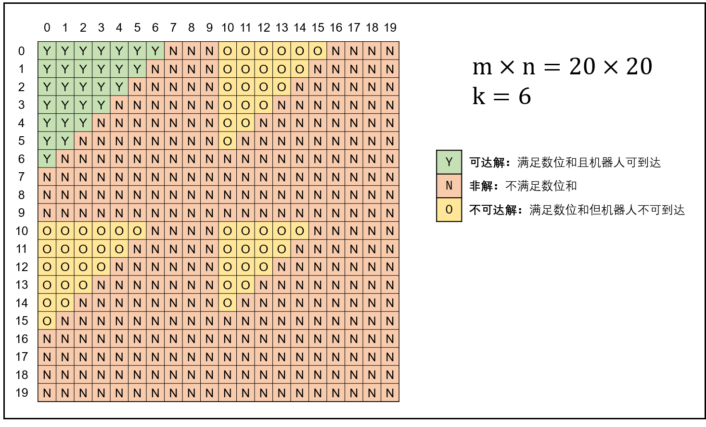

# [3. 数组中重复的数字](https://leetcode-cn.com/problems/shu-zu-zhong-zhong-fu-de-shu-zi-lcof/)

常见的解思路是使用 Set 作为辅助数据结构一次遍历集合如果 set 中已经有同样的 value 返回，否则加入。

```java
class Solution {
    public int findRepeatNumber(int[] nums) {
        final Set<Integer> cache = new HashSet<>();
        for (int i = 0; i < nums.length; i++) {
            if (cache.contains(nums[i])) {
                return nums[i];
            } else {
                cache.add(nums[i]);
            }
        }
        return -1;
    }
}
```

此解法的时间复杂度为 O(n)，空间复杂度 O(n)


但是此题很特殊：数组 nums 里的所有数字都在 0～n-1 的范围内，那么就有了一个空间复杂度为 O(1) 解发：

一次遍历数组，依次比较当前数字和下标与之对应的数字，如果数字和下标相等 continue，如果二者不相等则交换位置，相当则返回结果：

```java
class Solution {
    public int findRepeatNumber(int[] nums) {
        for (int i = 0; i < nums.length; i++) {
            if (i == nums[i]) {
                continue;
            }
            int target = nums[i];
            if (target == nums[target]) {
                return target;
            } else {
                nums[i] = nums[target];
                nums[target] = target;
            }
        }
        return -1;
    }
}
```

此解法的时间复杂度为 O(n)，空间复杂度 O(1)

# [二维数组中的查找](https://leetcode-cn.com/problems/er-wei-shu-zu-zhong-de-cha-zhao-lcof/)

这道题的思路就是缩小搜索空间。

1. 此题必须选用左下角，即 matrix\[matrix.length - 1][0] 否者选取左上角判断的条件很多，很难一次性写对！
2. 判断条件要判断数组是否为 null ，一位数组长度是否为 0，二维数组是否为 null。

```java
class Solution {
    public boolean findNumberIn2DArray(int[][] matrix, int target) {
        if (matrix == null || matrix.length == 0 || matrix[0] == null) {
            return false;
        }
        int curRow = matrix.length - 1;
        int curColumns = 0;
        while (curRow >= 0 && curColumns < matrix[0].length) {
            final int flag = matrix[curRow][curColumns];
            if (target == flag) {
                return true;
            } 
            if (target > flag) {
                curColumns++;
            } else {
                curRow--;
            }
        }
        return false;
    }
}
```

# [06. 从尾到头打印链表](https://leetcode-cn.com/problems/cong-wei-dao-tou-da-yin-lian-biao-lcof/)

1. 使用辅助栈，完成先进后出的特点：时间复杂度为 O(n) 空间复杂度为 O(n) 

```
/**
 * Definition for singly-linked list.
 * public class ListNode {
 *     int val;
 *     ListNode next;
 *     ListNode(int x) { val = x; }
 * }
 */
class Solution {
    public int[] reversePrint(ListNode head) {
        final Stack<ListNode> stack = new Stack<>();
        int count = 0;
        while (head != null) {
            stack.push(head);
            head = head.next;
            count++;
        }
        int index = 0;
        final int[] result = new int[count];
        while (!stack.empty()) {
            result[index++] = stack.pop().val;
        }
        return result;
    }
}
```

2. 使用数组下标索引特性,不借助任何辅助数据结构：时间复杂度为 O(n) 空间复杂度为 O(1) 

```java
/**
 * Definition for singly-linked list.
 * public class ListNode {
 *     int val;
 *     ListNode next;
 *     ListNode(int x) { val = x; }
 * }
 */
class Solution {
    public int[] reversePrint(ListNode head) {
        int capacity = 0;
        ListNode node = head;
        while (node != null) {
            capacity++;
            node = node.next;
        }
        int[] result = new int[capacity];
        while (head != null) {
            result[capacity - 1] = head.val;
            head = head.next;
            capacity--;
        }
        return result;
    }
}
```

# [07. 重建二叉树](https://leetcode-cn.com/problems/zhong-jian-er-cha-shu-lcof/)

这道题要求面试者熟悉二叉树的遍历特点：

1. 前序遍历：|头节点|左子树|右子树|
2. 中序遍历：|左子树|头节点|右子树|

根据这个特点可以设计一个递归算法，时间和空间复杂度都为 O(n)

```java
/**
 * Definition for a binary tree node.
 * public class TreeNode {
 *     int val;
 *     TreeNode left;
 *     TreeNode right;
 *     TreeNode(int x) { val = x; }
 * }
 */
class Solution {
    // 记录当前根节点索引
    private int mCurRootIndex = 0;
    // 用于确定当前根节点在 inorder 的索引位置
    private Map<Integer, Integer> cache = new HashMap<>();

    public TreeNode buildTree(int[] preorder, int[] inorder) {
        int idx = 0;
        for (int nums : inorder) {
            cache.put(nums, idx++);
        }
        return buildTree(preorder, inorder, 0, inorder.length - 1);
    }

    private TreeNode buildTree(int[] preorder, int[] inorder, int start, int end) {
        // 递归完毕
        if (start > end) {
            return null;
        }
        // 当前根节点的值，取值后索引++
        int curRootNums = preorder[mCurRootIndex++];
        // 当前根节点在 inorder 中的位置，从而确定左右子数范围：|左子数集合|curRoot|右子数集合|（这是 inorder）
        int curRootIdxInOrder = cache.get(curRootNums);
        // 建立当前 root
        TreeNode curRoot = new TreeNode(curRootNums);
        // 遍历左子数集合
        curRoot.left = buildTree(preorder, inorder, start, curRootIdxInOrder - 1);
        // 遍历右子数集合
        curRoot.right = buildTree(preorder, inorder, curRootIdxInOrder + 1, end);
        return curRoot;
    }
}
```


# [10- I. 斐波那契数列](https://leetcode-cn.com/problems/fei-bo-na-qi-shu-lie-lcof/)

采用递归的方式是第一直观感受，但是递归算法设计大量重复计算，需要引入 HashMap 作为缓冲才能通过测试

```java
import java.util.*;

class Solution {
    private Map<Integer, Integer> mMap = new HashMap<>();
    public int fib(int n) {
        if (n <= 1) {
            return n;
        }
        if (mMap.containsKey(n)) {
            return mMap.get(n);
        } 
        int result = fib(n - 1) + fib(n - 2);
        mMap.put(n, result);
        return result;
    }
}
```

此解法时间、空间复杂度都为：O（n）


还可以使用递推从下往上计算：首先根据 f(0) 和 f(1) 计算出 f(2) 在根据 f(1) 和 f(2) 算出 f(3)……。此解法时间复杂度：O(n)、空间复杂度都为：O（1）

```java
class Solution {
    public int fib(int n) {
        int[] result = new int[]{0, 1};
        if (n < 2) {
            return result[n];
        }
        int fibOne = 0;
        int fibTow = 1;
        int fibN = 0;
        for (int i = 2; i <= n; i++) {
            fibN = fibOne + fibTow % 1000000007;
            fibOne = fibTow;
            fibTow = fibN;
        }
        return fibN;
    }
}
```

# [12. 矩阵中的路径](https://leetcode-cn.com/problems/ju-zhen-zhong-de-lu-jing-lcof/)

```java
class Solution {
    public boolean exist(char[][] board, String word) {
        char[] words = word.toCharArray();
        for (int y = 0; y < board.length; y++) {
            for (int x = 0; x < board[0].length; x++) {
                if(dfs(board, x, y, words, 0)) {
                    return true;
                }
            }
        }
        return false;
    }

    private boolean dfs(char[][]board, int x, int y, char[] words, int wordIndex) {
      	// 搜索的边界
        if (x < 0 || y < 0 || x >= board[0].length || y >= board.length) {
            return false;
        }
        // 不相等
        if (board[y][x] != words[wordIndex]) {
            return false;
        }
      	// 所有单词搜索完毕
        if (wordIndex == words.length - 1) {
            return true;
        }
        char tmp = board[y][x];
        // 防止重复搜索
        board[y][x] = '/';
        // 搜索左上右下
        boolean result = dfs(board, x - 1, y, words, wordIndex + 1)
                      || dfs(board, x, y + 1, words, wordIndex + 1)
                      || dfs(board, x + 1, y, words, wordIndex + 1)
                      || dfs(board, x, y - 1, words, wordIndex + 1);
        // 还原
        board[y][x] = tmp;
        return result;
    }
}
```

时间复杂度：O(M*N) ;空间复杂度： O(k) k = words.length


# [13. 机器人的运动范围](https://leetcode-cn.com/problems/ji-qi-ren-de-yun-dong-fan-wei-lcof/) 

20-09-03

> 地上有一个m行n列的方格，从坐标 [0,0] 到坐标 [m-1,n-1] 。一个机器人从坐标 [0, 0] 的格子开始移动，它每次可以向左、右、上、下移动一格（不能移动到方格外），也不能进入行坐标和列坐标的数位之和大于k的格子。例如，当k为18时，机器人能够进入方格 [35, 37] ，因为3+5+3+7=18。但它不能进入方格 [35, 38]，因为3+5+3+8=19。请问该机器人能够到达多少个格子？

这道题还是矩阵搜索题目，适用回溯 + DFS 深度优先算法解决。

这道题暗含两个优化点：

1. 位数之和的计算方式

   正常来讲计算位数之和需要使用如下函数：

   ```java
   private int sum(int i, int j) {
       int sum = 0;
       while (i != 0) {
           sum += i % 10;
           i /= 10;
       }
       return sum;
   }
   ```

   但是此题的取值是连续的即 x、 x  + 1、x + 2、 ……、x + ∞。所以适用如下公式：

   $$ s(x + 1)= \begin{cases} x - 8 & \text {$x \% 10 = 0$} \\ x + 1 & \text{$x \% 10  \neq 0 $} \end{cases} $$

   

2. 搜索方向的优化

   根据数位和增量公式得知，数位和每逢 **进位** 突变一次。则搜索路径为等腰三角形，所以可以看到只要向左、下搜索即可。

   

```java
class Solution {
    private int m;
    private int n;
    private int k;
    private boolean[][] visited;
    public int movingCount(int m, int n, int k) {
        this.m = m;
        this.n = n;
        this.k = k;
        visited = new boolean[m][n];
        return dfs(0, 0, 0, 0);
    }

    private int dfs(int m, int n, int sm, int sn) {
        // 只向左、下搜索，搜索过的地方也不再搜索
        // 注意边界条件：>=
        if (m >= this.m || n >= this.n || visited[m][n] || k < sm + sn) {
            return 0;
        }
      	// 标记已经搜索完毕
        visited[m][n] = true
        // 特殊的位数之和计算方式 S(x + 1) = (x + 1) % 10 == 0 ? S(x) - 8 : S(x) + 1;
        int newSm = dfs(m + 1, n, (m + 1) % 10 == 0 ? sm - 8 : sm + 1, sn);
        int newSn = dfs(m, n + 1, sm, (n + 1) % 10 == 0 ? sn - 8 : sn + 1);
        return 1 + newSm + newSn;
    }
}
```

时间、空间复杂度：O（MN）


# [14- I. 剪绳子](https://leetcode-cn.com/problems/jian-sheng-zi-lcof/)

20-09-09

剪绳子问题体现的是贪婪算法：尽可能多的剪绳子、最好每段都是 3 这样乘积最大。

```java
class Solution {
    public int cuttingRope(int n) {
        if (n <= 3) {
            return n -1;
        }
       // 最终结果
        int result = 1;
       // 剩下的绳子比 4 大，就接着剪
        while (n > 4) {
            result *= 3;
            n -= 3;
        }
        // 最后的 n 的取值范围是 1、2、3、4.而此时最大乘基就是自身。
        // 再剪反而变小
        return result * n;
    }
}
```

# [14- II. 剪绳子 II](https://leetcode-cn.com/problems/jian-sheng-zi-ii-lcof/)

20-09-09

这道题是上面一题的延伸，主要解决的是 int 容量溢出的问题。

```JAVA
class Solution {
    public int cuttingRope(int n) {
        if (n <= 3) {
            return n - 1;
        }
        // 最终结果
        long result = 1;
        // 剩下的绳子比 4 大就接着剪
        while (n > 4) {
            result *= 3;
            result = result % 1000000007;
            n -= 3;
        }
        // 最后的 n 的取值范围是 1、2、3、4.而此时最大乘基就是自身。
        // 再剪反而变小
        return (int)(result * n % 1000000007);
    }
}
```

# [ 16. 数值的整数次方](https://leetcode-cn.com/problems/shu-zhi-de-zheng-shu-ci-fang-lcof/)

2020/09/13

这道题看似简单其实暗藏了各种边界条件的判断：：x = 0、n = 0、n = 1、n < 0 等等。

此题的主要运用了二分查找和位运算的方式解决

1. Java 代码中 int32 变量 $n \in [-2147483648, 2147483647] $，因此当 $n = -2147483648$ 时执行 $n = -n$ 会因越界而赋值出错。解决方法是先将 n存入 long 变量 exponent ，后面用 exponent 操作即可。
2. $$a^n = \begin{cases} a^{n/2} *  a^{n/2} & \text{$n 为偶数$} \\a^{(n - 1)/2} *  a^{(n - 1)/2} & \text {$n 为奇数$}\end{cases}  $$


## 解法1：递推，时间复杂度 O(logn)、空间复杂度O(1)

```java
class Solution {
    public double myPow(double x, int n) {
        // 0 的任何次方都无意义。
        if (x == 0) {
            return 0;
        }
        // 任何数的 0 次方都等于 1
        if (n == 0) {
            return 1;
        }
        // 任何数的 1 次方都等于原数字
        if (n == 1) {
            return x;
        }
        // 见上文解释
        long exponent = n;
        // 如果 n < 0 着进行转化
        if (exponent < 0) {
            x = 1 / x;
            exponent = -exponent;
        }
        double result = 1;
       // 快速幂等算法
        while (exponent > 0) {
            // 判断二进制最右一位是否为 1,为 1 即为奇数
            if ((exponent & 1) == 1) {
                result *= x;
            }
            // 每次计算都计算 x^2 即可
            x *= x;
            // 相当于除以 2
            exponent >>= 1;
        }
        return result;
    }
}
```

## 解法2: 递归，时间复杂度 O(logn)、空间复杂度O(n)

```java
class Solution {
    public double myPow(double x, int n) {
        if (x == 0) {
            return 0;
        }
        if (n == 0) {
            // 任何数的 0 次方都等于 1
            return 1;
        }
        if (n == 1) {
            // 任何数的 1 次方都等于原数字
            return x;
        }
        long exponent = n;
        if (exponent < 0) {
            x = 1 / x;
            exponent = -exponent;
        }
       // 使用公式完成递推
        return ((exponent & 1) == 1) ? x * myPow(x * x, (int)(exponent >> 1))
                                      :myPow(x * x, (int)(exponent >> 1)) ;
    }
}
```