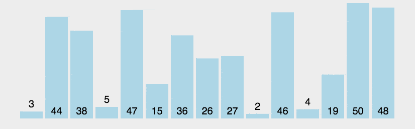
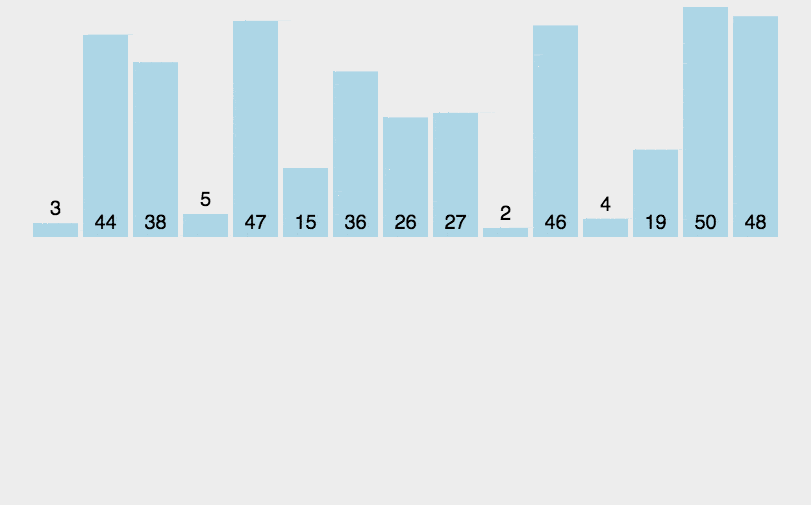
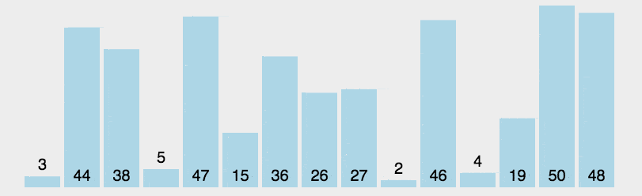

[动态图解十大经典排序算法](https://mp.weixin.qq.com/s/HQg3BzzQfJXcWyltsgOfCQ)

# 冒泡排序



```java

```

# 插入排序

1. 从第一个元素开始，该元素可以认为已经被排序；
2. 取出下一个元素，在已经排序的元素序列中从后向前扫描；
3. 如果该元素（已排序）大于新元素，将该元素移到下一位置；
4. 重复步骤3，直到找到已排序的元素小于或者等于新元素的位置；
5. 将新元素插入到该位置后；
6. 重复步骤2~5。



```java
    public int[] sortArray(int[] nums) {
        int length = nums.length;
        for (int i = 1; i < length; i ++) {
            int value = nums[i];
            int j = i - 1;
            for (; j >=0; j--) {
                if (nums[j] <= value) {
                    break;
                }
                nums[j + 1] = nums[j];
            }
            nums[j + 1] = value;
        }
        return nums;
    }
```


# 选择排序




```java
class Solution {
    public int[] sortArray(int[] nums) {
        // 选择排序
        for(int i = 0; i < nums.length; i++) {
            // 记录当前索引，假设当前索引是最小的
            int index = i;
            // k = i + 1 表示不用和自己比
            for (int k = i + 1; k < nums.length; k++) {
                // 记录比 index 还小的索引
                if (nums[k] < nums[index]) {
                    index = k;
                }
            }
            // 说明发现更小的了
            if (index != i) {
                int tmp = nums[index];
                nums[index] = nums[i];
                nums[i] = tmp;
            }
        }
        return nums;
    }
}
```

# 快速排序

```java
/**
 * 快速排序
 * <p>
 * Create by im_dsd 2020/9/19 5:44 下午
 */
class QuickSort {
    public static int[] quickSort(int[] array, int start, int end) {
        if (array == null || start < 0 || end >= array.length || start >= end) {
            return array;
        }
        int index = partition(array, start, end);
        quickSort(array, start, index - 1);
        quickSort(array, index + 1, end);
        return array;
    }

    public static int partition(int[] array, int start, int end) {
        int pivot = array[end];
        int i = (start - 1);
        for (int j = start; j < end; j++) {
            if (array[j] < pivot) {
                i++;
                swap(array, i, j);
            }
        }
        swap(array, i + 1, end);
        return i + 1;
    }

    public static void swap(int[] array, int i, int j) {
        int swapTemp = array[i];
        array[i] = array[j];
        array[j] = swapTemp;
    }
}
```

