> 本文由 [简悦 SimpRead](http://ksria.com/simpread/) 转码， 原文地址 [blog.csdn.net](https://blog.csdn.net/luo_boke/article/details/106762372)

[toc]


# 十种常见排序算法可以分为两大类：

1.  比较类排序：通过比较来决定元素间的相对次序，由于其时间复杂度不能突破 O(nlogn)，因此也称为非线性时间比较类排序。
2.  非比较类排序：不通过比较来决定元素间的相对次序，它可以突破基于比较排序的时间下界，以线性时间运行，因此也称为线性时间非比较类排序。

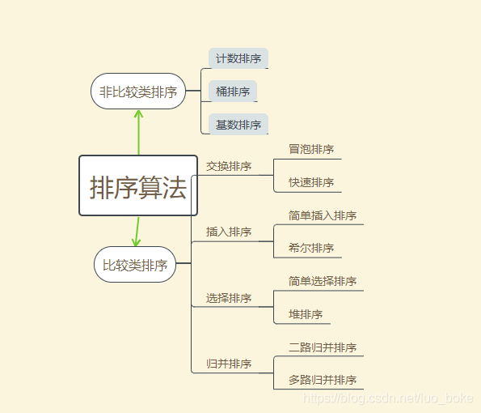

排序的时间和空间复杂度如下：  
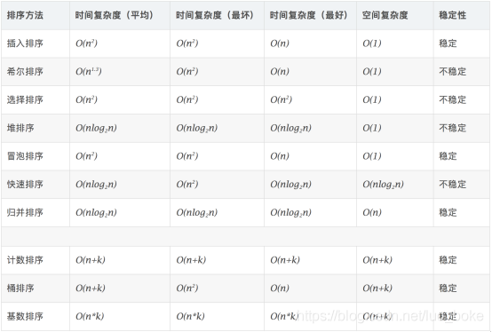  
关于对时间复杂度和空间复杂度的理解，后面会详细讲解

# ⭐️冒泡排序（Bubble Sort）

冒泡排序是一种简单的排序算法。它重复地走访过要排序的数列，一次比较两个元素，如果它们的顺序错误就把它们交换过来。走访数列的工作是重复地进行直到没有再需要交换，也就是说该数列已经排序完成。  
这个算法的名字由来是因为越小的元素会经由交换慢慢 “浮” 到数列的顶端。

**1. 算法描述**

*   比较相邻的元素。如果第一个比第二个大，就交换它们两个；
*   对每一对相邻元素作同样的工作，从开始第一对到结尾的最后一对，这样在最后的元素应该会是最大的数；
*   针对所有的元素重复以上的步骤，除了最后一个；
*   重复步骤 1~3，直到排序完成。

**2. 动画演示**  
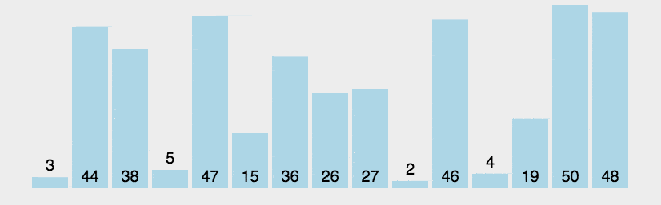  
**3. 代码**

```java
/**
 * 思想：两两比较将最大值推向最右端
 */
public int[] sortArray(int[] nums) {
        int length = nums.length;
        for (int i = 0; i < length; i++) {
            // length - i ：已经排序过得就不要比较了。-1 防止越界
            for (int j = 0; j < length - i - 1; j++) {
                // 小的在前大的在后
                if (nums[j] > nums[j + 1]) {
                    int tmp = nums[j + 1];
                    nums[j + 1] = nums[j];
                    nums[j] = tmp;
                }
            }
        }
        return nums;
    }
```

**4. 算法分析**  
冒泡排序的时间复杂度为 O(n2)，空间复杂度为 O(1)。

# ⭐️选择排序 （Selection Sort）

选择排序 (Selection-sort) 是一种简单直观的排序算法。它的工作原理：  
1）首先在未排序序列中找到最小（大）元素，存放到排序序列的起始位置  
2）然后，再从剩余未排序元素中继续寻找最小（大）元素（所有数据中第二小 / 大），然后放到已排序序列的末尾。 
3）以此类推，直到所有元素均排序完毕。

**1. 算法描述**
n 个记录的直接选择排序可经过 n-1 趟直接选择排序得到有序结果。假设 R[n] 代表有n个数据，具体算法描述如下：

1.  初始状态：无序区为 R[1…n]，有序区为空；
2.  第 i 趟排序 (i=1,2,3…n-1) 开始后，当前有序区和无序区分别为 R[1…i]和 R(i+1…n）。  
    该趟排序从当前无序区中 - 选出关键字最小的记录 R[k]，放在有序区末尾
3.  n-1 趟结束，数组有序化了。

**2. 动画演示**  
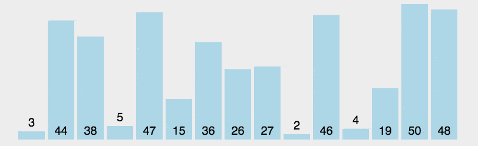  
**3. 代码**

```java
/**
 * 思想：每次遍历挑出一个最值来
 */
class Solution {
    public int[] sortArray(int[] nums) {
        for(int i = 0; i < nums.length; i++) {
            // 记录当前索引，假设当前索引是最小的
            int index = i;
            // k = i + 1 表示不用和自己比
            for (int k = i + 1; k < nums.length; k++) {
                // 记录比 index 还小的索引
                if (nums[k] < nums[index]) {
                    index = k;
                }
            }
            // 说明发现更小的了
            if (index != i) {
                int tmp = nums[index];
                nums[index] = nums[i];
                nums[i] = tmp;
            }
        }
        return nums;
    }
}
```

**4. 算法分析**  
表现最稳定的排序算法之一，因为无论什么数据进去都是 O(n^2) 的时间复杂度，所以用到它的时候，数据规模越小越好。

唯一的好处可能就是不占用额外的内存空间了吧。理论上讲，选择排序可能也是平时排序一般人想到的最多的排序方法了吧。

# ⭐️插入排序（Insertion Sort）

插入排序的算法描述是一种简单直观的排序算法。  
它的工作原理是通过构建有序序列，对于未排序数据，在已排序序列中从后向前扫描，找到相应位置并插入。

==1. **算法描述**== 
一般来说，插入排序都采用 in-place 在数组上实现。具体算法描述如下：

1.  从第一个元素开始，该元素可以认为已经被排序；
2.  取出下一个元素，在已经排序的元素序列中从后向前扫描；
3.  如果该元素（已排序）大于新元素，将该元素移到下一位置；
4.  重复步骤 3，直到找到已排序的元素小于或者等于新元素的位置；
5.  将新元素插入到该位置后；
6.  重复步骤 2~5。

**2. 动画演示**  
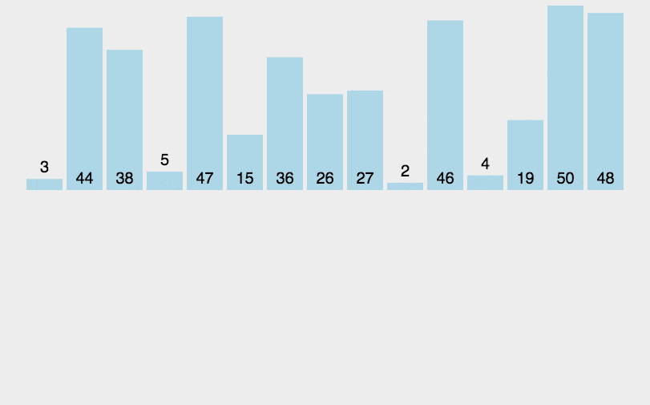  
**3. 代码**

```java
class Solution {
    public int[] sortArray(int[] nums) {
        if(nums == null || nums.length <= 1) {
            return nums;
        }
        // 可以认为第一个数字就有序的
        for(int i = 1; i < nums.length; i++) {
            // 需要排序的数字
            int curVal = nums[i];
            // 等于已经排序部分的最后一个索引
            int preIndex = i - 1;
            // 在已排序部分寻找要插入的位置：如果已排序元素 > 需要排序元素则将以排序元素移到下一位置
            // 从后向前扫描
            while(preIndex >= 0 && nums[preIndex] > curVal) {
                nums[preIndex + 1] = nums[preIndex];
                preIndex--;
            }
            // 插入已排序数组
            nums[preIndex + 1] = curVal;
        }
        return nums;
    }
}
```

**[单链表的插入排序](https://leetcode-cn.com/problems/insertion-sort-list/submissions/)**

单链表无法倒序遍历，所以只能从头开始遍历

```java
class Solution {
    public ListNode insertionSortList(ListNode head) {
        if (head == null || head.next == null) {
            return head;
        }
        // 创建哑结点方便在 head 前插入数据
        ListNode dummpy = new ListNode(-1);
        dummpy.next = head;
        // 记录最后一个有序节点，一开始假设第一个已经排好序
        ListNode lastSortedNode = head;
        // 当前需要新插入的结点
        ListNode curNode = head.next;
        while (curNode != null) {
            if (lastSortedNode.val <= curNode.val) {
                // 新插入值比最后一个还大就不用排序了，移动已排序指针
                lastSortedNode = curNode;
            } else {
                // 寻找前一个节点，后面需要排序用的
                ListNode prevNode = dummpy;
                // 正序寻找第一个比当前值大的节点
                while (prevNode.next.val <= curNode.val) {
                    prevNode = prevNode.next;
                }
                // 将 curr 插入到 prevNode 后面
                lastSortedNode.next = curNode.next;
                curNode.next = prevNode.next;
                prevNode.next = curNode;
            }
            // 更新当前节点，准备下一次插入
            curNode = lastSortedNode.next;
        }
        return dummpy.next;
    }
}
```


**4. 算法分析**  
插入排序在实现上，通常采用 in-place 排序（即只需用到 O(1) 的额外空间的排序）。  
前面的数据都是已经排好了的，因而在从后向前扫描过程中，需要反复把已排序元素逐步向后挪位，为最新元素提供插入空间。


==对于小规模数据和基本有序数据效率较高。==

如果要排序的数据已经是有序的，我们并不需要搬移任何数据。如果我们从尾到头在有序数据组里面查找插入位置，每次只需要比较一个数据就能确定插入的位置。所以这种情况下，最好是时间复杂度为 O(n)。

最好是时间复杂度为 O(n)如果数组是倒序的，每次插入都相当于在数组的第一个位置插入新的数据，所以需要移动大量的数据，所以最坏情况时间复杂度为 O(n^2)。

平均时间复杂度为 O(n^2)。


# 希尔排序（Shell Sort）

希尔排序按其设计者希尔（Donald Shell）的名字命名，它是一种基于插入排序的快速排序算法，要了解希尔排序，必须先掌握插入排序的原理与实现。

它是第一个突破 O(n^2) 的排序算法，它与插入排序的不同之处在于，它会优先比较距离较远的元素。希尔排序又叫**缩小增量排序**。它的效率提升实质是**希尔排序通过允许非相邻的等间距元素进行交换来减少插入排序频繁挪动元素的弊端**

希尔排序的算法思想是：
1）通过将比较的全部元素分为几个区域来提升插入排序的性能。这样可以让一个元素可以一次性地朝最终位置前进一大步。  
2）然后算法再取越来越小的步长进行排序，算法的最后一步就是普通的插入排序，此时相隔的步长为 1。  
3）最后一步需排序的数据几乎是已排好的了，此时插入排序较快，因为此时是几个有序组组成的。

**步长**  
将记录分割成 N 份，则 N 就是步长（且步长要小于数组长度），步长的最终数值是 1，步长的选择是希尔排序的重要部分。

步长会根据一定设计不断变小，直至 1。当步长为 1 时，此时的算法就变为了插入排序，保证了数据一定是有序的。

**1. 算法描述**  
先将整个待排序的记录序列分割成为若干子序列分别进行直接插入排序，具体算法描述：

1.  选择一个增量序列 {t1，t2，…，tk}，其中 t(i)>t(i+1)，tk=1，如 8 个长度的序列，其增量序列可以是 4、2、1，可以理解为间距序列；
2.  按增量序列个数 k，对序列进行 k 趟排序，如增量序列是 4、2、1 则需要 3 趟插入排序；
3.  每趟排序，根据对应的增量 ti，将待排序列分割成若干长度为 m 的组合，组合中数下标相隔 ti 增量，如 index 索引分别相隔 4、2、1。分别对各子表进行直接插入排序
4.  仅增量因子为 1 时，整个序列作为一个表来处理，表长度即为整个序列的长度。

**2. 动画演示**  
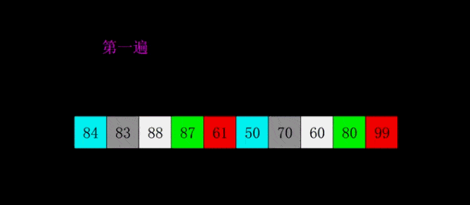  
**3. 例子分析**  
假设待排序数组 {6, 5, 3, 1, 8, 7, 2, 4, 9, 0}

1.  第一次步长 h=4，即可将数组分成四部分

<table><thead><tr><th align="center"></th><th align="center"></th><th align="center"></th></tr></thead><tbody><tr><td align="center">[0]6</td><td align="center">[4]8</td><td align="center">[8]9</td></tr><tr><td align="center">[1]5</td><td align="center">[5]7</td><td align="center">[9]0</td></tr><tr><td align="center">[2]3</td><td align="center">[6]2</td><td align="center"></td></tr><tr><td align="center">[3]1</td><td align="center">[7]4</td><td align="center"></td></tr></tbody></table>

2.  对 4 组进行插入排序后获得

<table><thead><tr><th align="center"></th><th align="center"></th><th align="center"></th></tr></thead><tbody><tr><td align="center">[0]6</td><td align="center">[4]8</td><td align="center">[8]9</td></tr><tr><td align="center">[1]0</td><td align="center">[5]5</td><td align="center">[9]7</td></tr><tr><td align="center">[2]2</td><td align="center">[6]3</td><td align="center"></td></tr><tr><td align="center">[3]1</td><td align="center">[7]4</td><td align="center"></td></tr></tbody></table>

此时数组的顺序为 {6, 0, 2, 1, 8, 5, 3, 4, 9, 7}

3.  当步数缩小为 h=2 时，数组分成了两部分

<table><thead><tr><th align="center"></th><th align="center"></th><th align="center"></th><th align="center"></th><th align="center"></th></tr></thead><tbody><tr><td align="center">[0]6</td><td align="center">[2]2</td><td align="center">[4]8</td><td align="center">[6]3</td><td align="center">[8]9</td></tr><tr><td align="center">[1]0</td><td align="center">[3]1</td><td align="center">[5]5</td><td align="center">[7]4</td><td align="center">[9]7</td></tr></tbody></table>

进行插入排序后，获得数组的排列顺序 {6, 0, 2, 1, 8, 5, 3, 4, 9, 7}

4. 将步数缩短为 h=1, 进行最后一步的插入排序，获得数组排列顺序 {0, 1, 2, 3, 4, 5, 6, 7, 8, 9}

**4. 代码**  
注意步长要设置好，有些博客在步长为 1 时没有考虑，写的算法代码是不可靠的。  
从代码上来看，希尔函数只是在普通插入函数外多了一成控制增量的循环而已

```java
/**
     * 希尔排序
     *
     * @param arr 需要排序的数组
     */
    void shellSort(int[] arr) {
        // 关于步长，取值没有统一标准，必须小于size，最后一次步长要为1
        int gap = 1;

        /* 计算首次步长,一般步数3比2好 */
        while (gap < arr.length / 3) {
            gap = 3 * gap;
        }
        while (gap >= 1) {
            // 插入排序
            insertionSort(arr, gap);
            gap = gap / 3;
        }
    }


   /**
     * @param arr 数组
     * @param gap 步长   gap=1 时就是一个普通的插入排序
     * @return 排序后的数组
     */
    int[] insertionSort(int[] arr, int gap) {
        int preIndex;
        int current;

        for (int i = gap; i < arr.length; i++) {
            preIndex = i - gap;
            current = arr[i];
            while (preIndex >= 0 && arr[preIndex] > current) {
                arr[preIndex + gap] = arr[preIndex];
                preIndex -= gap;
            }
            arr[preIndex + gap] = current;
        }
        return arr;
    }
```
```java
void shell_sort() {
    int[] arr = new int[]{6, 5, 3, 1, 8, 7, 2, 4, 9, 0};
    int size = 10;

    int h = 1;
    /* 计算首次步长 */
    while (h < size / 3) {
        h = 3 * h + 1;
    }

    int i, j, temp;
    while (h >= 1) {
        for (i = h; i < size; ++i) {
            /* 将a[i]插入到a[i-h]、a[i-2h]、a[i-3h]...中 */
            for (j = i; j >= h && (arr[j] < arr[j - h]); j -= h) {
                temp = arr[j];
                arr[j] = arr[j - h];
                arr[j - h] = temp;
            }
        }

        /* 每轮内循环后输出数组的现状 */

// int k;  
// printf(“the step=%d : “, h);  
// for (k = 0; k < size; ++k) {  
// printf(”%d “, arr[k]);  
// }  
// printf(”\n”);

/* 计算下一轮步长 */
        h = h / 3;
    }
}
```

**5. 算法分析**  
关于时间复杂度，步长的选取能决定希尔排序的效率，根据科学家的分析当相邻增量之间的比例为 1:3 时效果还行。

*   也就是增量序列为 {1,4,13,40,121,364,1093,…} 时效率较高。
*   {1,2,4,8,…} 2^i |^ 这种序列并不是很好的增量序列，它的时间复杂度（最坏情形）是 O(n2)
*   {1,3,7，15…,2^k *^-1}， 这种序列的时间复杂是 O(n1.5)  
    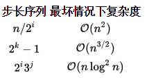

关于稳定性，在多个分组多次插入排序的情况下可能会改变相同元素的相对位置, 因为它是跳跃排序，可能改变相同元素的前后位置，所以`希尔排序是不稳定的排序，但插入排序是稳定`

# ⭐️归并排序（Merge Sort）

归并排序是建立在归并操作上的一种有效的排序算法。该算法是采用分治法（Divide and Conquer）的一个非常典型的应用。将已有序的子序列合并，得到完全有序的序列；即先使每个子序列有序，再使子序列段间有序。若将两个有序表合并成一个有序表，称为 2路归并。

**1. 算法描述**

1.  把长度为 n 的输入序列分成两个长度为 n/2 的子序列；
2.  对这两个子序列分别采用归并排序；
3.  将两个排序好的子序列合并成一个最终的排序序列。

归并的核心：

1.  为每个需要排序的数组分配其对应长度的缓存数组
2.  设定两个指针，最初位置分别为两个已经排序序列的起始位置
3.  比较两个指针所指向的元素，选择相对小的元素放入到合并空间，并移动指针到下一位置
4.  重复步骤 3 直到某一指针超出序列尾
5.  将另一序列剩下的所有元素直接复制到合并序列尾

**2. 动画演示**  


**3. 代码**

```java
    /**
     * 进行归并排序
     *
     * @param arr        需要排序的数组
     * @param startIndex 数组的开始索引
     * @param endIndex   数组最后一个元素的索引
     */
    public void mergeSort(int[] arr, int startIndex, int endIndex) {
        // 当子序列中只有一个元素时结束递归
        if (startIndex >= endIndex) {
            return;
        }
        // 划分子序列
        int mid = startIndex + (endIndex - startIndex) / 2;
        // 对左侧子序列进行递归排序: 左右闭区间
        mergeSort(arr, startIndex, mid);
        // 对右侧子序列进行递归排序: 左右闭区间
        mergeSort(arr, mid + 1, endIndex);
        // 合并
        merge(arr, startIndex, mid, endIndex);
    }

   /**
     * 两路归并算法，两个排好序的子序列合并为一个子序列
     *
     * @param arr   需要合并的数组
     * @param left  左边起始索引
     * @param mid   中间索引
     * @param right 右边起始索引
     */
      public void merge(int[] arr, int first, int mid, int last) {
        //辅助数组
        int[] tmp = new int[last + 1 - first];
        //left、right 是检测指针，k 是进度指针
        int left = first, right = mid + 1, k = 0;

        while (left <= mid && right <= last) {
            // 取等是保证排序的稳定性！！！
            if (arr[left] <= arr[right]) {
                tmp[k++] = arr[left++];
            } else {
                tmp[k++] = arr[right++];
            }
        }

        //如果第一个序列未检测完，直接将后面所有元素加到合并的序列中
        while (left <= mid) {
            tmp[k++] = arr[left++];
        }

        //如果第二个序列未检测完，直接将后面所有元素加到合并的序列中
        while (right <= last) {
            tmp[k++] = arr[right++];
        }

        // 复制回原素组
        for (int i = 0; i <= last - first; i++) {
            arr[first + i] = tmp[i];
        }
    }
```

**4. 算法分析**  
归并排序是一种稳定的排序方法。和选择排序一样，归并排序的性能不受输入数据的影响，但表现比选择排序好的多，因为始终都是 O(nlogn）的时间复杂度。代价是需要额外的内存空间: O(n)

# ⭐️快速排序 Quick Sort

快速排序是对冒泡排序的一种改进，==它是不稳定的==。由 C. A. R. Hoare 在 1962 年提出的一种划分交换排序，采用的是分治策略（一般与递归结合使用），以减少排序过程中的比较次数，它的最好情况为 O(nlogn)，最坏情况为 O(n^2)，平均时间复杂度为 O(nlogn)。

选择一个基准数，通过一趟排序将要排序的数据分割成独立的两部分，其中一部分的所有数据都比另外一部分的所有数据都要小。  
然后再按此方法对这两部分数据分别进行快速排序，整个排序过程可以递归进行，以达到全部数据变成有序。

在计算机科学中，分治法就是运用分治思想的一种很重要的算法。分治法是很多高效算法的基础，如快速排序，归并排序，傅立叶变换（快速傅立叶变换）等等。

**1. 算法描述**  
快速排序使用分治法来把一个串（list）分为两个子串（sub-lists）。具体算法描述如下：

1.  从数列中挑出一个元素，称为基准值（pivot）；
2.  将所有元素比基准值小的摆放在基准前面，所有元素比基准值大的摆在基准的后面（相同的数可以到任一边）。  
    在这个分区退出之后，该基准就处于数列的中间位置，这个称为分区（partition）操作。
3.  递归地（recursive）把小于基准值元素的子数列和大于基准值元素的子数列排序。

注意：基准元素 / 左游标 / 右游标都是针对单趟排序而言的， 也就是说在整个排序过程的多趟排序中，各趟排序取得的基准元素 / 左游标 / 右游标一般都是不同的。对于基准元素的选取，原则上是任意的，但是一般我们选取数组中第一个元素为基准元素（假设数组随机分布）。

**2. 动画演示**  
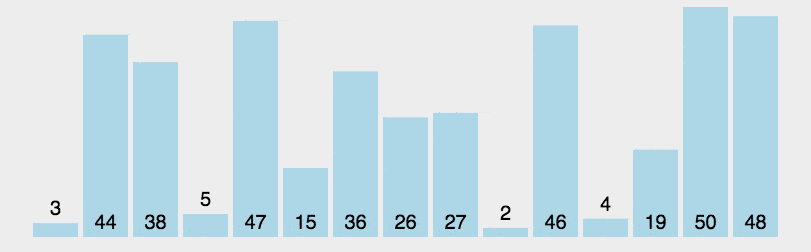  

3. [**代码解析**](https://leetcode-cn.com/leetbook/read/sort-algorithms/eul7hm/)

```java
class Solution {
    public int[] sortArray(int[] nums) {
        quickSort(nums, 0, nums.length - 1);
        return nums;
    }

    private void quickSort(int[] nums, int first, int last) {
        // 要保证相比较的元素大于等于 2
        if (first >= last) {
            return;
        }
        int mid = partition(nums, first, last);
        quickSort(nums, first, mid - 1);
        // mid 已经有序不用参与排序！！！
        quickSort(nums, mid + 1, last);
    }

    //双指针分区算法：从 left 开始遇到比基数大的数记录其下标；再从 right 往前遍历，找到第一个比基数小的数，记录其下标；然后交换这两个数。
    private int partition(int[] nums, int first, int last) {
        // 选取第一个元素作为轴
        int pivot = nums[first];
        // 左边界
        int left = first + 1;
        // 右边界
        int right = last;
        while(left < right) {
            // 从左侧开始找到第一个大于基数的位置
            while (left < right && nums[left] <= pivot) left++;
            // 从右侧开始找第一个小于基数的位置
            while (left < right && nums[right] >= pivot) right--;
            // 交换这两个最值
            if (left < right) {
                swap(nums, left, right);
                left++;
                right--;
            }
        }
        // 如果 left 和 right 相等，单独比较 arr[right] 和 pivot
        if (right == left && nums[right] > pivot) {
            right--;
        }
        // 将基数和轴交换
        swap(nums, first, right);
        return right;
    }

    private void swap(int[] nums, int i, int j) {
        int tmp = nums[i];
        nums[i] = nums[j];
        nums[j] = tmp;
    }
}
```

**使用尾部为轴，代码更简单**

```java
    class Solution {
        public int[] sortArray(int[] nums) {
            quickSort(nums, 0, nums.length - 1);
            return nums;
        }

        private void quickSort(int[] nums, int first, int last) {
            // 排序的元素不能少于两个
            if (first >= last) {
                return;
            }
            // 获取分区点
            int mid = partition(nums, first, last);
            // 注意 mid 已经排序需要排除
            quickSort(nums, first, mid - 1);
            quickSort(nums, mid + 1, last);
        }

        private int partition(int[] nums, int first, int last) {
            // 使用最后一个作为轴
            int pivot = nums[last];
            // 记录中间的位置，一开始为 first
            int mid = first;
            // 遍历整个范围，最有一个单独比较不用取等 last
            for (int i = first; i < last; i++) {
                // 交换左边为小于轴的数
                if (nums[i] < pivot) {
                    swap(nums, mid++, i);
                }
            }
            //最后一个数要单独处理，放到中间为轴
            swap(nums, mid, last);
            return mid;
        }

        private void swap(final int[] nums, final int last, final int left) {
            if (last == left) {
                return;
            }
            int tmp = nums[left];
            nums[left] = nums[last];
            nums[last] = tmp;
        }
    }
```


**4. 算法分析**  
快速排序的核心是能准确有效的找到数组的基准数索引，我们以数组 27,44,38,5,47,15,36,26,3,2,46,4,19,50,48 为例来演寻找 pivot 的过程  
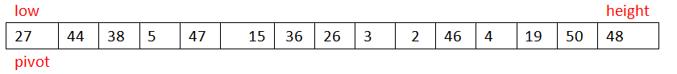

*   **第一次 while 循环**

1.  当从右到左扫描到 19 时，此时需要执行 arr[low]=19。  
    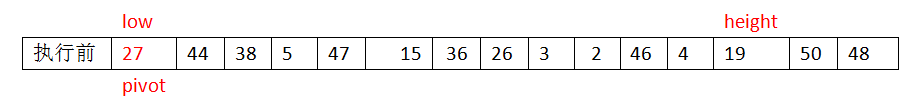  
    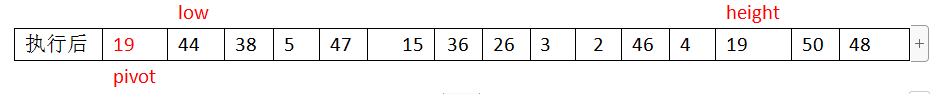
2.  切换为从由左到右扫描，当比较 44 时，执行 arr[height]=44。  
    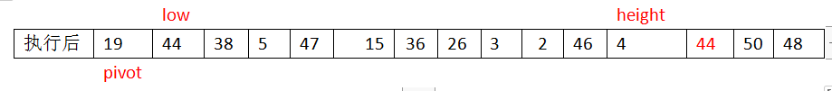
3.  当 1、2 步执行完毕后如果 low<height，继续循环执行 1、2 步
4.  当我们执行到如下情况时：  
    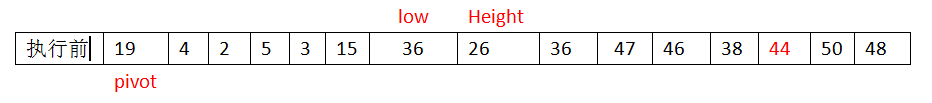  
    此时执行到从右向左扫描  
    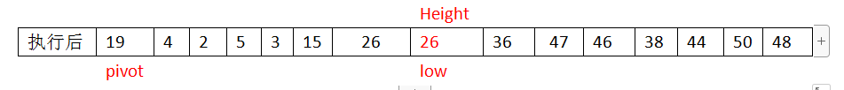  
    此时 low=height，分区操作完成。pivot 的索引 index=8。此时 arr[low]=arr[height]=arr[8]。
5.  循环执行 1、2、3、4 步骤即可完成快速排序。

基本上在任何需要排序的场景都可以使用快速排序，最好情况的时间复杂度为 O(nlogn)，最坏情况时间复杂度为 O(n^2)，但是由于基本不会出现，因此可以放心的使用快速排序。

最差情况下每一次取到的数（基准数）都是当前要比较的数中的最大 / 最小值，在这种情况下，每次都只能得到比上一次少 1 个数的子序列（即要么全比基准数大，要么全比基准小）。  
此时相当于一个冒泡排序，比较的次数 = (n - 1) + (n - 2) + … + 2 + 1 = (n - 1) * n / 2，此时的时间复杂度为：O(n^2)。最差情况一般出现在：待排序的数据本身已经是正序或反序排好了。

# 堆排序 Heap Sort

堆排序（Heapsort）是指利用堆这种数据结构所设计的一种排序算法。关于堆的详细介绍和堆如何构建请查看我的博文《》，详细从源码解析堆构建和排序的步骤和逻辑。

**1. 算法描述**  
1、将待排序的序列构造成一个大顶堆，根据大根堆的性质，当前堆的根节点就是序列中最大的元素；  
2、将堆顶元素和最后一个元素交换，然后将剩下的节点重新构造成一个大顶堆；  
3、重复步骤 2，如此反复，从第一次构建大顶堆开始，每一次构建，我们都能获得一个序列的最大值，  
然后把它放到大顶堆的尾部。最后就得到一个有序的序列。

**2. 动画演示**  
  
**3. 代码**

```java
/**
     * 将指定堆构建成大堆根函数
     * 逻辑
     * 1. 如果起始索引无子节点，则跳出该方法
     * 2. 如果只有一个左子节点，进行大小比较并置换值
     * 3. 如果有两个子节点，选择最大值与父节点比较,然后置换其位置。
     * 如果子节点大于父节点，置换完成后，递归进行同样操作，其子节点索引即是函数的start值
     *
     * @param array 源数组
     * @param start 起始索引
     * @param end   结尾索引
     */
    public void adjust(int[] array, int start, int end) {
        // 左子节点的位置
        int leftIndex = 2 * start + 1;
        if (leftIndex == end) {
            //只有一个左节点，进行比较并置换值
            if (array[leftIndex] > array[start]) {
                int temp = array[leftIndex];
                array[leftIndex] = array[start];
                array[start] = temp;
            }
        } else if (leftIndex < end) {
            //有两个子节点
            int temp = array[leftIndex];
            int tempIndex = leftIndex;
            if (array[leftIndex + 1] > array[leftIndex]) {
                temp = array[leftIndex + 1];
                tempIndex = leftIndex + 1;
            }
            if (temp > array[start]) {
                array[tempIndex] = array[start];
                array[start] = temp;
            }
            adjust(array, tempIndex, end);
        }
    }

    /**
     * 堆排序
     *
     * @param array 源数组
     */
    public void heapSort(int[] array) {
        //从右向左，从下到上依次遍历父节点，建立大根堆，时间复杂度：O(n*log2n)
        for (int i = (array.length - 1 - 1) / 2; i >= 0; i--) {
            adjust(array, i, array.length - 1);
        }

        int tmp;
        //要与root节点置换位置元素的索引
        int end = array.length - 1;
        //n个节点只用构建排序n-1次，最后只有1个元素不用在排序
        for (int i = array.length - 1; i > 0; i--) {
            tmp = array[0];
            array[0] = array[end];
            array[end] = tmp;

            end--;
            //头尾置换后，将堆重新构建为大堆根，置换尾部大元素不参加构建
            //因为除了root节点，其他都是由大到小有序的，所以再次构建大根堆时，不用在进行adjust()前的那个循环
            adjust(array, 0, end);

        }
    }
```

**4. 算法分析**  
堆排序是一种选择排序，整体主要由构建初始堆 + 交换堆顶元素和末尾元素并重建堆两部分组成。其中构建初始堆经推导复杂度为 O(n)，在交换并重建堆的过程中，需交换 n-1 次，而重建堆的过程中，根据完全二叉树的性质，[log2(n-1),log2(n-2)…1] 逐步递减，近似为 nlogn。所以堆排序时间复杂度一般认为就是 O(nlogn) 级，空间复杂度 O(1)。

# 计数排序 Counting Sort

计数排序不是基于比较的排序算法，其核心在于将输入的数据值转化为键存储在额外开辟的数组空间中。 作为一种线性时间复杂度的排序，计数排序要求输入的数据必须是有确定范围的整数。

**1. 算法描述**

1.  找出待排序的数组中最大和最小的元素；
2.  统计数组中每个值为 i 的元素出现的次数，存入数组 C 的第 i 项；
3.  对所有的计数累加（从 C 中的第一个元素开始，每一项和前一项相加）；
4.  反向填充目标数组：将每个元素 i 放在新数组的第 C(i) 项，每放一个元素就将 C(i) 减去 1。

**2. 动画演示**  
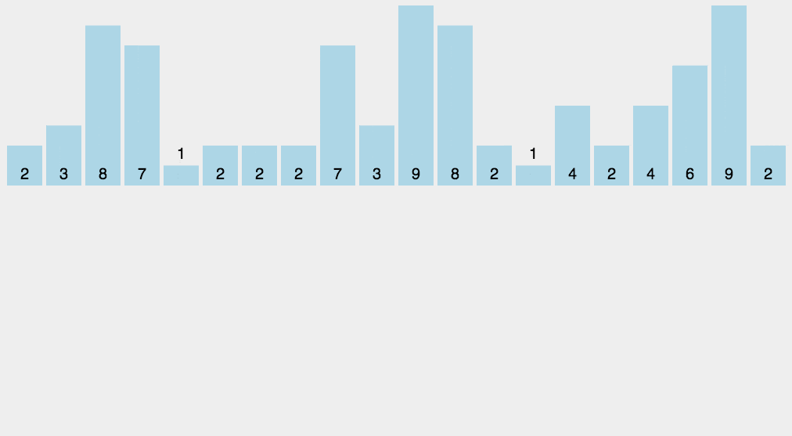  
**3. 代码**

```
/**
     * 计数算法，适合int类型数据排序，该方法有优化，支持有负数
     * 一种线性排序算法，不需要进行比较，时间复杂度为O(n)。
     *
     * @param array 待排序数组
     * @param max   最大值
     * @param min   最小值
     * @return 返回排序后的数组
     */
    public int[] countSort(int[] array, int max, int min) {
        //1.为了资源，数据不再从0开始，直接从最小到最大,创建临时空间数组
        int[] coutArray = new int[max - min + 1];
        //2.对原始数组元素进行统计,对空间数组index=value - min进行自增,统计了同样的数据
        for (int value : array) {
            coutArray[value - min]++;
        }

        //3.按顺序,空间数组每个元素的值是多少则打印多少次
        int index = 0;
        for (int i = 0; i < coutArray.length; i++) {
            for (int j = 0; j < coutArray[i]; j++) {
                array[index++] = i + min;
            }
        }
        return array;
    }
```

**4. 算法分析**  
计数排序是一个稳定的排序算法。当输入的元素是 n 个 0 到 k 之间的整数时，时间复杂度是 O(n+k)，空间复杂度也是 O(n+k)，其排序速度快于任何比较排序算法。当 k 不是很大并且序列比较集中时，计数排序是一个很有效的排序算法。

# 桶排序 Bucket sort

桶排序又称箱排序, 是计数排序的升级版，同样不属于比较排序。其主要思想近乎彻底的分治思想, 是鸽巢排序的一种归纳结果。其原理是：将待排序列（集合）中的元素分到数量有限的桶中，每个桶在进行排序。

对于桶的使用注意  
1）在额外空间充足的情况下，尽量增大桶的数量  
2）使用的映射函数能够将输入的 N 个数据均匀的分配到 K 个桶中 。该函数至关重要，高效与否的关键就在于这个映射函数的确定  
3）待排列的数据必须是整数

**1. 算法描述**  
桶排序的思想原理：划分多个范围相同的区间，每个子区间自排序，最后合并。

*   设置一定量的数组当空桶
*   使用一定函数将数组尽可能均分到有限数量的桶里。
*   每个桶获得数据后再分别排序（有可能再使用别的排序算法或是以递归方式继续使用桶排序进行排序）。
*   最后依次把各个桶中的数据取出得到有序序列。

**2. 动画演示**  
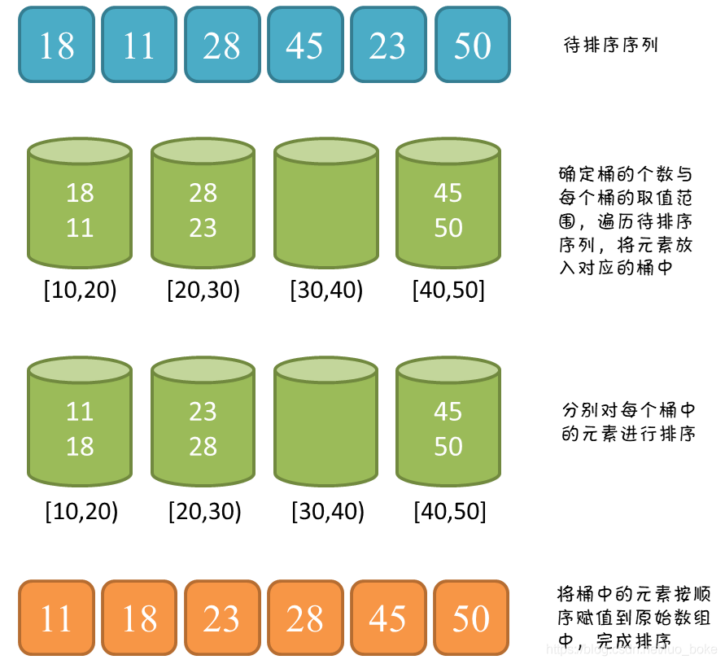

**3. 代码**

```java
/**
     * 这是一个桶排序，建桶规则是将数据分到arr.length+1 个桶中，然后进行排序整理
     * 该代码中如有9个数据，将数据期数据分到10个桶中。此分配规则不一样，会影响排序效果
     *
     * @param arr 源数组
     */
    public static void bucketSort(int[] arr) {
        // 计算最大值与最小值
        int max = 0;
        int min = 0;
        for (int value : arr) {
            if (max < value) {
                max = value;
            }
            if (min > value) {
                min = value;
            }
        }

        // 计算桶的数量，并创建一个桶集合
        int bucketNum = (max - min) / arr.length + 1;
        List<List<Integer>> bucketArr = new ArrayList<>();
        for (int i = 0; i < bucketNum; i++) {
            bucketArr.add(new ArrayList<>());
        }

        // 将每个元素放入桶
        for (int i = 0; i < arr.length; i++) {
            int num = (arr[i] - min) / (arr.length);
            bucketArr.get(num).add(arr[i]);
        }

        // 对每个桶进行排序
        for (int i = 0; i < bucketArr.size(); i++) {
            Collections.sort(bucketArr.get(i));
        }

        // 将桶中的元素赋值到原序列
        int index = 0;
        for (int i = 0; i < bucketArr.size(); i++) {
            for (int j = 0; j < bucketArr.get(i).size(); j++) {
                arr[index++] = bucketArr.get(i).get(j);
            }
        }
    }
```

**4. 实例演示**  
1）以 63,157,189,51,101,147,141,121,157,156,194,117,98,139,67,133,181,113,158,109 来为例进行桶排序  
2）获取到最小值为 51，最大值 194, 构建桶将其分为 15 组，以 [10,20)，[20,30)…[190,200) 为分组进行分配  
3）对其进行分组后如图  
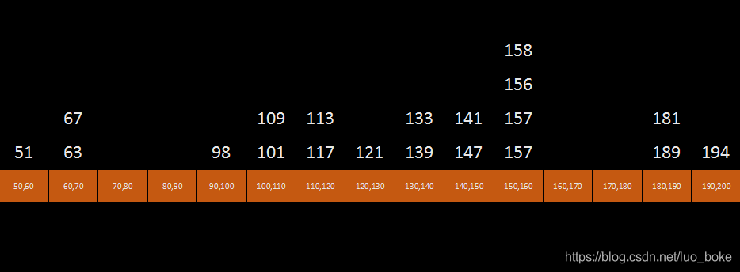  
4）然后对非空桶进行排序，排序方法自己选定  
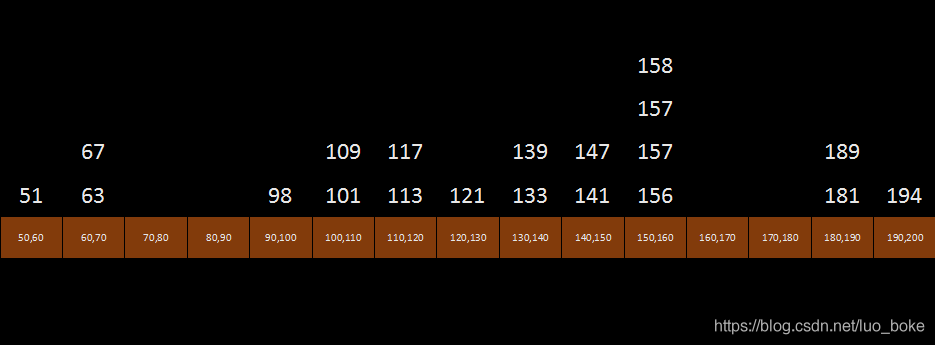  
5）最终获得排序数组为：51,63,67,98,101,109,113,117,121,133,139,141,147,156,157,157,158,181,189,194

**5. 算法分析**  
桶排序是一种稳定排序，它的的最好时间复杂度为 O(n + k)，最差时间复杂度是 O(n ^ 2)，其空间复杂度是 O(n*k)。 影响桶排序的有两大因素：

*   对于桶中元素的排序，选择何种比较排序算法对于性能的影响至关重要。
  
*   桶划分的大小问题，桶数越小，空间消耗越小，桶内元素越多，排序时间越大，反之亦反。在时间和空间消耗的平衡上，建桶建的好也至关重要。一般以 10n 和 2n 个数来建桶，或者取数列最大最小值均分建桶 。

建桶规则，也就是元素划分到不同桶的映射规则需要有一定思考的设计。映射规则需要根据待排序集合的元素分布特性进行选择，若规则设计的过于模糊、宽泛，则可能导致待排序集合中所有元素全部映射到一个桶上，则桶排序向比较性质排序算法演变。若映射规则设计的过于具体、严苛，则可能导致待排序集合中每一个元素值映射到一个桶上，则桶排序向计数排序方式演化。

# 基数排序（Radix Sort）

基数排序是桶排序的扩展，依然是一种非比较型数组，所以它可以突破比较排序时间 NlogN。由于整数也可以表达字符串（比如名字或日期）和特定格式的浮点数，所以基数排序也不是只能使用于整数。  
**1. 算法描述**

1.  获取数组中的最大值 max，根据 max 的位长 length, 确定后面要切割排序 length 次
2.  将数组 arr 中的每个元素按位数切割成不同的数字，由低位到高位切割排序。如先排序个位、十位、百位
3.  切割后按获得一位长度 0-9 的切割值 index, 按切割值将源数值加入对应桶 0~9 的第 index 个桶中
4.  将每个非空桶中的数组按顺序再次收集，改变源数组中元素的位置。从每个桶中收集数据时，从索引为 0 开始收集，这点很重要。
5.  重复 2、3、4 中的操作，直到将最高位也切割排序完毕，最终得到的数组 arr 就是经过排序的数组

**2. 动画演示**  
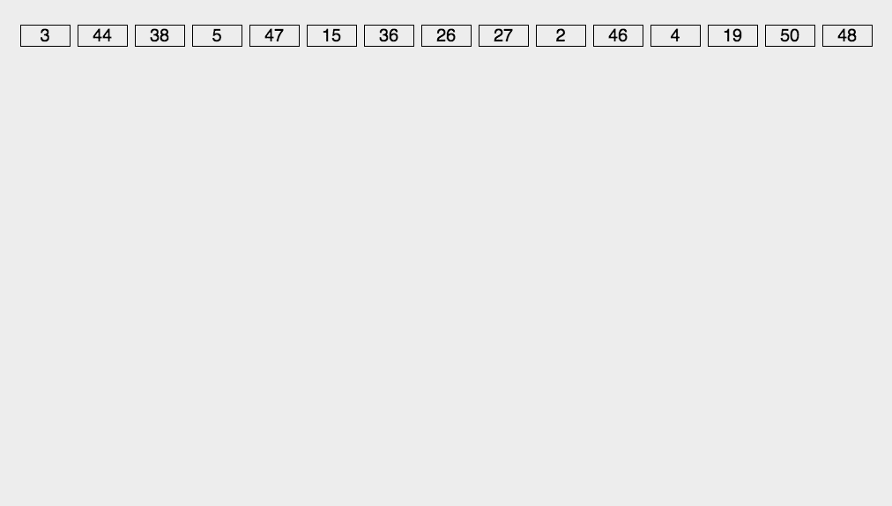  
**3. 案例演示**  
以待排数据 50,21,34,104,235,5,15,36,126,46,7,527,35,48,19 为例，其最大数 527 的，位长 3，需要桶排序 3 次，比较个位、十位、百位上的数据  
1）第一次排序，比较个位数据。  
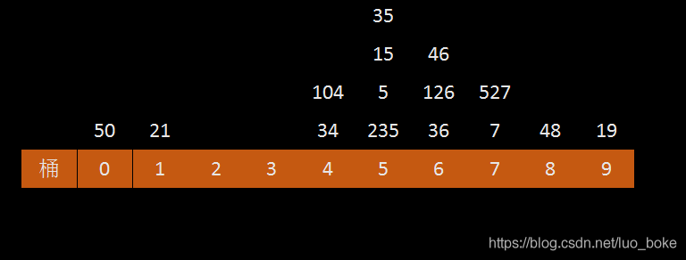  
2）第一次排序后收集数组：50,21,34,104,235,5,15,35,36,126,46,7,527,48,19  
3）进行十位数上的排序  
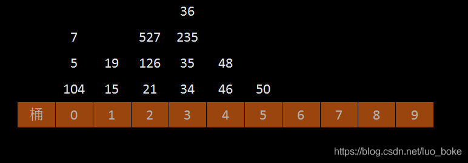  
4）第二次排序完成后收集的数组: 104,5,7,15,19,21,126,527,34,35,235,36,46,48,50  
5）进行第三次，百位上的排序  
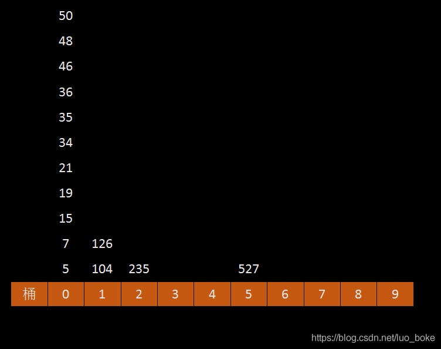  
6）第二次排序完成后收集的数组: 5,7,15,19,21,34,35,36,46,48,50,104,126,235,527

**3. 代码**

```
/**
     * 基数排序,该排序被优化，可以支持负数排序
     *
     * @param array 源数组
     */
    public void radixSort(int[] array) {
        //1. 获取最大、最小值
        int max = 0;
        int min = 0;

        for (int value : array) {
            if (max < value) {
                max = value;
            }
            if (min > value) {
                min = value;
            }
        }
        //兼容负数排序
        int absMax = max - min;

        //2. 获取最大值的位数长；
        int times = 0;
        while (absMax > 0) {
            absMax /= 10;
            times++;
        }

        //3. 由于数字的特殊性，数字尾数必定是0~9，可创建10个桶，用于分装数据
        List<List<Integer>> queue = new ArrayList<>();
        for (int i = 0; i < 10; i++) {
            List<Integer> q = new ArrayList<>();
            queue.add(q);
        }

        //开始比较,重点
        for (int i = 0; i < times; i++) {
            reconstruction(queue, array, i, min);
        }
    }

    /**
     * 数组位置重构
     * 根据i=0,1,2,将个位，十位，百位的数据重新分组为
     * 【1,11  2,22,42，132】、【1,2  11  22 132 42】、【1,2,11,22,42,132】
     *
     * @param queue 桶集合
     * @param array 源数组
     * @param i     数字位数，如 12345,i=1,2,3,4,5
     */
    private void reconstruction(List<List<Integer>> queue, int[] array, int i, int min) {
        for (int j = 0; j < array.length; j++) {
            // 当j=0,1,2 时分别取的是数字个位，十位，百位上的数据
            // array[j] - min是为了兼容负数
            int x = (array[j] - min) % (int) Math.pow(10, i + 1) / (int) Math.pow(10, i);
            // 将指定位上为X(x=0~9),放入第x个桶中
            List<Integer> q = queue.get(x);
            q.add(array[j] - min);
        }
        // 当位数i时,从0桶到9桶，一个个取出数据放入源数组中，此时数组顺序第一次改变了
        int count = 0;
        for (int j = 0; j < 10; j++) {
            while (queue.get(j).size() > 0) {
                List<Integer> q = queue.get(j);
                array[count++] = q.get(0) + min;
                q.remove(0);
            }
        }
    }
```

**4. 算法分析**  
基数排序是一种稳定排序，它的时间复杂度是平均、最好、最坏都为 O(k*n), 其中 k 为常数 (最大值位长)，n 为元素个数。空间复杂度是 O(n+x)，其中 x 为桶的数量，一般来说 n>>x，因此额外空间需要大概 n 个左右。

基数排序有两种排序方式：LSD 和 MSD，最小位优先 (从右边开始) 和最大位优先(从左边开始)

总结
--

**基数排序 VS 计数排序 VS 桶排序**

1.  此三种排序都是非比较排序，时间复杂度能打破 NlogN 的限制
  
2.  这三种排序算法都利用了桶的概念，但对桶的使用方法上有明显差异：  
    1) 基数排序：根据键值的每位数字来分配桶  
    2) 计数排序：每个桶只存储单一键值  
    3) 桶排序：每个桶存储一定范围的数值
    
3.  基数排序的性能比桶排序要略差，每一次关键字的桶分配都需要 O(n) 的时间复杂度，而且分配之后得到新的关键字序列又需要 O(n) 的时间复杂度。
  
4.  桶排序是对计数排序的改进，计数排序申请的额外空间跨度从最小元素值到最大元素值，若待排序集合中元素不是依次递增的，则必然有空间浪费情况。桶排序则是弱化了这种浪费情况，桶排序为最小值到最大值之间每一个固定区域申请空间，尽量减少了元素值大小不连续情况下的空间浪费情况。

**快速排序 VS 桶排序**

*   快速排序是将集合拆分为两个值域，这里称为两个桶，再分别对两个桶进行排序，最终完成排序。桶排序则是将集合拆分为多个桶，对每个桶进行排序，则完成排序过程。
  
*   两者不同之处在于，快排是在集合本身上进行排序，属于原地排序方式，且对每个桶的排序方式也是快排。 桶排序则是提供了额外的操作空间，在额外空间上对桶进行排序，避免了构成桶过程的元素比较和交换操作，同时可以自主选择恰当的排序算法对桶进行排序。

**相关推荐**  
1. [心中有堆: https://blog.csdn.net/luo_boke/article/details/106928990](https://blog.csdn.net/luo_boke/article/details/106928990)  
2. [心中有栈: https://blog.csdn.net/luo_boke/article/details/106982563](https://blog.csdn.net/luo_boke/article/details/106982563)  
3. [心中有树——基础: https://blog.csdn.net/luo_boke/article/details/106980011](https://blog.csdn.net/luo_boke/article/details/106980011)