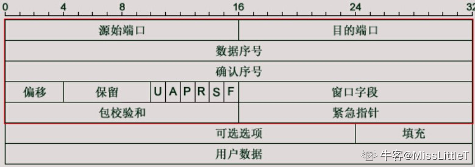
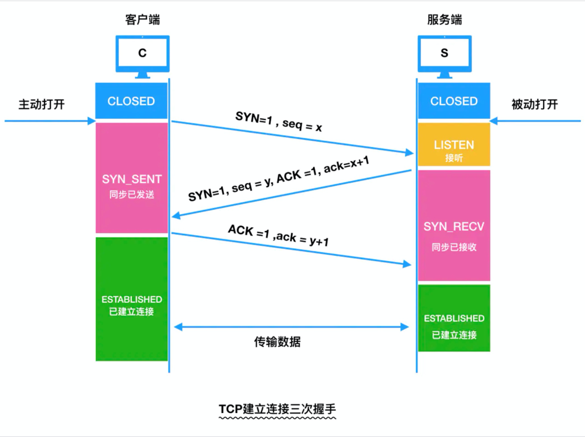
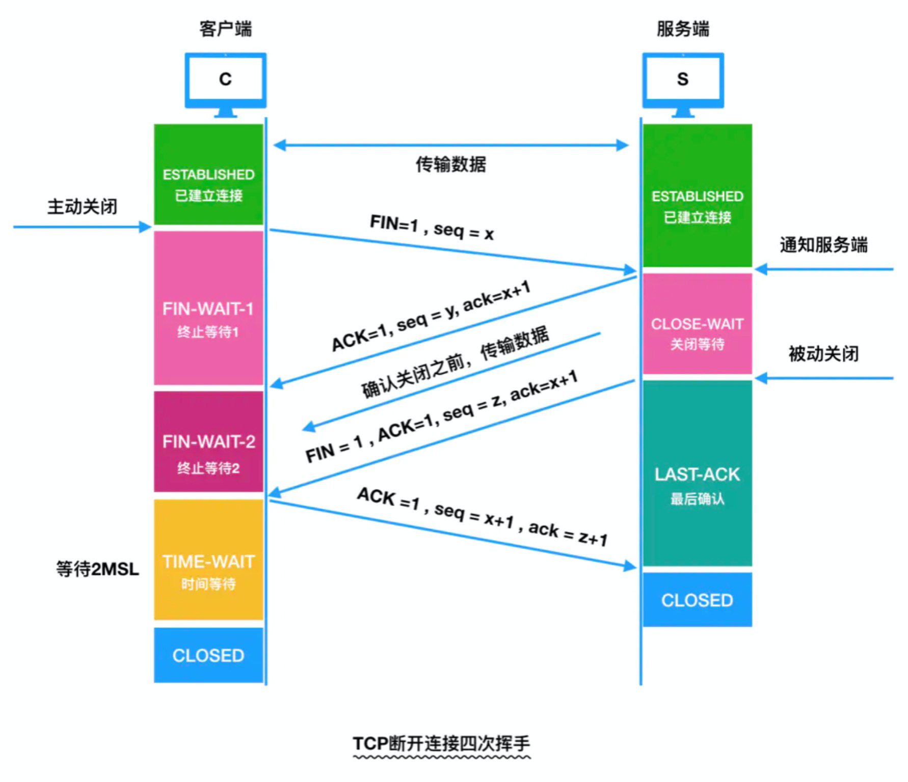

# TCP 知识要点

- **TCP头部为20字节** 
- 源端口号（16位）和目的端口号（16位）：再加上Ip首部的源IP地址和目的IP地址可以唯一确定一个TCP连接 
- 数据序号（16位）：表示在这个报文段中的第一个数据字节序号 
- 确认序号：仅当ACK标志为1时有效，确认号表示期望收到的下一个字节的序号 
- 偏移：就是头部长度，有4位，跟IP头部一样，以4字节为单位。最大是60个字节 
- 保留位：6位，必须为0 
- 6个标志位：URG-紧急指针有效；ACK-确认序号有效；PSH-接收方应尽快将这个报文交给应用层；RST-连接重置；SYN-同步序号用来发起一个连接；FIN-终止一个连接。 
- 窗口字段：16位，代表的是窗口的字节容量，也就是TCP的标准窗口最大为2^16 - 1 = 65535个字节 
- 校验和：源机器基于数据内容计算一个数值，收信息机要与源机器数值结果完全一样，从而证明数据的有效性。检验和覆盖了整个的TCP报文段：这是一个强制性的字段，一定是由发送端计算和存储，并由接收端进行验证的。
   

# 三次握手是防止已失效的连接请求突然又传到了服务端，因而产生错误。

在谢希仁著《计算机网络》第四版中讲“三次握手”的目的是“为了防止已失效的连接请求报文段突然又传送到了服务端，因而产生错误”。在另一部经典的《计算机网络》一书中讲“三次握手”的目的是为了解决“网络中存在延迟的重复分组”的问题。这两种不用的表述其实阐明的是同一个问题。
谢希仁版《计算机网络》中的例子是这样的，“已失效的连接请求报文段”的产生在这样一种情况下：client发出的第一个连接请求报文段并没有丢失，而是在某个网络结点长时间的滞留了，以致延误到连接释放以后的某个时间才到达server。本来这是一个早已失效的报文段。但server收到此失效的连接请求报文段后，就误认为是client再次发出的一个新的连接请求。于是就向client发出确认报文段，同意建立连接。假设不采用“三次握手”，那么只要server发出确认，新的连接就建立了。由于现在client并没有发出建立连接的请求，因此不会理睬server的确认，也不会向server发送数据。但server却以为新的运输连接已经建立，并一直等待client发来数据。这样，server的很多资源就白白浪费掉了。采用“三次握手”的办法可以防止上述现象发生。例如刚才那种情况，client不会向server的确认发出确认。server由于收不到确认，就知道client并没有要求建立连接。”

这个例子很清晰的阐释了“三次握手”对于建立可靠连接的意义。

在Google Groups的[TopLanguage](https://link.zhihu.com/?target=https%3A//groups.google.com/forum/%23!forum/pongba)中看到一帖讨论TCP“三次握手”觉得很有意思。贴主提出“[TCP建立连接为什么是三次握手？](https://link.zhihu.com/?target=https%3A//groups.google.com/d/topic/pongba/kF6O7-MFxM0/discussion)”的问题，在众多回复中，有[一条回复](https://link.zhihu.com/?target=https%3A//groups.google.com/d/msg/pongba/kF6O7-MFxM0/5S7zIJ4yqKUJ)写道：“这个问题的本质是, 信道不可靠, 但是通信双发需要就某个问题达成一致. 而要解决这个问题,  无论你在消息中包含什么信息, 三次通信是理论上的最小值. 所以三次握手不是TCP本身的要求, 而是为了满足"在不可靠信道上可靠地传输信息"这一需求所导致的. 请注意这里的本质需求,信道不可靠, 数据传输要可靠. 三次达到了, 那后面你想接着握手也好, 发数据也好, 跟进行可靠信息传输的需求就没关系了. 因此,如果信道是可靠的, 即无论什么时候发出消息, 对方一定能收到, 或者你不关心是否要保证对方收到你的消息, 那就能像UDP那样直接发送消息就可以了.”。这可视为对“三次握手”目的的另一种解答思路。

后面一段话意思就是如果想确定双通道通畅，必须使用三个包的发送接收，也就是三次握手

# 四次挥手：保证 “安全完整”

# TCP 三次握手

为了**保证数据能到达目标**，TCP采用三次握手策略。

1. 发送端**首先发送一个带SYN（synchronize）标志的数据包**给接收方【**第一次的seq序列号是随机产生的**，这样是为了**网络安全**，如果不是随机产生初始序列号，黑客将会以很容易的方式获取到你与其他主机之间的初始化序列号，并且伪造序列号进行攻击】 
2. 接收端收到后，**回传一个带有SYN/ACK（acknowledgement）标志的数据包**以示传达确认信息【**SYN 是为了告诉发送端，发送方到接收方的通道没问题**；**ACK 用来验证接收方到发送方的通道没问题**】 
3. 最后，**发送端再回传一个带ACK标志的数据包**，代表握手结束
   若在握手某个过程中某个阶段莫名中断，TCP协议会再次以相同的顺序发送相同的数据包 

### Q：为什么要三次握手？

三次握手的目的是建立可靠的通信信道，说到通讯，简单来说就是数据的发送与接收，而**三次握手最主要的目的就是双方确认自己与对方的发送与接收是正常的**

1. 第一次握手，发送端：什么都确认不了；接收端：**对方发送正常，自己接受正常** 
2. 第二次握手，发送端：**对方发送，接受正常，自己发送，接受正常** ；接收端：对方发送正常，自己接受正常 
3. 第三次握手，发送端：对方发送，接受正常，自己发送，接受正常；接收端：**对方**发送，**接受正常**，**自己发送**，接受正常 

### Q：两次握手不行吗？为什么TCP[客户端]()最后还要发送一次确认呢？

主要防止已经失效的连接请求报文突然又传送到了服务器，从而产生错误。
经典场景：**[客户端]()发送了第一个请求连接并且没有丢失，只是因为在网络结点中滞留的时间太长了**

- 由于TCP的[客户端]()迟迟没有收到确认报文，以为服务器没有收到，此时重新向服务器发送这条报文，此后[客户端]()和服务器经过两次握手完成连接，传输数据，然后关闭连接。 
- 此时此前滞留的那一次请求连接，网络通畅了到达服务器，这个报文本该是失效的，但是，两次握手的机制将会让[客户端]()和服务器再次建立连接，这将导致不必要的错误和资源的浪费。 
- 如果采用的是三次握手，就算是那一次失效的报文传送过来了，服务端接受到了那条失效报文并且回复了确认报文，但是[客户端]()不会再次发出确认。由于服务器收不到确认，就知道[客户端]()并没有请求连接。 

### Q：为什么三次握手，返回时，ack 值是 seq 加 1（ack = x+1）

- 假设对方接收到数据，比如sequence number = 1000，TCP Payload = 1000，数据第一个字节编号为1000，最后一个为1999，**回应一个确认报文，确认号为2000，意味着编号2000前的字节接收完成，准备接收编号为2000及更多的数据** 
- 确认收到的序列，并且告诉发送端下一次发送的序列号从哪里开始（便于接收方对数据[排序]()，便于选择重传） 

### Q：SYN洪泛攻击(SYN Flood，半开放攻击)，怎么解决？

- 什么是SYN洪范泛攻击？  

  - SYN Flood利用TCP协议缺陷，发送大量伪造的TCP连接请求，常用假冒的IP或IP号段发来海量的**请求连接的第一个握手包（SYN包）**，被攻击服务器回应第二个握手包（SYN+ACK包），因为对方是假冒IP，对方永远收不到包且不会回应第三个握手包。**导致被攻击服务器保持大量SYN_RECV状态的“半连接”**，并且会重试默认5次回应第二个握手包，**大量随机的恶意syn占满了未完成连接队列，导致正常合法的syn排不上队列，让正常的业务请求连接不进来**。【服务器端的资源分配是在二次握手时分配的，而[客户端]()的资源是在完成三次握手时分配的，所以服务器容易受到SYN洪泛攻击】 

- 检测 SYN 攻击非常的方便，**当你在服务器上看到大量的半连接状态时，特别是源IP地址是随机的，基本上可以断定这是一次SYN攻击**【在 Linux/Unix 上可以使用系统自带的 netstats 命令来检测 SYN 攻击】 

- 怎么解决？  

  - 缩短超时（SYN Timeout）时间 
  - 增加最大半连接数 
  - 过滤网关防护 
  - **SYN cookies技术**： 

  1. **当服务器接受到 SYN 报文段时，不直接为该 TCP 分配资源**，而只是打开一个半开的套接字。接着会使用 SYN 报文段的源 Id，目的 Id，端口号以及只有服务器自己知道的一个秘密函数**生成一个 cookie，并把 cookie 作为序列号响应给[客户端]()**。 
  2. **如果[客户端]()是正常建立连接，将会返回一个确认字段为 cookie + 1 的报文段**。接下来服务器会根据确认报文的源 Id，目的 Id，端口号以及秘密函数计算出一个结果，**如果结果的值 + 1 等于确认字段的值，则证明是刚刚请求连接的[客户端]()，这时候才为该 TCP 分配资源** 

### Q：TCP三次握手中，最后一次回复丢失，会发生什么？

- 如果最后一次ACK在网络中丢失，那么**Server端（服务端）该TCP连接的状态仍为SYN_RECV**，并且**根据 TCP的超时重传机制依次等待3秒、6秒、12秒后重新发送 SYN+ACK 包**，以便 **Client（[客户端]()）重新发送ACK包** 
- **如果重发指定次数后，仍然未收到ACK应答**，那么一段时间后，**Server（服务端）自动关闭这个连接** 
- **但是Client（[客户端]()）认为这个连接已经建立**，如果Client（[客户端]()）端向Server（服务端）发送数据，**Server端（服务端）将以RST包（Reset，标示复位，用于异常的关闭连接）响应**，此时，**[客户端]()知道第三次握手失败** 

## TCP四次挥手

1. 主动断开方（[客户端]()/服务端）-发送一个 FIN，用来关闭主动断开方（[客户端]()/服务端）到被动断开方（[客户端]()/服务端）的数据传送 
2. 被动断开方（[客户端]()/服务端）-收到这个 FIN，它发回一 个 ACK，确认序号为收到的序号加1 。和 SYN 一样，一个 FIN 将占用一个序号 
3. 被动点开方（[客户端]()/服务端）-关闭与主动断开方（[客户端]()/服务端）的连接，发送一个FIN给主动断开方（[客户端]()/服务端） 
4. 主动断开方（[客户端]()/服务端）-发回 ACK 报文确认，并将确认序号设置为收到序号加1 

### Q：为什么连接的时候是三次握手，关闭的时候却是四次握手？

- 建立连接的时候， 服务器在LISTEN状态下，收到建立连接请求的SYN报文后，把**ACK和SYN放在一个报文里**发送给[客户端]()。 
- 关闭连接时，服务器收到对方的FIN报文时，仅仅表示对方不再发送数据了但是还能接收数据，而自己也未必全部数据都发送给对方了,所以服务器可以立即关闭，也可以发送一些数据给对方后，再发送FIN报文给对方来表示同意现在关闭连接。因此，服务器**ACK和FIN一般都会分开发送**，从而导致多了一次。 

### Q：为什么TCP挥手每两次中间有一个 FIN-WAIT2等待时间？

- 主动关闭的一端调用完close以后（即发FIN给被动关闭的一端， 并且收到其对FIN的确认ACK）则进入FIN_WAIT_2状态。**如果这个时候因为网络突然断掉、被动关闭的一段宕机等原因，导致主动关闭的一端不能收到被动关闭的一端发来的FIN（防止对端不发送关闭连接的FIN包给本端）**，这个时候就需要FIN_WAIT_2定时器， 如果在该定时器超时的时候，还是没收到被动关闭一端发来的FIN，那么直接释放这个链接，进入CLOSE状态 

### Q：为什么[客户端]()最后还要等待2MSL？为什么还有个TIME-WAIT的时间等待？

1. **保证[客户端]()发送的最后一个ACK报文能够到达服务器**，因为这个ACK报文可能丢失，**服务器已经发送了FIN+ACK报文，请求断开，[客户端]()却没有回应，于是服务器又会重新发送一次，而[客户端]()就能在这个2MSL时间段内收到这个重传的报文，接着给出回应报文**，并且会重启2MSL计时器。 
2. 防止类似与“三次握手”中提到了的“已经失效的连接请求报文段”出现在本连接中。[客户端]()发送完最后一个确认报文后，在这个2MSL时间中，就可以**使本连接持续的时间内所产生的所有报文段都从网络中消失，这样新的连接中不会出现旧连接的请求报文**。 
3. 2MSL，最大报文生存时间，一个MSL 30 秒，2MSL = 60s 

### Q：[客户端]() TIME-WAIT 状态过多会产生什么后果？怎样处理？

1. 作为服务器，短时间内关闭了大量的Client连接，就会造成服务器上出现大量的TIME_WAIT连接，**占据大量的tuple /tApl/ ，严重消耗着服务器的资源**，此时部分[客户端]()就会显示连接不上 
2. 作为[客户端]()，短时间内大量的短连接，会大量消耗的Client机器的端口，毕竟端口只有65535个，端口被耗尽了，后续就无法在发起新的连接了 

- 在

  高并发短连接

  的TCP服务器上，当服务器处理完请求后立刻主动正常关闭连接。这个场景下会出现大量socket处于TIME_WAIT状态。如果[客户端]()的并发量持续很高，

  此时部分[客户端]()就会显示连接不上

  - **高并发可以让服务器在短时间范围内同时占用大量端口**，而端口有个0~65535的范围，并不是很多，刨除系统和其他服务要用的，剩下的就更少了 
  - **短连接表示“业务处理+传输数据的时间 远远小于 TIMEWAIT超时的时间”的连接** 

- 解决方法：  

  - 用负载均衡来抗这些高并发的短请求； 
  - 服务器可以设置 SO_REUSEADDR 套接字选项来避免 TIME_WAIT状态，TIME_WAIT 状态可以通过优化服务器参数得到解决，因为发生TIME_WAIT的情况是服务器自己可控的，要么就是对方连接的异常，要么就是自己没有迅速回收资源，总之不是由于自己程序错误导致的 
  - 强制关闭，发送 RST 包越过TIMEWAIT状态，直接进入CLOSED状态 

### Q：服务器出现了大量 CLOSE_WAIT 状态如何解决？

- **大量 CLOSE_WAIT 表示程序出现了问题**，对方的 socket 已经关闭连接，而我方忙于读或写没有及时关闭连接，需要检查代码，特别是释放资源的代码，或者是处理请求的线程配置。 

### Q：服务端会有一个TIME_WAIT状态吗？如果是服务端主动断开连接呢？

- 发起链接的主动方基本都是[客户端]()，但是**断开连接的主动方服务器和[客户端]()都可以充当**，也就是说，只要是主动断开连接的，就会有 TIME_WAIT状态 
- 四次挥手是指断开一个TCP连接时，需要[客户端]()和服务端总共发送4个包以确认连接的断开。在socket编程中，这一过程由[客户端]()或服务端任一方执行close来触发 
- 由于TCP连接时全双工的，因此，每个方向的数据传输通道都必须要单独进行关闭。