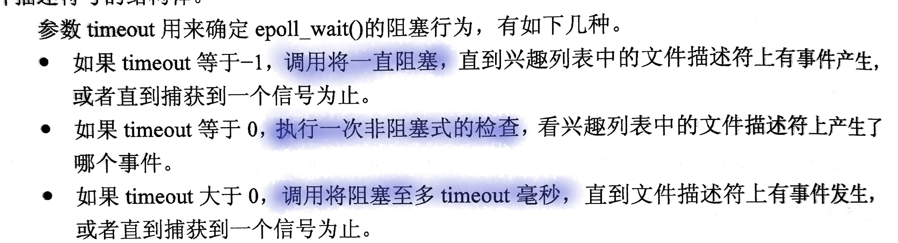

> 本文由 [简悦 SimpRead](http://ksria.com/simpread/) 转码， 原文地址 [www.nowcoder.com](https://www.nowcoder.com/discuss/637535)

*   战况（时间[排序](https://www.nowcoder.com/jump/super-jump/word?word=%E6%8E%92%E5%BA%8F)）
  
    *   [最右](https://www.nowcoder.com/jump/super-jump/word?word=%E6%9C%80%E5%8F%B3)二面挂
      
    *   [猿辅导](https://www.nowcoder.com/jump/super-jump/word?word=%E7%8C%BF%E8%BE%85%E5%AF%BC)一面挂
      
    *   伴鱼 offer（两轮技术 + 一轮 HR）
      
    *   顺丰二面挂
      
    *   [百度](https://www.nowcoder.com/jump/super-jump/word?word=%E7%99%BE%E5%BA%A6)二面挂
      
    *   [微博](https://www.nowcoder.com/jump/super-jump/word?word=%E5%BE%AE%E5%8D%9A)一面挂（一面就问意向薪资，面的还行，要多了没有后续了）
      
    *   老虎证券 offer（两轮技术 + 一轮 HR）
      
    *   [滴滴](https://www.nowcoder.com/jump/super-jump/word?word=%E6%BB%B4%E6%BB%B4)一面挂
      
    *   [快手](https://www.nowcoder.com/jump/super-jump/word?word=%E5%BF%AB%E6%89%8B)简历挂
      
    *   字节 offer（三轮技术 + 一轮 HR）
      
    *   [美团](https://www.nowcoder.com/jump/super-jump/word?word=%E7%BE%8E%E5%9B%A2) HR 面（三轮技术）
      
    *   [腾讯](https://www.nowcoder.com/jump/super-jump/word?word=%E8%85%BE%E8%AE%AF) HR 面（三轮技术）
    
*   非技术准备方面
  
    *   离职原因方面
      
        其实大家换工作无非钱少了 / 环境不好 / 没成长三种原因，但是面试在讲离职原因的时候一定不要过于实诚，请尽量往个人发展这个方向上靠拢，切忌一定不要说现任公司的坏话，尤其是跳槽频繁或者像我这种第一份工作不满两年的，一定要想好自己的离职理由，我有几家公司明显技术答的还行，都是因为离职理由挂掉的。
        
    *   简历投递顺序方面
      
        如果你对自己很有信心的话，可以直接投你的意向公司，如果信心不够强烈建议跟我一样先面几家体量不那么大的公司涨涨经验看看现在外面的行情，然后再投自己中意的公司。
        
    *   心态准备方面
      
        既然准备了要离职，就不要被任何其他事物影响心态，心态真的很重要。刚开始面试的时候我真的是处处碰壁，面一家挂一家，后来在一家面试过程中被面试官疯狂嘲讽，面完之后怀疑自我，是不是自己真的太菜了找不到工作。后来也辛亏隔天有一家公司给我发了 offer，让我明白了不是自己的问题。工作本身就是双向选择，一家不行再换一家，总有合适的，千万不要因为别人的一句话就全盘否定自己，一定要自信。
    
*   技术准备方面

    刚开始面试的时候是准备把面试过的所有家都写详细的题目出来的，后来发现写了[面经](https://www.nowcoder.com/jump/super-jump/word?word=%E9%9D%A2%E7%BB%8F)发在[牛客](https://www.nowcoder.com/jump/super-jump/word?word=%E7%89%9B%E5%AE%A2)的都挂了，也不知道是什么奇怪的玄学，后来就没发过了，不过其实面过来面过去就那些问题，就像下边这样整体总结一下吧。

    

    # Java

    ## 怎么判断一个字符串的字符个数，比如说中文

    直接取 String.length()、或者 String.toCharArray(), String.getByts 不太行，和编码格式后患。

    ## Java 的异常机制，为什么这么设计，什么时候用什么

    设计的目的是提高程序的健壮性，及时发现问题有点 fast-failed 的问题。

    Java 的异常机制都是实现了 Throwable ，具体分为 Error 和 Exception，Error 用于表明发生了不可恢复的严重错误例如 OOM、除数为 0，而 Exception 几乎都是可以恢复的异常，让外界能够感知到程序内部发上了，可以寻求恢复的办法。

    # HashMap

    ## 解决 hash 冲突的方案有哪几种

    开放寻址法、拉链法。

    拉链法就是在发生 hash 冲突后在数组身后拉出来一条链表、所有 hash 相同的 key 均在一个链表上，在比较的时候配合 equals 方法，就可以找到具体目标（这也就会为啥 hashCode 和 equals 方法要复写就得同时复写）

    ## 1.7 和 1.8 有什么区别（[链表](https://www.nowcoder.com/jump/super-jump/word?word=%E9%93%BE%E8%A1%A8)头插尾插方面）

    1.8 在 HashMap 的容量到达一定阈值后，就会转变为红黑树，这样遍历的时间复杂度将从 O(n) 缩减为 O(nlogn)

    1.8 将链表的插入方式由头插法改为了尾插发，这是修正之前版本的 HashMap 在并发场景下出现链表成环的问题

    ## hashmap 高并发场景会怎样

    首先就是数据不一致的问题，其次在低版本的（1.8之前的版本）可能出现链表有环，造成死循环的问题。

    ## 高并发链表成环会有什么问题

    出现死循环

    ## hashmap 扩容时到底干了什么（位运算过程）

    1. 开辟新的数组结构，等待数据的拷贝
    2. 计算位置：
       1. JDK7 对所有的 key 都进行重新 hash 寻找位置，效率低
       2. JDK8 中将 key 的原有位置与老容量进行 & 运算，如果结果为 0，保持不动。如果结果不为零，这计算新位置。新位置 = 原始位置 + 老容量

    这里要注意，之所以能够通过 & 运算计算位置原因是 HashMap 的容量必须是 2 的整数倍，才能成功推导。也正是因为 2 的整数倍才能使用位运算寻找 key 的位置。

    ## concurrentHashMap 原理

    减小锁的粒度，提高并发性。

    JDK 7 采用 

    

    # String，StringBuilder，StringBuffer

    String 内部使用 final 是不可继承对象、不可变。不同赋值方法内容的存储位置不同

    	1. String str = “str” // 分配在方法区
     	2. String str = new String() // 分配在堆
     	3. String str = new String(“str”) // “str”分配在方法区、对象分配在堆

    由于 String 不可变性，每次拼接字符串都是需要重新创建新的对象，性能低，所以引入了可拼接的方式

    StringBuilder 线程不安全的，在单线程下性能更好

    StringBuffer 线程安全，可以在并发场景下使用。

    

    # ArrayList 多线程下会有什么问题

    1. fast-faild
    2. 不一致行

    

    # 内部类持有外部类引用的原理是什么

    虽然内部和外部类的代码都写在一个文件里，但是编译之后会形成两个类，此时内部类 class 通过 this 访问外部类。

    # volatile 有什么用，原理是什么

    1. 保证修饰变量的可见性（但不保证变量修改的原子性）

    1. 防止指令重排，创建一个对象需要好几挑指令共同完成，所以创建对象的过程不具有原子性，在搞并发下会出现并发问题，所以可以禁止指令重排，例如 DCL 的单例模式。

    ## 为什么会有 StackOverflow，stack 的大小是多少

    StackOverflow 是 JVM 规定的一种 error：程序申请栈的大小超过了最大限制。如果将 JVM 的栈最大值甚至的很大，可能出现超过最大可用内存的问题，此时就会出现OOM问题

    在 Java 中 stack 的默认的大小时 1M，可以通过 JVM 参数调整， Android 对此进行了优化，大约是 64K

    # 虚拟机

    *   Java 虚拟机和 Android 虚拟机有什么区别
      
    *   Android 两种虚拟机有什么区别
      
    *   类加载过程
      
    *   内存模型
      
    *   四种引用类型
      
    *   class 文件格式
      
    *   synchronized 底层实现原理
      
    *   synchronized 放在普通方法和静态方法上有什么区别
      
    *   synchronized 的锁实际是保存在哪里的（对象头）
      
    *   双亲委派机制，为什么要用双亲委派机制，如何打破双亲委派机制
      
    *   内存收集整理的[算法](https://www.nowcoder.com/jump/super-jump/word?word=%E7%AE%97%E6%B3%95)

    # Android

    *   Activity
      
        *   Activity 的生命周期
          
        *   dialog 会不会影响 Activity 生命周期，为什么
          
        *   Activity 的启动模式（还会伴有场景让你说这种场景选哪个合适）
          
        *   Activity 任务栈以及 taskaffinity
        
    *   Service
      
        *   Service 存在的意义是什么
          
        *   startService 和 bindService 的生命周期
          
        *   startService 和 bindService 的区别
          
        *   startService 和 bindService 分别适合应用在什么场景
          
        *   Service 可以执行耗时操作吗
          
        *   IntentService 和 Service 的区别
          
        *   Service 和线程都可以用来执行后台任务，为什么选 Service 不选线程，明明线程用起来更简单
        
    *   broadcastreceiver
      
        *   广播的原理是什么
        
    *   View 的绘制流程
      
        *   详细讲一下 View 的绘制流程有哪些
          
        *   View 的第一次绘制是怎么调到的
          
        *   View 的后续绘制是怎么调用的
          
        *   View 的 onMeasure，onLayout，onDraw 都分别用来干什么
          
        *   除了上面三个，还有哪些关键的方法
          
        *   invalidate 的原理
          
        *   invalidate 和 requestlayout 的区别
          
        *   requestlayout 的作用范围是多大
          
        *   一个 View 被添加后第一个回调的方法是哪个（onAttacthToWindow）
          
        *   为什么 View.post 能拿到 view 的宽高
          
        *   讲一些字节做过的自定义 VIew 的例子
        
    *   触摸事件分发
      
        *   讲一下 Android 事件分发的流程
          
        *   怎么处理滑动冲突
          
        *   怎么判断手势
          
        *   讲一些自己做过的处理滑动冲突的原理
        
    *   事件分发

        *   handler 这套机制的原理
          
        *   IdleHandler 是什么
          
        *   handler 的 postDelay 怎么实现的

            https://juejin.cn/post/6896495861954510861#heading-7

        *   Message 有个缓存池，缓存池大小是多少知道吗
          
        *   MessageQueue 的中没有消息的时候为什么不会 ANR
          
        *   知道 epoll 的底层原理吗

            epoll 是 Linux 实现多路 IO 的一种实现方式，

        *   epoll 是阻塞的吗

        *   

    *   ANR
      
        *   ANR 是什么
          
        *   ANR 的原理
          
        *   什么情况下会发生 ANR
          
        *   如何检测是否发生了 ANR
        
    *   SharedPreference
      
        *   SharedPreference 原理
          
        *   SharedPreference 的优化
          
        *   SharedPreference 的 commit 和 apply 区别
          
        *   什么情况下会选择用 SharedPreference
        
    *   序列化
      
        *   Serlizeable 和 Parceable 的区别
          
        *   什么情况下选择用哪个，为什么
          
        *   有没有了解过别的序列化方法
        
    *   RecyclerView
      
        *   RecyclerView 的缓存机制
          
        *   RecyclerView 和 ListView 对比
          
        *   Recycler 是怎么进行回收和复用的
          
        *   LayoutManager 怎么进行布局的
        
    *   内存泄漏
      
        *   内存泄漏的常见场景
          
        *   怎么检查内存泄漏
        
    *   Binder
      
        *   Binder 原理
          
        *   Binder 比起其他跨进程的通信方式好在哪

    *   网络
      
        *   HTTP 报文格式
          
        *   HTTP 在网络体系架构中的意义是什么
          
        *   HTTPS 和 HTTP 的区别
          
            *   对称加密和非对称加密
              
            *   TLS 四次握手的过程
              
            *   CA 是干什么的
              
            *   校验证书的详细过程
              
            *   HTTPS 一定是安全的吗
            
        *   TCP 和 UDP 的区别（高频）
          
        *   HTTP1.0，1.1，2.0 的区别
          
        *   有没有实际了解过 HTTP2.0 到底比 1.1 快了多少
          
        *   详细解释 “Keep-Alive” 有什么用
          
        *   UDP 为什么比 TCP 快（存在误导，UDP 不一定比 TCP 快）
          
        *   UDP 可以进行广播为什么 TCP 不行
          
        *   为什么要三次握手，四次挥手
          
        *   为什么握手仅需要三次而回收需要四次
          
        *   HTTP 是基于什么协议的（一般来说是 TCP, 可以借此引出 QUIC，KCP 等协议进行进一步的探讨）
        
        # 操作系统
        
        *   线程间通信方式
          
        *   线程的几种状态
          
        *   进程间通信方式
          
        *   线程和进程的区别
        
        # 设计模式
        
        设计模式没有必要全都看，重要的是你会的几种设计模式他们的优点是什么，缺点是什么，在哪些常见的地方用到了他们，要能够举一反三，例举几个我面试时常说的。
        
        *   单例——单例一定要特别熟，特别高频，尤其是 DCL 为什么这么写，synchronized 为什么那么加，有什么讲究，volatile 在这个地方起到了什么作用，不加会导致什么问题。静态内部类的单例怎么能够保证线程安全。等等。
          
        *   Builder——常见，知道什么时候用就行了
          
        *   责任链——要能扩展到 Android 的事件分发，okhttp 的拦截链等。
          
        *   观察者模式——要能知道 Android 中哪些地方用到了观察者，什么情况下使用。比如广播机制就使用的是观察者
          
        *   享元模式——要知道享元模式是为了避免重复创建对象而导致的开销，Message，String，线程池都是这样的设计思想。
          
        *   Adapter——要能想到 ListView 和 RecyclerView，以及为什么他们设计的时候要用 Adapter
          
        *   代理模式——静态代理，动态代理
        
        # 算法（手撸代码）
        
        就[算法](https://www.nowcoder.com/jump/super-jump/word?word=%E7%AE%97%E6%B3%95)来说，其实大部分公司（除了字节和[腾讯](https://www.nowcoder.com/jump/super-jump/word?word=%E8%85%BE%E8%AE%AF)）问的都不是很难，一般都集中在数组和[链表](https://www.nowcoder.com/jump/super-jump/word?word=%E9%93%BE%E8%A1%A8)上，基本就是[剑指 offer](https://www.nowcoder.com/jump/super-jump/word?word=%E5%89%91%E6%8C%87offer) 难度甚至直接就是原题。
        
        *   移动零——一个数组有 0 和其他数，不更改原本其他非 0 数字的顺序，把 0 都移到数组最末位（[猿辅导](https://www.nowcoder.com/jump/super-jump/word?word=%E7%8C%BF%E8%BE%85%E5%AF%BC)）
          
        *   手写栈（伴鱼）
          
        *   [数组中只出现一次的数字](https://www.nowcoder.com/jump/super-jump/word?word=%E6%95%B0%E7%BB%84%E4%B8%AD%E5%8F%AA%E5%87%BA%E7%8E%B0%E4%B8%80%E6%AC%A1%E7%9A%84%E6%95%B0%E5%AD%97)——剑指原题（伴鱼）
          
        *   （顺丰，[腾讯](https://www.nowcoder.com/jump/super-jump/word?word=%E8%85%BE%E8%AE%AF)，[美团](https://www.nowcoder.com/jump/super-jump/word?word=%E7%BE%8E%E5%9B%A2)）
          
        *   （[腾讯](https://www.nowcoder.com/jump/super-jump/word?word=%E8%85%BE%E8%AE%AF)）
          
        *   （[腾讯](https://www.nowcoder.com/jump/super-jump/word?word=%E8%85%BE%E8%AE%AF)）
          
        *   一道贪心——题目太长了且没有原题（[腾讯](https://www.nowcoder.com/jump/super-jump/word?word=%E8%85%BE%E8%AE%AF)）
          
        *   （[百度](https://www.nowcoder.com/jump/super-jump/word?word=%E7%99%BE%E5%BA%A6)）
          
        *   （老虎证券）
          
        *   插入 5([https://www.lintcode.com/problem/188/)(](https://www.lintcode.com/problem/188/)()老虎证券)
          
        *   （[美团](https://www.nowcoder.com/jump/super-jump/word?word=%E7%BE%8E%E5%9B%A2)）
          
        *   手写 DCL 单例（字节）
          
        *   （字节）
          
        *   最短子数组长度——滑动窗口（字节）
          
        *   手写观察者模式（字节）
          
        *   （字节）
          
        *   获取一个 ViewGroup 的最深深度（[美团](https://www.nowcoder.com/jump/super-jump/word?word=%E7%BE%8E%E5%9B%A2)）
        
        # 设计题
        
        设计题这个部分其实大部分并没有标准答案，更多的是看以你的知识量能够想到什么比较好的解决方案。
        
        *   设计进程安全的 SharedPreference（字节，[腾讯](https://www.nowcoder.com/jump/super-jump/word?word=%E8%85%BE%E8%AE%AF)）
          
        *   设计一个 gif 加载框架（[微博](https://www.nowcoder.com/jump/super-jump/word?word=%E5%BE%AE%E5%8D%9A)）
          
        *   一个进程只有读操作，一个进程只有写操作，你怎么设计（[微博](https://www.nowcoder.com/jump/super-jump/word?word=%E5%BE%AE%E5%8D%9A)）
          
        *   如果一个 APP 需要有闲时加载任务的能力，你怎么设计（[美团](https://www.nowcoder.com/jump/super-jump/word?word=%E7%BE%8E%E5%9B%A2)）
          
        *   让你设计一个流式标签布局你怎么做，有哪些要考虑的点（[最右](https://www.nowcoder.com/jump/super-jump/word?word=%E6%9C%80%E5%8F%B3)）
          
        *   设计一个下拉刷新的 RecyclerView 你有几种方法（[美团](https://www.nowcoder.com/jump/super-jump/word?word=%E7%BE%8E%E5%9B%A2)）
          
        *   APP 使用经常会有弱网环境，怎么确保 APP 数据的即使同步更新以及正确性（顺丰）
          
        *   让你设计一个 push 的框架，你会怎么设计，考虑到哪些问题（[百度](https://www.nowcoder.com/jump/super-jump/word?word=%E7%99%BE%E5%BA%A6)）
          
        *   设计一个检测内存泄漏的框架（[腾讯](https://www.nowcoder.com/jump/super-jump/word?word=%E8%85%BE%E8%AE%AF)）
          
        *   设计一个事件总线（[最右](https://www.nowcoder.com/jump/super-jump/word?word=%E6%9C%80%E5%8F%B3)）
        
        # 项目
        
        在[项目](https://www.nowcoder.com/jump/super-jump/word?word=%E9%A1%B9%E7%9B%AE)上，一定要能做到融汇贯通，不仅从技术上也要从业务上。比如你做过的一个需求，为什么要做这个需求，这个需求的背景是什么，这个需求上线后带来了什么影响或者有哪些收益，虽然你是个技术，但是你能够知道这写得话肯定是更好的。其次在技术细节上，要能知道为什么要这样技术选项，这么做的好处是什么，以及能够横向纵向拓展。比如说我的[项目](https://www.nowcoder.com/jump/super-jump/word?word=%E9%A1%B9%E7%9B%AE)中有一个地方用 JobService 实现了定时任务，那么可以横向拓展的点就有，Android 中实现定时任务的方式都有哪些，他们都有哪些好处坏处，你的这个场景为什么要选 JobService，JobService 和普通 Service 的区别是什么。纵向扩展的话就有，JobService 的原理是什么，JobService 在参数配置上的一些细节，JobService 是不是会严格按照你配置的时间运行。这些都是可以扩展出来的，所以当你在对[项目](https://www.nowcoder.com/jump/super-jump/word?word=%E9%A1%B9%E7%9B%AE)复盘的时候，一定不要只盯着你做的那一部分，还要把自己做的部分横纵拓展一下，这样才能做到无懈可击。除此之外，良好的表达能力也是非常重要的一环，如果不觉得麻烦的话可以在复盘[项目](https://www.nowcoder.com/jump/super-jump/word?word=%E9%A1%B9%E7%9B%AE)的时候把自己做了什么，为什么这么做打个草稿，自己看自己的逻辑以及表达是否通顺，以此来做调整。
        

