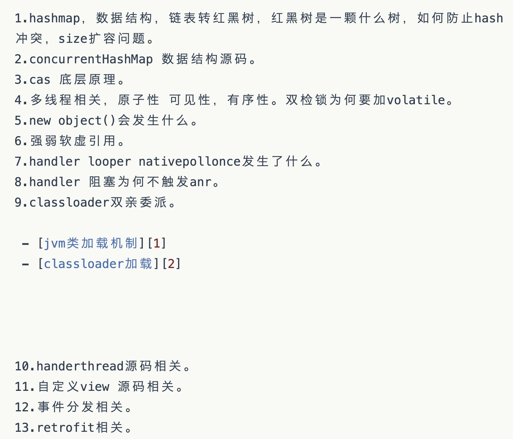

## Handler

1. 请简述handler消息机制
2. Looper 可以多次调用prepare吗
3. 如何理解 handler 中的同步屏障
4. Looper.loop中 for(;;)为什么不会造成死循环

5. handler idle的处理方式

## Retrofit

1. retrofit底层使用了okhttp 请问可以替换吗 怎么替换的
1. retrofit 使用了哪些设计模式
1. retrofit是如何通过interface具体实现的
1. 如何自定义一个gson retrofit convertadapter
1. retrofit中是如何实现协程的

## Linux

1. epoll 比 select poll 好在哪里 

​	[知乎的回答](https://zhuanlan.zhihu.com/p/272891398)

2. 