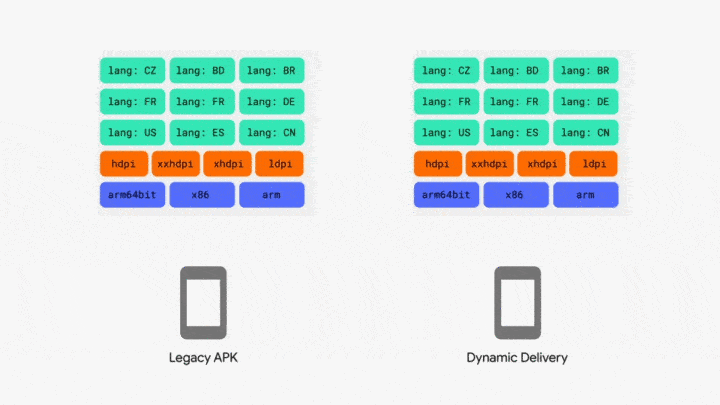

> 本文由 [简悦 SimpRead](http://ksria.com/simpread/) 转码， 原文地址 [yuweiguocn.github.io](https://yuweiguocn.github.io/module-apply-dynamic-feature/)

[toc]

本文介绍了 58 同城在无侵入改造业务库为 Dynamic Feature 工程的探索和实践。

> 《登鹳雀楼》  
> 白日依山尽，黄河入海流。  
> 欲穷千里目，更上一层楼。  
>
> - 王之涣


背景
--------------

58 同城探索将业务库改造为 Dynamic Feature 工程主要基于以下几点的考虑：

*   本地开发编译时间太长，影响开发效率。将业务库改造为 Dynamic Feature 工程可以极大提升开发效率。
*   厂商对内置包大小要求不能超过 45M，利用 Dynamic Feature 模块可以动态分发的特性产出厂商内置包以满足厂商对包大小的要求。
*   利用 Dynamic Feature 模块可以动态分发的特性产出只包含特定业务的推广包减少包大小提升推广效果。
*   国内华为应用市场已经支持 aab 格式发布应用，相信很快将支持 Dynamic Feature 模块的动态分发，相当于提前适配趋势

Android App Bundle 简介
---------------------------------------------------------------------

Google Play 应用市场支持针对不同的设备密度、CPU 架构、语言配置等上传多个 apk，你可以 splits 配置构建出多个 apk，这样当用户从 Google Play 下载应用时 Google Play 会根据用户设备匹配相应的 apk 进行分发。但由于 Android 设备类型繁多，开发者每次可能需要上传几十个 apk，这对于开发者来说很不友好，所以大部分开发者为了简单方便通常只会上传一个 apk 适配兼容不同的设备类型。

显然这不是 Google 想要的结果，所以为了解决这个问题，Google 推出了一种新的应用市场上传格式 (.aab)Android App Bundle。你可以使用 Android Studio 提供的功能构建出一个 aab 文件。


这个是 aab 文件结构图：  


使用 [BundleTool](https://github.com/google/bundletool) 可以将 aab 文件拆分为多个 apk，BundleTool 的产物其实是一个压缩包，解压后可以看到不同设备密度、CPU 架构、语言配置的多个 apk。  

```shell
java -jar bundletool-all-1.0.0.jar build-apks --bundle=app.aab --output=my_app.apks
```

解压后包含两个文件夹，一个是 splits，用于针对 android 5.0 及以上系统 Google Play 会根据设备所需资源动态分发所需 apk：  


下图是一个使用 BundleTool 将 aab 拆分为多个 apk 文件的结构示意图。  


使用下面的 bundletool 命令可以将拆分的多个 apk 根据设备所需安装到手机上：  

```sh
java -jar bundletool-all-1.0.0.jar install-apks --apks=my_app.apks
```

笔者使用的是华为 Mate20X，使用 adb 命令可以查看应用 path 目录下的 apk：  

```sh
adb shell pm path com.iqiyi.qigsaw.sample
package:/data/app/com.iqiyi.qigsaw.sample-DbE93F06pzCzfEd2h4TQJQ==/base.apk
package:/data/app/com.iqiyi.qigsaw.sample-DbE93F06pzCzfEd2h4TQJQ==/split_config.xxhdpi.apk
package:/data/app/com.iqiyi.qigsaw.sample-DbE93F06pzCzfEd2h4TQJQ==/split_config.zh.apk
package:/data/app/com.iqiyi.qigsaw.sample-DbE93F06pzCzfEd2h4TQJQ==/split_java.apk
package:/data/app/com.iqiyi.qigsaw.sample-DbE93F06pzCzfEd2h4TQJQ==/split_java.config.xxhdpi.apk
```

示例工程中包含 3 个 Dynamic Feature 工程，在下一节会详细介绍 Dynamic Feature。工程名分别是 assets、java、native，使用 BundleTool 安装后只看到了 java 的 feature apk，这是因为另外两个 feature 工程在清单文件中配置了按需加载（onDemand 设置为 true）：  

```xml
<manifest xmlns:android="http://schemas.android.com/apk/res/android"
    xmlns:dist="http://schemas.android.com/apk/distribution"
    package="com.iqiyi.qigsaw.sample.assets">

    <dist:module
        dist:onDemand="true"
        dist:title="@string/module_assets">
        <dist:fusing dist:include="false" />
    </dist:module>

    <application android:hasCode="false"></application>
</manifest>
```

另外一个是 standalones 目录，用于针对 android 5.0 以下系统不支持安装多 apk 时分发全功能的 apk，可以看到目录中的 apk 也根据适配屏幕的资源产出了多个 apk：  


在 Google Play 应用市场上传 aab 可以很好地解决前面提到的问题，唯一一点让开发者顾虑的是需要将签名文件上传到应用市场。下图是传统 apk 和 aab 动态分发的一个效果图：



华为应用市场目前已经支持使用 app bundle 发布应用，当然也需要加入应用签名计划，就是需要上传签名文件。详见：[https://developer.huawei.com/consumer/cn/doc/distribution/app/18527283](https://developer.huawei.com/consumer/cn/doc/distribution/app/18527283)


Dynamic Feature 简介
------------------------------------------------------------

Android App Bundle 中可以包含动态交付的功能，在新建 Module 时你可以选择 Dynamic Feature Module，Dynamic Feature 的插件是`apply plugin: 'com.android.dynamic-feature'`，`dynamic-feature`插件的产物是一个 apk。

既然 Dynamic Feature 工程的产物是一个 apk，那么能不能将业务库改造为 Dynamic Feature 库？从而满足背景中提到的 3 点需求：  
1. 首次全量编译后缓存 base apk 和 feature apk，业务需求开发第二次只编译改动的业务库产出 feature apk，配合首次全量编译缓存的 apk 完成安装，提升开发期间编译速度；  
2. 快速产出业务推广包；  
3. 产出厂商内置包满足厂商对包大小的要求。

答案是肯定的，需要考虑的是能否无侵入或低侵入现有工程结构代码，可以开关动态控制，不影响线上包。

Dynamic Feature 工程依赖关系
------------------------------------------------------------------------

*   feature 工程需要依赖 app 工程，app 工程不能依赖 feature 工程，这时 feature 工程的产物是 feature apk，app 工程的产物是 base apk。
*   如果 feature A 和 feature B 共同依赖了 library A，此时 library A 需要添加到 base 的依赖树中，这时所有 base 依赖的 library 会产出 base apk，feature 工程和它的独有依赖会产出 feature apk。

Dynamic Feature 工程资源合并、访问
---------------------------------------------------------------------------------

在插件化技术中，我们需要修改 aapt 源码实现修改插件资源 id，避免和宿主 apk 产生资源冲突。在 Android App Bundle 中，gradle 帮我们实现了这个功能，base apk 中的资源 id 是从 0x7f 开始，其它 feature apk 资源 id 依次减 1：


资源合并访问：

*   在构建时会将所有 feature 工程的清单文件合并到 base apk 中，所以 feature 工程清单文件中引用的主题图片等资源需要放到 base 工程可以依赖的 lib 中。
*   根据上面依赖关系和资源冲突解决的讲解，如果在 feature 工程访问 base 工程中的资源，我们需要使用 base 包名的 R 文件访问 base 工程中的资源，反之我们在 base 工程中需要使用 feature 包名的 R 文件访问 feature apk 中的资源。

无侵入改造业务库为 Feature 工程方案
----------------------------------------------------------------------

下图是 58app 工程结构图，上层依赖于下层，最上层是应用壳工程产物是 58app 的 apk，下层是所有业务库和基础库应用的插件是 Library 产物是 aar，各业务库之间代码不可见。


想要将业务库改造为 Feature 工程，首先需要将`library`插件修改为`dynamic-feature`插件，其次是修改依赖关系，feature 工程需要依赖 base 工程，产生的问题有两个：一个是修改插件后编译时会出现很多资源找不到的问题，原因就是我们前面提到的资源合并规则，因为业务库依赖的公共库被打包到了 base 中，所以我们需要修改大量的代码将找不到的资源包名修改为 base 的包名，这对我们来说改造成本太大了，且后续维护成本很高；另一个问题是各业务线之间代码是不可见的，各业务线本地开发时依赖其他业务线的 aar 代码，aar 代码无法作为一个 Feature 工程。

### 解决依赖关系和业务线代码不可见问题

为了解决上述问题，我们针对每个业务库新增了一个 Feature 壳工程，应用`dynamic-feature`插件，依赖 base 工程和各业务线的 aar 库，这个壳工程解决了各业务线代码不可见和依赖关系的问题，并且对现有工程结构无影响。


### [](#解决资源访问问题 "解决资源访问问题")解决资源访问问题

对于资源访问问题，解决思路如下，feature 中的资源访问分两种情况：一是访问的资源本身不在 feature apk 中，可以通过 feature 的 R 资源文件查询，这时我们直接将访问资源的包名修改为 base 的包名；另一种情况是访问的资源可能在 base apk 中，也可能在 feature apk 中，这时我们需要从 feature 和 base 中遍历查找到真正的资源。

根据上面的思路我们通过自定义 gradle 插件使用 asm 修改字节码，完成无侵入解决资源访问问题。主要流程如下：  
1. 使用 asm 扫描 class，首先收集 Feature 的 R 资源文件信息，如果访问的 R 资源不在集合中，则直接修改为 base 包名。  
2. 处理 findViewById()，解决 feature 库和 base 库存在相同 id，但使用的资源在 base 中，通过分别查找 feature 和 base 中的资源，最后通过反射，最终找到正确的 view。  
3. 处理 getResource()，解决使用 getResource().getIdentifier 获取 id 值不正确的情况，从 feature 中获取资源时包名需要使用 base 包名 + featureModuleName。  
4. 处理 onClick 方法中使用 v.getId() 判断 view 的情况，通过资源名称获取真正的 view 的 id。


对于 base 访问 feature 中的资源，通常是 base 中引用的资源被 feature 中的子类重写了，这种情况相对较少，所以我们通过添加白名单根据上面的方案只处理指定的类来避免影响构建速度。

### Feature 工程 Arouter 路由注册问题

项目中安居客业务使用了 Arouter 路由框架，使用`apply plugin: 'com.alibaba.arouter'`插件可以完成 Arouter 的路由注册，该插件的原理是先收集 Arouter 注解处理器生成的类信息，然后使用 ASM 修改字节码完成路由表的注册。Arouter 路由框架目前还不支持 Dynamic Feature 模块，所以将安居客业务改造为 Feature 工程后导致无法跳转。

解决方案如下：

*   因为 Feature 工程是一个壳工程，肯定不会包含 Arouter 相关代码逻辑，所以不需要使用 Arouter 的注解处理器生成相关类
*   Feature 壳工程依赖的 aar 中已经包含 Arouter 注解处理器生成的类文件
*   参考 Arouter 插件收集 Arouter 生成的类文件信息
*   在 Feature Application 的 onCreate 方法中使用 ASM 参考 Arouter 插件反射调用 Arouter 中 LogisticsCenter.register 方法完成 Feature 库中 Arouter 相关注册
*   最后在 base 工程中 Application 初始化时完成 Feature Application 的初始化即可

成果
--------------

至此，我们完成了无侵入改造业务库为 Feature 库。并且可以通过开关控制开发模式，对线上包无影响。在全量编译时 base 和 feature 会并行构建，所以构建速度上会有所提升，在增量编译时只需要编译改动的业务 feature 库，构建速度大幅提升约 60%-70%。

最后，我们自定义 gradle task 在全量编译完成后将所有 apk 进行缓存，增量编译时只编译对应业务 feature 工程产出 feature apk 配合全量编译产出的其他 apk，然后使用`adb install-multiple`命令完成安装即可。注意：oppo 和 vivo 手机不支持 `adb install-multiple`命令。  

```
adb install-multiple base.apk feature1.apk feature2.apk
```

总结
--------------

Google Play 推出的 Android App Bundle 解决了开发者为了适配不同类型设备需要上传多个 apk 的问题，使用 BundleTool 可以将 aab 根据设备屏幕密度、CPU 架构和语言配置拆分为多个 apk，用户从应用市场下载时只会推送用户设备所需资源的 apk，从而减少了用户下载 apk 的大小，提升了下载率和安装成功率。

Android App Bundle 中可以包含 Dynamic Feature 模块，它的产物是一个 apk，58 同城探索出了无侵入将业务库改造为 Feature 工程的方案，为后续提供厂商基础包和业务推广包打下了基础。得益于 gradle 的并行构建（base 和 feature 会同时构建），所以全量编译构建速度有所提升，将首次全量编译的 apk 进行缓存，业务线在增量编译时只构建对应业务 feature 工程构建速度提升 60%-70%，配合全量编译产出的其他 apk，然后使用 adb install-multiple 命令完成安装即可。

后续规划
--------------------

在无侵入将业务库改造为 Dynamic Feature 工程之后，如果想实现 Feature apk 的动态分发，需要借助 Google Play Core Library 提供的 api，由于众所周知的原因，国内是无法使用的。所以后续我们会使用插件化技术实现 Feature apk 的动态分发并产出厂商内置包和业务推广包。

项目成员：于卫国、况众文、王永川、栗庆庆

参考
--------------

*   [https://developer.huawei.com/consumer/cn/doc/distribution/app/18527283](https://developer.huawei.com/consumer/cn/doc/distribution/app/18527283)
*   [https://developer.android.google.cn/studio/build/configure-apk-splits.html?hl=en](https://developer.android.google.cn/studio/build/configure-apk-splits.html?hl=en)
*   [https://zhuanlan.zhihu.com/p/86995941](https://zhuanlan.zhihu.com/p/86995941)
*   [https://github.com/iqiyi/Qigsaw](https://github.com/iqiyi/Qigsaw)
*   [https://github.com/google/bundletool](https://github.com/google/bundletool)
